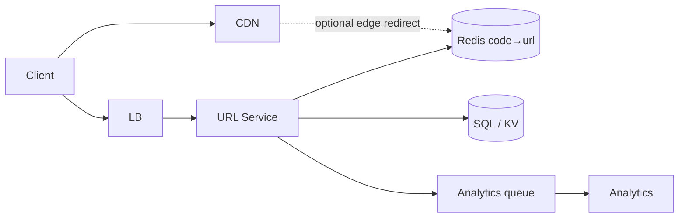

# URL Shortener

Classic warm-up design. Interviewers test ID generation, read-heavy caching, and redirect correctness.

## Requirements

### Functional

- Create short URL from long URL (optional custom alias, optional TTL/expiry)
- Redirect `GET /{code}` → long URL (301 vs 302)
- Optional: click analytics, user ownership, delete/disable

### Non-functional

- High read:write (often 100:1+)
- Low latency redirects (p99 < 50–100ms at edge/app)
- High availability for redirects
- Codes unguessable enough to avoid enumeration abuse (or rate-limit + auth)
- Durability of mappings

### Clarifying questions

- Custom aliases? Analytics depth? Auth required to create?
- 301 (permanent, cacheable) vs 302 (temporary, better for analytics)?
- Retention / GDPR delete of URLs?

## Capacity estimation

Assume: **100M new URLs/month**, **100:1 read:write**, avg code 7 chars, metadata ~500B.

| Metric | Estimate |
| --- | --- |
| Writes | 100M / 2.6e6 s ≈ **40 WPS** avg; peak ~200 |
| Reads | 40 × 100 = **4k RPS** avg; peak ~20k |
| Storage/year | 1.2B × 500B ≈ **600 GB** (+ indexes/replicas) |
| Code space | base62⁷ ≈ 3.5e12 — plenty for billions |

## API

```http
POST /v1/urls
Authorization: Bearer ...
Idempotency-Key: <uuid>
{ "longUrl": "https://...", "customAlias": "launch", "ttlSeconds": 86400 }

→ 201 { "code": "aB3xY9q", "shortUrl": "https://sho.rt/aB3xY9q" }

GET /{code}
→ 302 Location: https://...
   Cache-Control: ...

DELETE /v1/urls/{code}
GET /v1/urls/{code}/stats   # optional
```

**301 vs 302:** 301 lets browsers/CDNs cache forever → fewer analytics hits. Prefer **302** if you need accurate click counts; **301** if SEO/permanence matters.

## Data model

```text
urls
  code        PK  (or hash of code)
  long_url
  user_id     nullable
  created_at
  expires_at  nullable
  is_active
  click_count approx / separate analytics store
```

**Indexes:** PK on `code`; optional `(user_id, created_at)` for “my links”.

### ID generation options

| Approach | Pros | Cons |
| --- | --- | --- |
| Hash(long URL) truncated | Deterministic, dedupe | Collisions; same URL → same code |
| Auto-increment → base62 | Simple, compact | Predictable; needs coordinated counter |
| Pre-generated range per app | No central bottleneck | Range exhaustion ops |
| UUID truncated | Easy | Longer / collision risk if too short |
| Snowflake-like | Time-sortable | Overkill for shortener |

**Interview default:** distributed counter ranges or random base62 with uniqueness check + retry.

## Architecture



**Write path:** validate URL → generate code → insert DB (unique constraint) → set cache → return.

**Read path:** cache hit → redirect; miss → DB → fill cache → redirect. Negative cache short TTL for unknown codes (404) to stop abuse.

## Scaling

1. **Cache first** — redirect working set fits in Redis easily.
2. **Read replicas** for DB misses.
3. **Shard by code hash** when single primary can’t hold size/QPS.
4. **Edge / CDN** for 301 or signed edge workers reading KV.
5. **Analytics async** — never block redirect on analytics write.

## Bottlenecks

| Bottleneck | Mitigation |
| --- | --- |
| Hot codes (viral link) | Cache + CDN; no DB on hot path |
| ID generator SPOF | Pre-allocated ranges / random + unique index |
| Cache stampede on cold code | Singleflight / lock; probabilistic early expire |
| Enumeration | Rate limit; longer codes; captcha on create |
| DB unique conflicts | Retry with new code; backoff |

## Consistency & expiry

- Soft-delete / `is_active=false` for disable.
- TTL: store `expires_at`; check on read; async sweeper or Redis TTL twin key.
- Cache TTL ≤ DB truth; on disable, **delete cache key** immediately.

## Follow-ups

**Custom alias races?** Unique constraint + 409 Conflict.

**Global multi-region?** Regional writes with global code uniqueness (central allocator or CRDT-unfriendly — usually global uniqueness service or hash of region+id).

**Analytics at 20k RPS?** Append-only stream → aggregate by minute; approximate counts OK.

**SQL injection / open redirect?** Validate URL scheme (`http`/`https` only); escape nothing into HTML on redirect path (Location header).

## Interview Q&A

**Q: Why not hash the long URL as the code?**  
Collisions and “same long URL always same short” may be unwanted; also truncation needs collision handling anyway.

**Q: How long should codes be?**  
Balance length vs collision probability. base62⁶ ≈ 56B; base62⁷ ≈ 3.5T. Pick with birthday-bound math for expected volume.

**Q: Where do you put rate limiting?**  
On `POST /urls` by IP/user; on `GET` only for 404 storms.

## Common mistakes

- Synchronous analytics on redirect path
- Predictable sequential IDs without auth
- Forgetting cache invalidation on delete
- Using 301 when product needs click metrics

## Trade-offs

| Decision | Choose when |
| --- | --- |
| 301 | Permanent links, max cache |
| 302 | Analytics / mutable targets |
| SQL | Simple relational + uniqueness |
| KV (Dynamo/Cassandra) | Extreme scale, simple key lookup |
| Edge redirects | Ultra-low latency global reads |
