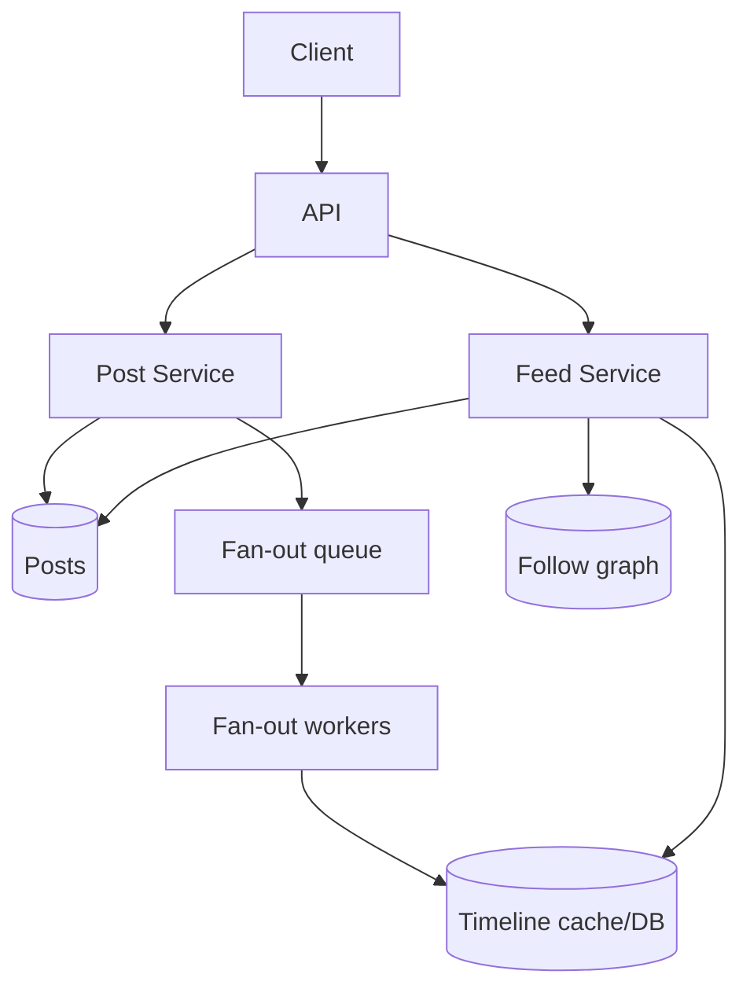
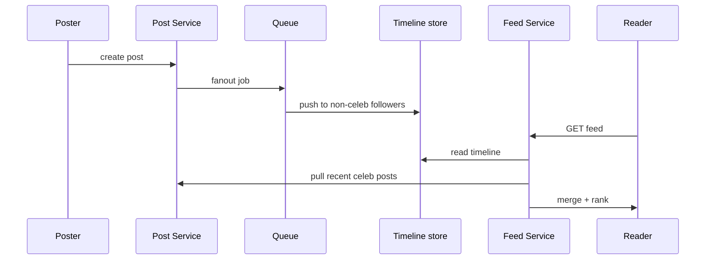

# News Feed

The classic fan-out problem: timeline generation under follow-graph skew (celebrities).

## Requirements

### Functional

- Create post
- Follow / unfollow
- Home feed (posts from people you follow), reverse chronological or ranked
- Optional: likes, comments, media (park if time-boxed)

### Non-functional

- Read-heavy home feed; write spikes at events
- Freshness: new posts appear within seconds for most users
- Celebrity accounts: millions of followers without melting the write path
- Availability over perfect global ordering

### Clarifying questions

- Chronological vs ranked? Media? Soft delete? Mute/block?
- Max feed length cached (e.g. last 1000 items)?
- Cross-region?

## Capacity estimation

Assume **100M DAU**, **avg 20 feed views/day**, **avg 2 posts/day**, **avg 200 follows**.

| Metric | Estimate |
| --- | --- |
| Feed reads | 100M × 20 / 86400 ≈ **23k RPS** avg; peak ~100k |
| Posts | 100M × 2 / 86400 ≈ **2.3k WPS** |
| Fan-out if push all | 2.3k × 200 = **460k timeline writes/s** — motivates hybrid |

Storage: posts metadata small; media in object store. Timeline entries: user × cached items × ~64B.

## API

```http
POST /v1/posts
{ "text": "...", "mediaIds": [] }

POST /v1/follows/{userId}
DELETE /v1/follows/{userId}

GET /v1/feed?cursor=...&limit=20
→ { "items": [{ "postId", "authorId", "text", "createdAt", ... }], "nextCursor" }
```

Cursor = `(created_at, post_id)` opaque token — not offset.

## Data model

```text
users(user_id, ...)
posts(post_id PK, author_id, text, created_at, ...)  -- index (author_id, created_at DESC)
follows(follower_id, followee_id) PK(follower, followee)
  indexes: (follower_id), (followee_id)  -- for fan-out targets

-- push model
timeline(user_id, post_id, author_id, created_at)
  PK (user_id, created_at DESC, post_id)
```

Optional: like counts denormalized; social graph in graph store or sharded SQL.

## Architecture



### Fan-out on write (push)

On post: enqueue job → for each follower, insert into their timeline store.

- **Pros:** Home feed = cheap range query
- **Cons:** Celebrity write amplification; slow for huge fan-out

### Fan-out on read (pull)

On feed request: fetch followees → query recent posts per author → merge-sort.

- **Pros:** Writes cheap
- **Cons:** Read latency; thundering herd; hard at large follow counts

### Hybrid (interview favorite)

- **Regular users:** push to followers’ timelines
- **Celebrities** (follower count > threshold): skip push; merge celebrity posts at read time
- Mute/block applied at read or via filtered timeline



## Scaling

1. Shard timelines by `user_id`
2. Cache hot timelines in Redis (list/ZSET of post IDs) + post content cache
3. CDN for media only
4. Ranker as separate async/feature service if needed — don’t block MVP on ML
5. Follow graph cached; invalidate on follow/unfollow

## Bottlenecks

| Issue | Fix |
| --- | --- |
| Celebrity post | Hybrid fan-out; rate-limit fan-out workers |
| Timeline hot key | Shard; Redis cluster hash tags carefully |
| Follow/unfollow | Rebuild or incremental timeline repair async |
| Ranking latency | Precompute scores; cache ranked window |
| Consistency of “seen” | Accept eventual; show optimistic local post |

## Ranking (light)

MVP chronological. Next: score = affinity × freshness × engagement; compute offline features; online blend top-K from candidates.

## Follow-ups

**Delete post?** Tombstone + remove from timelines async; cache invalidate.

**Unfollow?** Stop future pushes; optionally scrub past posts from timeline async.

**Multi-region?** Home region sticky; cross-region async replication of posts; accept lag.

**Abuse / spam?** Rate limits, shadowban flags checked at feed merge.

## Interview Q&A

**Q: Why hybrid?**  
Push optimizes the common read path; pull protects the write path for skewed graphs.

**Q: Redis list vs DB timeline?**  
Redis for the hot window (e.g. 800 IDs); DB for backlog / cold users.

**Q: How do you page a merged feed?**  
Keep cursors per source (timeline + each celeb stream) or materialize merged scores with a single cursor.

## Common mistakes

- Push to all followers of a celebrity synchronously in the request
- Offset pagination on feed
- Storing full post bodies duplicated in every timeline row without a content cache strategy
- Ignoring mute/block until the end

## Trade-offs

| Model | Best for |
| --- | --- |
| Push | Read-heavy, modest follow fan-out |
| Pull | Write-heavy, sparse follows, small graphs |
| Hybrid | Real social networks with skew |
| Ranked | Engagement products — higher complexity |
