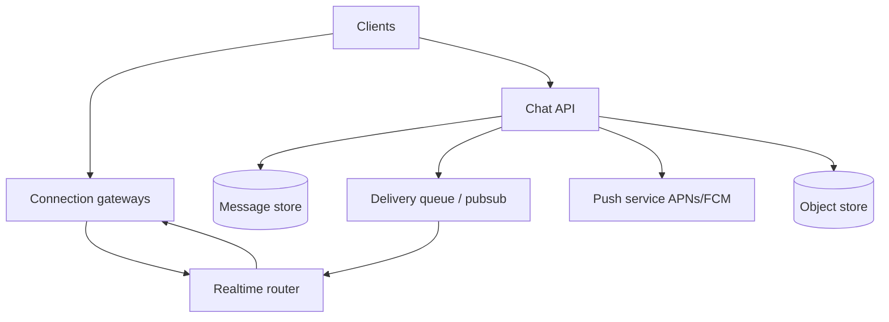
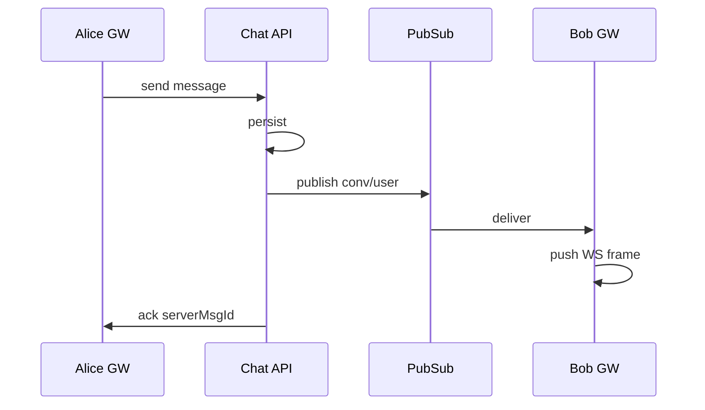

# Chat / Messaging

Real-time delivery, offline sync, group fan-out, and ordering — under connection scale.

## Requirements

### Functional

- 1:1 and group messaging
- Online delivery (push) + offline inbox
- Read receipts, typing indicators (optional, ephemeral)
- Message history, search (optional)
- Media attachments via object store

### Non-functional

- Low latency for online users (p99 < 200–500ms end-to-end)
- At-least-once delivery to devices; **exactly-once display** via client dedupe + message IDs
- Ordering per conversation (not necessarily global)
- Horizontal scale of websocket/long-poll connections
- Durability of messages

### Clarifying questions

- Mobile + web? E2E encryption? Max group size? Retention?
- Presence accuracy needs?

## Capacity estimation

Assume **50M DAU**, **avg 40 messages sent/day**, **peak 5×**, avg message 200B metadata + media separate.

| Metric | Estimate |
| --- | --- |
| Send QPS | 50M × 40 / 86400 ≈ **23k** avg; peak ~100k |
| Connections | tens of millions concurrent → connection gateways mandatory |
| Storage/year | 50M × 40 × 365 × 200B ≈ **146 TB** raw (+ indexes) |

## API

**HTTP (control + history):**

```http
POST /v1/conversations
POST /v1/conversations/{id}/messages
Idempotency-Key: ...
{ "clientMsgId": "...", "body": "...", "attachmentIds": [] }

GET /v1/conversations/{id}/messages?cursor=...&limit=50
POST /v1/conversations/{id}/read { "uptoMsgId": "..." }
```

**Realtime channel (WebSocket / SSE / MQTT):**

```text
→ server: { type: "message", conversationId, message }
→ server: { type: "ack", clientMsgId, serverMsgId, ts }
→ client: { type: "typing", conversationId }
→ client: { type: "resume", lastReceivedId }  // sync gap
```

## Data model

```text
conversations(id, type, created_at)
members(conversation_id, user_id, role, last_read_msg_id, joined_at)
messages(conversation_id, message_id, sender_id, body, created_at, ...)
  PK / cluster: (conversation_id, message_id)  -- message_id time-sortable
devices(user_id, device_id, push_token, last_seen)
```

Prefer **time-sortable IDs** (Snowflake) for range scans and ordering.

Unread: derive from `last_read` vs latest message, or maintain counter carefully (race-prone).

## Architecture



### Send path

1. Client sends with `clientMsgId` (idempotent)
2. API persists message (source of truth)
3. Publish to conversation channel / fan-out to member inbox queues
4. Gateways holding online members push frames
5. Offline → push notification; message waits in history for sync

### Connection layer

- Sticky sessions via LB + gateway registry: `user_id → gateway_id` in Redis
- Heartbeats; resume token = last contiguous message ID
- Shard gateways; pubsub between gateways for cross-node delivery



## Group chat fan-out

| Group size | Strategy |
| --- | --- |
| Small (<100) | Fan-out to each member’s online connection + inbox |
| Large | Write to conversation log; members pull/tail; online subscribers via pubsub topic per conversation |

Don’t copy full message body into N inboxes at huge N — store once, notify with pointer.

## Ordering & sync

- **Per-conversation total order** via `(conversation_id, message_id)`
- Client buffers out-of-order WS events until gap filled, or refetch range
- Multi-device: each device tracks its own cursor; server stores per-device read optional

## Scaling

1. Partition messages by `conversation_id`
2. Separate hot path (recent) vs cold history (object/archive)
3. Presence in Redis with short TTL; don’t require strong consistency
4. Rate-limit typing events (client + server coalesce)
5. Media: pre-signed upload URLs; messages store object keys only

## Bottlenecks

| Bottleneck | Mitigation |
| --- | --- |
| Million WS on one box | Many gateway nodes; kernel tuning; HTTP/2 or dedicated WS fleet |
| Hot group | Conversation topic + pull history; avoid N² |
| DB write QPS | Batch; partitioned stores (Cassandra/Dynamo/Scylla patterns) |
| Push storms | Collapse notifications; quiet hours |
| Split brain registry | Heartbeat lease for user→gateway mapping |

## Follow-ups

**E2E encryption?** Server stores ciphertext; search/push previews limited; key exchange out of band.

**Message edit/delete?** New event type; clients apply; retention of tombstones.

**Moderation?** Async pipeline on plaintext (if not E2E) or report-only.

**Multi-region?** Conversation home region; cross-region forward with higher latency.

## Interview Q&A

**Q: WebSocket or long polling?**  
WS for bidirectional low latency; long poll as fallback for hostile networks.

**Q: How do you guarantee no lost messages?**  
Persist first, then fan-out; client resume from `lastReceivedId`; at-least-once + idempotent `clientMsgId`.

**Q: Read receipts at scale?**  
Coalesce; store watermark per user/conversation; broadcast sparingly.

## Common mistakes

- Treating WS as source of truth (no durable store)
- Global ordering across all chats
- Fan-out full payloads to 100k-member groups
- Blocking send API on push provider latency

## Trade-offs

| Choice | Gain | Cost |
| --- | --- | --- |
| Persist-then-ack | Durability | Slightly higher send latency |
| Inbox per user | Fast offline sync | Write amplification |
| Shared conversation log | Efficient groups | Harder per-user unread |
| Strong presence | Accurate UX | Load + flapping |
