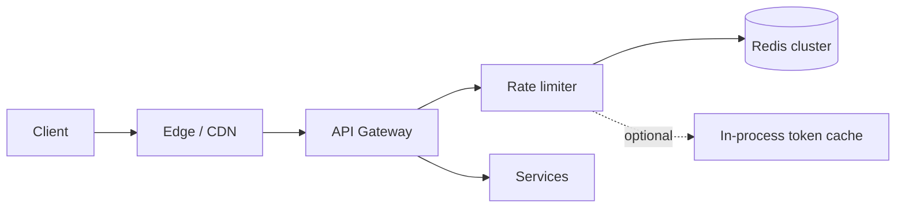
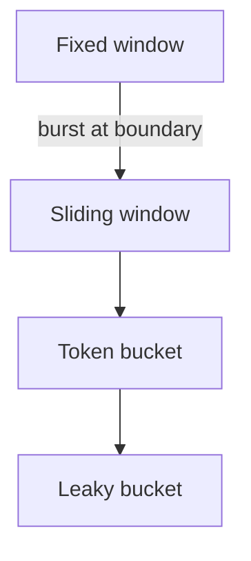

# Rate Limiter

Distributed rate limiting as a shared library/service — accuracy, performance, and multi-key policies.

## Requirements

### Functional

- Limit requests by key: IP, userId, API key, route, tenant
- Algorithms: token bucket / sliding window / fixed window (discuss trade-offs)
- Return standard headers: `X-RateLimit-Limit`, `Remaining`, `Retry-After`
- Soft vs hard limits; optional quarantine

### Non-functional

- Very low added latency (inline on every request)
- Correct enough under concurrency (not “exact” at global scale)
- Highly available — limiter failure mode must be explicit (fail open vs closed)
- Multi-region awareness (local vs global budgets)

### Clarifying questions

- Enforce at edge, API gateway, or service?
- Per-user + per-IP + per-tenant combined rules?
- Need distributed consistency or regional limits OK?

## Capacity estimation

Assume **100k RPS** peak through gateway.

- Each request: 1 Redis `INCR`/`EVAL` ≈ fine on a cluster if pipelined and keyed well
- Memory: one counter/bucket per active key; with TTL, working set manageable
- Hot keys (single viral API key) need careful sharding or local + global hybrid

## API (as middleware / sidecar)

```text
Allow(key, cost=1) → { allowed: bool, limit, remaining, resetAt }

# HTTP mapping
429 Too Many Requests
Retry-After: 3
X-RateLimit-Limit: 100
X-RateLimit-Remaining: 0
X-RateLimit-Reset: 1710000000
```

Config example:

```yaml
policies:
  - name: api_user
    key: "user:{userId}:{route}"
    algorithm: token_bucket
    rate: 100/min
    burst: 20
```

## Data model

Redis-centric:

| Algorithm | Structure |
| --- | --- |
| Fixed window | `INCR` + `EXPIRE` on `key:window_id` |
| Sliding window log | Sorted set of timestamps (memory heavy) |
| Sliding window counter | Two windows weighted |
| Token bucket | Hash: `tokens`, `last_refill` updated via Lua |

Lua/EVAL for atomic read-modify-write.

## Architecture



**Placement:**

1. **Edge** — coarse IP limits, DDoS
2. **Gateway** — per-API-key / tenant
3. **Service** — business quotas (uploads/day)

Defense in depth: cheap local checks + authoritative Redis.

## Algorithms & trade-offs



| Algorithm | Pros | Cons |
| --- | --- | --- |
| Fixed window | Simple, cheap | 2× burst at window edges |
| Sliding log | Accurate | Memory/CPU |
| Sliding counter | Good balance | Approx |
| Token bucket | Smooth + burst control | Needs atomic refill |
| Leaky bucket | Smooth egress | Less intuitive for APIs |

**Interview default:** token bucket in Redis with Lua; fixed window acceptable if you call out boundary burst.

## Scaling

1. Redis Cluster; hash tag so related keys colocated if needed
2. **Local quota** (e.g. 10% of budget) for ultra-hot paths + sync to Redis periodically — trades accuracy
3. Regional limiters for latency; global budget via coarser async reconciliation if required
4. Pipeline / batch `Allow` for GraphQL field costs

## Bottlenecks

| Issue | Mitigation |
| --- | --- |
| Redis RTT | Local optimistic tokens; connection pool; same-AZ |
| Hot key | Key split (`key#0..N`) + random shard; or edge limit first |
| Clock skew | Prefer Redis server time in scripts |
| Failover | Explicit fail-open (availability) vs fail-closed (safety) |

## Consistency

Exact global limits across regions are expensive. Usually:

- **Regional limits** (N × region) or
- **Global** with higher latency / approximate counters

State the product choice.

## Follow-ups

**Cost-based limits?** `Allow(key, cost=complexity)` for search/upload.

**Fairness across tenants?** Hierarchical token buckets (tenant → user).

**Shadow mode?** Log would-block without blocking for tune-up.

**Distributed rate limit without Redis?** Gossip approximate; harder — Redis is the expected answer.

## Interview Q&A

**Q: Fixed window problem?**  
At `T=59s` and `T=61s` user can send 2× limit. Sliding or token bucket fixes.

**Q: Fail open or closed?**  
Payments / auth abuse → closed; public read CDN → open with edge controls. Say it.

**Q: Where is idempotency vs rate limit?**  
Idempotency prevents duplicate *effects*; rate limit caps *attempt rate*. Both often needed.

## Common mistakes

- In-memory only limiter on multi-instance app (each instance has full budget)
- Ignoring `Retry-After` / client guidance
- One global Redis key for all users
- Claiming “exactly once per second globally” without distributed coordination cost

## Trade-offs

| Choice | When |
| --- | --- |
| Redis central | Standard multi-node accuracy |
| Local-only | Single node / best effort |
| Edge + origin | DDoS + business rules |
| Fail-open | Prioritize availability |
| Fail-closed | Prioritize abuse prevention |

See also: [Backend rate limiting](/backend/08-rate-limit).
