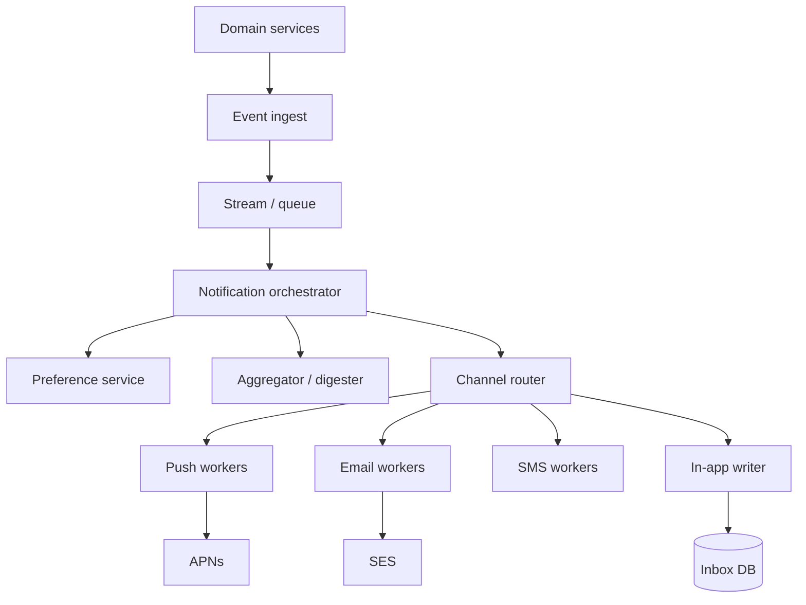

# Notification System

Multi-channel fan-out (push, email, SMS, in-app) with preferences, templates, and reliability.

## Requirements

### Functional

- Trigger notifications from events (like, mention, billing, security)
- Channels: in-app, mobile push, email, SMS
- User preferences + quiet hours + unsubscribe
- Templates / localization
- Delivery status, retries, digests

### Non-functional

- High fan-out (celebrity like → millions of notifications — usually **don’t**)
- At-least-once to providers; idempotent per user/event
- End-to-end latency: seconds for transactional; minutes OK for digests
- Opt-out / compliance (CAN-SPAM, GDPR)

### Clarifying questions

- Real-time vs digest? Priority lanes (security never muted)?
- Per-device push tokens? Email volume caps?

## Capacity estimation

Assume **10M DAU**, **avg 20 notif events/user/day** after aggregation.

| Metric | Estimate |
| --- | --- |
| Events | 10M × 20 / 86400 ≈ **2.3k/s** avg; peak 10k+ |
| Provider calls | × channel fan-out; collapse with digests |
| In-app storage | similar to chat inbox scale |

**Product rule:** aggregate (“X and 50 others liked your photo”) before fan-out.

## API

```http
# Internal event
POST /internal/notifications/events
{ "type": "post.liked", "actorId", "objectId", "recipientIds": ["..."] }

# User
GET /v1/notifications?cursor=...
POST /v1/notifications/read
GET /v1/notification-preferences
PUT /v1/notification-preferences
{ "email": { "marketing": false, "security": true }, "push": { "likes": true } }
```

Providers: APNs/FCM, SES/SendGrid, Twilio — via adapters.

## Data model

```text
notification_events(event_id, type, payload, created_at)
notifications(user_id, notif_id, type, body, ref_id, created_at, read_at)
preferences(user_id, channel, category, enabled)
devices(user_id, device_id, push_token, platform)
delivery_log(notif_id, channel, status, provider_id, attempts)
templates(type, locale, channel, body)
```

Idempotency key: `(event_id, user_id, channel)`.

## Architecture



### Pipeline stages

1. **Ingest** event with idempotency
2. **Expand recipients** (avoid naive “all followers” — use product caps)
3. **Aggregate** short window (e.g. 2 min) for social
4. **Filter** preferences, quiet hours, frequency caps
5. **Render** template
6. **Enqueue** per channel with priority
7. **Deliver** with retry/DLQ; record status
8. **In-app** write always (if enabled) even if push fails

## Scaling

- Partition workers by channel; separate **transactional** vs **bulk** queues
- Provider rate limits → token buckets per provider account
- Template render CPU → cache rendered strings for identical payloads
- In-app inbox sharded by `user_id`; unread counters carefully (or compute)

## Bottlenecks

| Bottleneck | Mitigation |
| --- | --- |
| Fan-out explosion | Aggregate; drop low-priority; online-only for some types |
| Provider 429 | Backoff, multi-account, priority queue |
| Preference DB at QPS | Cache prefs in Redis with version |
| Duplicate sends | Idempotency keys at provider when supported |
| Template bugs | Shadow send; feature flag per type |

## Priority & digests

| Class | Examples | SLA |
| --- | --- | --- |
| P0 | Password reset, 2FA | Immediate, bypass marketing mute |
| P1 | Direct message | Seconds |
| P2 | Social | Aggregate window |
| P3 | Marketing | Digest / campaign system |

## Follow-ups

**User deletes account?** Stop sends; purge inbox; provider suppression lists.

**Multi-device push?** Fan-out tokens; collapse display ID so one logical notif updates.

**Exactly-once email?** Impossible end-to-end; aim for “at most one visible” via idempotent provider APIs + ledger.

**Observability?** Delivery success rate, provider latency, queue lag, unsubscribe rate.

## Interview Q&A

**Q: Why not notify every follower on every post?**  
Write amplification + spam. Use feed for broadcast; notify only mentions/close friends or sample.

**Q: Push vs pull in-app?**  
Write in-app record; client polls or WS for badge; push wakes mobile.

**Q: How do quiet hours work with P0?**  
Security/transactional categories bypass; document policy.

## Common mistakes

- Coupling notification send to the like request thread
- No preference check until after provider call (wastes money + trust)
- Single queue for password-reset and “someone liked”
- Ignoring provider idempotency → duplicate SMS

## Trade-offs

| Choice | Gain | Cost |
| --- | --- | --- |
| Sync send in API | Simple | Latency, outages |
| Async orchestrator | Scale, retry | Complexity, delay |
| Heavy aggregation | Less spam | Less “real-time” feel |
| Per-channel microservices | Isolate failures | More ops |

Related: [Job Queue](./08-job-queue), [News Feed](./02-news-feed).
