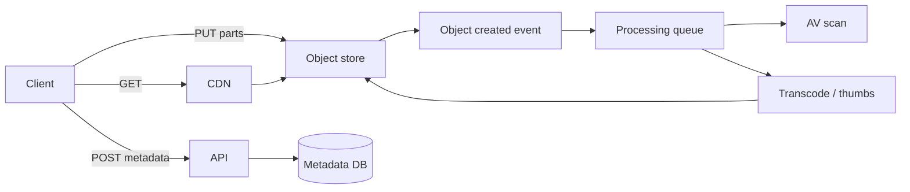

# File Upload / CDN

Reliable large uploads, virus scanning, and global download via object storage + CDN.

## Requirements

### Functional

- Upload files (images, video, docs) from clients
- Resume / multipart for large objects
- Process: validate type/size, virus scan, transcode thumbnails
- Serve via CDN with cache headers; optional signed URLs
- Delete / lifecycle / retention

### Non-functional

- Don’t proxy multi-GB through app servers
- High availability downloads
- Security: authz on private objects; content-type sniffing resistance
- Cost control (egress)

### Clarifying questions

- Max size? Public vs private? Image transforms? Video streaming?
- Compliance (encryption at rest, region lock)?

## Capacity estimation

Assume **1M uploads/day**, avg **5 MB**, **10× download multiplier**, peak 5×.

| Metric | Estimate |
| --- | --- |
| Ingest | 1M × 5MB / 86400 ≈ **290 Mbps** avg; peak ~1.5 Gbps |
| Egress | ×10 → multi-Gbps → **CDN mandatory** |
| Storage/year | 1M × 365 × 5MB ≈ **1.8 PB** raw (before lifecycle) |

## API

**Direct-to-storage (preferred):**

```http
POST /v1/uploads
{ "filename", "contentType", "size", "checksum" }
→ {
  "uploadId",
  "strategy": "multipart",
  "parts": [{ "partNumber", "url", "expiresAt" }],
  "completeUrl": "/v1/uploads/{id}/complete"
}

POST /v1/uploads/{id}/complete
{ "parts": [{ "partNumber", "etag" }] }

GET /v1/files/{id}           # metadata
GET /v1/files/{id}/content   # 302 to CDN/signed URL
DELETE /v1/files/{id}
```

Client PUTs bytes to pre-signed URLs; app never sees payload body.

## Data model

```text
files(file_id, owner_id, status, content_type, size, checksum,
      storage_key, visibility, created_at)
upload_sessions(upload_id, file_id, strategy, expires_at, state)
variants(file_id, kind, storage_key, width, height)  -- thumb, hls, ...
```

Statuses: `pending → uploaded → scanning → ready | rejected`.

## Architecture



### Upload flow

1. Authn → create `upload_session` + pre-signed URLs (short TTL)
2. Client multipart upload
3. `complete` → verify size/checksum/ETags → mark `uploaded`
4. Async: AV scan → generate variants → mark `ready`
5. Clients only receive CDN URLs when `ready` (or progressive for images)

### Download flow

- **Public:** CDN URL with long cache (`Cache-Control: public, max-age=...`) + immutable object keys (content-hash in path)
- **Private:** short-lived signed URLs; CDN may still cache with signed cookies / token

## Scaling

1. Object store scales horizontally; app only metadata QPS
2. CDN for egress; origin shield to protect storage
3. Processing workers autoscaled on queue depth
4. Partition metadata by `owner_id` / `file_id`
5. Lifecycle rules: tier cold storage; expire multipart abandoned uploads

## Bottlenecks

| Bottleneck | Mitigation |
| --- | --- |
| App proxy upload | Never — pre-signed only |
| Slow virus scan | Async; optional provisional private access |
| Hot transform storm | On-the-fly image CDN (Thumbor/Cloudflare Images) with cache |
| Huge multipart complete races | Idempotent complete; state machine |
| Cache poisoning | Immutable keys; don’t reuse key for new bytes |

## Security

- Authenticate before issuing pre-signed URLs; authorize path prefixes per tenant
- Constrain `content-type` and max size in policy
- Scan before public; quarantine bucket
- Don’t trust client `content-type` alone — magic-byte sniff server-side on complete
- CSRF less relevant for pre-signed PUT; still protect metadata API

## Follow-ups

**Resume after crash?** Multipart list parts + continue; or tus protocol.

**Multi-region?** Replicate objects; metadata regional or global with stronger consistency on create.

**Range requests / video?** Store HLS/DASH manifests; CDN supports byte range.

**Dedup?** Content-hash keys + refcount; privacy caveats across tenants.

## Interview Q&A

**Q: Why not upload through the API server?**  
Memory, sockets, double bandwidth, horizontal scale pain.

**Q: How do you invalidate CDN after replace?**  
Prefer **never replace** — new key + update pointer; else purge by URL.

**Q: Consistency of “ready”?**  
Client polls status or gets websocket/push; don’t serve unscanned public content.

## Common mistakes

- Storing blobs in SQL/Mongo
- Long-lived world-writable bucket
- Mutable object keys with long CDN cache
- Blocking HTTP request on transcode

## Trade-offs

| Choice | Gain | Cost |
| --- | --- | --- |
| Pre-signed direct upload | Scale, cost | Complex client; status sync |
| Through-server | Simple client | Doesn’t scale |
| Eager derivatives | Fast first view | Storage + CPU |
| Lazy on-the-fly | Cheap cold files | First-hit latency |

Related: [Job Queue](./08-job-queue), FE [Image Gallery](/frontend-system-design/05-image-gallery).
