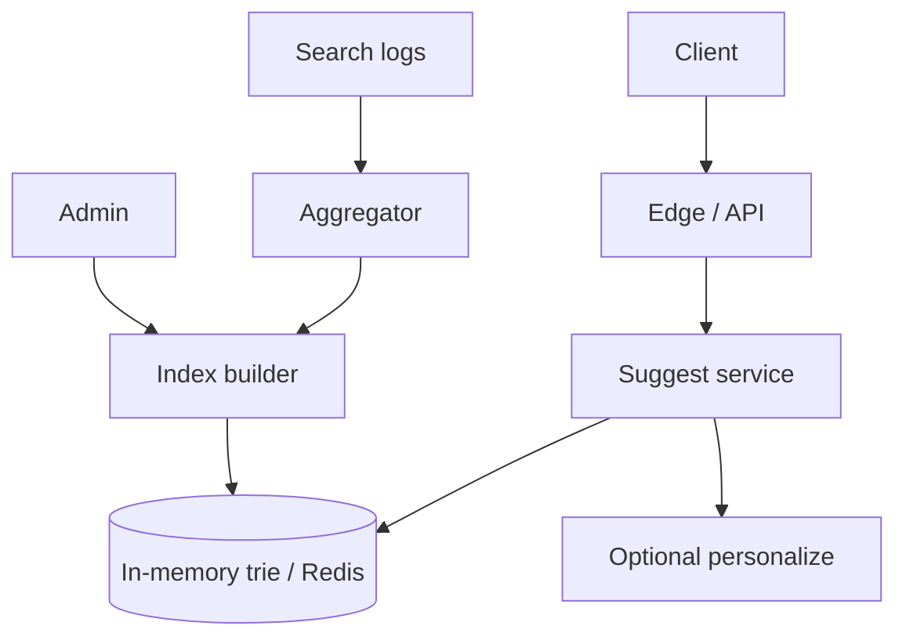

# Search Autocomplete

Prefix suggestion under tight latency budgets with freshness and personalization knobs.

## Requirements

### Functional

- Suggest top queries / entities as user types
- Rank by popularity, freshness, personalization (optional)
- Handle typos (optional fuzzy)
- Admin: boost/bury, blocklist

### Non-functional

- **p99 < 50–100ms** for suggest API
- High QPS (every keystroke, debounced client-side)
- Eventual freshness OK (minutes) for popularity; faster for trending
- Graceful degradation if ranker fails

### Clarifying questions

- Query suggest vs product/user entity suggest?
- Languages / Unicode? Personalization? Multi-tenant?

## Capacity estimation

Assume **20M DAU**, **10 searches/day**, **avg 5 suggest calls/search** (after debounce).

| Metric | Estimate |
| --- | --- |
| Suggest QPS | 20M × 10 × 5 / 86400 ≈ **12k** avg; peak 50k+ |
| Payload | tiny JSON (~1–2KB) |
| Index | millions of prefixes — memory-optimized structures |

Client **debounce 150–300ms** + cancel in-flight — cuts backend QPS hard. Mention this in interviews.

## API

```http
GET /v1/suggest?q=ama&limit=8&lang=en
→ {
  "suggestions": [
    { "text": "amazon", "type": "query", "score": 0.92 },
    { "text": "Amazon Kindle", "type": "product", "id": "..." }
  ]
}
```

Optional: `sessionId` for personalization; `cursor` rarely needed.

## Data model

**Offline / nearline:**

```text
query_stats(query, count_1d, count_7d, last_seen)
entities(id, name, type, popularity, attributes)
blocklist(term)
boosts(term, weight)
```

**Serving structures:**

| Structure | Use |
| --- | --- |
| Trie / radix tree in memory | Prefix → top-K |
| Sorted sets in Redis `ZSET` per prefix | `ZREVRANGE prefix:ama 0 7` |
| Search engine edge n-grams | Flexible, heavier |
| Finite automaton / FST (Lucene) | Compact prefix |

Popular interview answer: **Redis ZSETs of top queries per prefix** (or limited prefix length) + periodic rebuild from logs.

## Architecture



### Request path

1. Normalize: lowercase, Unicode NFKC, trim, strip control chars
2. Reject too-short / too-long
3. Lookup prefix → top-K candidates
4. Apply blocklist, boosts
5. Optional personalize re-rank (cached user profile)
6. Return; cache popular prefixes at CDN/edge for anonymous

### Build path

- Stream query logs → count
- Every N minutes: recompute top queries; update tries/ZSETs
- Trending lane: faster window (last 15m) merged with long-term

## Scaling

1. Shard by prefix hash or language
2. Keep serving set in memory; rebuild via blue/green index swap
3. Edge cache for head queries (`a`, `am`, … still careful — huge cardinality at length 1–2: **require min length 2–3**)
4. Rate-limit abusive clients; bot detection

## Bottlenecks

| Bottleneck | Mitigation |
| --- | --- |
| Prefix cardinality | Cap prefix length stored (e.g. 20); min length 2–3 |
| Hot head prefixes | Edge cache; local in-process LRU |
| Rebuild stalls | Atomic swap; dual-buffer index |
| Personalization latency | Async features; skip if budget exceeded |
| Typo tolerance | Separate fuzzy path with stricter limit / higher cost |

## Ranking sketch

```text
score = w1*log(count_7d) + w2*recency + w3*click_through + w4*personal
```

Keep explainability for debugging bad suggestions.

## Follow-ups

**Multi-language?** Separate indexes; detect lang; don’t mix scripts carelessly.

**Privacy?** Aggregate counts with thresholds; no personal data in global trie.

**Abuse (poison suggestions)?** Moderation queue; downrank rare queries; blocklist.

**Consistency with search results?** Suggest can be query-log based while search is catalog — disclose lag.

## Interview Q&A

**Q: Trie vs Redis ZSET?**  
Trie: ultra-low latency in-process. ZSET: simpler ops, shared across nodes, slightly higher RTT. Both valid.

**Q: How to update popularity without downtime?**  
Build new version → health check → atomic pointer swap.

**Q: Why debounce on client?**  
Cuts QPS ~5–10×; cancels stale responses (race). Backend still must be fast.

## Common mistakes

- Hitting primary search cluster on every keystroke
- Storing every prefix of every query forever without caps
- No normalization → duplicate suggestions
- Ignoring that length-1 prefixes dominate memory

## Trade-offs

| Choice | Gain | Cost |
| --- | --- | --- |
| Log-based query suggest | Reflects real demand | Cold-start for new products |
| Catalog prefix | Complete inventory | Less “what users type” |
| In-memory | Fastest | Ops + memory |
| Search engine | Features/fuzzy | Latency/cost |

Related FE: [Autocomplete UI](/frontend-system-design/02-autocomplete).
