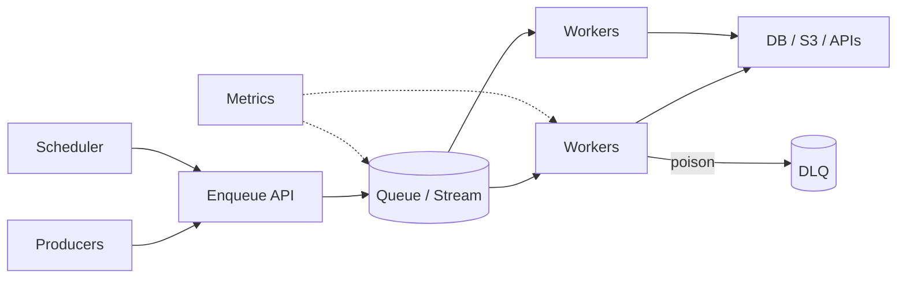
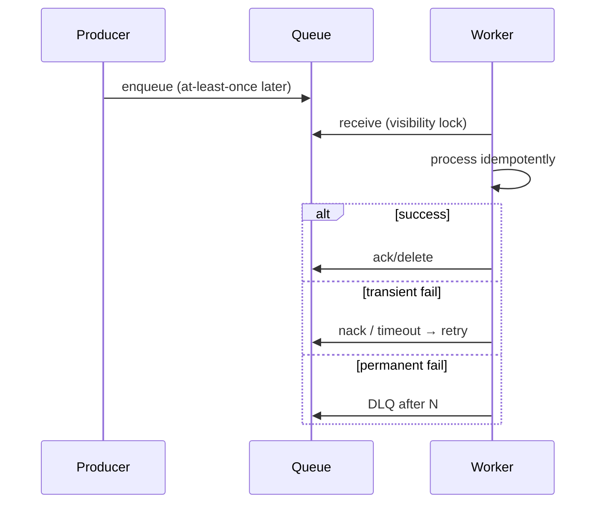

# Job Queue / Async Workers

Reliable background processing: delivery semantics, retries, idempotency, and poison messages.

## Requirements

### Functional

- Enqueue jobs with type, payload, delay, priority
- Workers pull/consume and execute handlers
- Retry with backoff; dead-letter queue (DLQ)
- Delayed / scheduled / cron jobs
- Observability: lag, success rate, age

### Non-functional

- At-least-once delivery (default honest answer)
- Horizontal scale of producers and consumers
- Backpressure when consumers slow
- Multi-tenant fairness (optional)

### Clarifying questions

- Max payload size? Ordering needs? Exactly-once business effect?
- Throughput vs latency priority?

## Capacity estimation

Example: **5k jobs/s**, avg handler **200ms CPU/IO**, desired lag **< 5s**.

| Calc | Result |
| --- | --- |
| Concurrent work | 5k × 0.2 = **1000** in-flight |
| Workers | 1000 / jobs_per_worker_concurrency |
| Queue depth alert | depth / consume_rate > SLO |

Always size from **arrival rate × service time**.

## API

```http
POST /v1/jobs
Idempotency-Key: ...
{
  "type": "image.transcode",
  "payload": { "fileId": "..." },
  "delaySeconds": 0,
  "priority": "normal",
  "dedupeKey": "transcode:file:123"
}

GET /v1/jobs/{id}
POST /v1/jobs/{id}/cancel
```

Worker protocol (SQS-like):

```text
Receive → process → Delete/Ack
         ↘ fail → visibility timeout expires → retry
         ↘ maxReceiveCount → DLQ
```

## Data model

```text
jobs(job_id, type, payload_ref, state, attempts, available_at,
     dedupe_key UNIQUE, created_at, last_error)
job_attempts(job_id, attempt, worker_id, started_at, ended_at, error)
dlq(job_id, reason, dumped_at)
```

Large payloads → object store; queue holds pointer.

States: `pending → running → succeeded | failed | dead | cancelled`.

## Architecture



### Broker choices (trade-offs)

| System | Best for |
| --- | --- |
| SQS / cloud queues | Simple work queues, ops-light |
| RabbitMQ | Routing patterns, classic jobs |
| Kafka / Pulsar | High throughput event log, replay |
| Redis Streams / lists | Lightweight, durability caveats |
| DB as queue | Small scale only — lock storms |

**Interview:** pick based on volume, ordering, replay needs — don’t default Kafka for email sends.

## Semantics



**Exactly-once:** claim *effect* via idempotent handler + dedupe table, not magic broker.

## Retry policy

- Exponential backoff + jitter
- Distinguish retryable (429, 5xx, deadlock) vs not (validation)
- Cap attempts; DLQ with alert
- Poison message: handler crash loop → quarantine

## Scaling

1. Compete consumers on partitioned queues
2. Separate queues per priority / job type (blast radius)
3. Autoscaling on lag / oldest message age (better than CPU alone)
4. Rate-limit outbound calls inside workers
5. Fairness: per-tenant partition or weighted fair queueing

## Bottlenecks

| Bottleneck | Mitigation |
| --- | --- |
| Hot partition | Better key; shuffle |
| Mega payloads | Externalize blob |
| Dual writes (DB + queue) | Outbox pattern |
| Lost jobs on crash | Visibility timeout > processing; heartbeat extend |
| Thundering retry | Jitter; circuit breaker |

## Transactional outbox

When “DB commit + enqueue” must not diverge:

1. Write business row + `outbox` row in same transaction
2. Publisher polls/CDC outbox → queue
3. Mark published

## Follow-ups

**Ordering per user?** Partition key = `user_id`; accept head-of-line blocking.

**Cron at scale?** Leader-elected scheduler enqueues tick jobs; workers execute.

**Multi-region?** Regional queues; avoid cross-region sync for latency-sensitive jobs.

**Security?** Authenticate enqueue; sanitize payloads; no secrets in job body (use refs).

## Interview Q&A

**Q: At-least-once vs at-most-once?**  
At-most-once loses work; at-least-once duplicates — prefer at-least-once + idempotency.

**Q: Why visibility timeout?**  
Hides in-flight message; if worker dies, message reappears.

**Q: Kafka vs SQS for thumbnails?**  
SQS/work queue simpler; Kafka if you need replay/multiple independent consumers of the same event log.

## Common mistakes

- Non-idempotent handlers with automatic retry
- One giant queue for all job types
- Infinite retries without DLQ
- Dual-write without outbox
- Using the DB as a high-throughput queue

## Trade-offs

| Choice | Gain | Cost |
| --- | --- | --- |
| Competing consumers | Scale | No global order |
| Single partition order | Order | Limited throughput |
| Many specialized queues | Isolation | Ops sprawl |
| Long visibility timeout | Safe long jobs | Slow retry on crash |

Related: [Backend queues](/backend/06-queues), [Notifications](./05-notifications), [File/CDN](./06-file-cdn).
