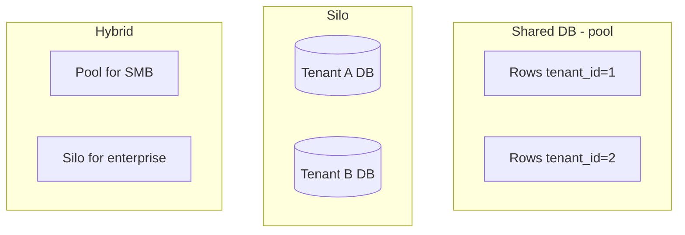
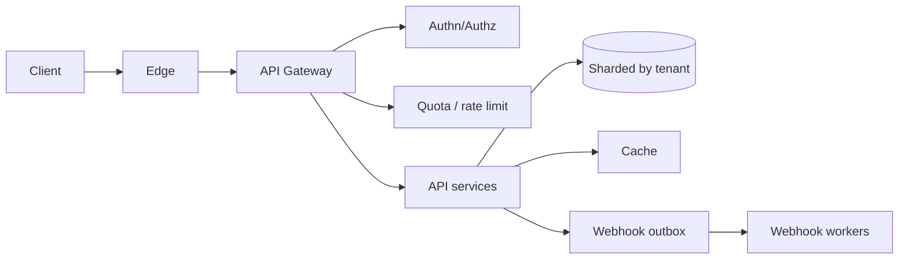

# Multi-tenant SaaS API

Tenant isolation, quotas, authz, and noisy-neighbor control for a B2B API platform.

## Requirements

### Functional

- Multi-tenant resources (projects, API keys, webhooks)
- CRUD APIs with pagination, filtering, idempotency
- Per-tenant quotas (RPS, storage, seats)
- Admin portal vs public API
- Webhooks / event delivery to customer endpoints

### Non-functional

- Strong **tenant isolation** (data + performance)
- High availability; per-tenant blast radius limited
- Audit logs; enterprise SSO (optional follow-up)
- Cost attribution per tenant

### Clarifying questions

- Shared DB vs silo? Compliance (HIPAA)? Custom domains?
- Free tier abuse expectations?

## Capacity estimation

Assume **10k tenants**, **top 1% generate 50% traffic**, platform peak **50k RPS**.

- Design for **skew**: one tenant must not starve others
- Storage: sum of tenant data + indexes; plan shard by `tenant_id`
- Webhook egress separate from inbound API capacity

## API

```http
# Tenant-scoped (API key or JWT with tenant claim)
GET /v1/items?cursor=...&limit=100
POST /v1/items
Idempotency-Key: ...
X-Tenant-Id: t_123   # usually implied by credential

# Platform admin
POST /v1/admin/tenants
PATCH /v1/admin/tenants/{id}/plan { "rps": 1000, "storageGb": 100 }

# Webhooks
POST /v1/webhook_endpoints
{ "url": "https://customer/hooks", "secret": "..." }
```

Errors: `401`, `403`, `404` (don’t leak cross-tenant existence), `409`, `429` with quota headers.

## Data model

```text
tenants(tenant_id, plan, status, created_at)
api_keys(key_id, tenant_id, hash, scopes, expires_at)
users(user_id, tenant_id, role)  -- if human users
items(tenant_id, item_id, ...)   -- EVERY row carries tenant_id
quotas(tenant_id, rps_limit, burst, storage_limit)
audit(tenant_id, actor, action, at, meta)
webhook_endpoints(tenant_id, url, secret, status)
```

**Golden rule:** every query includes `tenant_id` predicate (enforced in data access layer / RLS).

## Tenancy strategies



| Model | Pros | Cons |
| --- | --- | --- |
| Shared schema + `tenant_id` | Cheap, simple ops | Noisy neighbor; careful isolation |
| Shared DB, separate schema | Clearer boundaries | Migration pain |
| DB-per-tenant | Strong isolation | Ops explosion |
| Hybrid | Best of both | Routing complexity |

**Interview default:** shared tables + `tenant_id` + Redis quotas; silo whales.

## Architecture



### Request path

1. Authenticate API key / JWT → resolve `tenant_id`
2. Authorize scopes
3. Enforce RPS + concurrent + storage quotas
4. Data access always scoped
5. Emit audit for mutating calls
6. Async webhooks via outbox

## Scaling & isolation

1. **Shard by `tenant_id`** (hash) for data
2. **Per-tenant rate limits** + global ceiling
3. **Connection pools** per shard; avoid one tenant holding all connections (serverless pooler / concurrency limits)
4. Cache keys prefixed `tenant:{id}:...`
5. Separate compute for enterprise silos
6. Webhook workers with per-tenant concurrency caps (slow customer ≠ stuck queue)

## Bottlenecks

| Issue | Mitigation |
| --- | --- |
| Noisy neighbor | Quotas; priority lanes; silo |
| Cross-tenant leak bug | Central repository helper; RLS; tests |
| Hot tenant shard | Rebalance / dedicated shard |
| Webhook retry storms | Per-endpoint backoff; disable on repeated 410 |
| Schema migrations | Expand/contract; careful with 10k silos |

## Security & compliance

- Hash API keys at rest; show once on create
- Scoped keys (read-only)
- Encryption at rest; optional CMEK for enterprise
- Soft-delete + legal hold
- Admin impersonation fully audited

## Follow-ups

**SSO/SAML?** Per-tenant IdP config; map groups → roles.

**Data residency?** Region pin tenant → regional stack.

**Custom SLAs?** Separate cell / silo with dedicated capacity.

**Metered billing?** Emit usage events → billing pipeline; not on critical path.

## Interview Q&A

**Q: How do you prevent tenant A from reading B?**  
Credential → tenant binding; forced `WHERE tenant_id=?`; automated tests for IDOR; optional Postgres RLS.

**Q: 429 vs 403 for quota?**  
`429` for rate/quota exceeded; `403` for plan feature not enabled.

**Q: Idempotency across tenants?**  
Keys scoped by tenant: `(tenant_id, idempotency_key)`.

## Common mistakes

- Looking up resources by ID only (`WHERE id=?`) without tenant check
- Global rate limit only (unfair + weak isolation)
- Synchronous customer webhooks in the request path
- One shared Redis namespace without prefixes

## Trade-offs

| Choice | When |
| --- | --- |
| Pool model | SMB, cost-sensitive |
| Silo | Enterprise, compliance, huge tenants |
| Cell architecture | Large SaaS — blast radius + region |
| Fine-grained scopes | Security-sensitive APIs |

Related: [Auth Service](./10-auth-service), [Rate Limiter](./04-rate-limiter).
