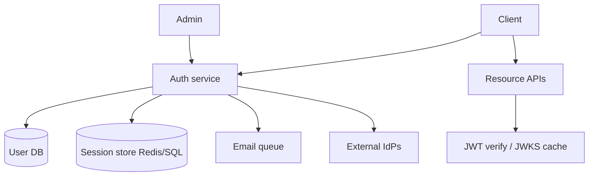
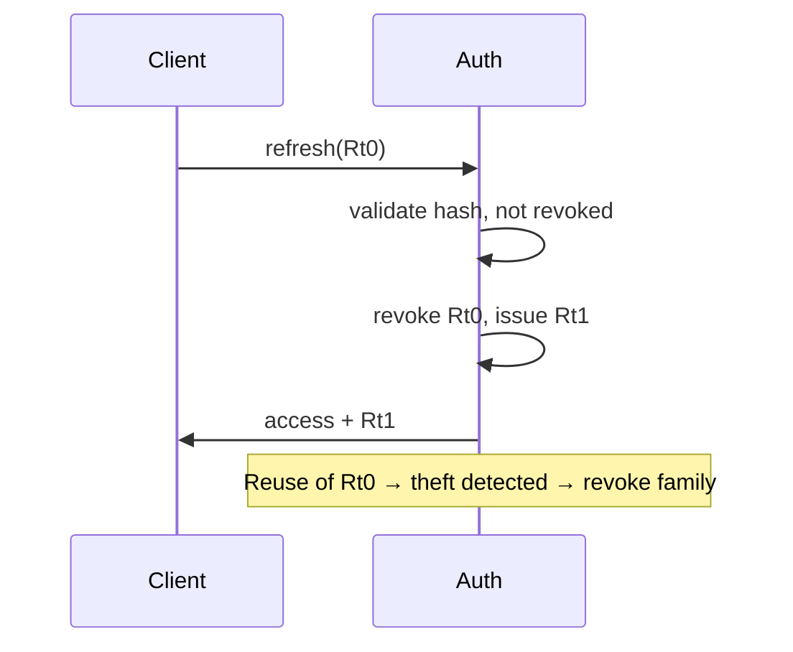

# Auth Service

Authentication, session/JWT lifecycle, refresh rotation, revocation, and OAuth/OIDC integration — as a dedicated system design.

## Requirements

### Functional

- Register / login / logout
- Session or JWT access tokens + refresh tokens
- Password reset, email verify, MFA (optional deep dive)
- OAuth/OIDC social login (Google etc.)
- Service-to-service tokens (optional)
- Admin revoke user / session

### Non-functional

- High availability (auth outage = total outage)
- Low latency validate on every API call
- Secure defaults: hashing, rotation, fixation resistance
- Audit sensitive events

### Clarifying questions

- First-party apps only or third-party OAuth provider?
- SPA + mobile + server?
- Compliance (SOC2) — session length policies?

## Capacity estimation

Assume **50M users**, **10M DAU**, **avg 20 authenticated API calls/day**, login rarer.

| Metric | Estimate |
| --- | --- |
| Token validations | 10M × 20 / 86400 ≈ **2.3k RPS** avg; peak 10k+ |
| Logins | much lower; still spike on incidents |
| Session store | millions of active refresh sessions |

Validation path must be **local JWT verify** or **cached session** — not a DB round-trip every time if avoidable.

## API

```http
POST /v1/auth/register { email, password }
POST /v1/auth/login    { email, password } → { accessToken, refreshToken, expiresIn }
POST /v1/auth/refresh  { refreshToken } → new pair
POST /v1/auth/logout   { refreshToken } / all devices
POST /v1/auth/password-reset/request
POST /v1/auth/password-reset/confirm

GET  /oauth/authorize  # if acting as IdP
POST /oauth/token
GET  /v1/userinfo
```

Resource APIs: `Authorization: Bearer <accessToken>`.

## Data model

```text
users(user_id, email UNIQUE, password_hash, email_verified, mfa_secret, status)
sessions(session_id, user_id, refresh_hash, user_agent, ip, created_at,
         expires_at, revoked_at, rotated_from)
oauth_accounts(user_id, provider, provider_subject)
login_events(user_id, at, ip, success, reason)
```

- Store **hash** of refresh tokens (like passwords)
- Access JWT: short TTL (5–15m); refresh: days–weeks with rotation

## Architecture



### Login

1. Rate-limit by IP + account
2. Verify password (Argon2id/bcrypt)
3. Create session + refresh token
4. Issue access JWT (kid, sub, roles, ver)
5. Optional MFA step-up

### Resource request

- Verify JWT signature + `exp` + `iss`/`aud` locally via cached JWKS
- Check `ver` / session version if you need faster revocation
- Enforce scopes/roles

### Refresh rotation



## Sessions vs JWT

| Approach | Pros | Cons |
| --- | --- | --- |
| Opaque session ID in cookie | Easy revoke; server state | DB/Redis every request if not cached |
| JWT access + refresh | Stateless validate; mobile-friendly | Revoke harder until expiry |
| JWT + session version claim | Middle ground | Must bump version on password change |

**Interview favorite:** short-lived JWT access + rotating refresh in httpOnly cookie (web) or secure storage (mobile).

## Scaling

1. Auth service horizontally scaled; sticky not required
2. Redis for sessions / refresh; SQL source of truth for users
3. JWKS cached at every resource service
4. Separate “login” pool from “refresh” if needed
5. Geographic: regional auth with global user directory carefully (or cell)

## Bottlenecks & attacks

| Threat / bottleneck | Mitigation |
| --- | --- |
| Credential stuffing | Rate limit, CAPTCHA, breach detection, MFA |
| Refresh theft | Rotation + reuse detection; bind UA lightly |
| Password DB leak | Argon2id, pepper, unique salts |
| Auth storm | Cache; degrade nonessential checks |
| Key compromise | JWT `kid` rotation; short TTL |

## Revocation

- Logout: revoke session
- Password change: revoke all sessions / bump `token_version`
- Emergency: deny-list `jti` in Redis until exp (keep list small via short TTL)

## Follow-ups

**MFA?** TOTP / WebAuthn; step-up for sensitive actions.

**Become OIDC provider?** Authorization code + PKCE for SPAs; don’t use implicit.

**Service accounts?** Client credentials grant; locked down scopes.

**SSO for SaaS?** SAML/OIDC per tenant — see [SaaS API](./09-saas-api).

## Interview Q&A

**Q: Store JWT in localStorage?**  
XSS risk. Prefer httpOnly secure cookie for web + CSRF strategy (SameSite, double-submit).

**Q: Why short access TTL?**  
Limits stolen token window without hitting the DB every request.

**Q: Can JWT be revoked instantly?**  
Not while purely stateless; need denylist or version field.

## Common mistakes

- Long-lived JWT with no refresh/revoke story
- Rolling your own crypto
- Timing-unsafe password compare (use constant-time)
- Putting PII secrets in JWT claims
- Refresh without rotation

## Trade-offs

| Choice | Gain | Cost |
| --- | --- | --- |
| Stateless JWT | Scale validate | Revocation complexity |
| Server sessions | Control | Central store dependency |
| Cookie session | XSS harder | CSRF considerations |
| Bearer in SPA memory | CSRF easier | XSS / persistence UX |

Related: [Node JWT](/node/08-jwt-auth), [Backend auth](/backend/07-auth).
