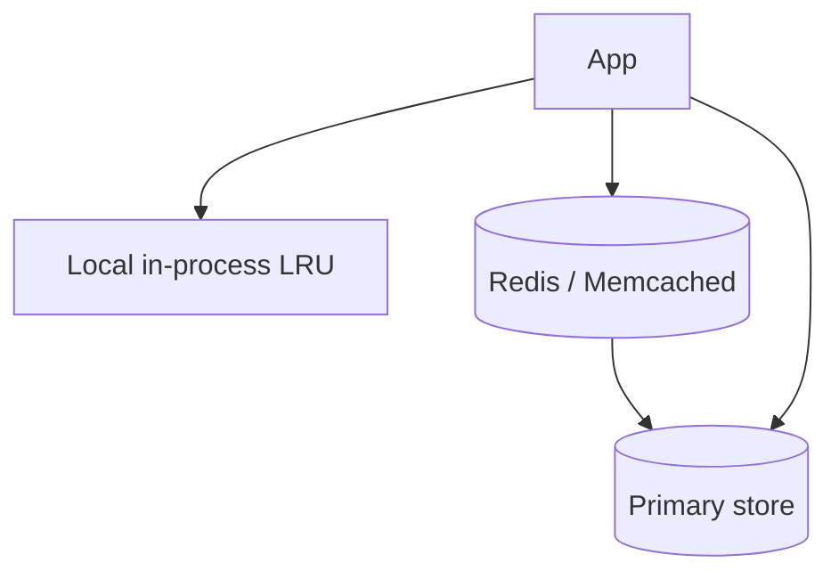
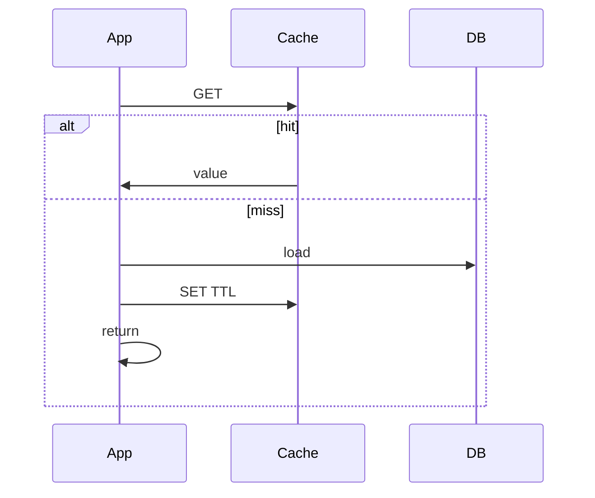

# Cache Layer

Design a caching tier: placement, invalidation, stampede control, and coherence — the interview behind almost every other design.

## Requirements

### Functional

- Get/set/delete by key; optional TTLs
- Multi-tenant key namespacing
- Bulk get; optional read-through / write-through helpers
- Admin: flush by prefix (careful), stats

### Non-functional

- Ultra-low latency (sub-ms–few ms)
- High hit rate on working set
- Predictable behavior on failure (fail open to DB vs error)
- Consistency model explicit (TTL eventual vs explicit invalidate)

### Clarifying questions

- What is cached (rows, objects, pages, sessions)?
- How stale is acceptable?
- Single region or global?

## Capacity estimation

Assume app peak **50k RPS**, **80% cacheable reads**, **90% hit rate**.

| Metric | Estimate |
| --- | --- |
| Cache QPS | 50k × 0.8 ≈ **40k** gets |
| DB QPS after cache | 40k × 0.1 = **4k** (+ writes) |
| Memory | working set × avg value × replicas / eviction overhead |

Size cache for **working set**, not full DB.

## API

```text
GET key → value | miss
SET key value EX ttl
DEL key
MGET keys...

# Higher-level
GetOrLoad(key, loader, ttl)   # singleflight inside
```

Key design: `org:{id}:user:{id}:profile:v{schema}`.

## Data model / topology



| Layer | Latency | Size | Coherence |
| --- | --- | --- | --- |
| L1 process | μs–0.1ms | Small | Hard across nodes |
| L2 Redis | sub-ms–2ms | Large | Shared |
| CDN | edge | Huge public | Purge APIs |

## Architecture patterns

### Cache-aside (lazy)



Most common. App owns coherence.

### Read-through / write-through

Cache library loads DB; writes go cache+DB. Simpler app code, less flexible.

### Write-behind

Write cache first, async DB — high risk; rare for critical data.

## Invalidation strategies

| Strategy | Use |
| --- | --- |
| TTL only | Mildly stale OK |
| Explicit `DEL` on write | Read-your-writes needed |
| Versioned keys | Avoid purge races (`:v2`) |
| Pub/sub invalidate L1 | Multi-node L1 |
| Time-bucket keys | News/feed windows |

**Hard truth:** invalidation is the hard part — name your consistency goal.

## Stampede / thundering herd

When hot key expires, N requests hammer DB.

**Mitigations:**

1. **Singleflight / request coalescing** per key in app
2. **Probabilistic early expiration** (XFetch)
3. **Lock** in Redis (`SET nx`) — one loader
4. **Soft TTL** + background refresh
5. **Never expire** hot keys; update in place

## Scaling

1. Redis Cluster / Memcached continuum — shard by key
2. Avoid hot keys: replicate key, local L1, or compute locally
3. Compression for large values; don’t cache huge blobs — cache pointers
4. Separate caches by workload (sessions vs pages) so eviction doesn’t thrash
5. Multi-region: regional caches; global invalidation via pub/sub or short TTL

## Bottlenecks

| Issue | Mitigation |
| --- | --- |
| Hot key | L1 + split; serve stale |
| Large values | Cache IDs; compress; slab awareness (Memcached) |
| Serialization CPU | Efficient codecs; cache structs carefully |
| Connection storms | Pooling; cluster-aware clients |
| Flushall accidents | Disable; prefer version bump |

## Failure modes

| Cache down | Policy |
| --- | --- |
| Fail open | Talk to DB — protect with shed load |
| Fail closed | Error — only if stale wrong is catastrophic |
| Partial partition | Timeouts + circuit breaker |

Always pair with **DB overload protection**.

## Follow-ups

**Cache stampeded after deploy?** Warm critical keys; use versioned keys in deploy.

**Security?** No PII in keys; TLS; ACL per app; don’t cache sensitive tokens long.

**Nearline vs online?** Materialized views / CQRS when invalidation too hard.

**How to measure?** Hit rate, eviction rate, p99 get latency, DB QPS correlation.

## Interview Q&A

**Q: Cache-aside vs write-through?**  
Aside: flexible, risk of stale if forget invalidate. Write-through: always warm on write, more write latency.

**Q: Why not infinite TTL + invalidate?**  
Missed invalidations → forever stale. TTL is safety net.

**Q: Where to put cache?**  
Beside DB for data; CDN for public HTTP; L1 for ultra-hot. Often all three.

## Common mistakes

- Caching without key versioning across schema changes
- `FLUSHALL` in production scripts
- Caching user-specific pages at CDN without `Vary` / cookie care
- No stampede control on famous keys
- Assuming Redis is a source of truth

## Trade-offs

| Choice | Gain | Cost |
| --- | --- | --- |
| Longer TTL | Higher hit rate | Stale data |
| Aggressive invalidate | Fresher | More DB load |
| L1 + L2 | Latency | Complex coherence |
| CDN | Global scale | Purge / personalization limits |

Related: [Backend Redis](/backend/05-redis), used in [URL Shortener](./01-url-shortener), [Feed](./02-news-feed), [Rate Limiter](./04-rate-limiter).
