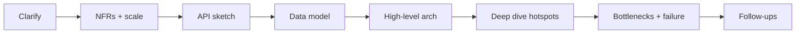
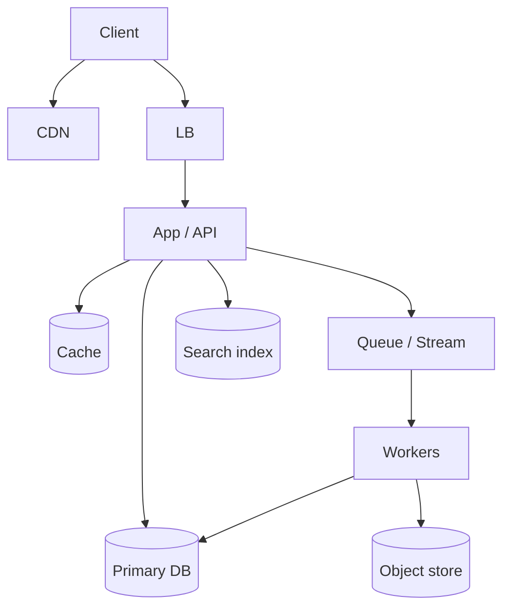

# Backend System Design — Interview Framework

Language-agnostic playbook for mid→senior backend / full-stack SD rounds. Use this framework on every prompt; the chapters that follow are worked examples.

## What interviewers score

| Signal | What “strong” looks like |
| --- | --- |
| Clarifying questions | Functional vs non-functional split; scale numbers; consistency needs |
| Capacity estimation | Back-of-envelope QPS, storage, bandwidth — orders of magnitude, not fake precision |
| High-level design | Clear components + data flow before diving into one service |
| Deep dive | Correct bottlenecks, indexes, caching, partitioning, failure modes |
| Trade-offs | Consistency vs availability, push vs pull, sync vs async — with when you’d flip |
| Communication | Drive the whiteboard; check in; time-box |

> [!TIP]
> Aim for **45–50 minutes** of structured talk: 5m clarify → 5m estimate → 15m high-level → 15m deep dive → 5–10m follow-ups.

## Step-by-step framework

### 1. Clarify requirements (5 min)

Always ask:

- **Actors:** users, services, admins, third parties?
- **Core actions:** write path vs read path ratio?
- **Consistency:** strong, eventual, read-your-writes?
- **Latency SLOs:** p99 for reads/writes?
- **Scale:** DAU, peak QPS, data retention, growth?
- **Geography:** single region vs multi-region?
- **Out of scope:** explicitly park ML ranking, billing, mobile clients if needed.

Split into:

- **Functional:** what the system *does*
- **Non-functional:** latency, availability, durability, cost, security, compliance

### 2. Capacity estimation (5 min)

Use round numbers. State assumptions out loud.

| Quantity | Typical formula |
| --- | --- |
| QPS | DAU × actions/day ÷ 86_400 × peak factor (2–5×) |
| Storage | objects × size × replicas × retention |
| Bandwidth | QPS × avg payload |
| Cache | working set × hit-rate target |

**Units cheat sheet:** 1 day ≈ 10⁵ s; 1M users × 10 actions ≈ 100 avg QPS; peak often 3–5×; 1KB × 10k QPS ≈ 80 Mbps.

### 3. API design (5–8 min)

REST or RPC is fine. Interviewers care about:

- Resources and verbs
- Idempotency on writes (`Idempotency-Key`)
- Pagination (`cursor` > `offset` at scale)
- Authn/Authz boundaries
- Error model (4xx vs 5xx, retryability)

### 4. Data model (5–8 min)

- Entities + relationships
- Primary keys / partition keys
- Indexes for hot queries
- What is denormalized and *why*
- TTL / retention / soft-delete

Call out SQL vs NoSQL choice with a reason (query patterns, consistency, fan-out writes).

### 5. High-level architecture (10–15 min)

Draw left→right: **Client → Edge/LB → App → Cache → DB → Async**.

Name each box’s responsibility. Don’t invent 12 microservices on day one — start modular monolith, then split on clear seams (write amplification, independent scale, blast radius).

### 6. Deep dive + bottlenecks (10–15 min)

Pick 1–2 hotspots:

- Hot partition / celebrity key
- Cache stampede / thundering herd
- Fan-out on write vs read
- Cross-region replication lag
- Queue backlog / poison messages
- Connection pool exhaustion

For each: **symptom → cause → mitigation → trade-off**.

### 7. Follow-ups (always prepare)

Interviewers escalate: multi-region, GDPR delete, abuse, cost, observability, migrations. Chapters end with likely follow-ups and crisp answers.

## Common building blocks

| Block | Use when |
| --- | --- |
| Cache (Redis/Memcached) | Hot reads, session, rate counters |
| CDN | Static + cacheable public content |
| Queue / stream | Decouple write path, retry, fan-out |
| Object store | Blobs, media, backups |
| Search (ES/OpenSearch) | Full-text / fuzzy beyond DB `LIKE` |
| Shard / partition | Single DB can’t hold QPS or size |
| Replica | Scale reads; failover |

## Consistency cheat sheet

| Need | Pattern |
| --- | --- |
| Strong single-key | Primary DB + sync replica lag awareness |
| Read-your-writes | Sticky session / read-from-primary / version token |
| Eventual OK | Async fan-out, CQRS read models |
| Exactly-once *effect* | At-least-once delivery + idempotent consumers |

## How to use this part

1. Memorize the **framework** above.
2. Drill each design chapter out loud (whiteboard or paper).
3. Cross-link implementation depth in [Backend Engineering](/backend/01-api-design) and [Node](/node/01-libuv).
4. Pair with [FE System Design](/frontend-system-design/index) when the prompt is full-stack.

## Chapter map

| # | Design | Core tension |
| --- | --- | --- |
| 1 | [URL Shortener](./01-url-shortener) | Write once / read many; collision-free IDs |
| 2 | [News Feed](./02-news-feed) | Fan-out on write vs read |
| 3 | [Chat](./03-chat) | Real-time delivery + offline sync |
| 4 | [Rate Limiter](./04-rate-limiter) | Accuracy vs cost vs distributed clocks |
| 5 | [Notifications](./05-notifications) | Fan-out, preference, multi-channel |
| 6 | [File / CDN](./06-file-cdn) | Upload reliability + edge cache |
| 7 | [Autocomplete](./07-autocomplete) | Prefix latency + freshness |
| 8 | [Job Queue](./08-job-queue) | At-least-once + backoff + DLQ |
| 9 | [SaaS API](./09-saas-api) | Tenancy isolation + quotas |
| 10 | [Auth Service](./10-auth-service) | Sessions/JWT, refresh, revocation |
| 11 | [Cache Layer](./11-cache-layer) | Invalidation, stampede, coherence |

## Interview Q&A — framework itself

**Q: How do you start when the prompt is vague (“design Twitter”)?**  
Clarify MVP (post, follow, home timeline), scale (e.g. 100M DAU), and what is *out* (ads, DMs). State assumptions if they won’t give numbers.

**Q: SQL or NoSQL first answer?**  
Default to the query pattern: relational + transactions → SQL; massive key-value / flexible docs / extreme write scale → NoSQL — then justify.

**Q: When do you introduce a queue?**  
When work is slow, spiky, or multi-consumer; when you need retry/backoff without blocking the user request.

## Common mistakes

- Jumping to Kafka + 20 microservices before stating requirements
- Fake-precise estimates (1,234,567 QPS) without assumptions
- Ignoring failure: what if cache is empty? replica lagging? queue stuck?
- Never stating trade-offs (“we’ll use Redis” with no why)

## Trade-offs (meta)

| Choice | Gain | Cost |
| --- | --- | --- |
| More services | Independent scale | Ops + latency + consistency |
| Strong consistency | Simpler correctness | Availability / latency |
| Heavy denormalization | Fast reads | Write amplification, drift |
| Aggressive caching | Lower DB load | Invalidation bugs |
