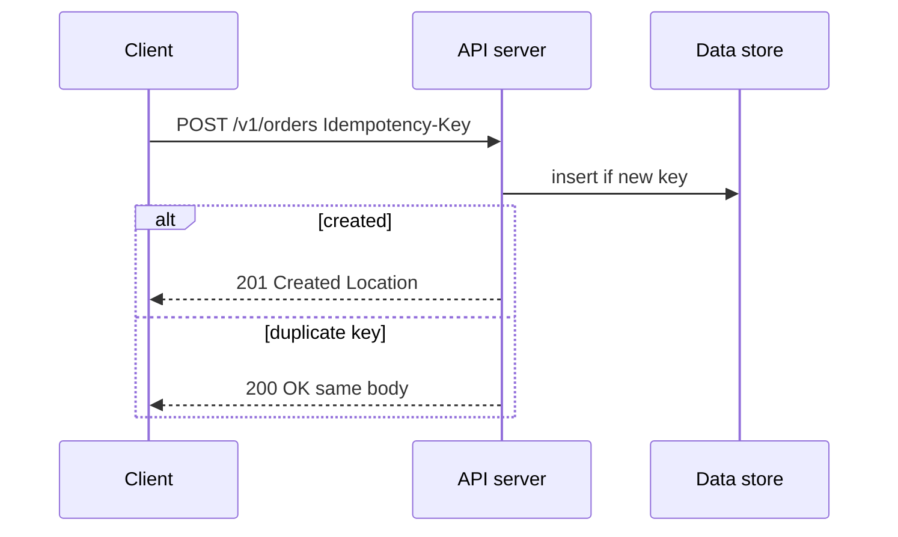
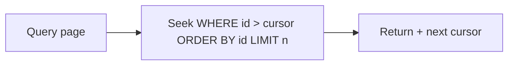

# API Design (REST, GraphQL, HTTP)

API design interviews test **resource modeling, status codes, versioning, idempotency, pagination, and when to choose REST vs GraphQL vs RPC**. Language-agnostic principles with TypeScript/Node examples.

Related: [Rate limit](/backend/08-rate-limit) · [Auth](/backend/07-auth) · [SaaS API SD](/backend-system-design/09-saas-api) · [Node middleware](/node/09-middleware)

## HTTP as the contract



| Verb | Idempotent? | Safe? | Typical use |
| --- | --- | --- | --- |
| GET | Yes | Yes | Read |
| HEAD | Yes | Yes | Metadata |
| PUT | Yes | No | Replace |
| DELETE | Yes | No | Remove |
| POST | **No** (unless keyed) | No | Create / actions |
| PATCH | Conditional | No | Partial update |

## REST modeling

- Nouns for resources: `/users/{id}/orders`
- Prefer plural; avoid verbs in paths (`/createUser` → `POST /users`)
- Actions that aren’t CRUD: `POST /orders/{id}/cancel` or capability resources
- Consistent error envelope:

```ts
type ApiError = {
  error: {
    code: string
    message: string
    details?: unknown
    requestId: string
  }
}
```

```ts
// Express sketch
app.post('/v1/orders', async (req, res) => {
  const key = req.header('Idempotency-Key')
  if (!key) return res.status(400).json({ error: { code: 'missing_idempotency_key' } })
  const order = await createOrderIdempotent(key, req.body)
  res.status(201).location(`/v1/orders/${order.id}`).json(order)
})
```

## Status codes (interview set)

| Code | When |
| --- | --- |
| 200 | OK with body |
| 201 | Created |
| 202 | Accepted async |
| 204 | No body |
| 400 | Validation |
| 401 | Unauthenticated |
| 403 | Authenticated but forbidden |
| 404 | Not found / hidden |
| 409 | Conflict |
| 422 | Semantic validation (optional style) |
| 429 | Rate limited |
| 500 | Bug |
| 503 | Dependency down |

Don’t use 200 for failures with `{ success: false }` if you can avoid it.

## Pagination

```ts
// Cursor pagination — stable under inserts
GET /items?limit=20&cursor=eyJpZCI6MTIzfQ

type Page<T> = { data: T[]; nextCursor: string | null }

// Offset — simple, breaks under churn; OK for admin small sets
GET /items?limit=20&offset=40
```



Prefer **cursor/keyset** for feeds — [News Feed SD](/backend-system-design/02-news-feed).

## Versioning

| Strategy | Pros | Cons |
| --- | --- | --- |
| URL `/v1` | Explicit | URL churn |
| Header `Accept-Version` | Clean URLs | Less discoverable |
| No version + evolvable | Simple | Needs discipline |

Compatible evolution: add fields; don’t remove/rename without deprecation window.

## GraphQL

```graphql
type Query {
  user(id: ID!): User
}
type User {
  id: ID!
  email: String!
  orders(first: Int!, after: String): OrderConnection!
}
```

**Wins:** client-specified fields; fewer round-trips for BFF/mobile.  
**Costs:** caching harder, N+1 resolvers (DataLoader), authz per field, query cost attacks.

```ts
// DataLoader batches
import DataLoader from 'dataloader'

const userLoader = new DataLoader(async (ids: readonly string[]) => {
  const rows = await db.users.findByIds([...ids])
  const map = new Map(rows.map((u) => [u.id, u]))
  return ids.map((id) => map.get(id) ?? null)
})
```

Persisted queries / depth-cost limits in production.

## REST vs GraphQL vs gRPC

| | REST | GraphQL | gRPC |
| --- | --- | --- | --- |
| Cache | HTTP semantics strong | Custom | Weak at edge |
| Streaming | Limited | Subs | First-class |
| Browser | Native | Over HTTP | grpc-web |
| Contract | OpenAPI | Schema | Protobuf |

## HATEOAS / hypermedia

Rare in industry APIs; know the idea (links in responses). Most teams ship OpenAPI instead.

## Idempotency keys

Store `key → response` with TTL; same key + same body → replay; same key + different body → 409. Critical for payments — [Rate limit & idempotency](/backend/08-rate-limit).

## Interview Q&A

**Q: PUT vs PATCH?**  
A: PUT replaces resource (client sends full); PATCH partial. PUT idempotent by definition.

**Q: How do you delete privately without leaking existence?**  
A: 404 for both missing and unauthorized when enumeration matters.

**Q: Why not always GraphQL?**  
A: File uploads, HTTP cache, simple public APIs, operational complexity.

**Q: How to version breaking changes?**  
A: New version + sunset headers; dual-run; migrate clients.

**Q: 202 vs 201?**  
A: 201 resource exists now; 202 work queued — return job URL.

## Common Mistakes

- Verbs in URLs and random status codes.
- Offset pagination on infinite scroll feeds.
- Unbounded GraphQL queries.
- POST create without idempotency for money.
- Breaking JSON field types silently (`id` number → string).

## Trade-offs

| Choice | Benefit | Cost |
| --- | --- | --- |
| REST+OpenAPI | Ubiquitous tooling | Over/under fetching |
| GraphQL BFF | Mobile flexibility | Server complexity |
| Fat resources | Fewer calls | Payload bloat |
| Fine resources | Small payloads | Chatty clients |

**Next:** Persistence realities in [SQL](/backend/02-sql) and [NoSQL](/backend/03-nosql).


## Conditional requests & caching

```http
ETag: "v3"
If-None-Match: "v3" → 304
If-Match: "v2" on PUT → 412 if changed
```

Useful for optimistic concurrency without inventing custom versions — pairs with CDN for public GETs.

## Bulk endpoints

`POST /batch` with capped array size, per-item results, partial success policy (`200` with per-item errors vs all-or-nothing transaction). Document atomicity.

## Webhooks

Sign payloads (HMAC), send timestamps, require verifiers to reject skew, deliver at-least-once, expose retry schedule — [Queues](/backend/06-queues).

## OpenAPI discipline

Generated clients drift without CI contract tests. Treat breaking OpenAPI changes like DB migrations.
