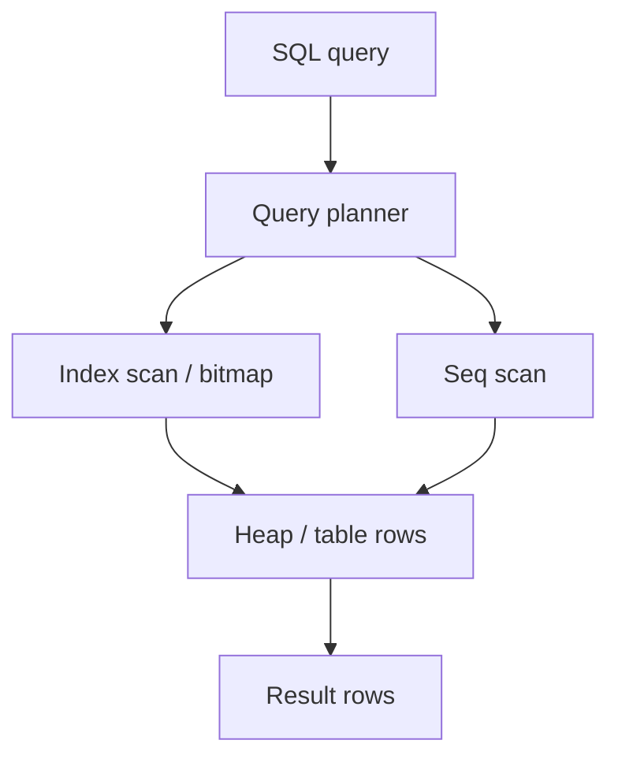

# SQL, Indexes, Transactions, N+1, Migrations

Relational internals show up in almost every backend interview: **indexes, EXPLAIN, isolation, locks, N+1, and safe migrations**.

Related: [ORM](/backend/04-orm) · [NoSQL](/backend/03-nosql) · [Cache](/backend/05-redis) · [SaaS API](/backend-system-design/09-saas-api)

## Mental model



## Indexes

**B-tree** (default): equality + range (`WHERE`, `ORDER BY`, joins).  
**Hash:** equality only (limited).  
**GIN/GiST:** full-text, JSONB, arrays (Postgres).  
**Partial / covering / composite:** interview favorites.

```sql
-- Composite: leftmost prefix matters
CREATE INDEX ON orders (user_id, created_at DESC);

-- Helps: WHERE user_id = $1 ORDER BY created_at DESC LIMIT 20
-- Does NOT fully help: WHERE created_at > $1  (skips leading column)

-- Covering / include (Postgres)
CREATE INDEX ON users (email) INCLUDE (id, status);

-- Partial
CREATE INDEX ON users (email) WHERE deleted_at IS NULL;
```

```sql
EXPLAIN (ANALYZE, BUFFERS)
SELECT * FROM orders WHERE user_id = 42 ORDER BY created_at DESC LIMIT 20;
```

Look for: Seq Scan on large tables, high cost, Nested Loop explosions, sorts that spill to disk.

### Selectivity & anti-patterns

- Indexing low-cardinality columns alone (`is_active`) often useless.
- Functions on columns (`WHERE LOWER(email)=`) defeat indexes unless expression index.
- Leading wildcards (`LIKE '%foo'`) can’t use normal B-tree well.

## Transactions & ACID

| Property | Meaning |
| --- | --- |
| Atomicity | All or nothing |
| Consistency | Constraints hold |
| Isolation | Concurrent effects controlled |
| Durability | Committed data survives crash |

### Isolation levels (know anomalies)

| Level | Dirty read | Non-repeatable | Phantom |
| --- | --- | --- | --- |
| Read uncommitted | Yes | Yes | Yes |
| Read committed | No | Yes | Yes |
| Repeatable read | No | No | DB-dependent |
| Serializable | No | No | No |

Postgres default: **Read Committed**. Use explicit transactions for multi-statement correctness.

```sql
BEGIN;
UPDATE accounts SET balance = balance - 100 WHERE id = 1;
UPDATE accounts SET balance = balance + 100 WHERE id = 2;
COMMIT;
```

```ts
await db.tx(async (t) => {
  await t.none('UPDATE accounts SET balance = balance - $1 WHERE id = $2', [100, from])
  await t.none('UPDATE accounts SET balance = balance + $1 WHERE id = $2', [100, to])
})
```

### Locks & deadlocks

Row-level locks on `UPDATE`/`SELECT FOR UPDATE`. Deadlocks → one transaction aborted; **retry** idempotently.

```sql
SELECT * FROM seats WHERE id = $1 FOR UPDATE; -- pessimistic
```

Optimistic: `UPDATE ... WHERE id=$1 AND version=$2` check rowcount.

## N+1 queries

```ts
// N+1 — classic ORM trap
const users = await User.findAll()
for (const u of users) {
  u.orders = await Order.findAll({ where: { userId: u.id } }) // N queries
}

// Fix: join or IN-batch
const users = await User.findAll({ include: [Order] })
// or
const orders = await Order.findAll({ where: { userId: { in: userIds } } })
```

Detect with query logs / APM. DataLoader for GraphQL — [API Design](/backend/01-api-design).

## Schema migrations

**Expand/contract** for zero downtime:


```sql
-- BAD in one step on huge table without care
ALTER TABLE users ADD COLUMN full_name text NOT NULL DEFAULT '';

-- Better: add nullable → backfill in batches → set NOT NULL
ALTER TABLE users ADD COLUMN full_name text;
-- batch UPDATE ... WHERE id BETWEEN ... 
-- then
ALTER TABLE users ALTER COLUMN full_name SET NOT NULL;
```

Avoid long locks: concurrent index creation (Postgres `CREATE INDEX CONCURRENTLY`), no rewrite ALTERs during peak without plan.

## Connection pooling

```ts
const pool = { max: 10 } // per instance
// total ≈ instances * max < Postgres max_connections
```

PgBouncer transaction pooling: careful with session features.

## Interview Q&A

**Q: Why composite index column order matters?**  
A: B-tree uses leftmost prefix; `(a,b)` helps `a` and `a,b`, not `b` alone.

**Q: Covering index?**  
A: Index contains all columns needed → index-only scan.

**Q: Serializable vs optimistic concurrency?**  
A: DB serializable prevents anomalies via locks/SSI; optimistic uses version checks — fewer locks, retries.

**Q: How do you find N+1?**  
A: Count queries per request in staging; ORM “include”; logs.

**Q: Migration that must rewrite table?**  
A: Shadow table / batch copy / swap; or maintenance window.

## Common Mistakes

- `SELECT *` everywhere — can’t use covering indexes well; overfetch.
- Missing index on FK → slow joins/cascades.
- Huge transactions holding locks.
- Offset pagination `ORDER BY random()`.
- Running `migrate down` in prod casually.

## Trade-offs

| Choice | Win | Cost |
| --- | --- | --- |
| More indexes | Read speed | Write amp / storage |
| Higher isolation | Correctness | Contention |
| Denormalize columns | Read speed | Anomalies |
| Stored procedures | Locality | Portability / ops |

**See:** Document/KV trade-offs in [NoSQL](/backend/03-nosql); ORMs in [ORM](/backend/04-orm).


## Write amplification & fillfactor

Heavy secondary indexes slow `INSERT`/`UPDATE`. Measure write p99 after adding indexes. Partial indexes reduce size when predicates match query filters.

## `SKIP LOCKED` job claims

```sql
UPDATE jobs
SET status = 'running', locked_by = $1, locked_at = now()
WHERE id = (
  SELECT id FROM jobs
  WHERE status = 'ready'
  ORDER BY id
  FOR UPDATE SKIP LOCKED
  LIMIT 1
)
RETURNING *;
```

Classic DB-backed queue primitive — see [Queues](/backend/06-queues).

## Vacuum / bloat (Postgres)

Updates leave dead tuples; autovacuum must keep up. Sudden disk growth after bulk updates → check bloat, not only “disk leak in app.”
