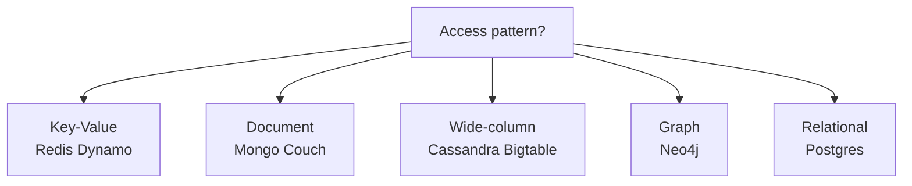
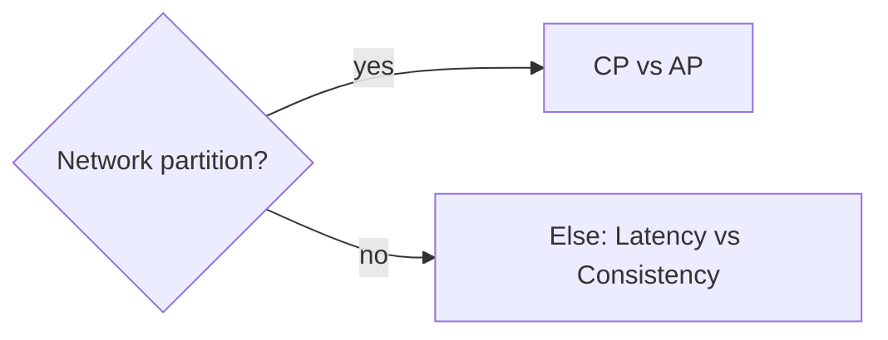

# NoSQL Trade-offs

NoSQL interviews are about **access patterns first**, not “Mongo is web scale.” Know document, KV, wide-column, and graph trade-offs vs relational.

Related: [SQL](/backend/02-sql) · [Redis](/backend/05-redis) · [Cache layer SD](/backend-system-design/11-cache-layer) · [Chat SD](/backend-system-design/03-chat)

## Landscape



| Family | Strength | Weakness |
| --- | --- | --- |
| KV | Latency, simple get/put | Limited query |
| Document | Flexible JSON, rapid product | Multi-doc tx historically weak; schema drift |
| Wide-column | Huge write throughput, time-series-ish | Query by PK/design; ops complexity |
| Graph | Relationship traversal | Global graph scale hard |
| Relational | Joins, constraints, ad-hoc query | Horizontal write scale harder |

## Document stores (Mongo-style)

```ts
// Model for query: embed vs reference
type OrderEmbedded = {
  _id: string
  userId: string
  items: { sku: string; qty: number; price: number }[]
  total: number
}

// Embed when data read together & bounded size
// Reference when unbounded / shared / separately updated
```

**Indexes** still matter. Blindly dumping JSON without indexes → collection scans.

```js
db.orders.createIndex({ userId: 1, createdAt: -1 })
```

**Transactions:** multi-document ACID exists in modern Mongo — still costlier; design for single-document atomicity when possible.

## Key-value / Dynamo style

Partition key determines shard. **Hot keys** kill throughput.

```ts
// BAD hot partition
pk = 'global_leaderboard'

// BETTER: shard leaderboard
pk = `lb#${shard}` // or time buckets
```

GSIs / secondary indexes: eventual consistency options — know consistency knobs (`consistent read` costs).

## Wide-column

Design **tables around queries** (Cassandra): `(partition_key, clustering)`.

```cql
-- messages by chat, ordered by time
CREATE TABLE messages (
  chat_id uuid,
  created_at timeuuid,
  sender text,
  body text,
  PRIMARY KEY (chat_id, created_at)
) WITH CLUSTERING ORDER BY (created_at DESC);
```

No ad-hoc JOIN — denormalize deliberately. See [Chat](/backend-system-design/03-chat).

## CAP / PACELC (interview framing)



Be precise: most systems offer **tunable** consistency. Don’t recite CAP as “Mongo=AP.”

## When NoSQL wins

- Extreme write throughput with known keys (IoT, timelines)
- Flexible evolving documents with few relational constraints
- Session/cache/ephemeral (Redis)
- Multi-region AP needs with conflict resolution (CRDTs / LWW)

## When SQL wins

- Complex joins/reporting
- Strong multi-row invariants (payments, inventory)
- Mature tooling / one source of truth
- Ad-hoc analytics (or use warehouse)

## Polyglot reality

```text
Postgres (source of truth) + Redis (cache) + S3 (blobs) + OpenSearch (search)
```

Avoid “Mongo for everything.” Search ≠ primary store ([Autocomplete](/backend-system-design/07-autocomplete)).

## Interview Q&A

**Q: Embed or reference?**  
A: Embed bounded, co-read, same lifecycle; reference shared/unbounded/frequently independent updates.

**Q: How do you model many-to-many in documents?**  
A: Arrays of ids (bounded), or junction collection; or denormalize both sides with care.

**Q: Hot partition fix?**  
A: Key salting, bucketing, write sharding + fan-in reads.

**Q: Is NoSQL schemaless?**  
A: Schema-on-read — still need application schema & migrations mindset.

**Q: Cassandra vs Postgres for chat?**  
A: Cassandra/wide-column for huge append timelines; Postgres fine until scale forces it — justify with numbers.

## Common Mistakes

- Choosing Mongo to avoid learning SQL joins.
- Unbounded embedded arrays (growing documents).
- Secondary indexes that recreate relational pain without transactions.
- Ignoring backup/restore & consistency of secondary stores.
- Treating Redis as durable system of record without persistence design.

## Trade-offs

| Decision | Gain | Pain |
| --- | --- | --- |
| Denormalize for reads | Latency | Dual updates |
| Single-document atomicity | Simplicity | Cross-entity invariants |
| Multi-region AP | Availability | Conflict UX |
| Dual writes to search | Query power | Sync lag / bugs |

**Next:** [ORM vs query builder](/backend/04-orm) for how apps talk to SQL; [Redis](/backend/05-redis) for KV caching patterns.


## Consistency choices (Dynamo-style)

Eventually consistent reads cheaper; strongly consistent reads hit leaders. Product must know if “add to cart” can read stale inventory.

## Change data capture

Mongo change streams / Postgres logical replication → search index / cache. CDC beats dual-writes when mature — still handle lag & replay.

## Time-series pattern

Bucket by time in PK (`metric#2026-07-16#hour`), TTL old buckets, avoid unbounded partitions. Wide-column and some document designs excel here.
