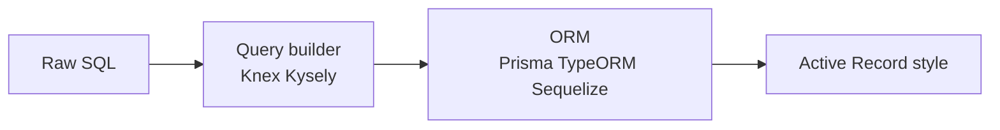

# ORM vs Query Builder

ORMs accelerate CRUD and hurt you with **N+1, leaky abstractions, and surprising queries**. Seniors know when to drop to SQL.

Related: [SQL](/backend/02-sql) · [API Design](/backend/01-api-design) · [Node Performance](/node/11-performance)

## Spectrum



| Layer | Control | Safety | Speed of CRUD |
| --- | --- | --- | --- |
| Raw SQL | Max | Manual | Slow write |
| Query builder | High | Parameterized | Medium |
| ORM | Medium | Models/migrations | Fast |

## Prisma-style example

```ts
// Convenient
const user = await prisma.user.findUnique({
  where: { id },
  include: { orders: { take: 10, orderBy: { createdAt: 'desc' } } },
})

// Generated SQL should be inspected in reviews
```

```ts
// Transaction API
await prisma.$transaction(async (tx) => {
  const from = await tx.account.update({
    where: { id: fromId },
    data: { balance: { decrement: amount } },
  })
  if (from.balance < 0) throw new Error('insufficient')
  await tx.account.update({
    where: { id: toId },
    data: { balance: { increment: amount } },
  })
})
```

Note: application-level check races without proper isolation/`SELECT FOR UPDATE` — know limits.

## Query builder (Kysely sketch)

```ts
const rows = await db
  .selectFrom('orders')
  .innerJoin('users', 'users.id', 'orders.user_id')
  .select(['orders.id', 'users.email', 'orders.total'])
  .where('orders.status', '=', 'paid')
  .orderBy('orders.created_at', 'desc')
  .limit(20)
  .execute()
```

Typed SQL-ish control without stringly SQL everywhere.

## N+1 & ORM footguns

```ts
// Lazy loading (TypeORM style) — silent N+1
const users = await userRepo.find()
for (const u of users) {
  console.log(u.orders.length) // each access may query
}
```

Mitigations: explicit `relations`/`include`, DataLoader, query metrics in CI.

## Migrations ownership

ORMs generate migrations — **review the SQL**. Prisma migrate vs expand/contract manually for hot tables — [SQL migrations](/backend/02-sql).

## Repository pattern

```ts
interface UserRepository {
  findByEmail(email: string): Promise<User | null>
  save(user: User): Promise<void>
}

// Allows swapping Prisma ↔ SQL for hot paths without rewriting domain
```

Don’t build a second ORM on top of an ORM without need.

## When to drop to SQL

- Window functions, CTEs, complex reports
- `UPDATE ... FROM ... JOIN` bulk ops
- Hinting / `FOR UPDATE SKIP LOCKED` job claims — [Queues](/backend/06-queues)
- Partial indexes / advanced Postgres features

```ts
await prisma.$queryRaw`
  SELECT date_trunc('day', created_at) d, sum(total)
  FROM orders
  WHERE created_at > ${since}
  GROUP BY 1
  ORDER BY 1
`
```

Always parameterize — never string concat user input.

## Interview Q&A

**Q: ORM vs query builder?**  
A: ORM for domain models/relations; builder when you want explicit SQL shape with composition; raw for advanced SQL.

**Q: How do ORMs cause production incidents?**  
A: N+1, over-fetch, huge IN lists, migrations locking, chatty unit-of-work flush order.

**Q: Is Active Record bad?**  
A: Fine for simple apps; domain logic in models can blur boundaries and testing.

**Q: How to test repositories?**  
A: Integration tests against real Postgres in CI > heavy mocking of ORM.

**Q: Identity map / unit of work?**  
A: ORM tracks loaded entities and batches writes on flush — surprising write order / dirty checks.

## Common Mistakes

- `findMany` without pagination.
- Loading entire relations “just in case.”
- Ignoring generated SQL in PR review.
- Using ORM transactions for distributed side effects without outbox — [Queues](/backend/06-queues).
- Auto-migrate on app boot in production.

## Trade-offs

| Approach | Benefit | Cost |
| --- | --- | --- |
| Full ORM | Velocity | Abstraction leaks |
| Builder + SQL | Clarity | More code |
| Raw only | Power | Boilerplate / safety |
| Hybrid | Pragmatism | Dual styles |

**Pair with:** indexing strategy in [SQL](/backend/02-sql); caching ORM results carefully in [Redis](/backend/05-redis).


## Dirty checking surprises

Loading an entity and mutating a nested JSON field may not persist unless marked dirty. Know your ORM’s change tracking.

## Soft deletes

Global filters (`deleted_at IS NULL`) hide rows — unique indexes must be partial or you’ll block reuse of emails. Cascades get subtle.

## Connection lifecycle

ORMs holding transactions open across `await` external HTTP = lock death. Keep transactions short; use outbox for side effects.
