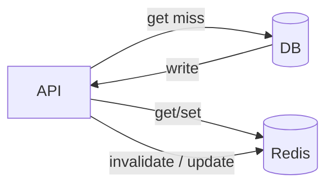
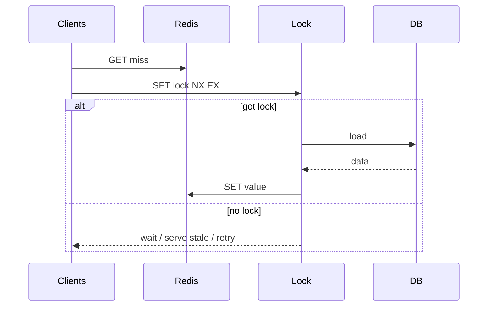

# Redis Caching Patterns

Redis is the default answer for **sessions, rate limits, locks, and hot-key caches** — until someone forgets invalidation or stampede control. Interview depth: data structures, TTLs, consistency, and failure modes.

Related: [Cache layer SD](/backend-system-design/11-cache-layer) · [Rate limit](/backend/08-rate-limit) · [Scaling Node](/node/10-scaling) · [Auth](/backend/07-auth)

## Role in a stack



Redis is usually **not** the system of record (unless designed as such with persistence + HA).

## Core structures (interview table)

| Structure | Use |
| --- | --- |
| STRING | Cache blobs, counters (`INCR`) |
| HASH | Object fields |
| LIST | Simple queues (prefer Streams/dedicated MQ) |
| SET | Uniqueness, tags |
| ZSET | Leaderboards, sliding windows |
| STREAM | Consumer groups / lightweight log |
| BITMAP / HYLL | Flags, approximate counts |

```ts
import Redis from 'ioredis'
const redis = new Redis(process.env.REDIS_URL)

await redis.set('user:42', JSON.stringify(user), 'EX', 60)
const raw = await redis.get('user:42')
```

## Cache-aside (lazy loading)

```ts
async function getUser(id: string): Promise<User> {
  const key = `user:${id}`
  const cached = await redis.get(key)
  if (cached) return JSON.parse(cached) as User

  const user = await db.users.find(id)
  if (!user) throw notFound()
  await redis.set(key, JSON.stringify(user), 'EX', 300)
  return user
}

async function updateUser(id: string, patch: Partial<User>) {
  const user = await db.users.update(id, patch)
  await redis.del(`user:${id}`) // invalidate
  return user
}
```

**Write-through:** write DB + cache together.  
**Write-behind:** cache first, async DB — speed vs durability risk.

## Invalidation strategies

| Strategy | Pros | Cons |
| --- | --- | --- |
| TTL only | Simple | Stale window |
| Explicit `DEL` on write | Fresher | Missed paths → ghosts |
| Version keys | `user:42:v7` | Indirection |
| Tag sets | Invalidate groups | Memory / complexity |

## Thundering herd / stampede

Many requests miss simultaneously → DB overload.



```ts
async function getUserSingleFlight(id: string): Promise<User> {
  const key = `user:${id}`
  const cached = await redis.get(key)
  if (cached) return JSON.parse(cached)

  const lockKey = `lock:user:${id}`
  const got = await redis.set(lockKey, '1', 'EX', 5, 'NX')
  if (!got) {
    await sleep(50)
    return getUserSingleFlight(id) // or return stale if available
  }
  try {
    const user = await db.users.find(id)
    await redis.set(key, JSON.stringify(user), 'EX', 300)
    return user
  } finally {
    await redis.del(lockKey)
  }
}
```

Alternatives: **probabilistic early expiration**, serve stale while revalidate, request coalescing in-process.

## Hot keys & large values

- Shard hot keys (`key#0..N`)
- Compress large JSON; prefer hashes for partial updates
- Avoid huge `KEYS *` — use `SCAN`

## Distributed lock (caveats)

```ts
// Simplified — prefer Redlock carefully or Redis-based lease with token
const token = randomUUID()
const ok = await redis.set('lock:job', token, 'EX', 30, 'NX')
// release with compare-and-del Lua to avoid deleting others' lock
```

Locks aren’t consensus. For correctness under partitions, understand limits — often DB constraints or Quorum systems are safer for money.

## Persistence & eviction

| Mode | Behavior |
| --- | --- |
| Volatile TTL + `allkeys-lru` | Classic cache |
| AOF/RDB | Durability options — still not magic |
| Cluster / Sentinel | HA topology |

Eviction can drop keys anytime under memory pressure — app must tolerate miss.

## Interview Q&A

**Q: Cache-aside vs write-through?**  
A: Aside: simple reads, risk stampede/stale. Through: write latency↑, fresher reads.

**Q: How do you prevent stampede?**  
A: Lock/single-flight, stale-while-revalidate, jittered TTLs.

**Q: Why not cache lists of “all users”?**  
A: Invalidation nightmare; huge keys; prefer page-level or item-level keys.

**Q: Redis as queue?**  
A: Possible (Streams); durability/retry/visibility vs Kafka/SQS — [Queues](/backend/06-queues).

**Q: What happens when Redis is down?**  
A: Decide fail-open (DB load↑) vs fail-closed (503). Circuit breakers.

## Common Mistakes

- No TTL on keys → memory blowup.
- Caching unauthorized responses (user A gets user B via shared key without auth scope).
- `FLUSHALL` in prod.
- Treating lock success as business correctness alone.
- Stampede after deploy clears cache.

## Trade-offs

| Pattern | Latency | Consistency |
| --- | --- | --- |
| Short TTL | Good | Eventual |
| Strong invalidation | Good | Closer to fresh |
| No cache | Worse | Strongest |
| Local+Redis | Best | Multi-layer invalidation hard |

**Design drill:** [Cache Layer](/backend-system-design/11-cache-layer).


## Cache stampedes after deploy

Empty cache + full traffic = coordinated miss. Mitigations: warm critical keys in release job, longer dual-run TTLs, probabilistic early refresh, gradual traffic canary — [Ops](/backend/10-ops).

## Negative caching

Cache 404s briefly to protect DB from missing-key hammering — short TTL, careful with authz (don’t cache “not found” for unauthorized as public).

```ts
if (!user) {
  await redis.set(key, 'null', 'EX', 30)
  throw notFound()
}
```

## Multi-get pipelines

```ts
const pipe = redis.pipeline()
ids.forEach((id) => pipe.get(`user:${id}`))
const rows = await pipe.exec()
```

Reduces RTT; still watch stampede on collective miss.
