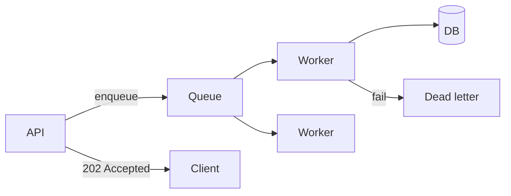
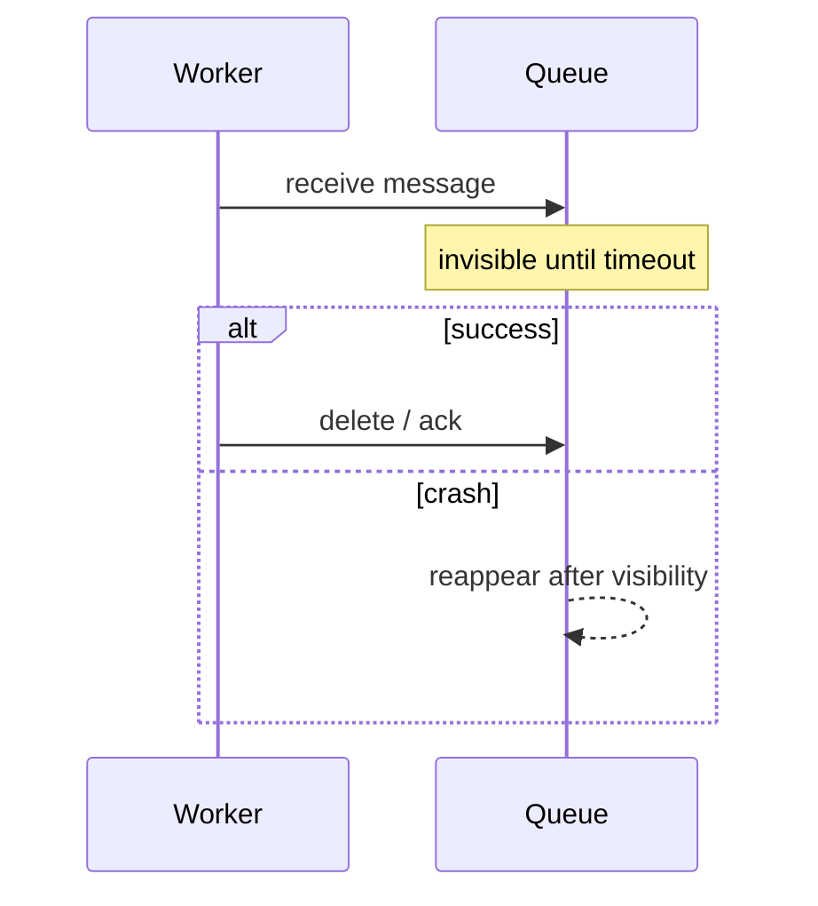
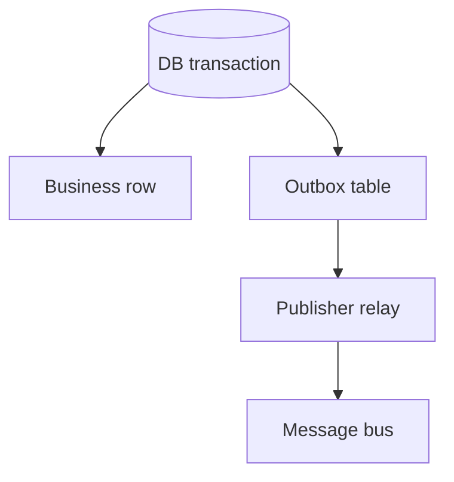

# Queues & Messaging

Queues absorb spikes, enable retries, and decouple services. Interviews focus on **delivery semantics, idempotency, visibility timeouts, and DLQs** — not tool logos.

Related: [Job Queue SD](/backend-system-design/08-job-queue) · [Notifications SD](/backend-system-design/05-notifications) · [Redis](/backend/05-redis) · [API Design](/backend/01-api-design)

## Why queues



Use when work is: slow, spiky, retriable, fan-out, or must outlive the HTTP request.

## Delivery semantics

| Semantic | Meaning | App requirement |
| --- | --- | --- |
| At-most-once | May lose | Rarely OK |
| At-least-once | May duplicate | **Idempotent consumers** |
| Exactly-once | End-to-end rare | Usually “effective exactly-once” via idempotency |

Most cloud queues (SQS, Rabbit with acks, Kafka consumer commits) → **at-least-once**.

## Idempotency

```ts
async function handlePaymentEvent(evt: { eventId: string; orderId: string }) {
  const inserted = await db.query(
    `INSERT INTO processed_events (event_id) VALUES ($1) ON CONFLICT DO NOTHING RETURNING 1`,
    [evt.eventId],
  )
  if (!inserted.rowCount) return // duplicate

  await db.query(`UPDATE orders SET status='paid' WHERE id=$1 AND status='pending'`, [evt.orderId])
}
```

Also: idempotent natural keys, upserts, version checks.

## Visibility timeout / ack



Extend visibility for long jobs; if processing > timeout → duplicate delivery.

## Retry & DLQ

```ts
type Job = { attempts: number; payload: unknown }

async function process(job: Job) {
  try {
    await doWork(job.payload)
  } catch (err) {
    if (job.attempts >= 5) {
      await dlq.push(job)
      await alert(err)
      return
    }
    await queue.retry(job, { delayMs: backoff(job.attempts) })
  }
}

function backoff(attempt: number) {
  const base = Math.min(60_000, 500 * 2 ** attempt)
  return base + Math.floor(Math.random() * 200) // jitter
}
```

Classify: retryable (timeouts) vs poison (validation) → DLQ immediately.

## Outbox pattern (dual-write fix)



```sql
BEGIN;
UPDATE orders SET status='confirmed' WHERE id=$1;
INSERT INTO outbox (id, topic, body) VALUES ($2, 'order.confirmed', $3);
COMMIT;
-- separate process publishes outbox rows → queue, then marks sent
```

Avoids “DB committed but Kafka publish failed” split brain.

## Ordering & partitions

- Single queue ≠ global order under concurrency.
- Kafka: order **per partition key** (`orderId`).
- Don’t require global order unless necessary.

## Poison messages & schema

Version payloads (`schemaVersion`). Consumers must tolerate N and N-1 during deploys.

## Interview Q&A

**Q: Why at-least-once dominates?**  
A: Crash between side effect and ack duplicates; losing messages often worse than dupes + idempotency.

**Q: SQS vs Kafka?**  
A: SQS: simple competing consumers, ops-light. Kafka: log, replay, high throughput, partitioning, more ops.

**Q: When is a queue the wrong tool?**  
A: Need sync user latency path; tiny work; when it hides needed transactional coupling.

**Q: How do you claim DB jobs?**  
A: `FOR UPDATE SKIP LOCKED` — [SQL](/backend/02-sql).

**Q: Exactly-once?**  
A: Say “idempotent processing + dedupe store” unless the platform’s transactional outbox/inbox is explicit.

## Common Mistakes

- Non-idempotent consumers + automatic retries → double charge.
- Infinite retries without DLQ.
- Visibility timeout too short.
- Huge payloads in queue (store S3 pointer).
- One mega-queue without priority/isolation for critical paths.

## Trade-offs

| Choice | Win | Cost |
| --- | --- | --- |
| Competing consumers | Scale | Harder ordering |
| FIFO queues | Order | Throughput limits |
| Long visibility | Big jobs | Slow retry on crash |
| Outbox | Consistency | Extra moving parts |

**Implementations:** BullMQ/Redis, SQS+Lambda, Kafka consumers — principles transfer. Continue with [Auth](/backend/07-auth) for secure workers/APIs.


## Poison pill playbook

1. Detect repeated fail → DLQ  
2. Alert with payload redacted  
3. Fix consumer or data  
4. Replay with rate limit  
5. Document runbook  

## Priority & fairness

Separate queues for critical vs bulk (`payments` vs `email-newsletter`) so bulk backlog cannot starve checkout. Weight fair scheduling if single worker pool.

## Exactly-once myth

Even Kafka transactions don’t free you from idempotent business side effects. Say “effectively once” and show the dedupe table.
