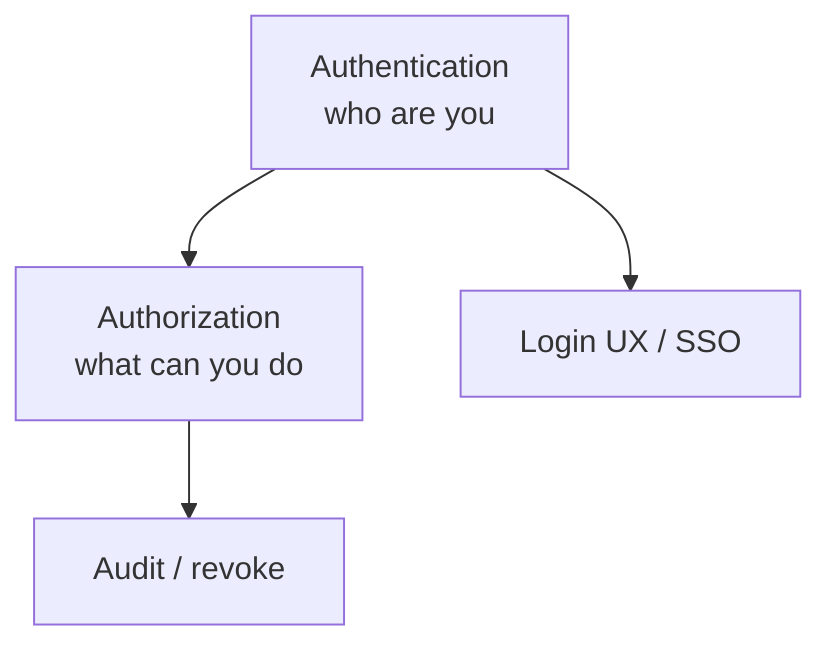
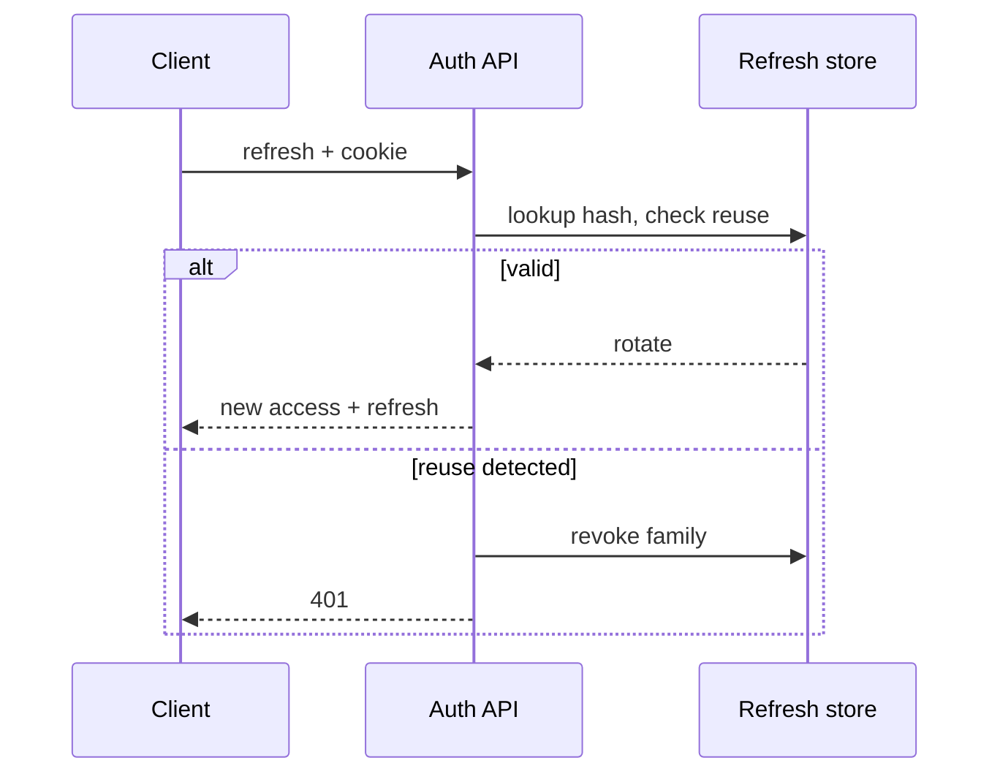

# Auth at Scale

Session cookies, JWT, OAuth2/OIDC, refresh rotation, and service auth — the senior version beyond “use Passport.”

Related: [Node JWT](/node/08-jwt-auth) · [Auth Service SD](/backend-system-design/10-auth-service) · [Security](/node/12-security) · [Rate limit](/backend/08-rate-limit)

## Goals



- Authenticate humans & services
- Authorize with least privilege
- Revoke on logout/compromise
- Survive horizontal scale

## Session-based auth

```ts
// Store session id in HttpOnly cookie; state in Redis
const sessionId = randomUUID()
await redis.setex(`sess:${sessionId}`, 86400, JSON.stringify({ userId, roles }))
res.cookie('sid', sessionId, { httpOnly: true, secure: true, sameSite: 'lax' })
```

**Pros:** Instant revoke, server-controlled TTL.  
**Cons:** Shared store required; CSRF for cookie-based mutating requests.

## JWT access tokens

Short-lived access (`5–15m`) + refresh. Signed claims: `sub`, `iss`, `aud`, `exp`, `iat`, `jti`, roles/scopes.

```ts
// Verify every request
const payload = await jose.jwtVerify(token, publicKey, {
  issuer: 'https://auth.example.com',
  audience: 'api',
})
```

**Pros:** Stateless verification at APIs.  
**Cons:** Revocation needs denylist/versioning; don’t stuff sensitive PII.

## Refresh tokens



Store **hash** of refresh; rotate on use; reuse detection revokes family — [Node JWT](/node/08-jwt-auth).

## OAuth 2.1 / OIDC (conceptual)

| Role | Job |
| --- | --- |
| Resource owner | User |
| Client | Your app |
| Authorization server | Issues tokens |
| Resource server | API |

OIDC adds **ID Token** (who user is) on top of OAuth access tokens (what client can call).

Flows:

- **Authorization Code + PKCE** — SPAs/native (no implicit).
- **Client credentials** — machine-to-machine.
- Avoid legacy implicit.

```ts
// PKCE sketch
const verifier = base64url(randomBytes(32))
const challenge = base64url(sha256(verifier))
// send challenge to /authorize; later exchange code + verifier
```

## Authorization models

| Model | Use |
| --- | --- |
| RBAC | Roles → permissions |
| ReBAC | Relationships (Google Zanzibar-ish) |
| ABAC | Attributes / policies |

```ts
function authorize(user: User, action: string, resource: Resource) {
  if (user.roles.includes('admin')) return true
  if (action === 'read' && resource.ownerId === user.id) return true
  return false
}
```

Enforce on **server** always; UI hiding is not authz.

## CSRF & cookies

For cookie sessions: `SameSite`, CSRF tokens/double-submit for state-changing requests, or separate CSRF header. See [Browser Security](/browser/06-security).

## Service-to-service

- mTLS mesh
- JWT with tight `aud` / short TTL
- SPIFFE / cloud IAM roles

Never share long-lived user JWTs between services as ambient authority.

## Interview Q&A

**Q: Sessions vs JWT at scale?**  
A: Sessions need Redis/DB but revoke easily; JWT scales verify, revoke harder — hybrid common.

**Q: Why PKCE?**  
A: Stops code interception on public clients without client secrets.

**Q: Access vs ID vs refresh?**  
A: Access → APIs; ID → identity (OIDC); refresh → get new access (confidential storage).

**Q: How to revoke JWT ASAP?**  
A: Short TTL; denylist `jti`; session version claim checked in Redis.

**Q: Where to store tokens in SPA?**  
A: Prefer BFF/cookie HttpOnly; avoid localStorage if XSS is a concern.

## Common Mistakes

- Long-lived JWT in localStorage.
- Accepting any `alg`.
- Confusing OAuth “login” without OIDC identity validation (`nonce`, `iss`).
- Authorization only on frontend routes.
- Refresh tokens without rotation/reuse detection.

## Trade-offs

| Design | Security | Complexity |
| --- | --- | --- |
| Server sessions | High control | Store dependency |
| Stateless JWT | Simple APIs | Revoke/PII |
| OIDC SSO | UX + central IAM | Integration surface |
| mTLS | Strong S2S | Cert ops |

**Next:** Abuse prevention via [Rate limiting](/backend/08-rate-limit); system design in [Auth Service](/backend-system-design/10-auth-service).


## Audience & issuer checks

Always verify `iss` and `aud`. Accepting any signed token from a shared keystore without audience check → confused deputy across APIs.

## Step-up authentication

Sensitive actions (change email, payout) require recent MFA / reauth claim (`amr`, `auth_time`). Access token alone may be insufficient.

## Session fixation

Rotate session id on login. Invalidate server session on password change across devices.
