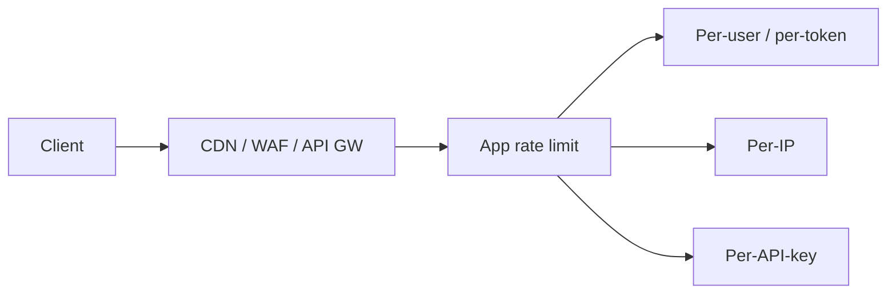
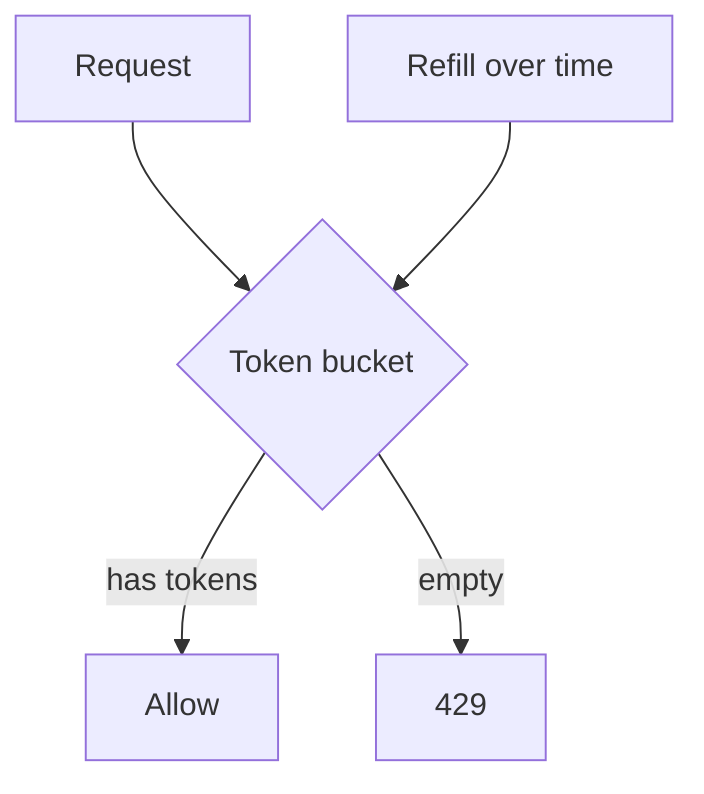

# Rate Limiting & Idempotency

Protect APIs from abuse and accidental double-submits. Classic senior topic: algorithms, Redis implementations, and where to place limits.

Related: [Rate Limiter SD](/backend-system-design/04-rate-limiter) · [Redis](/backend/05-redis) · [API Design](/backend/01-api-design) · [Auth](/backend/07-auth)

## Where to enforce



Defense in depth: edge for volumetric; app for business quotas (per plan).

## Algorithms

### Fixed window

```text
count[floor(now / window)]++
if count > limit → reject
```

Simple; burst at window edges (2× near boundary).

### Sliding window log

Store timestamps; accurate; memory heavy.

### Sliding window counter (approx)

Weight previous window + current — good Redis compromise.

### Token bucket

```text
tokens = min(capacity, tokens + refill * dt)
if tokens >= cost: tokens -= cost; allow
else reject
```

Allows controlled bursts — often preferred UX.

### Leaky bucket

Smooths to constant drain rate — stricter shaping.



## Redis token bucket sketch

```ts
// Pseudo — production: Lua for atomicity
async function allow(key: string, capacity: number, refillPerSec: number): Promise<boolean> {
  const now = Date.now() / 1000
  const data = await redis.hgetall(key)
  let tokens = data.tokens ? Number(data.tokens) : capacity
  let ts = data.ts ? Number(data.ts) : now
  tokens = Math.min(capacity, tokens + (now - ts) * refillPerSec)
  if (tokens < 1) {
    await redis.hset(key, { tokens, ts: now })
    await redis.expire(key, 3600)
    return false
  }
  tokens -= 1
  await redis.hset(key, { tokens, ts: now })
  await redis.expire(key, 3600)
  return true
}
```

Atomicity: use Lua/`INCR` with TTL carefully to avoid races.

## HTTP semantics

```http
HTTP/1.1 429 Too Many Requests
Retry-After: 2
X-RateLimit-Limit: 100
X-RateLimit-Remaining: 0
X-RateLimit-Reset: 1710000000
```

Document limits in OpenAPI. Differ login (`/login`) vs public read.

## Key design

| Key | Use | Bypass risk |
| --- | --- | --- |
| IP | Anonymous | NAT shared pain; spoof if no trust proxy |
| userId | Authenticated | Needs auth first |
| API key | Partners | Key leak |
| route+user | Fine-grained | Cardinality |

```ts
const key = `rl:${userId}:${route}`
```

Unauthenticated expensive routes: IP + CAPTCHA / proof-of-work after threshold.

## Idempotency (client retries)

Distinct from rate limits but often co-designed for POST.

```ts
app.post('/charges', async (req, res) => {
  const idem = req.header('Idempotency-Key')
  if (!idem) return res.status(400).json({ error: 'idempotency_required' })

  const existing = await redis.get(`idem:${idem}`)
  if (existing) return res.status(200).json(JSON.parse(existing))

  const lock = await redis.set(`idemlock:${idem}`, '1', 'EX', 30, 'NX')
  if (!lock) return res.status(409).json({ error: 'in_progress' })

  try {
    const result = await charge(req.body)
    await redis.set(`idem:${idem}`, JSON.stringify(result), 'EX', 86400)
    return res.status(201).json(result)
  } finally {
    await redis.del(`idemlock:${idem}`)
  }
})
```

Persist idempotency in DB for money — Redis alone may lose keys.

## Distributed & multi-region

Central Redis for global quotas; or regional limits + eventual — product decision. Edge + origin must not multiply unfairly (count once).

## Interview Q&A

**Q: Token vs leaky bucket?**  
A: Token allows burst up to capacity; leaky enforces smoother rate.

**Q: Why Lua for Redis RL?**  
A: Multi-step check/update must be atomic under concurrency.

**Q: Rate limit by IP enough?**  
A: No — bots rotate IPs; authenticated quotas needed; IP hurts CGNAT users.

**Q: Idempotency vs rate limit?**  
A: Idempotency makes retries safe; RL bounds abuse volume.

**Q: Where do you put RL for microservices?**  
A: Gateway for coarse; service for domain quotas; don’t double-punish without care.

## Common Mistakes

- In-process counters with many pods — under-enforcement ([Cluster](/node/05-cluster)).
- Trusting `X-Forwarded-For` blindly.
- Same limit for `/health` and `/search`.
- No `Retry-After` → client stampede.
- Idempotency keys reused for different bodies without 409.

## Trade-offs

| Choice | UX | Protection |
| --- | --- | --- |
| Strict leaky | Smooth | May feel harsh |
| Bursty token | Snappy | Need capacity cap |
| Soft limit + warn | Friendly | Abuse window |
| Edge-only | Cheap | Weak business logic |

**Deep design:** [Rate Limiter system design](/backend-system-design/04-rate-limiter).


## Quotas vs rate limits

Rate limit: short window (per second/minute). Quota: daily/monthly plan allotments. Both Redis; different keys and UX (upgrade CTA vs Retry-After).

## Cost-based GraphQL limits

Assign cost to fields; reject queries over budget; persist allowlisted operations in prod.

## Fairness under shared IP

Corporate NAT: IP limits punish coworkers. Prefer user/API-key once authenticated; softer anonymous limits + bot detection.
