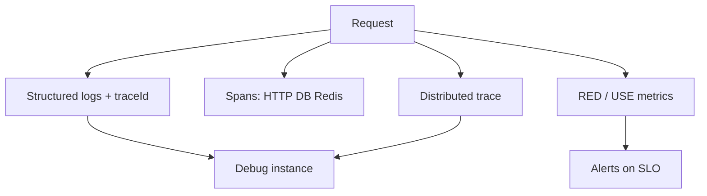
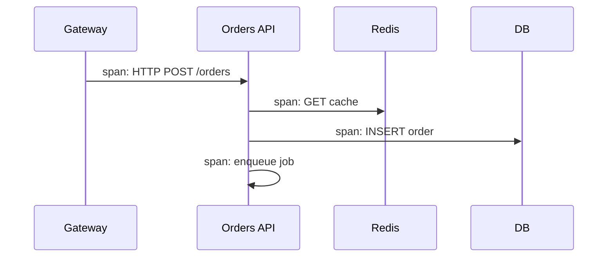

# Observability

Logs, metrics, and traces — the three pillars — plus SLOs and how Node services emit them. Interviews want **what you’d look at during an incident**, not vendor names only.

Related: [Node Performance](/node/11-performance) · [Production](/node/13-production) · [Ops](/backend/10-ops) · [FE Observability](/frontend-system-design/07-observability)

## Pillars



| Pillar | Answers | Example |
| --- | --- | --- |
| Metrics | Is it broken / how bad? | p99 latency, error rate |
| Logs | What happened on this node? | Exception stack |
| Traces | Where did time go across services? | Span waterfalls |

## RED & USE

- **RED** (request-driven): Rate, Errors, Duration  
- **USE** (resources): Utilization, Saturation, Errors  

```ts
// Conceptual counters/histograms
metrics.increment('http_requests_total', { route, status })
metrics.timing('http_request_duration_ms', ms, { route })
```

Prefer histograms for latency (heatmaps / percentiles), not only averages.

## Structured logging

```ts
logger.info({
  msg: 'order_created',
  orderId,
  userId,
  requestId,
  traceId,
  durationMs,
})
```

- JSON in prod
- Levels: debug/info/warn/error
- **Never** log secrets, tokens, raw cards, passwords
- Sample high-volume debug

Correlate with `traceparent` / OpenTelemetry context — [Middleware ALS](/node/09-middleware).

## Distributed tracing



Instrument outbound HTTP, DB, Redis automatically when possible (OTEL SDKs). Propagate context on queue messages too.

## SLIs / SLOs / Error budgets

| Term | Meaning |
| --- | --- |
| SLI | Measurement (e.g. success ratio) |
| SLO | Target (99.9% over 30d) |
| Error budget | 1 - SLO → allowed failure |

Alert on **burn rate** (fast/slow) better than raw CPU.

```text
SLO: 99.9% of checkout requests < 300ms and non-5xx
Alert: 2% budget burned in 1 hour
```

## Node-specific signals

| Signal | Tooling idea |
| --- | --- |
| Event loop delay | `monitorEventLoopDelay` |
| Heap / RSS | `process.memoryUsage`, cgroup metrics |
| GC pauses | OTEL / `--trace-gc` staging |
| Active handles | leak suspicion |

See [Performance](/node/11-performance).

## Health vs observability

`/healthz` is for orchestrators — not a substitute for metrics. Deep dependency checks belong in readiness carefully — [Ops](/backend/10-ops).

## Sampling

Always sample errors & slow traces; head/tail sampling for volume. Metrics usually aggregated, not sampled the same way.

## Interview Q&A

**Q: Metrics or logs first in an outage?**  
A: Metrics/SLO dashboards to see blast radius; traces for latency; logs for exception detail.

**Q: Why averages lie?**  
A: Hide multimodal / tail latency — use p95/p99.

**Q: Cardinality explosion?**  
A: Don’t put `userId` on metric labels; use logs/traces for high-cardinality.

**Q: How do you trace across a queue?**  
A: Inject trace context into message attributes; start consumer span as child/link.

**Q: What is an error budget?**  
A: Allowed unreliability; guides release velocity vs freeze.

## Common Mistakes

- `console.log` strings without IDs.
- Alerting on CPU only — miss user-facing errors.
- 100% trace sampling in prod → cost melt.
- Metrics labeled with unbounded paths (`/users/123`).
- No correlation between mobile/web RUM and backend — [FE Observability](/frontend-system-design/07-observability).

## Trade-offs

| Choice | Benefit | Cost |
| --- | --- | --- |
| Full OTEL | Insight | Overhead / vendor $ |
| Log everything | Debug | PII + cost |
| Tight SLOs | Quality | Slower shipping |
| Wide dashboards | Coverage | Alert fatigue |

**Practice:** Narrate a checkout outage using RED → trace → log → fix → postmortem.


## Exemplars

Link a metric bucket to an example traceId — jump from “p99 spike” to a concrete waterfall.

## Continuous profiling

Sampling profilers (Pyroscope/etc.) catch CPU regressions without full traces. Pair with deploy markers.

## Postmortem minimums

Timeline, impact (SLO burn), root cause, blast radius, action items with owners. Dashboards without culture don’t fix recurrence.
