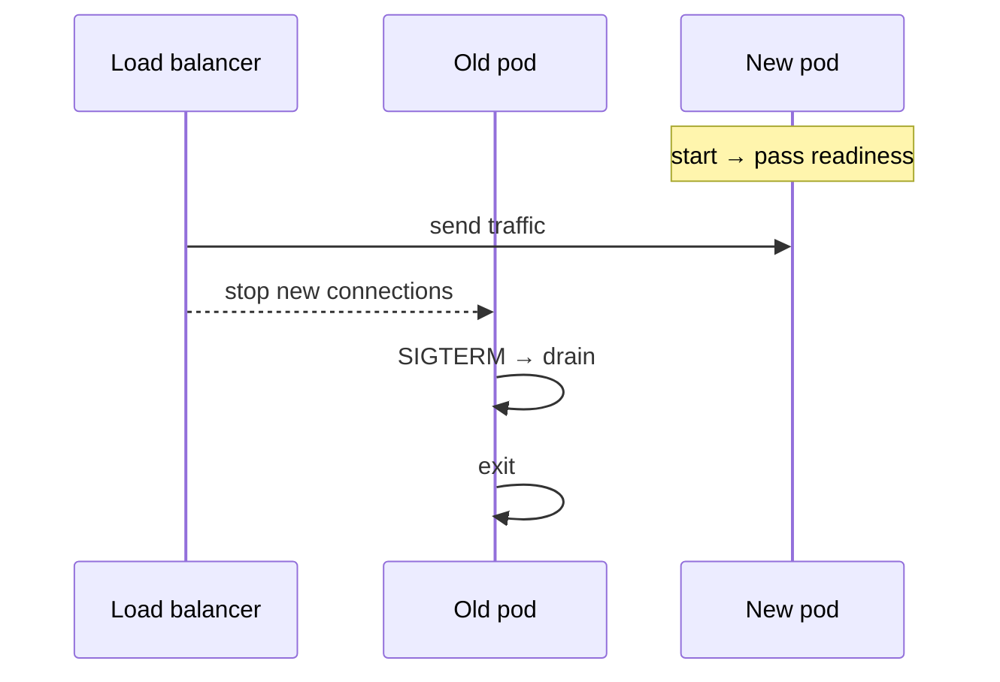

# Deployment & Ops

Containers, health probes, zero-downtime deploys, migrations, and runtime hygiene for backend services (Node-focused examples).

Related: [Node Production](/node/13-production) · [Observability](/backend/09-observability) · [SQL migrations](/backend/02-sql) · [Scaling](/node/10-scaling)

## Container basics

```dockerfile
FROM node:22-bookworm-slim AS deps
WORKDIR /app
COPY package*.json ./
RUN npm ci --omit=dev

FROM node:22-bookworm-slim
WORKDIR /app
ENV NODE_ENV=production
RUN useradd -r -u 10001 nodeuser
COPY --from=deps /app/node_modules ./node_modules
COPY dist ./dist
USER nodeuser
EXPOSE 3000
CMD ["node", "dist/server.js"]
```

- Non-root user
- Small image / pinned digests in prod
- Read-only root FS when possible
- Resource requests/limits in k8s

```yaml
resources:
  requests: { cpu: "250m", memory: "512Mi" }
  limits: { cpu: "1", memory: "1Gi" }
livenessProbe:
  httpGet: { path: /healthz, port: 3000 }
  periodSeconds: 10
readinessProbe:
  httpGet: { path: /readyz, port: 3000 }
  periodSeconds: 5
```

## Liveness vs readiness vs startup

| Probe | Fail means |
| --- | --- |
| Startup | Give slow boots time before liveness |
| Liveness | Restart container |
| Readiness | Remove from Service endpoints |

Don’t check DB on liveness — [Production](/node/13-production).

## Zero-downtime rolling update



Requirements:

1. Multiple replicas
2. Readiness gating
3. Graceful `server.close` + connection drain
4. Backward/forward compatible APIs & schemas
5. LB idle timeouts aligned with app

```ts
process.on('SIGTERM', () => {
  ready = false // fail readiness if checked
  server.close(() => process.exit(0))
})
```

## Migrations & deploys order

**Expand/contract:**

1. Deploy code that works with old+new schema  
2. Migrate expand (add column)  
3. Dual write / backfill  
4. Deploy code that reads new  
5. Contract (drop old)

Never: migrate breaking change then hope old pods die instantly.

## Blue/Green & canary

| Strategy | Idea |
| --- | --- |
| Rolling | Gradual pod replace |
| Blue/Green | Flip traffic between two environments |
| Canary | % traffic to new; watch SLOs |

Canary needs good metrics — [Observability](/backend/09-observability).

## Config & secrets

- Env / mounted secrets; rotate
- ConfigMap for non-secret
- Feature flags for risky behavior

## Autoscaling

HPA on CPU/RPS/custom metrics. Pair with DB pool math: `pods * pool <= db_max * safety`. Warm pools for Node cold starts if serverless.

## Backups & DR

- DB PITR / snapshots
- Redis: know RDB/AOF RPO
- Regular restore drills (untagged backups = fantasy)

## Interview Q&A

**Q: Steps for zero-downtime Node deploy?**  
A: Compatible migration → roll pods with readiness → SIGTERM drain → verify SLO.

**Q: Why read-only root filesystem?**  
A: Shrink attack write surface; force ephemeral to volumes.

**Q: CrashLoopBackOff after migrate?**  
A: Code expects new column; migrate failed/order wrong; fix forward.

**Q: Horizontal pod autoscaler thrashing?**  
A: Cooldown, sensible metrics, avoid scaling on noisy CPU alone.

**Q: One container process or sidecars?**  
A: App + optional sidecar (proxy/agent); don’t run multi-app unsupervised in one pod without reason.

## Common Mistakes

- Single replica “for cost” → downtime every deploy.
- Ignoring `terminationGracePeriodSeconds` < drain time.
- Applying destructive migrate in the same second as incompatible code.
- Privileged containers / root.
- No resource limits → noisy neighbor OOM.

## Trade-offs

| Tactic | Benefit | Cost |
| --- | --- | --- |
| Rolling | Simple | Mixed versions live |
| Blue/Green | Instant rollback | 2× resources |
| Canary | Risk control | Complexity |
| Serverless | Scale-to-zero | Cold start / limits |

**Tie-in:** Runtime architecture in [Node Production](/node/13-production); abuse/load in [Rate limit](/backend/08-rate-limit).


## PDB & disruption budgets

```yaml
apiVersion: policy/v1
kind: PodDisruptionBudget
spec:
  minAvailable: 2
  selector: { matchLabels: { app: api } }
```

Prevents voluntary eviction from taking all pods during node drains.

## Network policies

Default deny egress except DB/Redis/OIDC. Limits SSRF blast radius — [Security](/node/12-security).

## Image provenance

Sign images (cosign), verify in admission controller, scan CVEs, block criticals on gateways.
