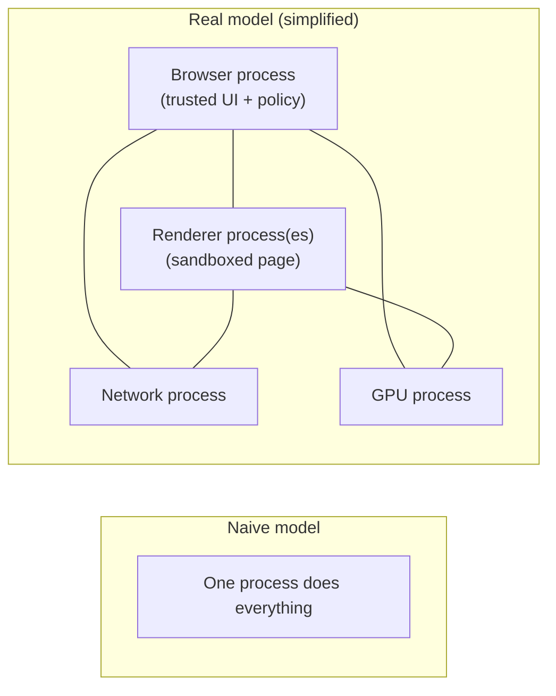
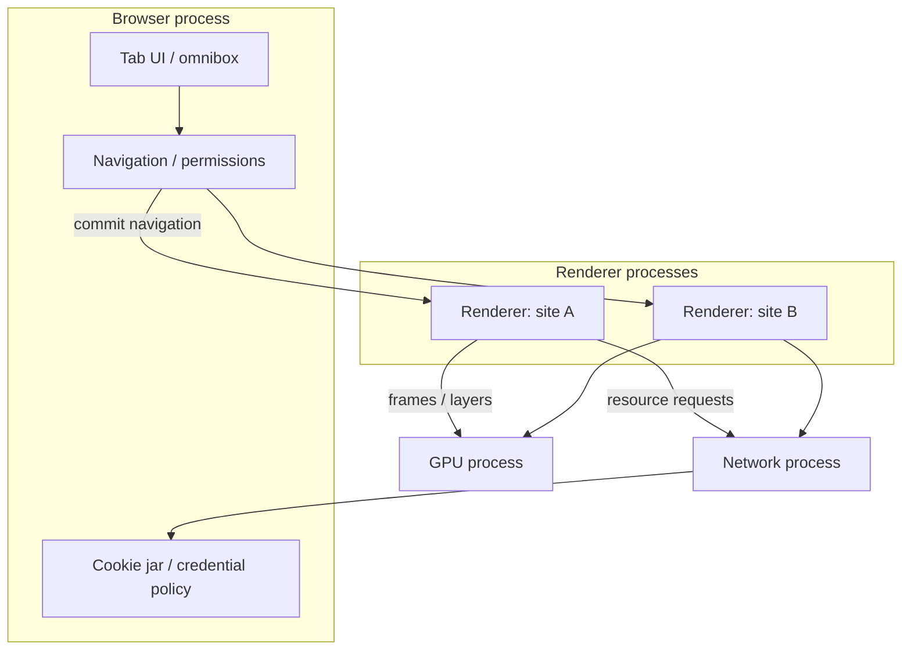
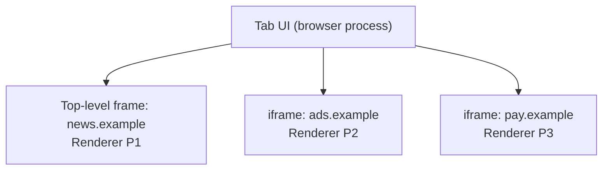
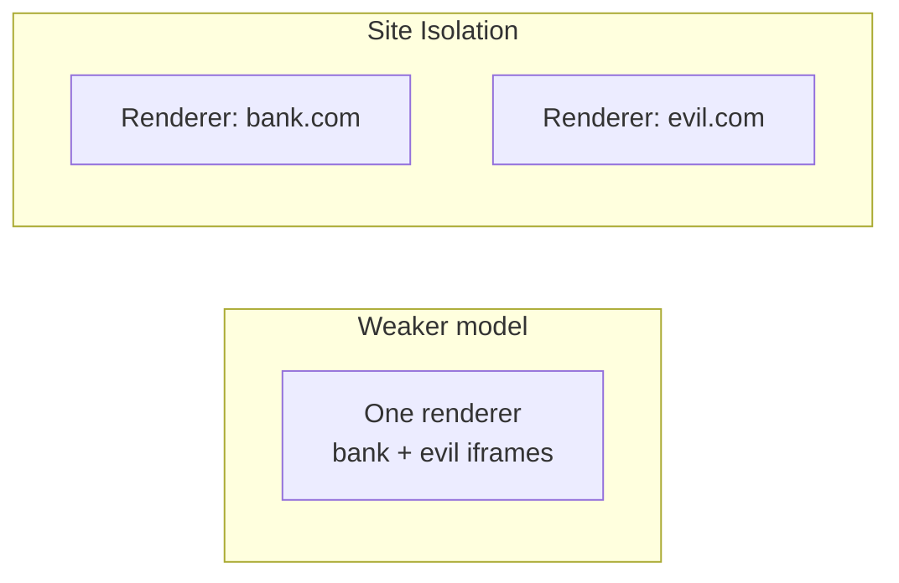
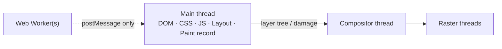
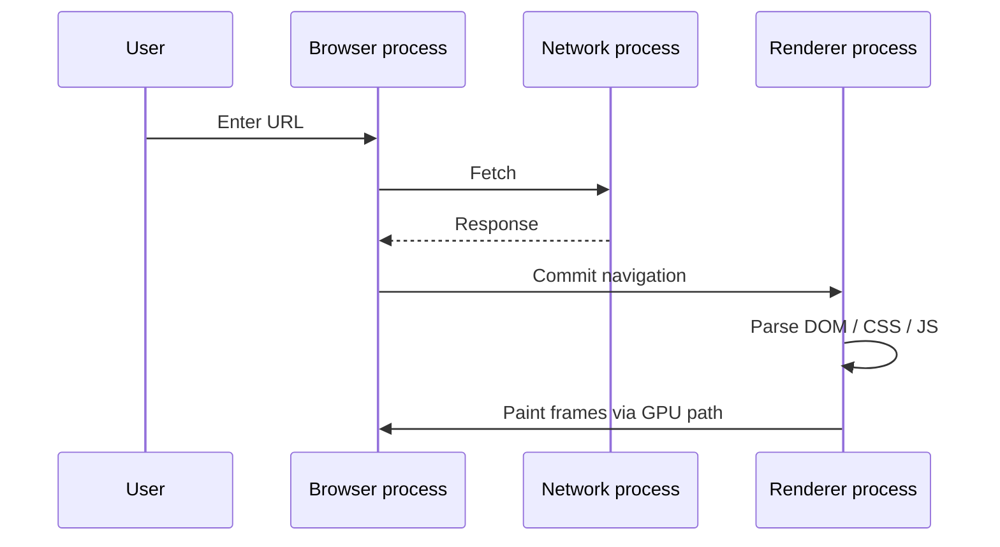

# Browser Architecture

This chapter teaches how a modern browser is built from scratch. You do not need to already know processes, sandboxes, Site Isolation, or Chromium’s process model. By the end you should be able to explain **why a browser uses many processes**, **what the browser / renderer / GPU / network processes do**, **what a “tab” really is**, and **why one compromised page should not read another site’s memory**.

Related later: [Rendering Pipeline](/browser/02-rendering-pipeline) · [Browser Event Loop](/browser/03-event-loop) · [JS Event Loop](/javascript/10-event-loop) · [Security](/javascript/21-security)

---

## 1. Start with a simpler (wrong) picture

When you open a website, it *feels* like one app: address bar, page content, JavaScript running, images appearing. A natural first mental model is:

> “The browser is one program. It downloads HTML, draws the page, and runs JS.”

That picture is good enough to *use* a browser. It is **not** how modern browsers are engineered.

A more accurate first correction:

> A browser is a **collection of cooperating programs** (processes) that talk to each other. Some are highly privileged. Some are deliberately weak and sandboxed. The page you see is mostly drawn by a sandboxed process that is **not trusted** with your passwords for other sites, your OS files, or other tabs’ memory.

Why bother with that complexity? Because web pages run **untrusted code** (HTML/CSS/JS from strangers). If one bad page could freely touch everything the browser can touch, every ad, iframe, and phishing site would be catastrophic.



This chapter teaches the real model step by step.

---

## 2. Process, memory, and privilege — plain language first

### 2.1 What a process is

A **process** is an operating-system container for a running program:

- It has its **own memory address space** (by default, process A cannot read process B’s RAM).
- It has a set of **privileges** (what files, devices, and system calls it may use).
- It can contain one or more **threads** (concurrent workers *inside* that process that *do* share memory).

So:

| Idea | Shares memory with others of its kind? | Typical isolation |
| --- | --- | --- |
| **Process** | No (separate address spaces) | Strong OS boundary |
| **Thread** | Yes (same process) | Weak; one bug can corrupt all |

Browsers use **processes** as the main security wall between sites. They use **threads** inside a process for parallelism (layout, compositing, workers) where sharing memory is useful and acceptable.

### 2.2 Why isolation matters for the web

Imagine two tabs:

1. `https://bank.example` — session cookies, account HTML
2. `https://evil.example` — attacker’s JS

If both ran in **one** process with shared memory, a bug in the JS engine (or a Spectre-style side channel) could let evil code **read bank memory** even without a classic “hack the OS” exploit. Separating them into different processes makes that much harder: there is no shared heap to snoop.

That is the core *why* behind multi-process browsers.

---

## 3. The four process types you must know

Chromium (Chrome, Edge, many Electron apps) is the clearest teaching model. Firefox and Safari differ in details but share the same *ideas*. Learn Chromium-shaped vocabulary; map other engines later.

### 3.1 Browser process (the trusted coordinator)

The **browser process** (sometimes called the *main* or *browser* process) is the privileged core:

- Owns the **UI chrome**: tab strip, address bar, bookmarks, menus
- Decides **navigations** (“go to this URL”)
- Owns sensitive stores: **cookies**, passwords (via OS integration), permissions (“can this site use the camera?”)
- **Spawns and kills** other processes
- Enforces high-level **security policy** (which renderer may talk to which origin’s cookies, etc.)

Plain language:

> The browser process is the **manager**. It does not usually parse your page’s DOM or run page JavaScript. It decides *who* is allowed to do *what*, and it shows the window chrome.

### 3.2 Renderer process (where the page lives)

A **renderer process** runs the engine that turns a document into an interactive page:

- Parse HTML → build the **DOM**
- Parse CSS → build style data
- Run page **JavaScript** (V8 in Chromium, SpiderMonkey in Firefox, JavaScriptCore in Safari)
- **Layout** and **paint** recording
- Talk to the compositor / GPU for frames

Renderers are **sandboxed**: even if attacker JS escapes the JS engine into native code inside the renderer, the OS sandbox tries to limit what that process can do (no free filesystem access, limited syscalls).

Plain language:

> The renderer is the **workshop for one site’s page**. It is powerful for drawing and scripting *that* page, and intentionally weak everywhere else.

### 3.3 GPU process

Drawing modern UIs uses the **GPU** heavily: compositing layers, WebGL/WebGPU, accelerating rasterization.

Putting GPU work in a **separate process** helps:

- Crash isolation (a GPU driver bug need not kill every tab)
- Privilege separation (GPU access is dangerous; contain it)

The renderer often prepares “display lists” / layer trees; the GPU process helps turn those into **pixels on screen**.

### 3.4 Network process

The **network process** owns much of the HTTP stack:

- DNS lookups (often coordinated with the OS / system resolver)
- TCP / TLS / HTTP/2 / HTTP/3
- Disk HTTP cache coordination
- Many CORS / mixed-content checks at the network boundary

Why separate? Networking touches the outside world and caches; isolating it reduces the blast radius of bugs and keeps cookie attachment policy centralized with the browser process.



| Process | Trust level | Main job |
| --- | --- | --- |
| Browser | High | UI, policy, cookies, spawn processes |
| Renderer | Low (sandboxed) | DOM, CSS, JS, layout, paint |
| GPU | Restricted | Compositing / GPU APIs |
| Network | Restricted | Sockets, HTTP, cache plumbing |

There are also **utility** processes (audio, PDF, storage helpers). Treat them as “extra sandboxed helpers” unless an interviewer asks.

---

## 4. What is a “tab”, really?

Users think: **one tab = one page = one process**.

Reality is more precise:

- A **tab** is a **UI concept** in the browser process (a strip entry + a WebContents / browsing context container).
- Inside a tab you may have:
  - a top-level document (`https://news.example`)
  - several **iframes** from other origins (`ads.example`, `widget.example`)
  - navigations that replace the document over time

Those documents may run in **different renderer processes** even inside one tab.

So:

> A tab is a **user-facing container**. A renderer process is a **security and execution container**. They are not 1:1.



**Interview-ready sentence:** “Tabs are UI; process boundaries follow **site / origin isolation** policy, not the tab strip.”

---

## 5. Site, origin, and Site Isolation

### 5.1 Origin (security unit for the web)

An **origin** is roughly:

```text
scheme + host + port
```

Examples:

| URL | Origin |
| --- | --- |
| `https://example.com/a` | `https://example.com` (default port 443) |
| `https://example.com:443/b` | same as above |
| `http://example.com` | **different** (scheme differs) |
| `https://api.example.com` | **different** host |
| `https://example.com:4443` | **different** port |

The **Same-Origin Policy** says: by default, JS in origin A must not freely read origin B’s DOM or credentials. (Networking has extra rules — see [Networking](/browser/05-networking) and [Security](/javascript/21-security).)

### 5.2 “Site” vs “origin” in Chromium language

For **process assignment**, Chromium often talks about a **site** (roughly scheme + registrable domain), which is a coarser bucket than origin. Details evolve, but the teaching point is:

> Related subdomains sometimes used to share a process more readily than completely unrelated domains. Cross-site content is isolated more aggressively.

You do **not** need every Chromium heuristic. You need the *goal*:

### 5.3 Site Isolation — the goal

**Site Isolation** means: put different sites into different renderer processes so that:

1. A compromised renderer for `evil.com` cannot casually read `bank.com`’s memory.
2. Cross-origin iframes are often out-of-process (**OOPIF** — out-of-process iframe).
3. Spectre-class speculative-execution attacks become harder across sites because there is no shared process heap.



**Why not “one process per tab” as the slogan?** Because one tab embeds many sites. The isolation unit must follow **who owns the content** (site/origin), not the tab chrome.

---

## 6. How processes talk: IPC (without the scary acronym soup)

Processes do not share memory freely. They send **messages** — Inter-Process Communication (**IPC**).

Examples of messages:

- Browser → Renderer: “Commit this navigation; here is the response head / body pipe.”
- Renderer → Network: “Please fetch `https://cdn.example/app.js`.”
- Renderer → GPU: “Here is an updated layer tree / frame.”
- Renderer → Browser: “User clicked; open this popup?” / “Request camera permission.”

Plain language:

> IPC is the **postal** between rooms. The renderer asks; the browser process decides; the network process dials.

If an interviewer asks “where do cookies live?”, a strong answer is: **cookie jar policy is owned with the browser / network side**, not freely readable by every renderer as a big shared global. Renderers get what policy allows for their requests.

---

## 7. Inside one renderer: threads

A renderer process is not single-threaded. Important threads (names vary by engine; concepts transfer):

### 7.1 Main thread (Blink main / UI thread for the page)

On the **main thread** you typically find:

- JavaScript for the page (event handlers, timers callbacks, promises — see [Browser Event Loop](/browser/03-event-loop))
- DOM mutations
- Style calculation
- Layout
- Paint *recording* (building a display list)

If JS runs for 200ms, **style/layout/paint for that document wait**. That is why long tasks cause jank.

### 7.2 Compositor thread

The **compositor** can often produce frames for certain updates (scrolling, transform/opacity on promoted layers) **without** waiting for the main thread to finish JS — *if* the change does not need layout on the main thread.

This is why “animate `transform`/`opacity`” is taught as cheaper than animating `top`/`width`. Deep dive: [Rendering Pipeline](/browser/02-rendering-pipeline).

### 7.3 Raster threads

**Raster** turns paint records into bitmap tiles (CPU or GPU-assisted). Parallel raster workers help large pages.

### 7.4 Web Workers

A **Worker** is JS on another thread (still usually same renderer process, separate V8 isolate). It cannot touch the DOM. It talks via `postMessage`.

```ts
// main thread
const worker = new Worker("/worker.js")

worker.postMessage({ type: "sum", values: [1, 2, 3] })

worker.onmessage = (event: MessageEvent<{ result: number }>) => {
  console.log(event.data.result)
}
```

```ts
// worker.js
self.onmessage = (event: MessageEvent<{ type: string; values: number[] }>) => {
  if (event.data.type === "sum") {
    const result = event.data.values.reduce((a, b) => a + b, 0)
    self.postMessage({ result })
  }
}
```



| Thread | Can touch DOM? | Typical work |
| --- | --- | --- |
| Main | Yes | JS, style, layout, paint record |
| Compositor | No | Scroll, composite frames |
| Raster | No | Bitmap tiles |
| Worker | No | CPU-heavy JS |

---

## 8. Engines under the hood (names, not trivia)

You will hear product + engine pairs:

| Browser | Rendering engine | JS engine |
| --- | --- | --- |
| Chrome / Edge | Blink | V8 |
| Firefox | Gecko | SpiderMonkey |
| Safari | WebKit | JavaScriptCore |

For architecture interviews, saying “Blink + V8 in a sandboxed renderer, coordinated by a browser process” is enough. Engine names matter when debugging engine-specific bugs, not when explaining process isolation.

---

## 9. Navigation lifecycle — slow motion

What happens when you type `https://example.com` and press Enter?

### Step 1 — UI event in the browser process

The omnibox lives in the **browser process**. Your keypress is not “JS in a page”; it is browser UI.

### Step 2 — Navigation decision

The browser process starts a **navigation**:

- Resolve whether this is same-document (hash) vs full navigation
- Pick or create a **renderer** appropriate for the destination site
- Ask the **network process** to fetch

### Step 3 — Network fetch

Network process: DNS → TCP → TLS → HTTP (taught in [Networking](/browser/05-networking)). Redirects are often followed under browser/network control.

### Step 4 — Commit

When headers look acceptable, the browser process **commits** the navigation to a renderer:

- Old document begins unload / may enter back-forward cache in some cases
- New document becomes the active document for that frame
- HTML bytes start flowing to the parser

### Step 5 — Parse and run

Renderer:

1. HTML parser builds DOM
2. Preload scanner may notice `<script src>` / `<link rel=stylesheet>` early and ask network for them
3. CSS applies; JS may run and block parser depending on script attributes
4. First paint opportunities appear when enough of the tree exists (see rendering chapter)

### Step 6 — Load events

Rough readiness ladder:

| `document.readyState` | Meaning (practical) |
| --- | --- |
| `loading` | Still parsing |
| `interactive` | DOM parsed; `DOMContentLoaded` soon/fired |
| `complete` | Subresources done enough for `load` |

```ts
type ReadyState = "loading" | "interactive" | "complete"

function whenDomReady(fn: () => void): void {
  if (document.readyState === "loading") {
    document.addEventListener("DOMContentLoaded", fn, { once: true })
  } else {
    fn()
  }
}

function whenFullyLoaded(fn: () => void): void {
  if (document.readyState === "complete") {
    fn()
  } else {
    window.addEventListener("load", fn, { once: true })
  }
}
```



---

## 10. Sandboxing — what “untrusted renderer” means

A sandbox is a set of **OS restrictions** on a process:

- Cannot open arbitrary files
- Cannot make arbitrary network connections without going through brokered APIs
- Cannot install kernel drivers, etc.

JS running in the page is therefore **double-wrapped**:

1. Language/runtime rules (Same-Origin Policy, CORS, etc.)
2. Process sandbox (even native code escape is limited)

No sandbox is perfect. Defense in depth = **SOP + CORS + CSP + process isolation + permission prompts**. See [JS Security](/javascript/21-security).

---

## 11. Memory and crashes — practical consequences

Because tabs/sites are split across processes:

- **One renderer crash** often shows a sad tab, not a dead browser.
- Memory cost rises: each process has base overhead (isolates, heaps).
- DevTools “Memory” for a page is mostly **that renderer**, not the whole browser.

When an interviewer asks “why multi-process if it uses more RAM?”, answer:

> Security and reliability. The web runs adversarial code; isolation is worth the memory.

---

## 12. Worked mental model — three scenarios

### Scenario A: Two tabs, two sites

- Tab 1: `https://mail.example`
- Tab 2: `https://shop.example`

Expect **two renderer processes** (plus shared browser/GPU/network). Cookies for each site attach under policy when each renderer’s requests go out.

### Scenario B: One tab, cross-origin iframe

- Top: `https://news.example`
- iframe: `https://ads.example`

Often **two renderers** (OOPIF). The ad’s JS should not read the news DOM. Parent/iframe talk only via allowed channels (`postMessage`, etc.).

### Scenario C: `about:blank` popup then navigate

Popups and `window.open` still involve the **browser process** for opener relationships and permission. Cross-origin windows cannot read each other’s DOM.

```ts
const win = window.open("https://other.example/app")
// If cross-origin, win.document is not readable — SOP
win?.postMessage({ hello: true }, "https://other.example")
```

---

## 13. How this connects to JS you write

You rarely spawn processes yourself from page JS. But architecture explains symptoms:

| Symptom | Architectural reason |
| --- | --- |
| Page freeze, tab still scrollable sometimes | Main thread busy; compositor may still scroll |
| iframe feels “separate” | May be another process + SOP |
| Chrome task manager shows many processes | Site Isolation + utility processes |
| `alert()` freezes the page | Modal dialog blocks that page’s JS; browser UI may still work |

Deep related chapters:

- Scheduling of JS vs paint: [Browser Event Loop](/browser/03-event-loop), [JS Event Loop](/javascript/10-event-loop)
- Pixels: [Rendering Pipeline](/browser/02-rendering-pipeline), [JS Rendering](/javascript/20-rendering)

---

## 14. Minimal TypeScript map of responsibilities

This is not a real browser API — it is a teaching model of who owns what:

```ts
/** Teaching model only — not a real browser API */
type ProcessId = string

interface BrowserProcess {
  openTab(url: string): TabId
  navigate(tab: TabId, url: string): Promise<void>
  cookieJar: Map<string, string>
  spawnRenderer(site: string): ProcessId
}

interface RendererProcess {
  site: string
  document: unknown // DOM
  runJs(source: string): void
  requestResource(url: string): Promise<ArrayBuffer>
}

interface NetworkProcess {
  fetch(
    url: string,
    credentialsPolicy: "omit" | "same-origin" | "include",
  ): Promise<Response>
}

type TabId = string
```

Read it as: **page JS lives in `RendererProcess`**; **navigation policy and cookies** lean on `BrowserProcess` + `NetworkProcess`.

---

## Interview Questions

### Q1. Why are modern browsers multi-process?
**Expected:** To isolate untrusted site code for security (especially Spectre-class / renderer compromise) and to improve reliability (one crash does not kill the whole browser).  
**Common wrong:** “Only for speed” / “One process per tab is the full story.”  
**Follow-ups:** What is Site Isolation? What runs in the browser process vs renderer?

### Q2. What is the difference between a tab and a renderer process?
**Expected:** A tab is UI in the browser process; a renderer is a sandboxed execution environment. One tab can contain multiple renderers (cross-origin iframes).  
**Common wrong:** “Always exactly one process per tab.”  
**Follow-ups:** What is an OOPIF?

### Q3. What does the GPU process do?
**Expected:** Helps composite layers / accelerate raster and graphics APIs so frames reach the screen, isolated from renderers and the browser process.  
**Common wrong:** “It runs all JavaScript.”  
**Follow-ups:** Why can scrolling sometimes work while JS is busy?

### Q4. Where do cookies live, and can page JS read all of them?
**Expected:** Cookie storage/policy is coordinated by privileged browser/network code. Page JS can read only non-HttpOnly cookies for its document’s origin via `document.cookie`, not arbitrary other sites’ cookies.  
**Common wrong:** “Cookies are just variables in the renderer heap shared by all tabs.”  
**Follow-ups:** What does `HttpOnly` change?

### Q5. What is Site Isolation trying to prevent?
**Expected:** Cross-site data theft via renderer compromise or speculative-execution side channels by putting sites in different processes.  
**Common wrong:** “It replaces the Same-Origin Policy.” (It *reinforces* it at the OS level.)  
**Follow-ups:** How does this interact with cross-origin iframes?

### Q6. Main thread vs compositor thread — why care?
**Expected:** Main thread runs JS/layout/paint recording; compositor can update some frames independently. Long main-thread tasks cause jank; compositor-friendly animations hurt less.  
**Common wrong:** “All drawing waits for every `setTimeout`.”  
**Follow-ups:** Which CSS properties tend to be compositor-friendly?

## Common Mistakes

- Equating **tab** with **process** in every explanation.
- Saying the **browser process runs page JavaScript**.
- Forgetting that **iframes** can be out-of-process.
- Treating sandbox as “JS cannot have bugs” — sandbox limits *damage after escape*, it does not remove SOP needs.
- Ignoring memory overhead when praising multi-process (acknowledge the trade-off).
- Mixing up **origin** (SOP unit) and **site** (process-assignment approximation) without saying you are simplifying.

## Trade-offs / Production Notes

- **More processes ⇒ more RAM**, better isolation and crash containment. Mobile browsers tune aggressiveness differently than desktop.
- **Electron / CEF** apps inherit Chromium’s model — a heavy “web app desktop shell” is multiple processes whether you notice or not.
- When debugging performance, use the browser’s **task manager** + Performance panel: confirm whether jank is main-thread JS, layout, or GPU.
- Security reviews should assume a **compromised renderer** and ask what remains protected (cookies with right flags, other processes, OS secrets).
- Related reading paths: [Rendering Pipeline](/browser/02-rendering-pipeline) · [Networking](/browser/05-networking) · [JS Security](/javascript/21-security) · [JS Event Loop](/javascript/10-event-loop)
