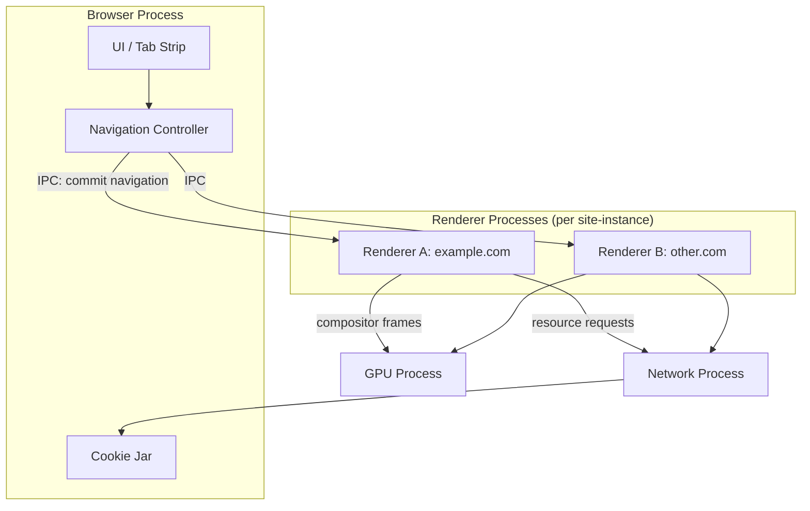
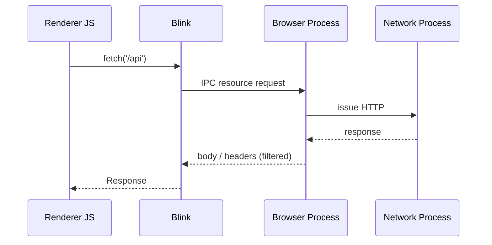

# Browser Architecture

Modern browsers are multi-process systems. Chrome/Edge (Blink + V8), Firefox (Gecko + SpiderMonkey), and Safari (WebKit + JavaScriptCore) share the same conceptual split: a privileged **browser process**, per-site **renderer processes**, a **GPU process**, and **network / utility** processes. Site Isolation and Spectre defenses made this mandatory rather than optional.

Related: [JS Event Loop](/javascript/10-event-loop) · [JS Browser APIs](/javascript/19-browser-apis) · [React Fiber](/react/01-fiber)

## Process model (Chromium-shaped)

| Process | Privilege | Responsibility |
| --- | --- | --- |
| Browser (main) | High | Tabs UI, navigation, cookie store, permissions, process spawn |
| Renderer | Sandboxed | Parse HTML/CSS/JS, DOM, layout, paint, V8 isolate |
| GPU | Restricted | Compositing, WebGL/WebGPU, raster acceleration |
| Network | Restricted | HTTP stack, cache, sockets, CORS enforcement helpers |
| Utility | Restricted | Audio decode, PDF, storage backends |



### Site Isolation

A **site** ≈ scheme + registrable domain (`https://a.example.com` and `https://b.example.com` can share; `https://evil.com` cannot). Cross-origin iframes often get their own process. Goal: steal memory across origins even if the renderer is compromised (Spectre-class).

**Interview hook:** “Why not one process per tab?” — Because one tab can embed many origins; process-per-site-instance is the unit that matches the Same-Origin Policy.

## Inside a renderer: threads


| Thread | Does | Must not |
| --- | --- | --- |
| Main | JS, style, layout, paint recording | Block >16ms frames |
| Compositor | Scroll, CSS transforms/opacity on compositor-only props | Touch DOM |
| Raster | Tile bitmaps | Run JS |
| Worker | CPU work off main | DOM access |

Blink’s **Blink Main** owns the DOM. V8 runs on the same thread for page JS (Workers get their own isolates). Compositor can produce frames while main is busy **only** for properties that don’t need layout (see [Rendering Pipeline](/browser/02-rendering-pipeline)).

## Navigation & document lifecycle

1. User / `location` change → browser process decides.
2. Network process fetches; redirects resolved centrally.
3. **Commit**: browser process sends the response to a renderer; old document starts unload.
4. HTML parser builds DOM; speculative parsing + preload scanner run ahead of JS.
5. `DOMContentLoaded` → resources → `load` → idle → bfcache candidates.

```ts
// Document readiness — interview-grade mental model
type ReadyState = 'loading' | 'interactive' | 'complete'

function onReady(fn: () => void): void {
  if (document.readyState === 'loading') {
    document.addEventListener('DOMContentLoaded', fn, { once: true })
  } else {
    // interactive | complete — DOM already parsed
    queueMicrotask(fn)
  }
}

// Navigation Timing Level 2 (high-res)
function ttfb(): number | undefined {
  const [nav] = performance.getEntriesByType('navigation') as PerformanceNavigationTiming[]
  return nav ? nav.responseStart - nav.requestStart : undefined
}
```

Cross-link: parsing blocking scripts ↔ [JS Modules](/javascript/13-modules) and [Networking](/browser/05-networking).

## IPC & security boundary

Renderers talk to the browser process via Mojo/IPC. DOM never directly opens raw sockets; `fetch` / XHR are mediated. Cookies with `HttpOnly` never enter JS heaps. Permissions (camera, geolocation) are gated in the browser process UI.



## Multi-process vs single-process trade-off table

| Model | Crash isolation | Memory | IPC cost | Security |
| --- | --- | --- | --- | --- |
| Single process (old) | None | Low | Zero | Weak |
| Process per tab | Good | High | Medium | Medium |
| Site Isolation | Best | Highest | Higher | Strongest |

## Interview Questions

**Q1. What runs in the browser process vs the renderer?**  
Browser: chrome UI, navigation policy, cookie database, process management, some permission prompts. Renderer: DOM, CSSOM, layout, paint, JS execution for that site-instance. Network/GPU are separate helpers.

**Q2. Can two tabs of the same origin share a process?**  
Often yes (same site-instance / browsing instance heuristics). Not guaranteed across all browsers/versions; treat as implementation detail. Cross-origin iframes may still be out-of-process.

**Q3. Why can CSS `transform` scroll smoothly while JS is busy?**  
Compositor thread owns scroll and can animate compositor-friendly properties without waiting on main-thread layout. Heavy JS blocks main → style/layout/paint stall, but existing compositor animations may continue.

**Q4. What is a browsing context?**  
A unit that displays a document: window, tab, iframe, or nested worker-like contexts. Has session history, `document`, `window`. Related to [JS `this` / window](/javascript/06-this).

**Q5. How does OOPIF (out-of-process iframe) change `postMessage`?**  
API unchanged; messages cross process boundaries via IPC. Structured clone still applies; SharedArrayBuffer needs cross-origin isolation.

## Common Mistakes

- Assuming “the browser” is one thread — blaming “the browser is slow” without distinguishing main vs compositor vs network.
- Thinking Web Workers share the DOM — they share nothing but message ports / optionally SAB.
- Confusing **origin** (`https://app.com:443`) with **site** (`https://app.com`) with **registrable domain**.
- Believing `localStorage` is in the renderer only — backed by browser-process storage; quota and eviction are cross-tab.
- Ignoring that extensions and DevTools add processes/overhead in profiles.

## Trade-offs

| Choice | Win | Cost |
| --- | --- | --- |
| Site Isolation | Spectre resistance, crash isolation | RAM (hundreds of MB per heavy site) |
| Main-thread JS frameworks | Simple mental model | Contends with layout/paint — see [React concurrent](/react/04-concurrent) |
| Offloading to Worker | Smooth input | Serialization cost, no DOM |
| Compositor-only animations | 60fps under JS load | Limited property set; layout-inducing props force main |

**Senior takeaway:** Architecture interview answers should name **processes**, **threads**, and **which queue/thread your bug blocks** — then map that to user-visible jank, security, or memory.

## Deep dive — Blink + V8 binding

DOM objects are C++ (Blink). JS sees **wrapper objects** in V8. The binding layer maps `element.innerHTML = …` to C++ setters. When a node is GC’d from JS but still in the tree, Blink keeps it; when removed from the tree but JS holds a reference, both stay alive ([Memory](/browser/07-memory-gc)).

```ts
// Wrapper identity: same node → same JS object in a realm
const a = document.body
const b = document.querySelector('body')
console.log(a === b) // true — identity via wrapper map
```

Cross-realm (iframe) wrappers differ: `iframe.contentDocument.body !==` parent’s view of the same C++ node as a shared object — separate realms, `postMessage` to communicate ([Security](/browser/06-security)).

## Deep dive — scheduling & priorities

Chromium’s scheduler prioritizes input > rendering > default idle. Long tasks delay input → INP regression. `scheduler.postTask(fn, { priority: 'user-blocking' | 'user-visible' | 'background' })` (where available) expresses intent; React 18+ aligns with this via cooperative yielding ([React concurrent](/react/04-concurrent)).

```ts
type Priority = 'user-blocking' | 'user-visible' | 'background'

async function postTask(priority: Priority, fn: () => void): Promise<void> {
  const sch = (globalThis as unknown as {
    scheduler?: { postTask: (f: () => void, o: { priority: Priority }) => Promise<void> }
  }).scheduler
  if (sch?.postTask) await sch.postTask(fn, { priority })
  else fn()
}
```

## Process vs thread interview script

1. Tab crash kills renderer, not whole browser → process isolation.  
2. Heavy canvas uses GPU process → compositor/GPU path.  
3. `fetch` goes Network process → cookies applied with browser-process policy.  
4. Extension background may be another process → don’t assume one heap.

## Extra Q&A

**Q6. What is a Site Instance?**  
Chromium grouping of same-site frames that can share a renderer. Different sites → different instances/processes under Site Isolation.

**Q7. Does `iframe` always get its own process?**  
Cross-site often yes (OOPIF). Same-site may share. Never rely on process identity for security — rely on SOP.

**Q8. Where do service workers run?**  
Separate worker thread/process context owned by the browser; can wake without a page. Storage/cache shared per origin rules ([Storage](/browser/08-storage)).

**Q9. How does DevTools attach?**  
Debugging protocol (CDP) talks to browser/renderer targets — itself adds overhead; measure perf in clean profiles.

**Q10. Memory pressure kill?**  
OS may discard renderer processes; tabs reload on focus. Distinguish from JS heap OOM inside a surviving renderer.


## Worked example — diagnosing “UI freezes when uploading”

1. Performance panel: long task on main during `FileReader` sync read → move to Worker / stream.
2. Network process fine; renderer main blocked → [Event Loop](/browser/03-event-loop).
3. Compositor still scrolls → confirms main-only jank ([Architecture](/browser/01-architecture) threads).
4. After fix, INP on cancel button recovers ([Optimization](/browser/09-optimization)).

```ts
async function hashFile(file: File): Promise<string> {
  const buf = await file.arrayBuffer() // async; still main-thread CPU for digest
  const hash = await crypto.subtle.digest('SHA-256', buf)
  return [...new Uint8Array(hash)].map((b) => b.toString(16).padStart(2, '0')).join('')
}
// For multi-MB files, transfer ArrayBuffer to Worker for digest
```

## Comparison — Chrome vs Safari vs Firefox (interview nuance)

| Concern | Chromium | WebKit/Safari | Gecko/Firefox |
| --- | --- | --- | --- |
| Site Isolation | Strong | Different process model | Improving |
| bfcache | Aggressive | Strong historically | Good |
| `scheduler` APIs | Ahead | Partial | Partial |
| Storage partitioning | Yes | ITP pioneer | Tracking protection |

Don’t claim engine internals identical — cite behavior + MDN, verify on target browsers.

## Glossary

| Term | Definition |
| --- | --- |
| Renderer | Sandboxed process running Blink + V8 for a site-instance |
| OOPIF | Out-of-process iframe |
| Mojo | Chromium IPC system |
| Isolate | V8 heap/instance |
| Compositor frame | Layer tree snapshot presented to screen |
