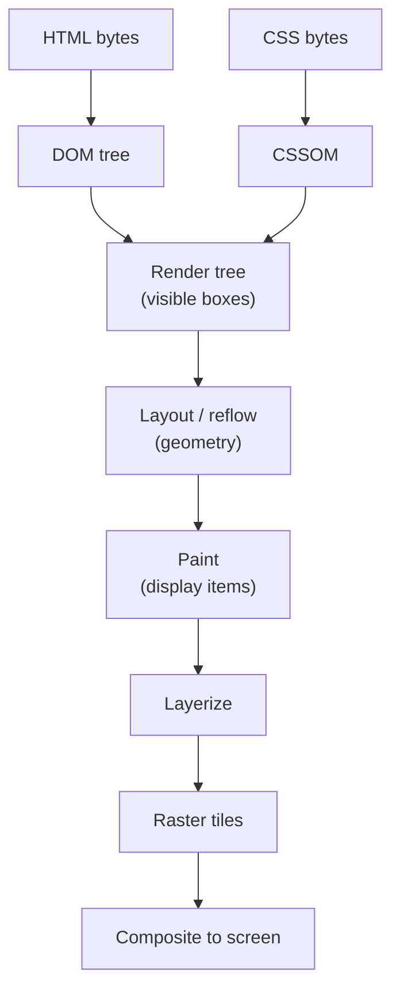
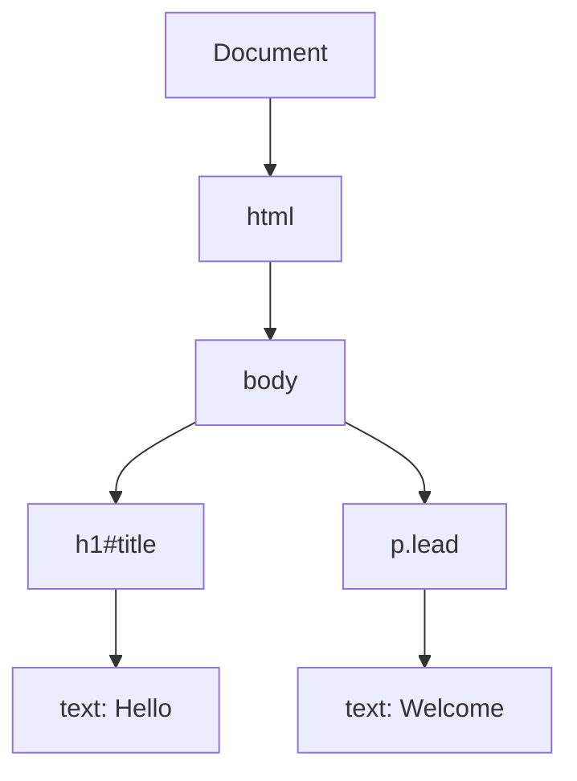
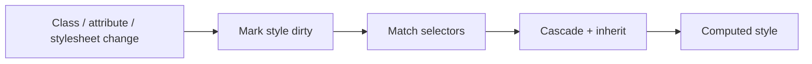
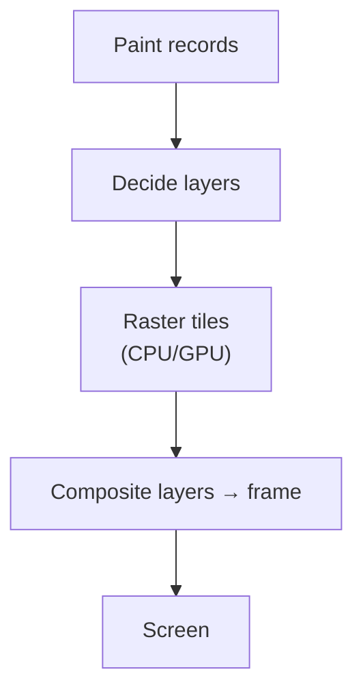
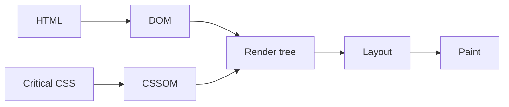

# Rendering Pipeline

This chapter teaches how a browser turns network bytes into pixels on your screen, from scratch. You do not need to already know DOM, CSSOM, “reflow,” compositing, or layers. By the end you should be able to walk **HTML/CSS → trees → layout → paint → composite**, explain **what each stage produces**, and predict **which kinds of changes make the browser redo which work**.

Related: [Browser Architecture](/browser/01-architecture) · [CSS Internals](/browser/04-css-internals) · [JS Rendering](/javascript/20-rendering) · [Browser Event Loop](/browser/03-event-loop) · [Networking](/browser/05-networking)

---

## 1. The goal in one sentence

> Given HTML, CSS, images, and fonts, produce a bitmap (or GPU frames) that matches the designer’s intent — and keep updating it when the user scrolls, types, or your JS changes the page.

That journey is the **rendering pipeline**.

A useful analogy: a print shop.

1. **Parse** — read the manuscript (HTML) and the style guide (CSS)
2. **Decide what is visible** — build a “what to print” list (render tree)
3. **Layout** — measure every box: where it sits, how wide/tall
4. **Paint** — decide colors, text glyphs, borders (record drawing commands)
5. **Composite** — layer the sheets and photograph the final page for the screen



You will learn each box slowly.

---

## 2. Parsing HTML → the DOM

### 2.1 What “parse” means

**Parsing** means: take a stream of characters and build a structured tree the rest of the engine understands.

HTML is not “a string forever.” After parsing, you get the **Document Object Model (DOM)** — a tree of nodes: elements, text, comments, etc.

```html
<!doctype html>
<html>
  <body>
    <h1 id="title">Hello</h1>
    <p class="lead">Welcome</p>
  </body>
</html>
```

Conceptually:



### 2.2 Slow-motion: what the parser does

1. Read bytes (decoded as characters using the document encoding).
2. Tokenize: recognize `<div>`, `</div>`, text, attributes.
3. Build nodes and attach them into a tree.
4. When a `<script>` without `async`/`defer` appears, parsing may **pause** so classic scripts can run and maybe `document.write` more HTML.
5. A **preload scanner** may look ahead in the raw bytes for `src` / `href` and start fetching early — even while the main parser is blocked on a script.

```html
<!-- Classic blocking script: parser waits -->
<script src="/config.js"></script>

<!-- Deferred: download in parallel, run after document parsed -->
<script defer src="/app.js"></script>

<!-- Module scripts defer by default -->
<script type="module" src="/main.js"></script>
```

Plain language:

> The DOM is the browser’s **live structured copy** of the document. When JS does `document.createElement` or sets `innerHTML`, it is editing this tree.

```ts
const title = document.querySelector("#title")
title!.textContent = "Hello again" // mutates the DOM; may dirty later pipeline stages
```

---

## 3. Parsing CSS → the CSSOM

### 3.1 Why CSS is not “just text”

CSS must become something the engine can query quickly: for each element, **which rules apply**, and what the **computed** values are.

That structured result is often called the **CSSOM** (CSS Object Model) in teaching materials — think “the browser’s stylesheet data structures,” not only the `document.styleSheets` API.

```css
body {
  margin: 0;
  font-family: system-ui, sans-serif;
}

.lead {
  color: #333;
  font-size: 1.125rem;
}
```

### 3.2 Why stylesheets can block first paint

Until the browser knows styles, painting would risk a **FOUC** (flash of unstyled content) — content appears naked, then jumps when CSS arrives.

So for normal stylesheets in the head, browsers typically **delay first render** until important CSS is available (details vary; treat “CSS in critical path blocks first paint” as the practical rule).

```html
<head>
  <link rel="stylesheet" href="/app.css" />
  <!-- First paint usually waits for this CSS (and fonts may delay text) -->
</head>
```

Networking and waterfalls: [Networking](/browser/05-networking).

### 3.3 Style calculation (matching + cascade)

For each element (roughly):

1. Find candidate rules (selector matching)
2. Resolve conflicts via the **cascade** (origin, layers, specificity, order — taught in [CSS Internals](/browser/04-css-internals))
3. Apply **inheritance** where appropriate
4. Produce **computed styles** (the used-for-layout values after resolving keywords, variables, etc.)



---

## 4. The render tree — “what will actually be drawn”

### 4.1 DOM ∪ CSS ≠ always visible

Some DOM nodes do not produce visual boxes:

- `display: none` — removed from the visual tree (still in the DOM)
- Certain metadata elements (`<script>`, `<head>` contents) — not painted as boxes

The engine builds a **render tree** (Blink talks about layout objects / fragments; teaching name: render tree): **visible boxes only**, with styles attached.

Pseudo-elements (`::before`, `::after`) can appear in the render tree even though they are not real DOM elements.

```css
.hidden {
  display: none; /* in DOM, not in render tree */
}

.invisible {
  visibility: hidden; /* still occupies layout space; box exists */
}
```

| Declaration | In DOM? | In render tree? | Takes layout space? |
| --- | --- | --- | --- |
| `display: none` | Yes | No | No |
| `visibility: hidden` | Yes | Yes | Yes |
| `opacity: 0` | Yes | Yes | Yes |

### 4.2 Analogy

DOM = full cast list including people off-stage.  
Render tree = people who will appear on camera for this shot.

---

## 5. Layout (also called reflow)

### 5.1 Plain-language definition

**Layout** answers:

> For every box, what are its **size** and **position** on the page (in CSS pixels)?

Inputs: render tree + containing blocks + formatting context rules (block flow, flex, grid, tables…).  
Output: geometry — x, y, width, height (and related fragment info).

Analogy: after you know who is on stage, layout places the furniture.

### 5.2 Box model reminder (just enough)

Each box has content, padding, border, margin. `box-sizing` changes whether `width` includes padding/border. Deep dive in [CSS Internals](/browser/04-css-internals).

```css
.card {
  box-sizing: border-box;
  width: 320px;
  padding: 16px;
  border: 1px solid #ccc;
}
```

### 5.3 What makes layout expensive

Layout can be:

- **Local** — one subtree if containment / isolation allows
- **Global** — large parts of the document when percentages, flex, or document flow couple boxes together

Things that commonly force layout work:

- Changing width/height, margins, fonts, text content
- Adding/removing DOM nodes in normal flow
- Resizing the viewport
- Reading geometry after writes (see §9)

```ts
el.style.width = "50%"
// Layout needed before the browser knows pixel width
```

### 5.4 Slow-motion layout of a simple page

```html
<div class="row">
  <div class="col">A</div>
  <div class="col">B</div>
</div>
```

```css
.row {
  display: flex;
  gap: 8px;
}
.col {
  flex: 1;
  padding: 12px;
}
```

1. Viewport width known (e.g. 800px).
2. `.row` is a flex container; content box width computed.
3. Each `.col` gets a share of free space (`flex: 1`).
4. Padding reduces content area inside each column.
5. Text “A” / “B” sized with font metrics; may grow height.
6. Row height becomes max of column heights (default align-items).

That is layout: **constraints in → used pixel geometry out**.

---

## 6. Paint

### 6.1 Plain-language definition

**Paint** answers:

> Given geometry, what **drawing commands** are needed — text glyphs, backgrounds, borders, shadows, images?

Paint does not always mean “immediately fill pixels.” Modern engines often **record** a list of display items (“draw rectangle here,” “draw text there”), then rasterize later.

Analogy: layout places picture frames; paint writes instructions for what goes inside each frame.

### 6.2 What typically dirties paint (but not always layout)

- `color`, `background-color`
- `visibility` (still laid out)
- `box-shadow`, `outline` (engine-dependent edge cases exist)
- Image decoding finishing

Changing `background-color` usually does **not** change geometry → skip full layout, still repaint.

### 6.3 Paint order and stacking

Painting respects stacking contexts and layers (z-index, opacity, transforms…). Details: [CSS Internals](/browser/04-css-internals). Pipeline takeaway: paint records are ordered so overlapping content composites correctly later.

---

## 7. Layers, raster, and composite

### 7.1 Why layers exist

If every tiny color change redrew the entire page from scratch on the CPU every frame, scrolling and animations would die.

Engines promote some content into **layers** (compositor layers) that can be:

- Rasterized into **tiles** (bitmaps)
- Moved / faded by the **compositor** / GPU without re-layout or re-recording all paint



### 7.2 Compositor-friendly changes

Often (not a hard guarantee for every edge case):

| Change | Typical pipeline cost |
| --- | --- |
| `transform: translate/scale/rotate` on a layer | Composite (cheap) |
| `opacity` | Composite (cheap) |
| `width` / `left` / `top` (non-transform) | Layout + paint + composite |
| `color` | Paint + composite |
| font-size | Layout + paint + composite |

```css
/* Prefer for animations when possible */
.ball {
  transform: translateX(0);
  transition: transform 200ms linear;
}
.ball.moved {
  transform: translateX(120px);
}
```

```css
/* More expensive pattern */
.ball-slow {
  position: relative;
  left: 0;
  transition: left 200ms linear;
}
.ball-slow.moved {
  left: 120px; /* layout-ish positioning */
}
```

### 7.3 Connection to architecture

The **main thread** often does style/layout/paint recording. The **compositor thread** can update transforms/opacity for existing layers while the main thread is busy — which is why a stuck page can sometimes still scroll. See [Architecture](/browser/01-architecture).

---

## 8. One frame, end to end

At ~60Hz, you have ~16.7ms per frame (more on high-refresh screens). A simplified frame:

```mermaid
sequenceDiagram
  participant Loop as Event loop
  participant Main as Main thread
  participant Comp as Compositor / GPU
  Loop->>Main: Run JS tasks / rAF
  Main->>Main: Style
  Main->>Main: Layout
  Main->>Main: Paint record
  Main->>Comp: Commit layer tree
  Comp->>Comp: Raster / composite
  Comp->>Comp: Present frame
```

Where this sits among tasks and microtasks: [Browser Event Loop](/browser/03-event-loop) · [JS Event Loop](/javascript/10-event-loop).

`requestAnimationFrame` callbacks run **before** the browser paints that frame — ideal place for visual updates.

```ts
const el = document.querySelector(".ball") as HTMLElement
let x = 0

function tick() {
  x += 2
  el.style.transform = `translateX(${x}px)`
  requestAnimationFrame(tick)
}

requestAnimationFrame(tick)
```

---

## 9. What dirties what — the table you want memorized

| You change… | Style | Layout | Paint | Composite |
| --- | --- | --- | --- | --- |
| Class that only changes `color` | ✓ | | ✓ | ✓ |
| Text content / font-size | ✓ | ✓ | ✓ | ✓ |
| `width` / `height` / margin | ✓ | ✓ | ✓ | ✓ |
| `transform` / `opacity` (promoted) | ✓* | | | ✓ |
| Add/remove node in flow | ✓ | ✓ | ✓ | ✓ |
| Scroll (composited) | | | | ✓ (often) |

\*Style may still invalidate; the *point* is you often avoid layout and heavy paint.

Engines optimize; treat the table as a **mental model**, not a contractual API.

---

## 10. Forced synchronous layout (“layout thrashing”)

### 10.1 The bug pattern

Browsers are smart: they **batch** layout until they need geometry or until the next frame.

If your JS:

1. Writes styles
2. Immediately **reads** geometry (`offsetHeight`, `getBoundingClientRect`, …)
3. Writes again
4. Reads again

…the browser must **flush layout immediately** on each read. That is **forced synchronous layout**, a.k.a. layout thrashing.

```ts
function thrash(els: HTMLElement[]): void {
  for (const el of els) {
    el.style.width = "100px" // write — dirties layout
    void el.offsetHeight // read — FORCES layout now
  }
}
```

### 10.2 The fix pattern — batch writes, then read

```ts
function batched(els: HTMLElement[]): void {
  for (const el of els) {
    el.style.width = "100px" // writes only
  }
  // one layout flush for all
  const heights = els.map((el) => el.offsetHeight)
  void heights
}
```

### 10.3 Geometry getters that commonly flush

- `offsetTop`, `offsetLeft`, `offsetWidth`, `offsetHeight`
- `clientTop`, `clientLeft`, `clientWidth`, `clientHeight`
- `scrollTop`, `scrollLeft`, `scrollWidth`, `scrollHeight`
- `getBoundingClientRect()`
- `getComputedStyle(...)` in many cases when layout-dependent values are needed

```ts
// Interleaved read/write — avoid in hot loops
el.style.height = "200px"
const h = el.getBoundingClientRect().height
el.style.marginTop = `${h / 2}px`
```

Prefer measuring once, or use `ResizeObserver` for reactions to size changes without polling in a read/write loop.

```ts
const ro = new ResizeObserver((entries) => {
  for (const entry of entries) {
    const box = entry.contentBoxSize[0]
    if (!box) continue
    // schedule work; avoid immediately forcing more sync layout freely
    console.log(box.inlineSize, box.blockSize)
  }
})
ro.observe(document.querySelector(".card")!)
```

---

## 11. Containment — limiting the blast radius

CSS **containment** tells the browser a subtree is independent for layout/style/paint:

```css
.card {
  contain: layout style paint;
}
```

Plain language:

> “Changes inside this card should not force you to relayout the whole page.”

This is an optimization hint with real semantics — misuse can break visible overflow. Use when you understand the trade-off (component libraries, virtualized lists, widgets).

Related performance mindset: [JS Rendering](/javascript/20-rendering).

---

## 12. Images, fonts, and the pipeline

### 12.1 Images

- May paint a placeholder first
- When decoded, often **repaint** the image box (size may also change if intrinsic size affects layout — width/height attributes help avoid layout shift)

```html

```

### 12.2 Fonts

Web fonts can cause:

- **FOIT** — invisible text until font loads
- **FOUT** — fallback font then swap

Font load can trigger **relayout** when metrics differ. `font-display` and size metrics (`size-adjust`, fallback tuning) matter for CLS (cumulative layout shift).

```css
@font-face {
  font-family: "Display";
  src: url("/display.woff2") format("woff2");
  font-display: swap;
}
```

---

## 13. Critical rendering path (CRP)

The **critical rendering path** is the minimum work to first useful paint:

1. Download HTML
2. Parse DOM
3. Download + parse critical CSS
4. Build render tree
5. Layout
6. Paint / composite

Anything that lengthens those steps delays first paint / LCP:

- Giant blocking CSS
- Blocking scripts in `<head>` without care
- Slow fonts
- Huge hero images without priority hints



See resource hints and waterfalls in [Networking](/browser/05-networking).

---

## 14. Worked example — classify three updates

```ts
const box = document.querySelector(".box") as HTMLElement

// A
box.style.backgroundColor = "navy"

// B
box.style.width = "50%"

// C
box.style.transform = "translateY(8px)"
```

Walkthrough:

| Update | You dirtied primarily… | Why |
| --- | --- | --- |
| A | Paint (+ composite) | Color ≠ geometry |
| B | Layout → paint → composite | Width changes box size; descendants may shift |
| C | Composite (ideally) | Transform on its own layer often skips layout |

If you then read `box.offsetHeight` after B, you **force** the layout flush immediately instead of waiting for the frame.

---

## 15. Debugging with DevTools (practical)

In Chrome Performance / Rendering tools you will see:

- **Recalculate Style**
- **Layout**
- **Paint**
- **Composite Layers**

Purple layout bars in a performance trace after every mousemove often mean thrashing or hover styles that invalidate large trees.

Layers panel helps see unexpected layer explosions (each layer costs memory).

---

## 16. How JS frameworks fit (lightly)

React/Vue/Svelte do not replace this pipeline. They **produce DOM updates**; the browser still styles, lays out, paints, composites.

Framework “reconciliation” decides *which DOM nodes change*. The cost of those changes still follows §9. Related: [JS Rendering](/javascript/20-rendering).

```ts
// Framework or vanilla — same browser rules
element.classList.add("open") // may style + layout depending on CSS
```

---

## Interview Questions

### Q1. Walk from HTML bytes to pixels.
**Expected:** Parse DOM + CSSOM → render tree → layout → paint → raster/composite.  
**Common wrong:** “The browser just paints the HTML string.”  
**Follow-ups:** Where do `display: none` nodes go? (DOM yes, render tree no.)

### Q2. Reflow vs repaint?
**Expected:** Reflow/layout recalculates geometry; repaint redraws visuals without necessarily changing layout. Transform/opacity often skip to composite.  
**Common wrong:** “They are the same.”  
**Follow-ups:** Does changing `color` reflow? (Usually no.)

### Q3. What is layout thrashing?
**Expected:** Interleaving DOM/style writes with geometry reads forces repeated synchronous layout.  
**Common wrong:** “Any `querySelector` thrashing.”  
**Follow-ups:** Name APIs that flush layout. How do you fix it?

### Q4. Why animate `transform` instead of `left`?
**Expected:** `transform` can often be handled by the compositor on a layer; `left` typically triggers layout.  
**Common wrong:** “Because transform is newer CSS.”  
**Follow-ups:** When might transform still be expensive? (Huge layers, filters, non-promoted elements.)

### Q5. Why can CSS block first paint?
**Expected:** Without CSS, first paint risks unstyled content; browsers wait for critical CSS to build correct render tree.  
**Common wrong:** “CSS never blocks; only JS does.”  
**Follow-ups:** How do scripts without async/defer affect parsing?

### Q6. Main thread vs compositor in rendering?
**Expected:** Main thread: JS, style, layout, paint record. Compositor: combine layers / present frames; can move layers independently sometimes.  
**Common wrong:** “GPU runs JavaScript.”  
**Follow-ups:** Link to [Architecture](/browser/01-architecture).

## Common Mistakes

- Reading `offsetHeight` inside a write loop.
- Animating layout properties for 60fps UI.
- Forgetting images without dimensions cause layout shift when they load.
- Assuming `visibility: hidden` skips layout (it does not).
- Exploding layer count with careless `will-change: transform` everywhere.
- Blaming “React” for costs that are really layout from CSS/DOM volume.

## Trade-offs / Production Notes

- Measure with Performance traces; do not guess which stage dominates.
- Prefer compositor-friendly animation for continuous motion; use layout changes for genuine reflow needs (expandable panels, etc.).
- `content-visibility` / `contain` can help large documents — validate overflow and accessibility (find-in-page, focus).
- Critical CSS inlining helps first paint; over-inlining hurts caching and HTML weight.
- Related: [CSS Internals](/browser/04-css-internals) · [Networking](/browser/05-networking) · [JS Rendering](/javascript/20-rendering) · [Browser Event Loop](/browser/03-event-loop)
