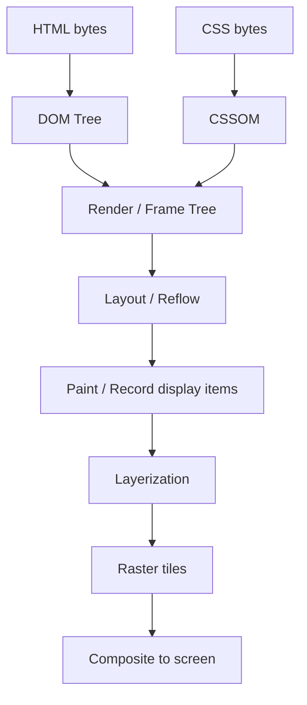
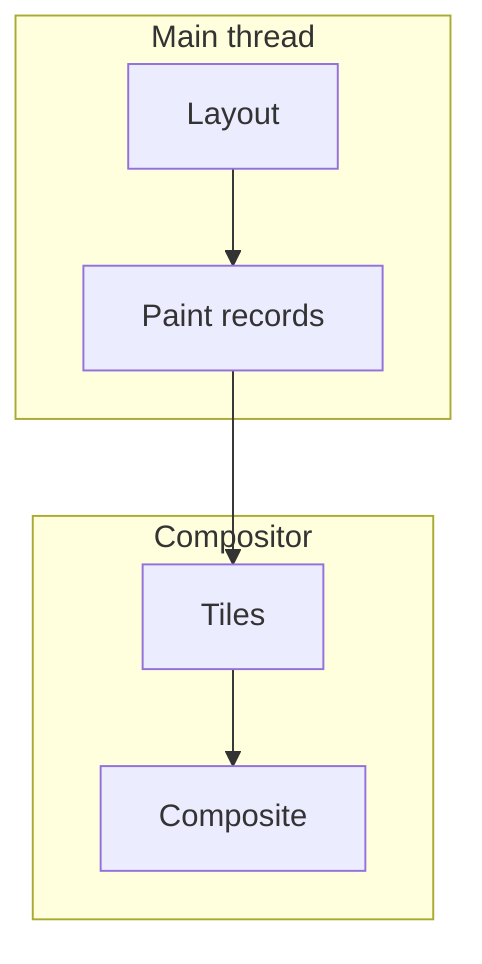
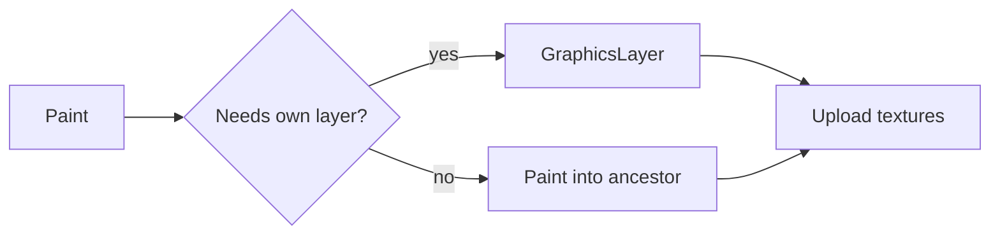

# Rendering Pipeline

From bytes to pixels: **parse → style → layout → paint → composite**. Interviewers expect you to know which DOM/CSS changes dirties which stage, and why that maps to “layout thrashing” vs “cheap opacity animation.”

Related: [JS Rendering](/javascript/20-rendering) · [CSS Internals](/browser/04-css-internals) · [Optimization](/browser/09-optimization) · [React reconciliation](/react/02-reconciliation)

## End-to-end pipeline



| Stage | Input | Output | Invalidated by |
| --- | --- | --- | --- |
| Parse | HTML/CSS | DOM + CSSOM | Document mutation / stylesheet load |
| Style | DOM + CSSOM | Computed styles | Class/style changes, media queries |
| Layout | Render tree | Geometry (box model) | Size/position/font/content affecting flow |
| Paint | Layout boxes | Display item list | Color, visibility, box-shadow, etc. |
| Composite | Layers | Frame | Transform, opacity, filter (often) |

**Critical path framing:** Time-to-First-Paint / LCP often blocked by CSS in `<head>`, fonts, and large images — not only JS. See [Networking](/browser/05-networking).

## DOM, CSSOM, render tree

- **DOM:** structure + content. `display: none` nodes exist in DOM but are **excluded** from render tree.
- **CSSOM:** cascade-resolved rules; blocking stylesheets delay first render.
- **Render tree (Blink: LayoutObject / Fragment tree):** visible boxes only. Pseudo-elements appear here, not in DOM.

```ts
// Forced synchronous layout — anti-pattern interview classic
function badReadWriteLoop(els: HTMLElement[]): void {
  for (const el of els) {
    el.style.width = '100px'          // write → dirties layout
    void el.offsetHeight              // read → forces layout NOW
  }
}

function batched(els: HTMLElement[]): void {
  for (const el of els) el.style.width = '100px' // writes
  // browser layouts once before next read / frame
  const heights = els.map((el) => el.offsetHeight)
  void heights
}
```

Geometry getters that flush layout: `offset*`, `client*`, `scroll*`, `getComputedStyle` (sometimes), `getBoundingClientRect`.

## Style recalc

Matching selectors is roughly **O(elements × matching cost)**. Right-to-left selector engines mean `.nav li a` is costlier than `.nav-link`. `:nth-child` and complex combinators amplify work.


**Containment** (`contain: layout style paint`) limits invalidation fan-out — senior-level optimization signal.

## Layout (reflow)

Layout assigns **used values** (px) for boxes. Block/inline, flex, grid each have different algorithms. Percentage heights, tables, and intrinsic sizing (`min-content`) are expensive.

```ts
// ResizeObserver: layout-aware without polling geometry in rAF incorrectly
const ro = new ResizeObserver((entries) => {
  for (const e of entries) {
    const { inlineSize, blockSize } = e.contentBoxSize[0]!
    // schedule work — do not force sync layout inside freely
    console.log(inlineSize, blockSize)
  }
})
ro.observe(document.querySelector('#root')!)
```

**Reflow vs repaint:** changing `width` → layout + paint + composite; changing `color` → paint (+ maybe composite); changing `transform` → often composite only.

## Paint & layers

Paint records drawing commands (text, backgrounds, borders). Browser promotes some nodes to **compositor layers** (own texture) when beneficial: video, canvas, 3D transforms, `will-change`, overlapping stacking contexts.



Too many layers → memory + upload cost (“layer explosion”). Too few → scrolling/animation hits main thread.

## Composite-only properties (rule of thumb)

Prefer animating: `transform`, `opacity` (and sometimes `filter`). Avoid animating: `top/left`, `width/height`, `margin`, `border-width` (layout).

```css
/* compositor-friendly */
.card {
  transition: transform 200ms, opacity 200ms;
}
.card:hover {
  transform: translateY(-4px);
  opacity: 0.95;
}
```

## Pixel pipeline vs React

React’s commit phase mutates the DOM → browser pipeline runs. Concurrent React ([Fiber](/react/01-fiber), [Concurrent](/react/04-concurrent)) can interrupt JS work, but **once DOM is committed**, style/layout still belong to the browser. Virtual DOM ≠ skipping layout.

## Interview Questions

**Q1. Explain reflow vs repaint.**  
Reflow/layout recalculates geometry. Repaint/raster updates pixels for visual properties without necessarily changing geometry. Composite merges layers. A reflow usually implies subsequent paint.

**Q2. Why does reading `offsetHeight` after writes cause jank?**  
Writes dirty layout; the read requires up-to-date geometry → browser flushes pending style+layout synchronously on the main thread mid-JS.

**Q3. Does `display: none` trigger layout for that subtree?**  
Removing from render tree can dirty ancestors; the hidden subtree is not laid out while `none`. Toggling it forces style+layout when shown — prefer `visibility`/`content-visibility`/`hidden` attribute patterns when appropriate.

**Q4. What does `will-change: transform` do?**  
Hints the engine to promote a layer early. Overuse wastes GPU memory. Prefer applying shortly before animation and removing after.

**Q5. How does `content-visibility: auto` help?**  
Skips rendering work for off-screen subtrees (with containment), improving both rendering CPU and sometimes Interaction to Next Paint. Needs correct sizing (`contain-intrinsic-size`) to avoid scroll jumps.

## Common Mistakes

- Measuring layout in a tight loop interleaved with DOM writes.
- Animating `left/top` instead of `transform`.
- Using `*` or deep universal selectors in hot stylesheets.
- Applying `will-change` on hundreds of nodes permanently.
- Assuming CSS-in-JS runtime style injection is “free” — it dirties style like any stylesheet mutation.
- Blaming React for “slow renders” when DevTools Performance shows **Recalculate Style / Layout** dominating after commit.

## Trade-offs

| Technique | Benefit | Cost |
| --- | --- | --- |
| Batch DOM reads/writes | Fewer forced layouts | Requires discipline / libraries |
| Compositor animations | Smooth under load | Limited expressiveness |
| Extra layers | Independent scroll/anim | VRAM, bandwidth |
| CSS containment | Smaller invalidation | Authoring complexity; bugs if misused |
| `content-visibility` | Big list perf | Scrollbar/size reserving |

**Senior takeaway:** Map every UI change to **which pipeline stage it dirties**. That single habit answers most rendering interview follow-ups.

## Deep dive — Style invalidation sets

Engines track which properties dirty style vs layout vs paint. Class changes may invalidate sibling/subtree matches depending on selectors. Attribute selectors (`[data-x]`) and sibling combinators (`+`, `~`) expand invalidation sets. Prefer local class toggles on the node that changes.

```ts
// Prefer targeted class over style attribute thrash
el.classList.add('is-open') // one invalidation path
// vs
el.style.height = `${n}px` // per-frame layout if animated poorly
```

## Deep dive — Layerization heuristics (Blink-shaped)

Promotion triggers (non-exhaustive): 3D transform, `<video>`, `<canvas>`, scrolling layers, `will-change`, opacity animations, filters. Compositor thread then can scroll/animate without main. Cost: each layer has a backing store (memory ≈ pixels × DPR × 4 bytes).



## Deep dive — Fonts & FOIT/FOUT

Font loads block text rendering depending on `font-display`. Swap reduces blank text but causes CLS if metrics differ — use `size-adjust` / fallback metric overrides. Preload only critical fonts ([Networking](/browser/05-networking), [Optimization](/browser/09-optimization)).

## Extra Q&A

**Q6. What is a stacking context vs a layer?**  
Stacking context = paint order / z-index algorithm. Compositor layer = GPU texture unit. Related but not 1:1.

**Q7. Does changing `background-color` reflow?**  
No layout; paint (and possibly composite). Geometry unchanged.

**Q8. Why does DevTools show purple “Layout” bars after React commit?**  
DOM mutations → browser layout. React time ≠ layout time; profile both [React reconciliation](/react/02-reconciliation).

**Q9. `offsetWidth` in a Web Worker?**  
Impossible — no DOM. Measure on main or use `OffscreenCanvas` for canvas-only cases.

**Q10. IntersectionObserver vs scroll layout reads?**  
IO is async and engine-optimized; prefer it over scroll handlers that call `getBoundingClientRect` every frame.


## Worked example — “accordion expand janks”

Symptom: expand toggles `height: auto` animation. Pipeline: each frame layout. Fix: animate `grid-template-rows: 0fr → 1fr` or transform scaleY with care, or WAAPI on compositor props; measure Layout events disappear.

```css
.panel {
  display: grid;
  grid-template-rows: 0fr;
  transition: grid-template-rows 200ms;
}
.panel.open { grid-template-rows: 1fr; }
.panel > .inner { overflow: hidden; min-height: 0; }
```

## Display locks & `content-visibility`

Browsers may skip rendering work for off-screen subtrees. Pair with `contain-intrinsic-size` to avoid scrollbar jumps. Great for long feeds ([Optimization](/browser/09-optimization), [Virtual list](/machine-coding/04-virtual-list)).

## Paint holding / first contentful

Engines may delay first paint until meaningful content (paint holding) — late fonts/CSS still dominate LCP. Critical CSS strategies must not ship megabytes inline.

## Glossary

| Term | Definition |
| --- | --- |
| Reflow | Layout recalculation |
| Repaint | Updating pixels without geometry change |
| Layer | Compositor texture candidate |
| Invalidation | Marking dirty regions/stages |
| Render object | Engine box tree node |
