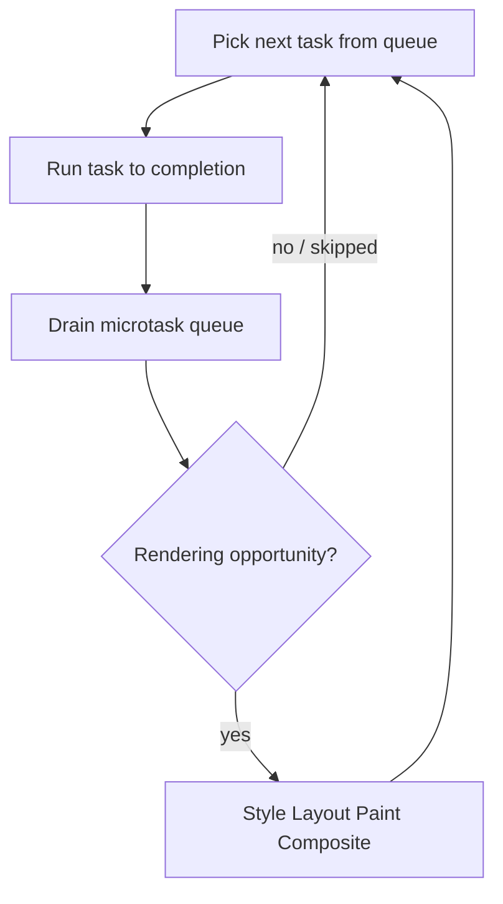
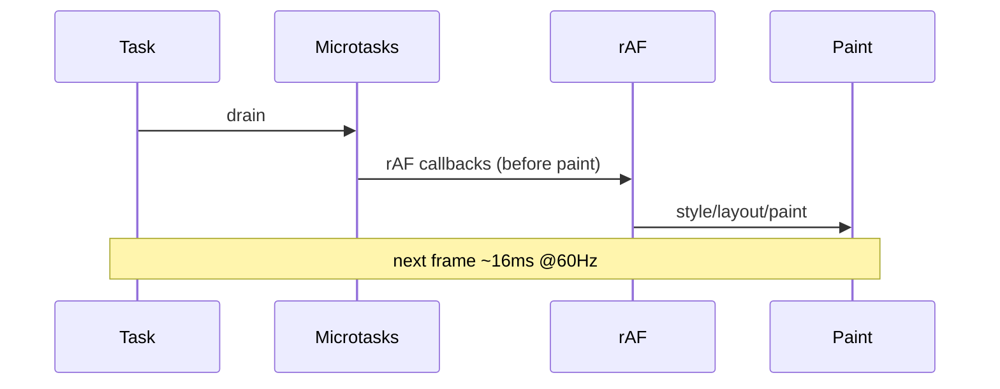

# Browser Event Loop

The browser event loop coordinates **task queues**, **microtasks**, **rendering**, and **input**. It is related to but not identical to Node’s loop ([Node phases](/node/02-event-loop)). Page JS shares the main thread with style, layout, and paint.

Related: [JS Event Loop](/javascript/10-event-loop) · [JS Async](/javascript/11-async) · [Architecture](/browser/01-architecture) · [React concurrent scheduling](/react/04-concurrent)

## Mental model



HTML spec (simplified):

1. Select oldest **task** (macrotask) from a task queue.
2. Run it.
3. Checkpoint: run all **microtasks** (and any newly queued microtasks) until empty.
4. Optionally update rendering (rAF callbacks → style → layout → paint → composite).
5. Repeat.

There are **multiple task sources** (DOM manipulation, user interaction, networking, history traversal, timers). The browser picks among queues fairly; order across sources is not a single FIFO in all cases — but within `setTimeout` you get ordering guarantees for equal delay.

## Tasks vs microtasks

| | Task (macrotask) | Microtask |
| --- | --- | --- |
| Examples | `setTimeout`, `setInterval`, `MessageChannel`, I/O callbacks, UI events (often) | `queueMicrotask`, `Promise.then/catch/finally`, `MutationObserver` |
| When drained | One task per turn | Until empty after each task / before render |
| Starvation risk | Lower | High if you keep scheduling microtasks |

```ts
console.log('script')

setTimeout(() => console.log('timeout'), 0)

queueMicrotask(() => console.log('micro1'))

Promise.resolve()
  .then(() => {
    console.log('promise1')
    queueMicrotask(() => console.log('micro2'))
  })
  .then(() => console.log('promise2'))

// Typical order:
// script → micro1 → promise1 → micro2 → promise2 → timeout
```

**Gotcha:** `async` function resumes are microtasks (promise reactions).

## `requestAnimationFrame` vs timers



| API | Phase | Use |
| --- | --- | --- |
| `requestAnimationFrame` | Before paint | Visual updates; pause in background tabs |
| `setTimeout(fn, 0)` | Task queue | Defer work; min delay clamped (~4ms nested); throttled in background |
| `requestIdleCallback` | Idle periods | Low-priority work; timeout option; not for animations |
| `MessageChannel` | Task | Post-task scheduling (React used historically) |

```ts
function measureFrame(cb: (dt: number) => void): void {
  let last = performance.now()
  function frame(now: number) {
    cb(now - last)
    last = now
    requestAnimationFrame(frame)
  }
  requestAnimationFrame(frame)
}

// Yield to browser — modern scheduling
async function yieldToMain(): Promise<void> {
  await new Promise<void>((resolve) => {
    // Scheduler API when available; else MessageChannel / setTimeout
    const s = (globalThis as unknown as { scheduler?: { yield: () => Promise<void> } }).scheduler
    if (s?.yield) void s.yield().then(resolve)
    else setTimeout(() => resolve(), 0)
  })
}
```

## Input, events, and the loop

User events are tasks. A long task (>50ms) delays click handlers → poor INP. Event listeners run on main thread unless you offload work.

Capture → target → bubble still applies ([JS browser APIs](/javascript/19-browser-apis)). `passive: true` on touch/wheel lets the browser scroll without waiting for listener completion.

```ts
window.addEventListener(
  'wheel',
  (e) => {
    // heavy sync work here blocks scroll if non-passive
  },
  { passive: true },
)
```

## Microtasks and rendering

If a task queues infinite microtasks, **rendering never happens** — page freezes with 100% CPU. Promises are not “async enough” to guarantee paint.

```ts
// NEVER in production — freezes UI
function starve() {
  Promise.resolve().then(starve)
}
```

## Workers & the loop

Each Worker has its own event loop and isolate. `postMessage` queues a task on the destination. Transferables / SAB avoid structured-clone cost ([Memory](/browser/07-memory-gc)).

## Interview Questions

**Q1. Order: `setTimeout(0)`, `Promise.then`, `requestAnimationFrame`?**  
Promise microtasks run before the next rendering opportunity; rAF runs before paint; timeout is a task and may run before or after a frame depending on timing. Classic answer: sync → microtasks → (rAF → paint) → timeout if scheduled as separate task after current, but if timeout fires in same frame window, interleaving depends on when the task was queued relative to the rendering opportunity. Prefer demonstrating with a snippet and Performance panel.

**Q2. Why can `await` in a click handler delay paint?**  
`await` yields to microtasks/tasks; continuing after await is a microtask/task continuation. Long work after await still blocks. Split with `scheduler.yield()` or rAF for visual priority.

**Q3. Difference between browser and Node event loops?**  
Browser: tasks + microtasks + **rendering** + input prioritization. Node: libuv phases (timers, pending, poll, check, close) + `process.nextTick` + microtasks. Don’t claim they’re identical — see [Node event loop](/node/02-event-loop).

**Q4. Is `MutationObserver` a microtask?**  
Yes — delivered as microtasks, so it can run before paint after DOM mutations in the same turn.

**Q5. How does React 18 concurrent mode relate?**  
React cooperatively yields between units of work so the browser can process input/render. It does not replace the browser event loop; it schedules on top ([Concurrent Rendering](/react/04-concurrent)).

## Common Mistakes

- Using `setTimeout(fn, 0)` expecting it before microtasks.
- Assuming `async/await` moves work off the main thread.
- Infinite `Promise.then` chains starving rendering.
- Doing layout reads inside rAF incorrectly interleaved with writes still causes thrashing.
- Relying on timer fidelity in background tabs (heavily throttled).
- Using `requestIdleCallback` for animation or input-critical work.

## Trade-offs

| Scheduling primitive | Pros | Cons |
| --- | --- | --- |
| Microtasks | Immediate sequencing after task | Can starve render |
| `setTimeout` | Simple deferral | Clamping, throttling, coarse |
| rAF | Sync with display | Not for non-visual work in inactive tabs |
| Idle callback | Polite CPU use | Unpredictable timing; Safari historically weak |
| Worker | True parallelism | Messaging cost, no DOM |

**Senior takeaway:** Explain **one task → drain microtasks → maybe render**, then point at long tasks as the root of INP/jank — with a concrete fix (split work, Worker, passive listeners, concurrent UI).

## Deep dive — task sources (HTML)

The HTML spec defines multiple task queues/sources. Browsers rotate fairly so networking callbacks can’t forever starve user input (in theory). Within a source, ordering is FIFO. Don’t write logic that depends on `setTimeout(0)` vs `MessageChannel` ordering across browsers.

```ts
// queueMicrotask vs Promise.resolve().then — same queue conceptually
queueMicrotask(() => console.log(1))
Promise.resolve().then(() => console.log(2))
// 1 then 2 (insertion order)
```

## Deep dive — `visibilitychange` & timers

Background tabs throttle timers aggressively (often ≥1s). `requestAnimationFrame` pauses when hidden. Use Page Lifecycle API (`freeze`/`resume` where supported) and don’t trust timer-based heartbeats for correctness — use server timestamps ([Networking](/browser/05-networking)).

```ts
document.addEventListener('visibilitychange', () => {
  if (document.visibilityState === 'hidden') pauseWork()
  else resumeWork()
})
```

## Deep dive — Atomics / SAB wait

`Atomics.wait` on the main thread is forbidden (would freeze UI). Workers can block on SharedArrayBuffer when cross-origin isolated (`COOP`/`COEP`). Ties to [Security](/browser/06-security) headers and [Memory](/browser/07-memory-gc).

## Extra Q&A

**Q6. Is `queueMicrotask` the same as `process.nextTick`?**  
No — Node `nextTick` drains before promises; browser has no `nextTick`. → [Node event loop](/node/02-event-loop)

**Q7. When do UI events become tasks?**  
Dispatched as tasks when the event is ready; if main is busy, they queue → delayed handlers → bad INP.

**Q8. Does `await fetch()` continue as microtask?**  
The continuation after await is a microtask when the promise fulfills; the network completion itself queues a task that resolves the promise.

**Q9. Why did React use MessageChannel?**  
To schedule a task after the current one (macrotask) without `setTimeout` 4ms clamp — historical; scheduler APIs evolving.

**Q10. Can microtasks run between rAF and paint?**  
Spec allows microtasks after rAF callbacks before rendering continues; don’t schedule heavy microtask work inside rAF.


## Worked example — promise vs timeout ordering puzzle

```ts
setTimeout(() => console.log('A'), 0)
Promise.resolve().then(() => {
  console.log('B')
  setTimeout(() => console.log('C'), 0)
})
queueMicrotask(() => console.log('D'))
console.log('E')
// E, B, D, A, C  (typical)
```

Explain with: sync → microtasks (B then D) → task A → later task C.

## Interaction with React 18 transitions

`startTransition` marks updates interruptible so input tasks can run between render units — still one browser event loop ([React concurrent](/react/04-concurrent)). Don’t confuse with Web Workers.

## `Atomics.waitAsync` vs blocking

Async wait can resolve via microtasks without blocking main; sync wait forbidden on main window.

## Glossary

| Term | Definition |
| --- | --- |
| Task | Macrotask queue item |
| Microtask | Promise/queueMicrotask job |
| Rendering opportunity | Chance to style/layout/paint |
| Long task | >50ms main-thread task |
| Passive listener | Cannot `preventDefault`; enables async scroll |
