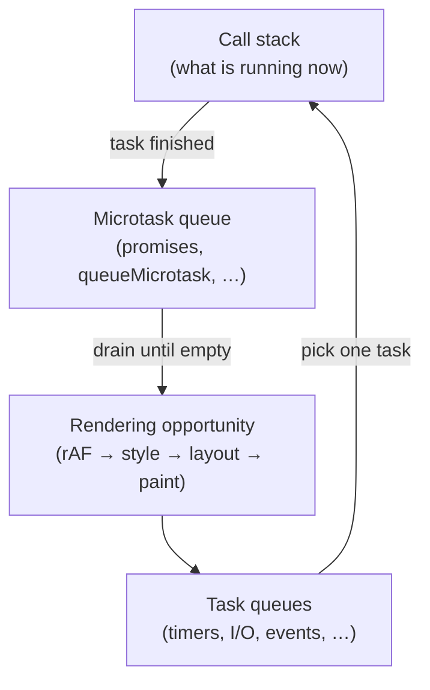
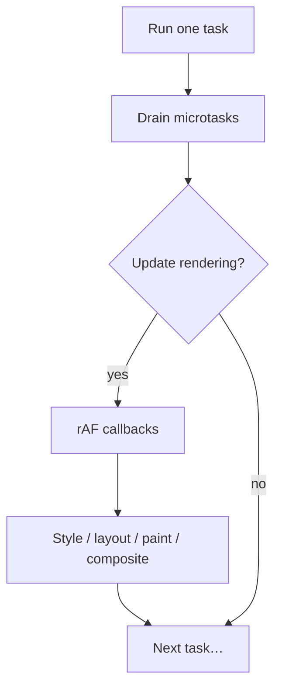
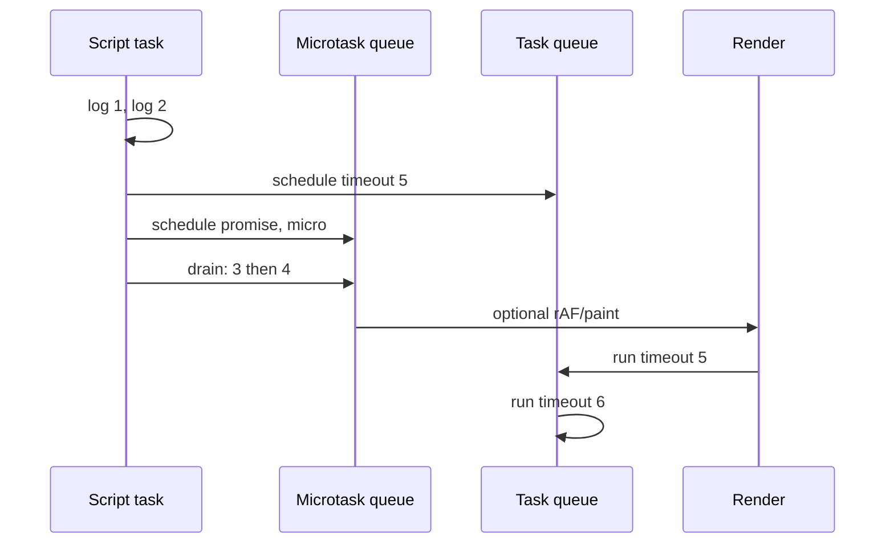
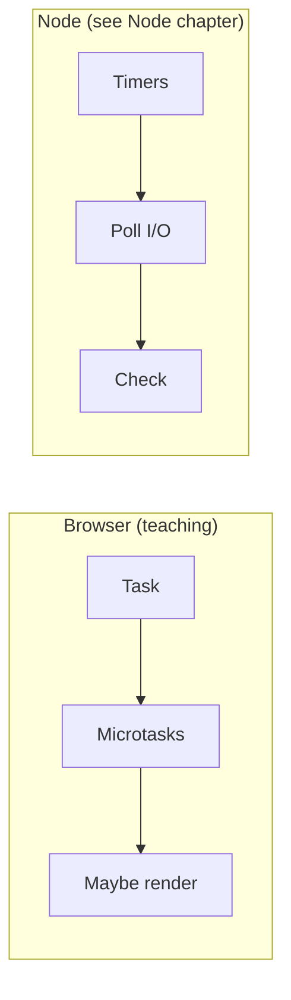

# Browser Event Loop

This chapter teaches how the browser schedules JavaScript and rendering from scratch. You do not need to already know macrotasks, microtasks, or how Node’s loop is structured. By the end you should be able to explain the **call stack**, **task queues**, **microtasks**, **when rendering can happen**, and how **input** fits in — and compare lightly to Node without treating them as identical.

Related: [JS Event Loop](/javascript/10-event-loop) · [Node Event Loop](/node/02-event-loop) · [Architecture](/browser/01-architecture) · [Rendering Pipeline](/browser/02-rendering-pipeline) · [JS Async](/javascript/11-async)

---

## 1. The problem: JS is single-threaded on the page

In a page’s main world, **one call stack** runs your JavaScript. Two `click` handlers do not truly run at the same instant on that stack. Network responses, timers, and paints must be **scheduled** somehow.

The **event loop** is the browser’s coordinator:

> Keep picking work to run, run it, then decide whether to update the screen — forever (while the document lives).



This chapter builds that diagram piece by piece.

---

## 2. The call stack — from zero

### 2.1 Plain language

A **call stack** is how the engine tracks “which function am I in, and who called me?”

- Calling a function **pushes** a frame
- Returning **pops** a frame
- When the stack is empty, that turn of work is done

```ts
function third() {
  console.log("third")
}

function second() {
  third()
}

function first() {
  second()
}

first()
```

Slow-motion:

1. `first` pushed
2. `second` pushed
3. `third` pushed → logs → pops
4. `second` pops
5. `first` pops
6. Stack empty

### 2.2 Synchronous code runs to completion

```ts
console.log("A")
for (let i = 0; i < 1e8; i++) {
  // busy work
}
console.log("B")
```

Nothing else on this thread — no paint, no other click handler — runs *between* A and B while this script holds the stack. That is why long synchronous work freezes the UI. The loop lives on the **main thread** of the renderer ([Architecture](/browser/01-architecture)).

---

## 3. “Later” work needs queues

Timers and network cannot push onto the call stack until it is free. They place **jobs** into queues. The event loop **picks** jobs when the stack is empty (between turns).

Two important families:

| Family | Teaching name | Examples |
| --- | --- | --- |
| **Tasks** | macrotasks / tasks | `setTimeout`, `setInterval`, message events, many input events, I/O callbacks |
| **Microtasks** | microtasks | `queueMicrotask`, `Promise.then/catch/finally`, `MutationObserver` |

You will see both names in articles. Prefer **task** and **microtask** as in the HTML specification.

---

## 4. Tasks — one unit of turn-based work

### 4.1 Definition

A **task** is a discrete piece of work the browser schedules on a task queue. The event loop runs **one task**, then does bookkeeping (microtasks, maybe render), then may pick another task.

```ts
console.log("script start")

setTimeout(() => {
  console.log("timeout 0")
}, 0)

console.log("script end")
```

Output:

```text
script start
script end
timeout 0
```

Why? The running script *is* (part of) a task. `setTimeout(..., 0)` schedules a **future** task. It cannot interrupt the current stack.

### 4.2 Multiple task sources

The browser has **several** task sources (DOM manipulation, user interaction, networking, history, timers, …). The event loop chooses among queues with fairness rules. Practical takeaway:

- Ordering **within** `setTimeout` callbacks with the same delay is reliable enough for teaching
- Ordering **across** unrelated sources (“will my fetch callback always beat this click?”) is not something to bet the farm on

### 4.3 `setTimeout` is not a precise clock

```ts
setTimeout(() => console.log("tick"), 0)
```

`0` means “as soon as you are allowed,” not “in 0ms wall time.” Nested timers get minimum delays; background tabs throttle timers aggressively.

---

## 5. Microtasks — drain until empty

### 5.1 Definition

A **microtask** is work that runs **soon after the current task finishes**, **before** the browser returns to picking the next task (and typically **before** rendering).

Important: after a task, the engine drains the **entire** microtask queue. If a microtask enqueues more microtasks, those run too — until the queue is empty.

```ts
console.log("script")

setTimeout(() => console.log("timeout"), 0)

queueMicrotask(() => console.log("micro1"))

Promise.resolve().then(() => console.log("promise1"))

console.log("script end")
```

Typical order:

```text
script
script end
micro1
promise1
timeout
```

Slow-motion:

1. Script task runs: logs `script`, schedules timeout task, schedules two microtasks, logs `script end`
2. Script task done → **drain microtasks**: `micro1`, `promise1`
3. Maybe render (if needed)
4. Next task: timeout → `timeout`

### 5.2 Promises are microtasks

```ts
Promise.resolve()
  .then(() => {
    console.log("then1")
    return Promise.resolve()
  })
  .then(() => console.log("then2"))
```

Each `then` reaction is a microtask. `async/await` is sugar over promises — await continuations are microtasks too.

```ts
async function demo() {
  console.log("async start")
  await null
  console.log("after await")
}

demo()
console.log("sync")
// async start → sync → after await
```

### 5.3 Starvation danger

```ts
// Do NOT do this — never returns to render / other tasks
function hammer() {
  queueMicrotask(hammer)
}
hammer()
```

Because microtasks drain until empty, endless microtask scheduling can **starve** rendering and timers.

---

## 6. The rendering opportunity

### 6.1 Where paint fits

After a task and its microtasks, the browser **may** update rendering:

1. Run `requestAnimationFrame` callbacks
2. Style → layout → paint → composite ([Rendering Pipeline](/browser/02-rendering-pipeline))
3. Continue the loop

The browser can skip a frame if nothing visual changed, or if it is under heavy load. It is an **opportunity**, not a guarantee after every task.



### 6.2 `requestAnimationFrame`

```ts
requestAnimationFrame((time) => {
  // time ≈ DOMHighResTimeStamp for this frame
  element.style.transform = `translateX(${time % 200}px)`
})
```

| API | Rough phase | Good for |
| --- | --- | --- |
| `requestAnimationFrame` | Before paint | Visual updates |
| `setTimeout(fn, 0)` | Task queue | Defer non-visual work |
| `requestIdleCallback` | Idle periods | Low-priority work (with timeout) |

Background tabs often **pause or heavily throttle** `rAF` — animations sleep when unseen.

```ts
function measureFrame(cb: (dt: number) => void): void {
  let last = performance.now()
  function frame(now: number) {
    cb(now - last)
    last = now
    requestAnimationFrame(frame)
  }
  requestAnimationFrame(frame)
}
```

---

## 7. A classic ordering puzzle — slow motion

```ts
console.log("1 script")

setTimeout(() => console.log("5 timeout"), 0)

Promise.resolve().then(() => {
  console.log("3 promise")
  setTimeout(() => console.log("6 timeout from promise"), 0)
})

queueMicrotask(() => console.log("4 micro"))

console.log("2 script end")
```

Expected:

```text
1 script
2 script end
3 promise
4 micro
5 timeout
6 timeout from promise
```

Slow-motion:

1. Script logs `1 script`.
2. `setTimeout` schedules a **task** (the “5 timeout” callback).
3. `Promise.then` schedules a **microtask** (`3 promise`).
4. `queueMicrotask` schedules another **microtask** (`4 micro`).
5. Script logs `2 script end` and the script task finishes.
6. Drain microtasks in order: `3 promise` (which schedules “6 timeout from promise” as a new task), then `4 micro`.
7. Next tasks: `5 timeout`, then `6 timeout from promise`.

### Mermaid sequence



---

## 8. Input events

User input (click, keydown, pointermove) is scheduled as tasks from an interaction task source (simplified teaching model).

Consequences:

1. A click handler runs as a **task** (with microtasks after it).
2. If a previous task is still running a tight loop, the click waits — UI feels dead.
3. Passive listeners and compositor scrolling can keep scrolling alive even when main thread is busy — architecture again.

```ts
button.addEventListener("click", () => {
  console.log("click")
  Promise.resolve().then(() => console.log("micro after click"))
  setTimeout(() => console.log("timeout after click"), 0)
})
```

Inside the click task: log `click` → drain microtasks (`micro after click`) → later task (`timeout after click`).

### `preventDefault` and responsiveness

Some events must be handled promptly for the browser to know whether to do the default action (e.g. touch scrolling). Blocking the main thread hurts here. Prefer non-blocking patterns; use `passive: true` when you will not call `preventDefault` on scroll/touch.

```ts
window.addEventListener("touchstart", onTouch, { passive: true })
```

---

## 9. Putting it together — HTML-ish algorithm (simplified)

Teaching simplification of the HTML event loop:

1. **Choose the oldest task** from a selected task queue.
2. **Run that task** to completion (call stack grows and empties).
3. **Perform a microtask checkpoint**: run all microtasks (and any new ones they spawn) until empty.
4. **Update rendering** if appropriate (rAF → style → layout → paint → compose).
5. Go to 1.

```ts
/** Teaching model only */
type Job = () => void

const taskQueues: Job[][] = []
const microtasks: Job[] = []
let needsRender = false

function queueTask(job: Job): void {
  taskQueues[0]!.push(job)
}

function queueMicrotaskTeach(job: Job): void {
  microtasks.push(job)
}

function drainMicrotasks(): void {
  while (microtasks.length) {
    const job = microtasks.shift()!
    job()
  }
}

function eventLoopTurn(): void {
  const task = taskQueues[0]?.shift()
  if (!task) return
  task()
  drainMicrotasks()
  if (needsRender) {
    // rAF callbacks, then style/layout/paint…
    needsRender = false
  }
}
```

Real browsers are more nuanced (multiple queues, idle callbacks, input prioritization). This model is enough to reason about promise vs timeout vs rAF.

---

## 10. `async/await` rewrite drill

```ts
async function load() {
  console.log("A")
  const data = await fetch("/api") // suspension — continuation is microtask-ish after fetch task completes
  console.log("B", data.status)
}

console.log("C")
load()
console.log("D")
```

Order of the synchronous parts: `C`, `A`, `D`, then later (after network task + promise reactions) `B`.

Do not claim “await creates a new thread.” It schedules continuation work through promises / the event loop.

More async patterns: [JS Async](/javascript/11-async) · deeper loop details: [JS Event Loop](/javascript/10-event-loop).

---

## 11. Browser loop vs Node loop — light comparison

Node also has an event loop, but **phases** differ (`timers`, `poll`, `check`, …) and there is **no browser rendering pipeline**.

| Topic | Browser | Node |
| --- | --- | --- |
| Main idea | Tasks + microtasks + **optional render** | Phases around I/O / timers |
| UI paint | Yes — rAF / style / layout / paint | No DOM |
| `setImmediate` | Not standard in browsers | Historically Node-specific |
| `process.nextTick` | N/A | Runs before other microtasks (Node-specific) |
| `setTimeout` | Task | Timers phase |



When you need Node detail, open [Node Event Loop](/node/02-event-loop). When you need a JS-focused deep dive that still centers the language runtime, open [JS Event Loop](/javascript/10-event-loop). This chapter stays on **what pages do**.

Shared truth in both worlds:

> One thread’s JS call stack runs to completion; asynchronous work is queued; microtasks run before the next macrotask-style turn.

---

## 12. Scheduling APIs cheat-sheet (with intent)

```ts
// 1) Visual — couple to frames
requestAnimationFrame(() => {
  updateAnimation()
})

// 2) After current task + microtasks, as a new task
setTimeout(() => {
  deferNonCritical()
}, 0)

// 3) Explicit microtask
queueMicrotask(() => {
  keepOrderingRelativeToPromises()
})

// 4) Idle (may never run soon — always set timeout option in real apps)
requestIdleCallback(
  (deadline) => {
    while (deadline.timeRemaining() > 0 && hasWork()) {
      doChunk()
    }
  },
  { timeout: 2000 },
)
```

React and other libraries have used `MessageChannel` to queue tasks with better ordering than nested `setTimeout`. Same idea: **post a task**.

---

## 13. Long tasks and Time to Interactive

A **long task** is main-thread work that blocks the loop for an extended time (commonly discussed around >50ms). During a long task:

- No other tasks (clicks) run on that stack
- Microtasks from that task only run after it finishes
- Frames drop

```ts
// Bad: one huge task
heavyComputeSync()

// Better: yield between chunks
async function chunked(items: number[]): Promise<void> {
  const size = 1000
  for (let i = 0; i < items.length; i += size) {
    processRange(items, i, i + size)
    await new Promise<void>((resolve) => setTimeout(resolve, 0))
    // yields to tasks / input / render opportunities
  }
}
```

Newer scheduling ideas (`scheduler.yield`, prioritization) evolve; the principle remains: **break work so the loop can breathe**.

---

## 14. Workers — escape hatch, not a second DOM loop

Web Workers have **their own** event loop and stack. They do not make the main page multi-threaded for DOM.

```ts
// main
const worker = new Worker("/w.js")
worker.onmessage = () => console.log("reply is a task on main")
worker.postMessage("go")
```

Messages arrive as tasks on the receiving side. Related architecture: [Architecture](/browser/01-architecture).

---

## 15. Worked example — predict the logs

```ts
document.body.addEventListener("click", () => {
  console.log("click")
  Promise.resolve().then(() => console.log("p"))
})

console.log("start")
setTimeout(() => console.log("t"), 0)
requestAnimationFrame(() => console.log("rAF"))
Promise.resolve().then(() => console.log("p0"))
console.log("end")
```

If the user is **not** clicking:

1. `start`
2. `end`
3. `p0` (microtask)
4. `rAF` (before paint, when a frame is produced)
5. `t` (timer task) — relative order of `rAF` vs timer can depend on timing/frame schedule; many teaching environments show microtasks first, then either rAF (if rendering) then timer, or timer before next frame. Be honest in interviews: **microtasks before next task**; **rAF tied to rendering**, not “always before every timeout.”

Safer interview claim:

> After the script task: drain microtasks (`p0`). The timeout is a separate task. `rAF` runs as part of a rendering update, which happens between tasks when the browser decides to paint.

If the user clicks later: `click` then `p` as microtask after the click task.

---

## Interview Questions

### Q1. What is the browser event loop?
**Expected:** A coordinator that runs tasks on the main thread, drains microtasks after each task, and optionally updates rendering (rAF/style/layout/paint).  
**Common wrong:** “It is a separate thread that runs JS in parallel with your code.”  
**Follow-ups:** Where does UI jank come from?

### Q2. Task vs microtask — examples and order?
**Expected:** Tasks: timers, many events, I/O. Microtasks: promise reactions, `queueMicrotask`. Microtasks run to empty after a task, before the next task.  
**Common wrong:** “`setTimeout(fn, 0)` is a microtask.”  
**Follow-ups:** Show a log-order puzzle.

### Q3. Where does `requestAnimationFrame` run?
**Expected:** In the rendering phase, before paint, when the browser updates the frame.  
**Common wrong:** “It is the same queue as `setTimeout(0)`.”  
**Follow-ups:** What happens in a background tab?

### Q4. Why can promise chains starve the UI?
**Expected:** Continuous microtask scheduling never reaches the next task/render opportunity.  
**Common wrong:** “Promises run on another thread so they cannot block UI.”  
**Follow-ups:** How do you yield?

### Q5. How does this differ from Node?
**Expected:** Same “queue async work” idea; Node uses different phases and has no DOM rendering. Node has `nextTick` / historical `setImmediate` specifics.  
**Common wrong:** “They are identical algorithms.”  
**Follow-ups:** Point to [Node Event Loop](/node/02-event-loop).

### Q6. What happens after a `click` handler returns?
**Expected:** Microtask checkpoint (promise handlers scheduled during the click), then possibly render, then other tasks.  
**Common wrong:** “The next `setTimeout(0)` always runs before promise `.then`.”  
**Follow-ups:** Tie-in to [JS Event Loop](/javascript/10-event-loop).

## Common Mistakes

- Calling `setTimeout(0)` a microtask.
- Believing `await` “sleeps the thread” without understanding promise continuations.
- Scheduling infinite microtasks.
- Doing heavy DOM reads/writes inside `rAF` without care (still main thread).
- Assuming Node phase lore applies unchanged to browsers.
- Expecting precise timer intervals in background tabs.

## Trade-offs / Production Notes

- Prefer **rAF** for animation; **idle/timeouts** for deferred non-visual work.
- Instrument long tasks (Performance panel, `Long Tasks` API where available).
- In SPAs, route-level code splitting reduces main-thread parse/eval tasks on startup.
- When comparing environments in interviews, say what is **shared** (stack + queues + microtasks) and what is **browser-only** (rendering + input).
- Related: [JS Event Loop](/javascript/10-event-loop) · [Node Event Loop](/node/02-event-loop) · [Rendering Pipeline](/browser/02-rendering-pipeline) · [Architecture](/browser/01-architecture)
