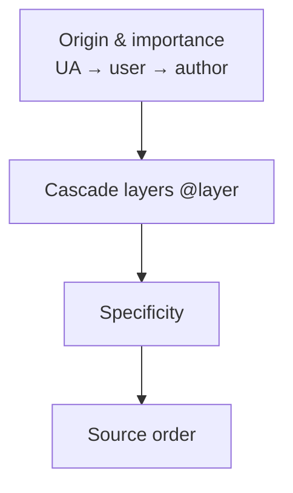

# CSS Internals

CSS is a constraint language + cascade algorithm, not “just styling.” Senior interviews probe **specificity**, **cascade layers**, **inheritance**, **containing blocks**, **stacking contexts**, and **layout modes** (flow, flex, grid) because they explain bugs that DevTools alone won’t.

Related: [Rendering Pipeline](/browser/02-rendering-pipeline) · [Optimization](/browser/09-optimization) · [JS Rendering](/javascript/20-rendering)

## Cascade & specificity



**Specificity tuple:** `(inline, IDs, classes/attributes/pseudo-classes, elements/pseudo-elements)`. `!important` flips competition into a separate importance lane (author important beats author normal, etc.).

```css
/* 0,1,0,0 */
#app { }
/* 0,0,2,1 */
nav.main a:hover { }
/* 1,0,0,0 — style="" */
```

### `@layer` (modern cascade control)

```css
@layer reset, base, components, utilities;

@layer reset {
  * { box-sizing: border-box; }
}
@layer components {
  .btn { padding: 0.5rem 1rem; }
}
@layer utilities {
  .p-0 { padding: 0; } /* wins over components if same specificity */
}
```

Later layers beat earlier layers **regardless of specificity** (within same origin/importance). This is how Tailwind-like utility systems stay predictable.

## Inheritance vs cascading

| Inherited (examples) | Not inherited |
| --- | --- |
| `color`, `font-*`, `line-height`, `visibility` | `margin`, `padding`, `border`, `width`, `display` |

`inherit`, `initial`, `unset`, `revert`, `revert-layer` control computed values explicitly.

```ts
// Reading used vs computed — interview nuance
const el = document.querySelector('.box')!
const computed = getComputedStyle(el).width // e.g. "240px" after layout
// getComputedStyle returns resolved values; percentages often already computed to px for width
```

## Box model & containing block


- Default `box-sizing: content-box` vs `border-box` (almost always prefer border-box in apps).
- **Percentage heights** resolve against the containing block’s height; if parent height is `auto`, percentage often behaves like `auto`.
- `position: absolute` → containing block is nearest positioned ancestor (or initial).
- `position: fixed` → normally viewport; under `transform`/`filter`/`perspective` on ancestor, that ancestor becomes the containing block (common “fixed is broken” bug).

## Formatting contexts

| Context | Establishes | Key rules |
| --- | --- | --- |
| Block Formatting Context (BFC) | `flow-root`, `overflow` ≠ visible, flex/grid items, etc. | Contains floats; margins don’t collapse through |
| Inline Formatting Context | Inline content | Line boxes, vertical-align |
| Flex | `display: flex` | Flex lines, grow/shrink, alignment |
| Grid | `display: grid` | Tracks, areas, alignment |

**Margin collapse:** adjoining vertical margins of block boxes in flow collapse to max — BFCs prevent collapse across boundaries.

```css
.card {
  display: flow-root; /* new BFC without overflow side effects */
}
```

## Stacking contexts & painting order

A stacking context is an atomic layer in z-order.

**Creates stacking context (subset):** `opacity < 1`, `transform` other than `none`, `filter`, `position` + `z-index` other than `auto`, `isolation: isolate`, `will-change`, fixed/sticky in many engines.

```css
/* Child z-index cannot escape parent stacking context */
.parent { opacity: 0.99; position: relative; z-index: 1; }
.child  { position: absolute; z-index: 9999; } /* still under sibling contexts of .parent */
```

Painting order (simplified): background/border of context → negative z-index children → in-flow → floats → in-flow inline → positioned z-index auto → positive z-index.

## Flex & Grid interview kernels

**Flex:** `flex-grow` / `flex-shrink` / `flex-basis`; `min-width: auto` prevents shrinking below content unless overridden (`min-width: 0` on nested flex overflow bugs).

**Grid:** explicit vs implicit tracks; `minmax(0, 1fr)` vs `1fr` (fr uses min-size auto by default — overflow traps).

```css
.row {
  display: flex;
}
.row > * {
  min-width: 0; /* allow shrink / text truncate */
}
.grid {
  display: grid;
  grid-template-columns: repeat(3, minmax(0, 1fr));
}
```

## Selector performance (Blink-shaped)

Engines match right-to-left. Prefer short, shallow selectors; avoid expensive ones on huge DOMs. Class selectors are fine; premature micro-optimization of selectors is usually dominated by **style invalidation scope** and **layout**.

## Interview Questions

**Q1. Specificity of `#a .b` vs `.b.c.d`?**  
`#a .b` → (0,1,0,1) wait: one ID + one class → (0,1,1,0). `.b.c.d` → (0,0,3,0). ID wins.

**Q2. Why doesn’t `z-index: 9999` work?**  
Ancestor created a stacking context; you’re competing inside it. Check `opacity`, `transform`, `filter`, `z-index` on parents.

**Q3. `position: fixed` scrolls with a modal — why?**  
An ancestor has `transform`/`filter`/`perspective`, becoming the fixed containing block.

**Q4. Difference between `visibility: hidden` and `display: none`?**  
`visibility` keeps layout space and can create descendants that are `visible`. `display: none` removes from render tree.

**Q5. How do cascade layers interact with specificity?**  
Within the same origin and importance, higher-priority layer wins even if specificity is lower. Specificity compares inside a layer.

## Common Mistakes

- Fighting specificity with `!important` instead of layers/structure.
- Percentage height chains without definite parent height.
- Nested flex overflow without `min-width: 0`.
- Expecting margins to add when they collapse.
- Using `px`-only layouts that ignore writing modes / zoom / a11y font scaling.
- Animating layout properties then blaming “CSS is slow.”

## Trade-offs

| Approach | Pros | Cons |
| --- | --- | --- |
| Utility CSS | Predictable cascade with layers | Verbosity; design consistency needs tokens |
| BEM / low specificity | Rare fights | Naming overhead |
| CSS-in-JS runtime | Colocation | Style recalc, FOUC, cache pressure |
| Container queries | Component-responsive | Older browser gaps; extra queries |
| Heavy grid/flex nesting | Expressive layouts | Harder mental model + cost |

**Senior takeaway:** Debug CSS in this order — **containing block → formatting context → cascade/layer → stacking context → layout mode algorithm**.

## Deep dive — used vs computed vs specified

| Level | Meaning |
| --- | --- |
| Specified | After cascade, before computation |
| Computed | Absolute-ish, inheritance resolved (e.g. `em` → px relative) |
| Used | After layout (percentages resolved against CB) |
| Actual | Possibly approximated for paint (rounding) |

`getComputedStyle` ≈ computed/used hybrid depending on property — interviews accept “resolved value you’d see applied.”

## Deep dive — container queries

```css
.card-root {
  container-type: inline-size;
  container-name: card;
}
@container card (min-width: 400px) {
  .meta { display: flex; }
}
```

Query the **container**, not the viewport — component-level responsiveness. Establishes containment; pair with [Optimization](/browser/09-optimization).

## Deep dive — subgrid & nesting

`grid-template` subgrid lets children align to parent tracks — powerful for design systems, still check support matrices. Nested flex/grid increases layout cost on large trees.

## Extra Q&A

**Q6. `em` vs `rem`?**  
`em` relative to element font-size (compounds); `rem` relative to root — prefer rem for spacing scales.

**Q7. Does `opacity: 0.99` create a stacking context?**  
Yes if opacity ≠ 1 — common accidental trap.

**Q8. `currentColor`?**  
Uses computed `color` — inherits conceptually for borders/SVGs.

**Q9. Why `100vh` mobile bugs?**  
Viewport units vs dynamic browser chrome — prefer `dvh`/`svh`/`lvh` where supported.

**Q10. Cascade for shadow DOM?**  
Shadow tree has separate scope; CSS variables pierce; `::part` / `:host` for intentional styling. Related to Web Components interviews.


## Worked example — “dropdown clipped”

Cause: ancestor `overflow: hidden` + stacking. Fix: portal to `document.body` (React portals) or rethink overflow. Containing block for `position: absolute` wasn’t the viewport.

## Cascade layers migration strategy

1. Wrap existing CSS in `@layer legacy`.  
2. New components in `@layer components`.  
3. Utilities last.  
Eliminates specificity wars without rewriting selectors overnight.

## Logical properties

`margin-inline-start` vs `margin-left` — writing-mode aware. Senior signal for i18n-ready CSS.

## Glossary

| Term | Definition |
| --- | --- |
| Specificity | Selector weight tuple |
| Containing block | Reference box for positioning/sizing |
| BFC | Block formatting context |
| Stacking context | Z-order atomic group |
| Used value | Post-layout value |
