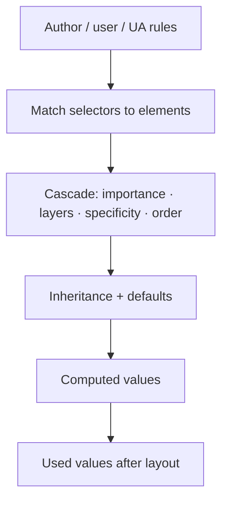
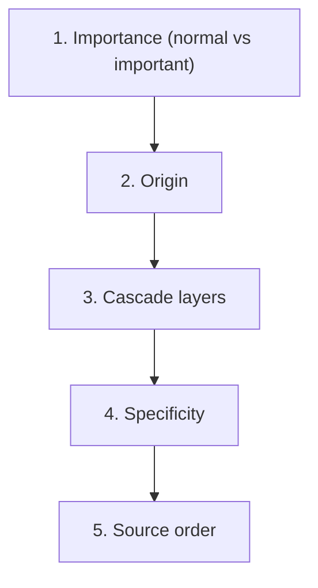
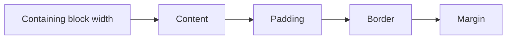
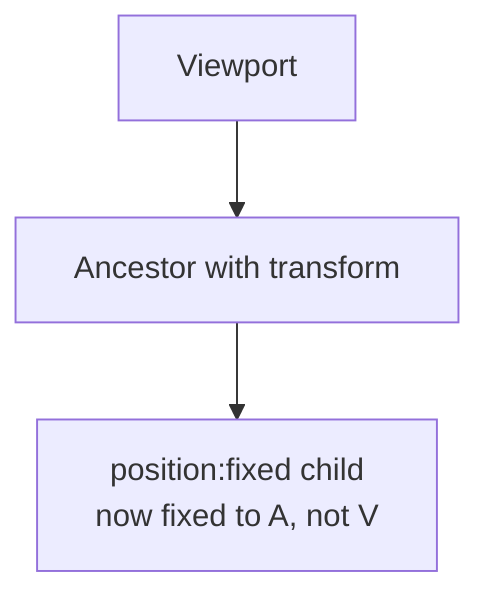
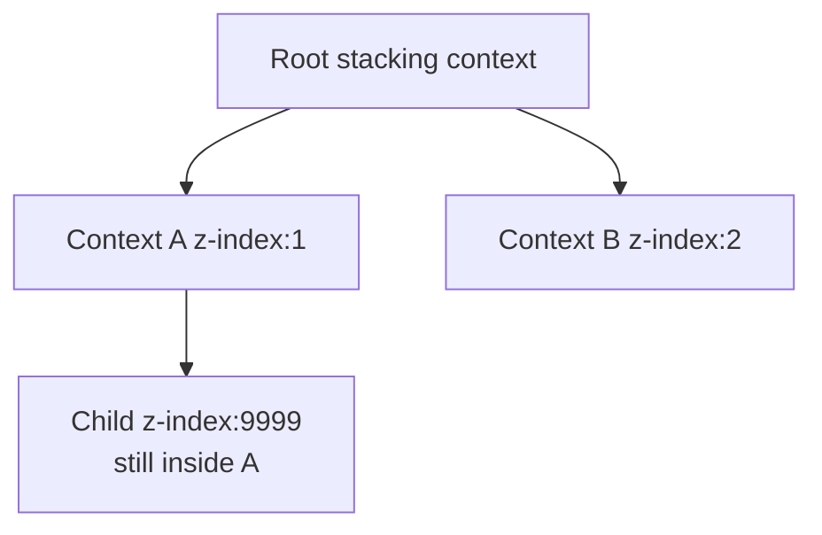

# CSS Internals

This chapter teaches how CSS actually decides what you see, from scratch. You do not need to already know specificity tuples, containing blocks, or stacking contexts. By the end you should be able to explain **the cascade**, **specificity**, **inheritance**, **containing blocks**, **stacking contexts**, and **why some style changes reflow while others only repaint** — with reasons, not memorized slogans.

Related: [Rendering Pipeline](/browser/02-rendering-pipeline) · [JS Rendering](/javascript/20-rendering) · [Architecture](/browser/01-architecture)

---

## 1. What CSS is trying to do

HTML gives structure. CSS answers:

> For each element, what are its **visual and layout properties** — and when two rules disagree, **who wins**?

CSS is not a paint program. It is a **constraint and conflict-resolution system**:

1. Collect all rules that might apply
2. Resolve conflicts (**cascade**)
3. Fill in missing values (**inheritance** / initials)
4. Compute used values for layout and paint



---

## 2. Declarations, rules, and stylesheets

### 2.1 Plain vocabulary

```css
/* rule = selector + declaration block */
.button {
  /* declaration: property + value */
  color: white;
  background-color: #0b6;
}
```

- **Selector** — which elements
- **Declaration** — one property/value pair
- **Stylesheet** — a list of rules (plus `@import`, `@media`, `@layer`, …)

Sources of rules:

| Origin | Examples |
| --- | --- |
| **User agent (UA)** | Browser default styles (`<a>` blue, underline) |
| **User** | Reader stylesheets / accessibility preferences |
| **Author** | Your CSS files, `<style>`, inline `style=""` |

Later cascade steps decide how these compete.

### 2.2 Inline styles

```html
<div style="color: red">Hi</div>
```

Inline declarations act like a very specific author rule for that element (see specificity). They are still subject to `!important` battles and cascade layers in modern CSS.

---

## 3. The cascade — conflict resolution from first principles

When two declarations target the same element and property, the cascade picks a winner.

### 3.1 Plain-language order (modern mental model)

From higher priority ideas down:

1. **Importance** — normal vs `!important` (separate championships)
2. **Origin** — UA vs user vs author (importance flips some pairwise outcomes)
3. **Cascade layers** (`@layer`) — layer order can beat specificity
4. **Specificity** — how precise the selector is
5. **Source order** — last one wins if still tied



You do not need every historical edge case. You need to *simulate* everyday conflicts correctly.

### 3.2 Why `!important` exists (and why it hurts)

```css
.button {
  color: white;
}

.button {
  color: black !important; /* wins over normal declarations */
}
```

`!important` is an escape hatch for forcing a win. Overuse makes later overrides painful — you need another `!important` or a carefully designed layer strategy.

Teaching rule:

> Prefer fixing **selector structure** and **layers** over sprinkling `!important`.

---

## 4. Specificity — measuring “how precise”

### 4.1 Intuition before numbers

Which selector feels more specific?

```css
button {
  color: black;
}
.toolbar button {
  color: navy;
}
#save {
  color: white;
}
```

For `<button id="save" class="toolbar…">`, `#save` is the most precise identity match. Specificity is the formal scoring of that intuition.

### 4.2 The tuple (simplified)

Count:

| Column | What you count |
| --- | --- |
| Inline style | `style=""` present? |
| IDs | `#id` |
| Classes / attributes / pseudo-classes | `.class`, `[type]`, `:hover` |
| Elements / pseudo-elements | `div`, `::before` |

Compare left to right; higher column wins.

```css
/* inline style ≈ strongest author normal specificity */
/* #app          → 1 ID */
/* .nav .link    → 2 classes */
/* nav ul li a   → 4 elements */
```

```html
<div id="app" class="wrap" style="color: green">Text</div>
```

```css
#app {
  color: blue; /* loses to inline green (normal importance) */
}
.wrap {
  color: red; /* loses to #app if inline removed */
}
```

### 4.3 What does *not* add specificity the way people think

- Universal selector `*` — zero
- Combinators (`>`, `+`, `~`, space) — zero
- `:where(...)` — **zero** specificity (useful reset trick)
- `:is(...)` / `:has(...)` — contribute based on their **most specific argument** (simplified teaching; verify exotic cases in specs when needed)

```css
:where(.btn) {
  padding: 8px; /* easy to override */
}

:is(.btn, #exception) {
  /* specificity influenced by #exception */
}
```

### 4.4 Slow-motion conflict

```html
<a class="nav-link" id="home" href="/">Home</a>
```

```css
a {
  color: black;
} /* elements: 1 */
.nav-link {
  color: purple;
} /* classes: 1 */
#home {
  color: orange;
} /* IDs: 1 */
a.nav-link {
  color: blue;
} /* 1 class + 1 element */
```

Winner for `color`: `#home` → orange.

---

## 5. Cascade layers — specificity’s boss (within the same origin/importance)

```css
@layer reset, base, components, utilities;

@layer reset {
  button {
    all: unset; /* careful in real apps */
  }
}

@layer components {
  button {
    padding: 0.5rem 1rem;
    background: #222;
    color: white;
  }
}

@layer utilities {
  .p-0 {
    padding: 0; /* beats components' padding even if lower specificity */
  }
}
```

Plain language:

> Layers let you say “utilities always win over components,” without writing absurd selectors.

Without layers, people invent ever-longer selectors or `!important`. Layers restore sanity in design systems (including utility-first approaches).

Unlayered styles sit in an implicit **higher** layer than named layers (author styles) — another common surprise. Put intentional order in an `@layer` list early.

---

## 6. Inheritance — values that flow downward

### 6.1 Plain definition

Some properties, if not specified on a child, take the parent’s **computed** value. That is **inheritance**.

```html
<article>
  <p>Hello <strong>there</strong></p>
</article>
```

```css
article {
  color: #222;
  font-family: Georgia, serif;
}
```

`p` and `strong` inherit `color` and `font-family` unless they set their own.

### 6.2 Inherited vs non-inherited (examples)

| Often inherited | Usually not inherited |
| --- | --- |
| `color` | `margin`, `padding` |
| `font-family`, `font-size`, `line-height` | `border`, `width`, `height` |
| `visibility` | `display`, `background` |
| `letter-spacing` | `position`, `top`/`left` |

Why? Typography should flow through text. Box geometry usually should not — otherwise every nested div would inherit huge margins accidentally.

### 6.3 Keywords that control computed values

| Keyword | Meaning |
| --- | --- |
| `inherit` | Take parent’s computed value |
| `initial` | Property’s initial value (spec default) |
| `unset` | `inherit` if inheritable, else `initial` |
| `revert` | Roll back toward earlier origin (UA/user) |
| `revert-layer` | Roll back to previous cascade layer |

```css
.muted {
  color: inherit;
  opacity: 0.7;
}

.button {
  /* reset author styles toward UA — situational */
  all: revert;
}
```

---

## 7. Computed vs used values

### 7.1 Definitions

- **Specified** — what the cascade chose (may be `%`, `em`, `inherit`)
- **Computed** — resolved enough to inherit (relative units often absolutized)
- **Used** — final value after layout (percentages that needed containing-block size)

```ts
const el = document.querySelector(".box")!
const cs = getComputedStyle(el)
console.log(cs.width) // often a pixel string after layout, e.g. "240px"
```

`getComputedStyle` returns **resolved** values suitable for reading; it is not always identical to the token you wrote in the stylesheet.

---

## 8. The box model — why width fights you



### 8.1 `content-box` vs `border-box`

```css
.legacy {
  box-sizing: content-box; /* width = content only; padding adds outside */
  width: 200px;
  padding: 20px; /* total outer content+padding+border grows */
}

.modern {
  box-sizing: border-box; /* width includes padding + border */
  width: 200px;
  padding: 20px;
}
```

Almost all app CSS resets use:

```css
*,
*::before,
*::after {
  box-sizing: border-box;
}
```

Why: humans think “a 200px card including its padding.”

---

## 9. Containing block — the reference for sizes and positioning

### 9.1 Plain definition

A box’s **containing block** is the rectangle used as reference for:

- Percentage sizes (`width: 50%`)
- `position: absolute` offsets
- Often `position: fixed` (with important exceptions)

If you do not know the containing block, percentages and absolute positioning feel random.

### 9.2 Common cases

**Normal flow percentage width:** containing block is typically the content box of the block container parent.

```css
.parent {
  width: 400px;
}
.child {
  width: 50%; /* → 200px used width */
}
```

**Percentage height trap:** if the parent’s height is `auto` (depends on content), a child’s `height: 100%` often cannot resolve to a definite height and behaves like `auto`.

```css
/* Often NOT a full-viewport panel by itself */
.section {
  height: 100%; /* parent must have definite height */
}

html,
body {
  height: 100%;
}
.section {
  height: 100%;
} /* now chain is definite */
```

Or use modern viewport units: `min-height: 100dvh`.

### 9.3 Absolute positioning

```css
.parent {
  position: relative; /* positioning context */
}
.badge {
  position: absolute;
  top: 0;
  right: 0; /* containing block = padding edge of .parent */
}
```

Nearest ancestor with `position` not `static` (plus some other cases like certain transforms) establishes the containing block for `absolute`.

### 9.4 Fixed positioning — classic bug

```css
.modal {
  position: fixed;
  inset: 0;
}

.transformed-parent {
  transform: translateZ(0); /* creates containing block for fixed descendants */
}
```

If an ancestor has `transform`, `filter`, `perspective`, or certain other properties, `position: fixed` may be fixed to **that ancestor**, not the viewport. That is why “my fixed header is scrolling weird” often traces to a transform on a parent.



---

## 10. Formatting contexts — how children are laid out

### 10.1 Block Formatting Context (BFC)

A **BFC** is a region where block boxes are laid out. Establishing a new BFC (e.g. `display: flow-root`, `overflow: auto` in many cases) causes:

- Floats to be contained
- Margin collapsing not to “escape” through the boundary the same way

```css
.card {
  display: flow-root; /* modern clearfix-ish containment */
}
```

### 10.2 Flex and Grid

```css
.row {
  display: flex;
  gap: 1rem;
}
.grid {
  display: grid;
  grid-template-columns: 1fr 2fr;
}
```

These create their own layout algorithms. Children become flex/grid items with different percentage and sizing rules than plain block flow.

You do not need every flex formula here — know that **changing `display` changes the layout mode**, which changes what properties do.

---

## 11. Stacking contexts — who paints on top

### 11.1 Plain definition

A **stacking context** is a local “deck of cards” for painting order. Elements inside are ordered relative to each other; the whole context is ordered as a unit against the outside world.

### 11.2 What creates a stacking context? (common list)

Examples:

- Root element
- `position`ed element with `z-index` other than `auto`
- `opacity` < 1
- `transform` other than `none`
- `filter` other than `none`
- `isolation: isolate`
- Certain `will-change` values

```css
.dropdown {
  position: absolute;
  z-index: 10;
}

.modal-backdrop {
  opacity: 0.99; /* new stacking context — can trap z-index battles */
}
```

### 11.3 Why z-index “fails”

```html
<div class="a">
  <div class="a-child">I want to be on top</div>
</div>
<div class="b">Sibling context</div>
```

```css
.a {
  position: relative;
  z-index: 1;
  opacity: 0.99;
}
.a-child {
  position: relative;
  z-index: 9999; /* only competes inside .a's context */
}
.b {
  position: relative;
  z-index: 2; /* entire .b paints above entire .a */
}
```

**Expected:** huge `z-index` on `.a-child` still loses to `.b` because `.a`’s whole context is below `.b`.



---

## 12. Reflow vs repaint — CSS property → pipeline stage

This connects directly to [Rendering Pipeline](/browser/02-rendering-pipeline).

### 12.1 Definitions

- **Reflow (layout):** recalculate geometry
- **Repaint:** redraw pixels / display items without necessarily redoing layout
- **Composite:** recombine layers (transforms/opacity often land here)

### 12.2 Why certain properties trigger reflow

Anything that changes **size, position in flow, or font metrics** forces layout:

```css
.trigger-layout {
  width: 50%;
  height: 200px;
  margin: 1rem;
  padding: 1rem;
  border-width: 2px;
  font-size: 18px;
  display: flex; /* layout mode change */
}
```

### 12.3 Why color usually only repaints

```css
.trigger-paint {
  color: #fff;
  background-color: #111;
  box-shadow: 0 2px 8px rgb(0 0 0 / 20%);
}
```

Geometry unchanged → skip layout; still need new paint records.

### 12.4 Why transform/opacity can be “cheap”

```css
.trigger-composite {
  transform: translateY(4px);
  opacity: 0.85;
}
```

If the element is on its own layer, the compositor can move/fade without relayout. Not free (layer memory), but good for animation.

### 12.5 Hover styles that explode cost

```css
/* Expensive if .item is many thousands of nodes */
.item:hover {
  font-weight: 700; /* may reflow text */
}
```

Prefer hover effects that paint/composite:

```css
.item:hover {
  background-color: #f6f6f6;
  transform: translateY(-1px);
}
```

---

## 13. Selector performance — practical truth

Engines match selectors efficiently; micro-optimizing selector strings rarely beats reducing DOM size. Still:

- Very deep selectors and frequent invalidation on huge trees cost style recalc
- Prefer short class selectors in components
- Know right-to-left matching intuition: `.nav li a` touches many `a` candidates

```css
/* clearer + usually enough */
.nav-link {
}
```

Invalidation & containment: see rendering chapter’s `contain` notes.

---

## 14. Custom properties (CSS variables)

```css
:root {
  --gap: 1rem;
  --brand: #0b6;
}

.card {
  padding: var(--gap);
  border-color: var(--brand);
}

.card.alt {
  --gap: 2rem; /* scoped override; inherits to descendants */
}
```

Custom properties **inherit** by default. Changing a variable on a parent can invalidate styles for descendants that use it — powerful theming, non-zero cost.

```ts
document.documentElement.style.setProperty("--brand", "#406")
```

---

## 15. Worked debugging stories

### Story A — “margin collapsed away”

```css
.outer {
  margin-top: 40px;
}
.inner {
  margin-top: 40px;
} /* may collapse with parent in block flow */
```

Margins of parent/child can **collapse** into one. Establish a BFC / add padding / use flex/grid to avoid surprise.

### Story B — “absolute not relative to what I thought”

Missing `position: relative` on the intended parent → absolute child jumps up to a higher ancestor.

### Story C — “fixed header slides”

Parent with `transform` on a carousel wrapper captures fixed descendants.

### Story D — “z-index ignored”

Parent opacity/transform created a stacking context; child’s z-index cannot escape.

---

## 16. Minimal TypeScript helpers for learning

```ts
function dumpBox(el: Element): void {
  const r = el.getBoundingClientRect()
  const cs = getComputedStyle(el)
  console.table({
    width: cs.width,
    height: cs.height,
    display: cs.display,
    position: cs.position,
    zIndex: cs.zIndex,
    rectW: r.width,
    rectH: r.height,
  })
}
```

Use this while changing one property at a time to build intuition for used geometry.

---

## Interview Questions

### Q1. What is the cascade?
**Expected:** The algorithm that resolves conflicting declarations using importance, origin, layers, specificity, and source order.  
**Common wrong:** “Whichever rule appears last always wins.”  
**Follow-ups:** Where do `@layer` and `!important` fit?

### Q2. Explain specificity with an example.
**Expected:** Count inline/ID/class/element columns; higher column wins; e.g. `#id` beats `.class`.  
**Common wrong:** “More selectors in the file = higher specificity.”  
**Follow-ups:** What does `:where()` do to specificity?

### Q3. Inheritance vs cascading?
**Expected:** Cascade picks the winning declaration for a property on an element; inheritance fills omitted inheritable properties from the parent.  
**Common wrong:** Using the words interchangeably.  
**Follow-ups:** Name three inherited and three non-inherited properties.

### Q4. What is a containing block?
**Expected:** The reference rectangle for percentage sizing and absolute/fixed positioning.  
**Common wrong:** “Always the parent element’s border box with no exceptions.”  
**Follow-ups:** Why does `height: 100%` fail so often? How can `transform` affect `fixed`?

### Q5. What is a stacking context? Why did z-index fail?
**Expected:** A local stacking scope; children cannot interleave with outside elements above their parent context. Opacity/transform/z-index can create contexts.  
**Common wrong:** “Higher z-index always wins globally.”  
**Follow-ups:** Give two properties that create a stacking context.

### Q6. Which CSS changes cause reflow vs repaint?
**Expected:** Geometry/font/flow → reflow; color/background → repaint; transform/opacity often composite.  
**Common wrong:** “Any CSS change reflows the whole page.”  
**Follow-ups:** Connect to [Rendering Pipeline](/browser/02-rendering-pipeline).

## Common Mistakes

- Fighting specificity with `!important` instead of structure/layers.
- Assuming percentage heights work without a definite containing-block height.
- Forgetting `box-sizing` when doing width math.
- Expecting `z-index` to escape a parent stacking context.
- Animating layout properties for hover micro-interactions.
- Using `position: fixed` inside transformed ancestors without checking.

## Trade-offs / Production Notes

- Design systems: prefer **`@layer`** + predictable class strategies over specificity wars.
- Resets: `border-box` globally; be careful with `all: unset` on rich components.
- Measure style invalidation on large lists; virtualize DOM when needed.
- Document stacking/overflow conventions for modals, popovers, and nav.
- Related: [Rendering Pipeline](/browser/02-rendering-pipeline) · [JS Rendering](/javascript/20-rendering) · [Browser Event Loop](/browser/03-event-loop)
