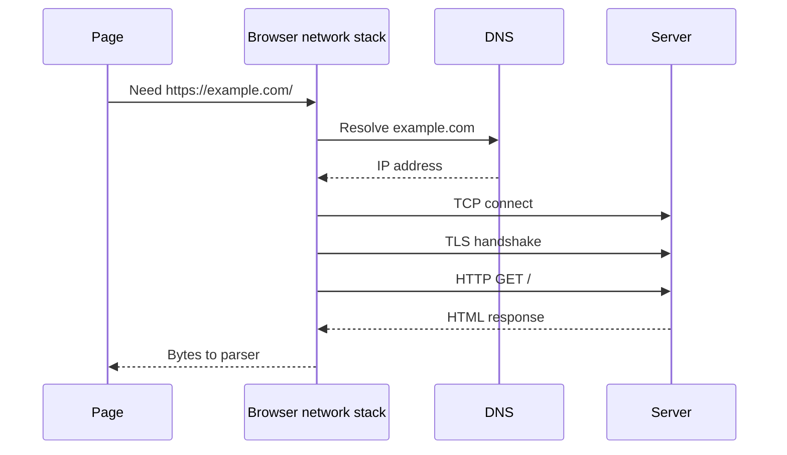
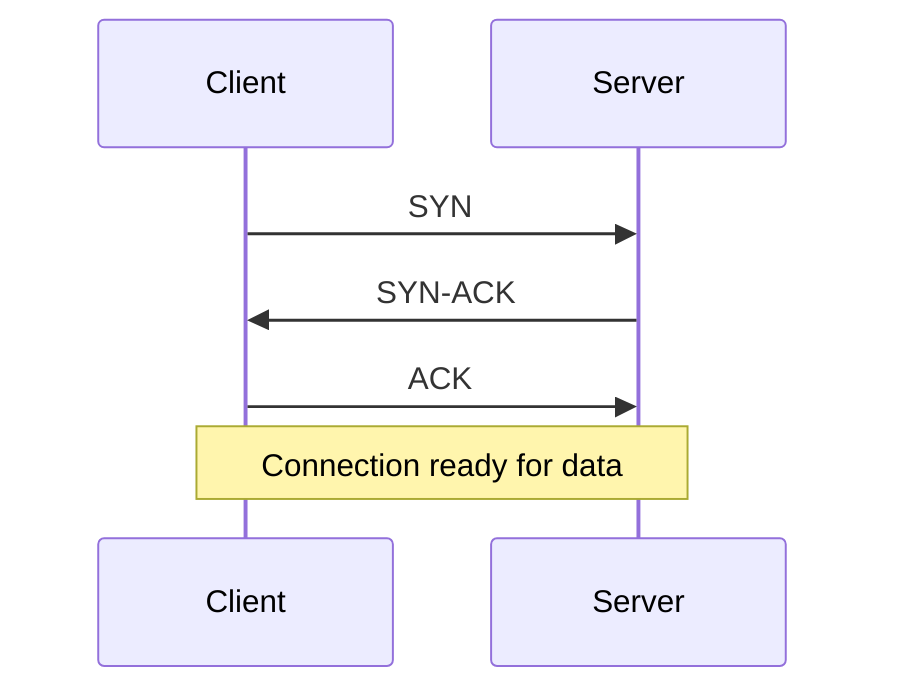
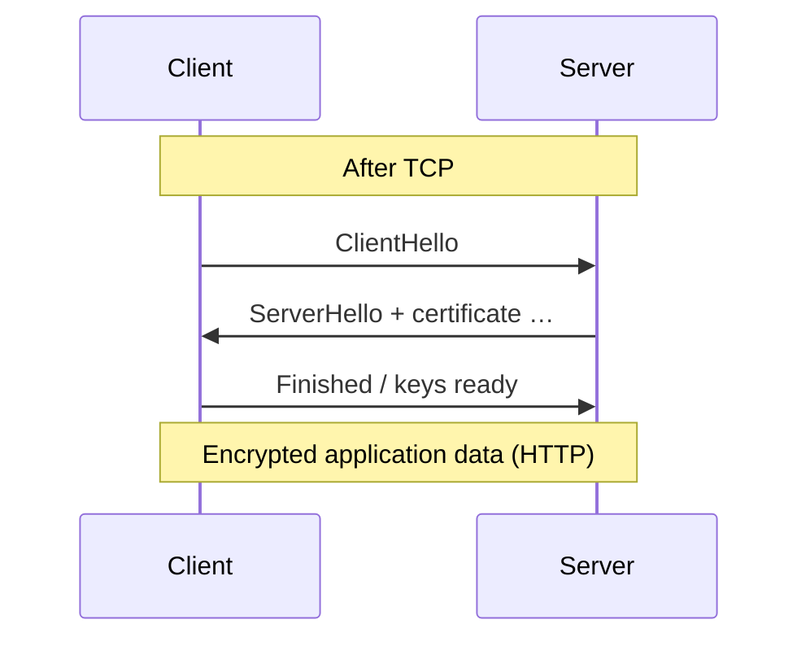
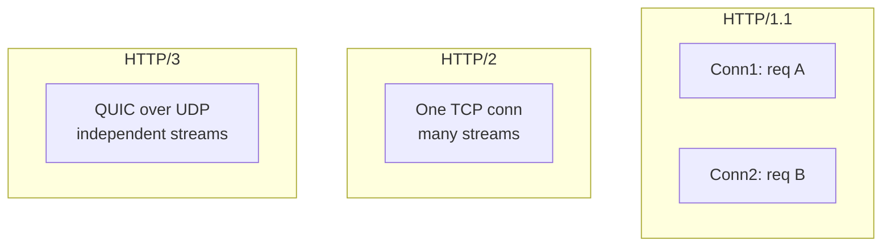
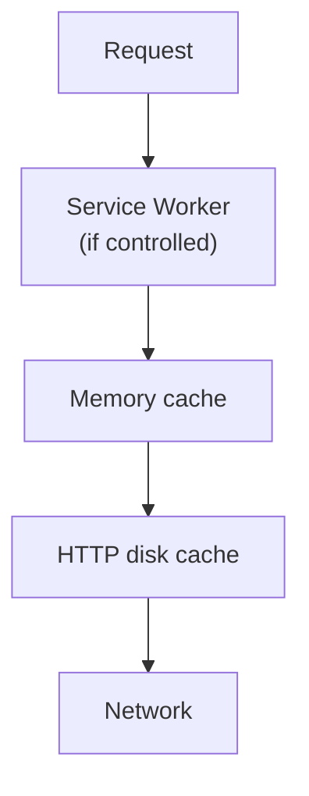
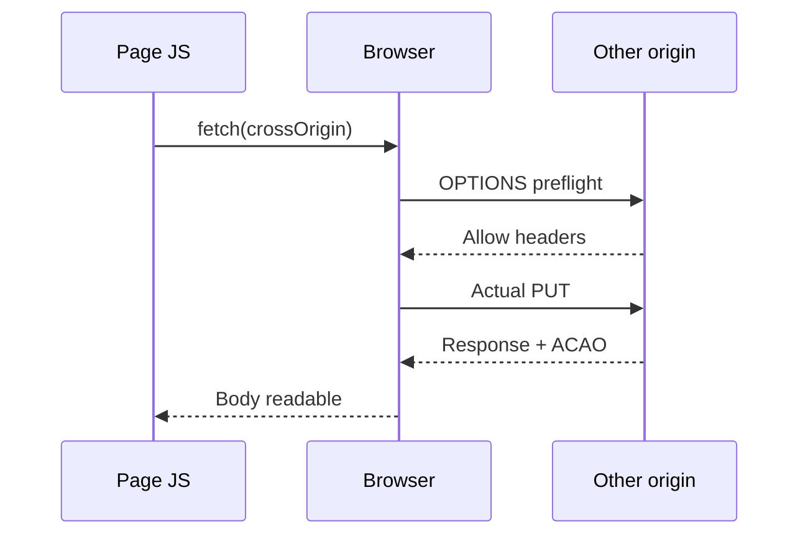

# Networking

This chapter teaches how a browser fetches a page and its resources from scratch. You do not need to already know DNS, TLS handshakes, HTTP caches, or CORS. By the end you should be able to walk **DNS → TCP → TLS → HTTP**, explain **caching and CORS**, read a **waterfall**, and say **what blocks first render**.

Related: [Architecture](/browser/01-architecture) · [Rendering Pipeline](/browser/02-rendering-pipeline) · [JS Security](/javascript/21-security) · [Browser Event Loop](/browser/03-event-loop)

---

## 1. The goal

When you navigate to `https://example.com`, the browser must:

1. Figure out **which server** to talk to
2. Open a **secure connection**
3. Send an **HTTP request** and read the response
4. Repeat for CSS, JS, images, fonts
5. Obey **security rules** (cookies, CORS, mixed content)
6. Prefer **cache** when allowed so repeat visits are faster



---

## 2. URLs and origins — before any packets

### 2.1 Anatomy of a URL

```text
https://www.example.com:443/path/page.html?q=1#section
|       |               |   |              |    |
scheme  host            port path          query fragment
```

- **Scheme** — `https` means use TLS + HTTP semantics over a secure channel
- **Host** — name to resolve (or already an IP)
- **Port** — default 443 for https, 80 for http
- **Fragment** (`#...`) — not sent to the server; client-only

### 2.2 Origin (again, because networking cares)

Origin ≈ `scheme + host + port`. Many network security features key off origin. Deep security: [JS Security](/javascript/21-security).

---

## 3. DNS — names to addresses

### 3.1 Plain definition

**DNS (Domain Name System)** maps a hostname like `www.example.com` to one or more **IP addresses**.

Without DNS, you would type raw IPs. Humans use names; machines route to IPs.

### 3.2 Slow-motion lookup (simplified)

1. Browser checks its DNS cache
2. OS resolver cache
3. Query configured resolvers (ISP, 1.1.1.1, company DNS, …)
4. Resolver may recursively ask authoritative name servers
5. Answer: `www.example.com → 93.184.216.34` (example)


### 3.3 Cost

DNS adds **latency before** the first TCP packet. On mobile networks it can be noticeable. Hints like `dns-prefetch` / `preconnect` start this earlier (see §12).

---

## 4. TCP — reliable byte streams

### 4.1 Plain definition

**TCP** is a transport protocol that gives a **reliable, ordered byte stream** between two hosts (with retransmission on loss).

HTTP/1.1 and HTTP/2 typically ride on TCP. (HTTP/3 uses QUIC over UDP — §8.)

### 4.2 Handshake (teaching picture)

Classic TCP handshake:

1. Client → Server: SYN
2. Server → Client: SYN-ACK
3. Client → Server: ACK

That is roughly **one round trip** of delay (plus whatever else shares the path) before application data. **RTT** (round-trip time) is the time for a packet to go and a response to return — the currency of connection setup.



### 4.3 Why “many connections” used to matter

Opening a new TCP connection costs handshakes. Browsers reused connections (**keep-alive**) and, under HTTP/1.1, opened **several parallel connections per origin** (historically ~6) because one connection could only do one response at a time effectively (head-of-line issues).

---

## 5. TLS — encryption and authenticity

### 5.1 Plain definition

**TLS (Transport Layer Security)** sits on top of TCP (for HTTPS) and provides:

1. **Encryption** — eavesdroppers cannot read payloads
2. **Integrity** — tampering is detected
3. **Authentication** — certificate proves you are (likely) talking to the real `example.com`

`https://` means “HTTP over TLS” in everyday speech.

### 5.2 Handshake cost

TLS needs extra round trips (TLS 1.3 is better than older TLS 1.2). Session **resumption** can make repeat connections cheaper. There is also **0-RTT** data in TLS 1.3 with replay caveats — know it exists; do not hand-wave security details unless asked.



### 5.3 Certificates in one sentence

The server presents a **certificate** chain that a trusted Certificate Authority signed; the client checks hostname + validity + trust anchors.

---

## 6. HTTP — request and response

### 6.1 Plain definition

**HTTP** is the application protocol for fetching resources: client sends a **request**, server returns a **response** with a status code and body.

```http
GET /index.html HTTP/1.1
Host: example.com
Accept: text/html
```

```http
HTTP/1.1 200 OK
Content-Type: text/html; charset=utf-8
Content-Length: 1234
Cache-Control: max-age=60

<!doctype html>...
```

### 6.2 Methods you meet constantly

| Method | Idea |
| --- | --- |
| `GET` | Read a resource |
| `POST` | Submit data / non-idempotent action |
| `PUT` / `PATCH` | Update |
| `DELETE` | Delete |
| `OPTIONS` | CORS preflight (see §11) |
| `HEAD` | Headers only |

### 6.3 Important status codes

| Code | Meaning |
| --- | --- |
| 200 | OK |
| 301 / 302 / 307 / 308 | Redirects |
| 304 | Not Modified (cache revalidation success) |
| 400 | Bad request |
| 401 / 403 | Auth / forbidden |
| 404 | Not found |
| 500 | Server error |

### 6.4 `fetch` in the page

```ts
const res = await fetch("/api/user", {
  method: "GET",
  credentials: "same-origin",
  headers: { Accept: "application/json" },
})

if (!res.ok) {
  throw new Error(`HTTP ${res.status}`)
}

const data: unknown = await res.json()
```

`fetch` does not throw on 404 by default — check `res.ok` / `status`.

---

## 7. HTTP/1.1 vs HTTP/2 vs HTTP/3

### 7.1 HTTP/1.1

- Text requests
- Parallelism via **multiple TCP connections** per origin
- **Head-of-line blocking** at the HTTP level: one slow response delays that connection’s queue

### 7.2 HTTP/2

- **Multiplexing**: many streams on **one** TCP connection
- Header compression (HPACK)
- Still suffers **TCP** head-of-line blocking: one lost packet stalls all streams on that connection

### 7.3 HTTP/3 (QUIC)

- Runs over **UDP** with QUIC
- Streams are more independent under packet loss
- Connection migration benefits (e.g. network changes) in some cases



Interview sentence:

> H2 multiplexes over TCP; H3 multiplexes over QUIC to reduce TCP-level HOL blocking.

---

## 8. Cookies and credentials (network angle)

When the browser sends a request to an origin, it may attach **Cookie** headers according to policy (Domain, Path, Secure, HttpOnly, SameSite).

```http
GET /dashboard HTTP/1.1
Host: example.com
Cookie: session=abc; theme=dark
```

- **HttpOnly** — not readable from `document.cookie` (helps against XSS stealing session)
- **Secure** — only on HTTPS
- **SameSite** — limits cross-site sending (CSRF mitigation)

Page JS does not manually glue cookies for same-origin navigations; the network stack does. Architecture reminder: cookie policy is enforced with privileged browser/network code ([Architecture](/browser/01-architecture)).

```ts
await fetch("/api", { credentials: "include" }) // allow cross-origin cookies when CORS allows
```

---

## 9. Caching — avoid the network when safe

### 9.1 Why cache

Every RTT and byte costs time. If the resource did not change, reuse a stored copy.

### 9.2 Layers (practical)



Exact order can vary by browser; the teaching point is **multiple layers** exist before a cold network hit.

### 9.3 `Cache-Control` (learn these tokens)

```http
Cache-Control: max-age=31536000, immutable
```

| Directive | Idea |
| --- | --- |
| `max-age=N` | Fresh for N seconds |
| `s-maxage=N` | Freshness for shared caches (CDN) |
| `no-store` | Do not store |
| `no-cache` | Can store but must revalidate before use |
| `private` | Browser may cache; not shared CDN |
| `public` | OK for shared caches |
| `immutable` | Won’t change while fresh (great for hashed assets) |
| `stale-while-revalidate` | Show stale while refreshing in background |

### 9.4 Validators: `ETag` / `Last-Modified`

When stale, browser can send:

```http
If-None-Match: "v123"
```

Server may answer `304 Not Modified` with no body — cheaper than re-downloading.

### 9.5 Heuristic caching

Without explicit headers, browsers may guess. Prefer **explicit** `Cache-Control` in production.

### 9.6 Fingerprinted assets pattern

```text
/app.9f3a21.js  →  Cache-Control: max-age=31536000, immutable
/index.html     →  Cache-Control: no-cache  (or short max-age)
```

HTML stays revalidatable; hashed JS/CSS can be cached “forever.”

```ts
await fetch("/app.9f3a21.js", { cache: "force-cache" })
```

---

## 10. What blocks rendering?

Connect to [Rendering Pipeline](/browser/02-rendering-pipeline).

### 10.1 HTML is the root

Until some HTML arrives, there is nothing to parse. **TTFB** (time to first byte) of the document matters.

### 10.2 CSS in the critical path

Stylesheets linked in the head generally **block first paint** to avoid unstyled flashes.

```html
<head>
  <link rel="stylesheet" href="/app.css" />
</head>
```

### 10.3 Scripts

```html
<!-- Blocks HTML parser until downloaded + executed -->
<script src="/big.js"></script>

<!-- Downloads in parallel; runs after document parsed; order preserved -->
<script defer src="/app.js"></script>

<!-- Downloads in parallel; runs when ready; order not guaranteed vs other async -->
<script async src="/analytics.js"></script>

<!-- Module scripts behave as deferred by default -->
<script type="module" src="/main.js"></script>
```

Parser-blocking scripts delay discovery of later resources unless the preload scanner already saw them.

### 10.4 Fonts and images

- Fonts can delay text rendering (FOIT) or cause swaps (FOUT) and layout shift
- Large images affect LCP; without dimensions they shift layout when loaded

```html
<link
  rel="preload"
  as="font"
  href="/display.woff2"
  type="font/woff2"
  crossorigin
/>

```

---

## 11. CORS — cross-origin reads from JS

### 11.1 The problem

By default, the Same-Origin Policy prevents page JS from reading responses from other origins — even if the network request succeeded.

You *may* load a cross-origin image in `` (no JS pixel read without tainting rules). You may *not* freely `fetch` another origin’s JSON without permission.

### 11.2 Plain definition

**CORS (Cross-Origin Resource Sharing)** is a header-based protocol where the **server** opts in to allowing cross-origin web pages to read responses (and send certain credentialed requests).

### 11.3 Simple request (simplified)

Browser sends `Origin: https://app.example`.

Server responds with:

```http
Access-Control-Allow-Origin: https://app.example
```

If the ACAO header permits the requesting origin (or `*` for non-credentialed), JS can read the body.

### 11.4 Preflight

For “non-simple” requests (custom headers, certain methods, etc.), the browser first sends:

```http
OPTIONS /api HTTP/1.1
Origin: https://app.example
Access-Control-Request-Method: PUT
Access-Control-Request-Headers: Content-Type
```

Server must allow; then the real request proceeds.



### 11.5 Common failure mode

DevTools shows a network **200**, but JS throws a CORS error. Why? The browser **hid** the body from JS because ACAO was missing/wrong. The request may still have hit the server.

```ts
try {
  const res = await fetch("https://api.other.com/data")
  console.log(await res.text())
} catch (e) {
  // Often TypeError from CORS / network opaque failure
  console.error(e)
}
```

More threat modeling: [JS Security](/javascript/21-security).

---

## 12. Resource hints — start early

```html
<link rel="preconnect" href="https://cdn.example.com" crossorigin />
<link rel="dns-prefetch" href="https://analytics.example.com" />
<link rel="preload" as="style" href="/critical.css" />
<link rel="modulepreload" href="/app.js" />
<link rel="prefetch" href="/next-page.js" />
```

| Hint | What it starts early |
| --- | --- |
| `dns-prefetch` | DNS only |
| `preconnect` | DNS + TCP + TLS |
| `preload` | High-priority fetch for **current** navigation |
| `modulepreload` | JS module and dependency graph |
| `prefetch` | Likely **future** navigation (low priority) |

Do not preload everything — contention can hurt the critical path.

---

## 13. Reading a waterfall

A **waterfall** chart (Network panel) shows each resource as a bar over time.

### 13.1 What to look for

1. **Document** TTFB — server/CDN slowness
2. **Blocking CSS** width — render delay
3. **Long tails** on JS — parse/eval later shows in Performance, but download shows here
4. **Queueing** — waiting for connection slot (HTTP/1.1)
5. **Chains** — JS discovers API URL late → late request (avoid with earlier discovery / SSR / preload)
6. **Redirects** — extra RTTs before HTML

```mermaid
gantt
  title Simplified waterfall
  dateFormat X
  axisFormat %s
  section Document
  DNS/TCP/TLS     :0, 3
  HTML download   :3, 5
  section CSS
  app.css         :4, 7
  section JS
  app.js          :5, 9
  section API
  /api/user       :9, 12
```



### 13.2 Critical path story

Bad chain:

1. HTML downloads
2. JS at end of body downloads
3. JS runs and *then* requests CSS theme or hero data

Better:

1. HTML includes needed data or preload hints
2. CSS in head
3. JS deferred; API starts earlier via markup or `preload`

---

## 14. Compression and content encoding

Servers often send `Content-Encoding: br` (Brotli) or `gzip`. Browser decompresses transparently.

```http
Accept-Encoding: gzip, deflate, br
Content-Encoding: br
```

Smaller bytes ⇒ faster download on bandwidth-limited links. CPU trades off slightly for decompress.

---

## 15. Mixed content

An HTTPS page loading `http://` active resources (scripts) is **mixed content** and gets blocked. Images may be upgraded or blocked depending on type/browser policy.

```html
<!-- Bad on an https page -->
<script src="http://evil.example/x.js"></script>
```

Always serve active assets over HTTPS.

---

## 16. Service Workers — programmable network

A **Service Worker** can intercept fetches and implement offline caches.

```ts
// sw.js (teaching sketch)
self.addEventListener("fetch", (event: FetchEvent) => {
  event.respondWith(
    caches.match(event.request).then((cached) => {
      return cached ?? fetch(event.request)
    }),
  )
})
```

This changes waterfalls and cache behavior dramatically. Treat SW as an application-level network proxy with careful versioning.

---

## 17. Worked example — first visit vs repeat visit

**First visit to `https://shop.example`:**

1. DNS lookup for `shop.example`
2. TCP + TLS to CDN/edge
3. `GET /` → HTML (`Cache-Control: no-cache`)
4. Discover `/styles.abc123.css`, `/app.def456.js`
5. Parallel fetch on H2 streams
6. CSS blocks first paint until ready
7. Deferred JS runs after parse
8. API `GET /api/cart` with cookies

**Repeat visit:**

1. DNS/TLS maybe resumed/faster
2. HTML revalidated (`304` or short fresh)
3. Fingerprinted CSS/JS served from disk cache instantly (`immutable`)

---

## 18. Minimal checklist for faster pages

1. Reduce document TTFB (CDN, edge, efficient backend)
2. Minimize blocking CSS; defer non-critical JS
3. Use HTTP/2 or HTTP/3 end-to-end
4. Fingerprint + long-cache static assets
5. Preconnect to critical third-party origins sparingly
6. Size images; set dimensions; consider modern formats
7. Avoid late-discovered critical requests
8. Measure with Network + Performance panels, not vibes

---

## Interview Questions

### Q1. Walk through what happens when you request `https://example.com`.
**Expected:** DNS → TCP → TLS → HTTP GET → response bytes → parse; then subresources repeat connection reuse/H2 streams as applicable.  
**Common wrong:** “The browser just downloads HTML and paints; networking is one step.”  
**Follow-ups:** Where do cookies get attached?

### Q2. HTTP/1.1 vs HTTP/2 vs HTTP/3?
**Expected:** H1 multiple connections / HOL; H2 multiplexed streams on TCP (TCP HOL remains); H3 QUIC/UDP with better loss isolation.  
**Common wrong:** “HTTP/2 removed all head-of-line blocking.”  
**Follow-ups:** Why did browsers limit connections per origin on H1?

### Q3. What is CORS and why can status be 200 while JS fails?
**Expected:** Server opt-in for cross-origin response reads; browser hides body from JS if ACAO invalid — network may still succeed.  
**Common wrong:** “CORS is a server firewall blocking the TCP connection.”  
**Follow-ups:** When is a preflight sent?

### Q4. How does HTTP caching work?
**Expected:** Freshness via `Cache-Control`/`max-age`; revalidation via ETag/Last-Modified → 304; layered caches including SW.  
**Common wrong:** “Browsers never cache without Service Workers.”  
**Follow-ups:** Why fingerprint filenames?

### Q5. What blocks first paint?
**Expected:** Document TTFB, critical CSS, parser-blocking scripts, sometimes fonts.  
**Common wrong:** “Only JavaScript blocks rendering.”  
**Follow-ups:** `defer` vs `async` vs `type=module`?

### Q6. How do you read a waterfall?
**Expected:** Identify long TTFB, blocking resources, connection queueing, request chains, redirects.  
**Common wrong:** “The longest bar is always the root cause” (maybe dependency chain).  
**Follow-ups:** How do resource hints change the chart?

## Common Mistakes

- Treating CORS errors as “backend is down” without checking ACAO.
- Caching `index.html` forever (users stick on old asset references).
- Preloading too many assets and starving the critical ones.
- Blocking the parser with huge sync scripts in `<head>`.
- Forgetting `crossorigin` on font preloads (fonts use CORS mode).
- Assuming H2 alone fixes a chatty request waterfall (still too many bytes/RTTs).

## Trade-offs / Production Notes

- CDNs cut latency but need correct cache keying (query strings, `Vary`).
- `preconnect` to many origins can waste sockets/battery — prioritize.
- Security headers (CSP, HSTS) interact with what can load — see [JS Security](/javascript/21-security).
- Measure field data (CrUX / RUM) as well as lab waterfalls.
- Related: [Architecture](/browser/01-architecture) · [Rendering Pipeline](/browser/02-rendering-pipeline) · [JS Security](/javascript/21-security) · [JS Event Loop](/javascript/10-event-loop)
