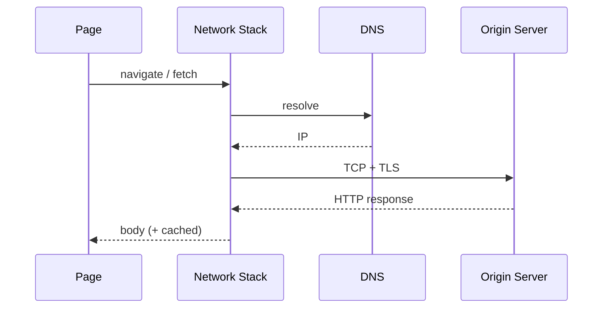
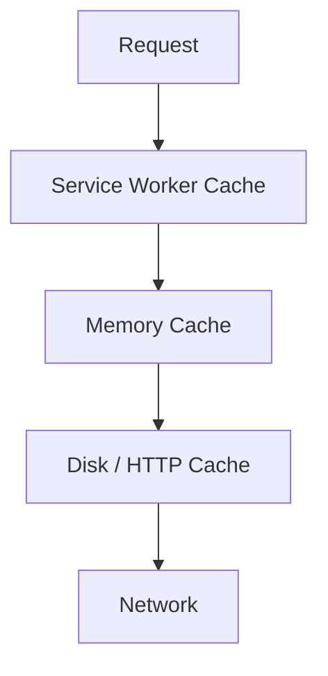
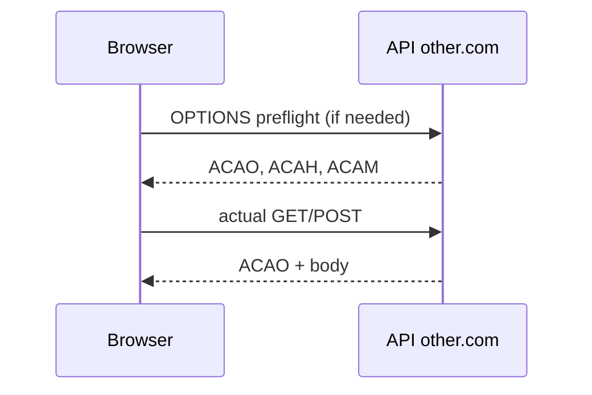

# Networking

Browser networking is a stack: DNS → TCP/TLS → HTTP → cache → CORS → application. Interviews mix protocol knowledge with **what the browser parallelizes**, **what blocks rendering**, and **how to read a waterfall**.

Related: [Architecture](/browser/01-architecture) · [Security](/browser/06-security) · [JS Performance](/javascript/22-performance) · [Next.js caching](/nextjs/10-caching)

## Connection lifecycle



| Step | Cost drivers | Mitigations |
| --- | --- | --- |
| DNS | Lookup latency | `dns-prefetch`, connection reuse, DoH quirks |
| TCP | Handshake RTT | Keep-alive, HTTP/2+/3 multiplexing |
| TLS | Extra RTTs | TLS1.3, session resumption, 0-RTT caveats |
| TTFB | Server + route | CDN, edge cache, early hints |
| Download | Bandwidth, size | Compression, Brotli, code-split |

**HTTP/1.1:** ~6 connections per origin; head-of-line blocking at connection level.  
**HTTP/2:** multiplexed streams on one connection; still TCP HOL blocking.  
**HTTP/3 (QUIC):** UDP-based; stream independence under loss.

## Critical rendering path & resource hints

```html
<link rel="preconnect" href="https://cdn.example.com" crossorigin />
<link rel="dns-prefetch" href="https://analytics.example.com" />
<link rel="preload" as="font" href="/f.woff2" type="font/woff2" crossorigin />
<link rel="modulepreload" href="/app.js" />
```

| Hint | Effect |
| --- | --- |
| `preconnect` | DNS + TCP + TLS early |
| `dns-prefetch` | DNS only (cheaper, weaker) |
| `preload` | High-priority fetch for current navigation |
| `prefetch` | Future navigation (low priority) |
| `modulepreload` | JS module graph |

Scripts: `defer` (order preserved, after parse), `async` (run when ready), `type="module"` deferred by default. Blocking classic scripts without async/defer stop HTML parser ([Architecture](/browser/01-architecture)).

## Cache hierarchy



**Heuristic vs explicit caching:** Prefer `Cache-Control` (`max-age`, `s-maxage`, `no-store`, `private`, `immutable`, `stale-while-revalidate`). `ETag` / `Last-Modified` enable conditional revalidation (`304`).

```ts
// Interpreting fetch cache modes
async function load(url: string): Promise<Response> {
  return fetch(url, {
    cache: 'force-cache', // prefer HTTP cache; still subject to SW
    credentials: 'same-origin',
  })
}

// Cache API (Service Worker / window)
async function putAsset(req: Request, res: Response): Promise<void> {
  const cache = await caches.open('static-v1')
  await cache.put(req, res.clone())
}
```

**bfcache (back/forward cache):** Entire page freeze including JS heap. Blocked by `unload` handlers, `Cache-Control: no-store` in some cases, open WebSockets (engine-dependent), etc. Huge navigation win.

## CORS

Browsers enforce CORS on cross-origin **XHR/fetch** from scripts (not on simple top-level navigations or ``/`<script>` tags — those use different rules).



Simple requests skip preflight (GET/POST/HEAD + safelisted headers/Content-Types). Custom headers, JSON `Content-Type`, PATCH → preflight.

```ts
// Server must allow credentialed CORS explicitly — no wildcard *
// Access-Control-Allow-Origin: https://app.example.com
// Access-Control-Allow-Credentials: true
await fetch('https://api.example.com/me', {
  credentials: 'include',
  headers: { 'Content-Type': 'application/json' },
})
```

Cross-link: cookies / CSRF in [Security](/browser/06-security).

## Cookies on the wire

`Set-Cookie` attributes: `Secure`, `HttpOnly`, `SameSite=Lax|Strict|None`, `Partitioned` (CHIPS), `Domain`, `Path`, `Max-Age`.

`SameSite=Lax` (default-ish modern): cookies sent on top-level GET navigations cross-site, not on cross-site POSTs / most subresource requests — CSRF mitigation.

## Compression & content

| Mechanism | Notes |
| --- | --- |
| gzip / br | `Content-Encoding`; Brotli better for text |
| zstd | Emerging support |
| Image formats | AVIF/WebP; responsive `srcset` |
| Streaming | `Transfer-Encoding: chunked`; fetch ReadableStream |

```ts
async function readStream(url: string): Promise<void> {
  const res = await fetch(url)
  if (!res.body) return
  const reader = res.body.getReader()
  const dec = new TextDecoder()
  for (;;) {
    const { done, value } = await reader.read()
    if (done) break
    console.log(dec.decode(value, { stream: true }))
  }
}
```

## Interview Questions

**Q1. HTTP/2 vs HTTP/3?**  
Both multiplex. H2 over TCP suffers head-of-line blocking under packet loss; H3/QUIC isolates streams. H3 also merges crypto+transport handshake.

**Q2. When does a CORS preflight fire?**  
Non-simple method/headers/content-type. Preflight is an `OPTIONS` with `Access-Control-Request-*`. Failure → browser hides body from JS (opaque error).

**Q3. `preload` vs `prefetch`?**  
`preload` for current page critical resources; `prefetch` for likely next navigation. Misusing preload wastes bandwidth and contention.

**Q4. Why is my disk cache ignored?**  
`no-store`, varying cookies (`Vary: Cookie`), service worker `network-first`, opaque responses, or DevTools “disable cache”.

**Q5. How do Early Hints (103) help?**  
Server suggests preloads before final response headers — browser can start CSS/font fetches during TTFB wait.

## Common Mistakes

- Wildcard `ACAO: *` with `credentials: include` (illegal; browser rejects).
- Putting auth tokens only in LS and forgetting CSRF/XSS ([Security](/browser/06-security)).
- Blocking CSS in the middle of `<body>` thrashing FOUC/waterfall.
- Mega-bundles without HTTP cache fingerprinting (`app.js?v=1` vs hashed filenames).
- Assuming CDN caches personalized `Cache-Control: private` responses at edge.

## Trade-offs

| Choice | Win | Cost |
| --- | --- | --- |
| Many small files H1 | Parallelism | Connection overhead |
| Single bundle H2/H3 | Multiplex-friendly | Cache invalidation blast radius |
| Aggressive `max-age` + hash | Perf | Deploy complexity |
| Service Worker | Offline, control | Complexity, stale bugs |
| `credentials: include` everywhere | Simple sessions | CSRF surface, CORS hardness |

**Senior takeaway:** Read waterfalls as **contention + critical path**, not just “make it faster.” Name protocol, cache layer, and whether the request is render-blocking.

## Deep dive — priority & contention

Browsers assign fetch priorities (H2/H3 weight / Chrome’s Priority header experiments). Competing requests: LCP image should be high; analytics low. Too many preloads starve each other.

```ts
await fetch('/api/important', { priority: 'high' } as RequestInit)
await fetch('/api/analytics', { priority: 'low' } as RequestInit)
```

## Deep dive — cookies, redirects, and CORS

Cross-origin redirects on credentialed fetches are tightly restricted. Opaque redirects in `no-cors` mode yield opaque responses (status 0, body locked) — useful for cache warmups, useless for reading JSON.

```ts
const res = await fetch('https://cdn.example.com/pixel', { mode: 'no-cors' })
console.log(res.type) // 'opaque'
```

## Deep dive — compression dictionaries & HPACK/QPACK

H2 HPACK / H3 QPACK compress headers via tables — repeated headers are cheap. Huge unique cookies defeat this. Prefer small cookie jars ([Storage](/browser/08-storage)).

## Extra Q&A

**Q6. What is an origin-keyed agent cluster?**  
Isolation key for certain APIs (SAB, timers precision) — related to COOP/COEP.

**Q7. `keepalive` fetch?**  
Allows request to outlive page for analytics beacons — size limits apply.

**Q8. Why HTTPS everywhere?**  
Secure cookies, service workers, many powerful APIs require secure contexts.

**Q9. CDN `s-maxage` vs `max-age`?**  
`s-maxage` for shared caches; `max-age` for browsers. Pair with `stale-while-revalidate`.

**Q10. WebSocket vs HTTP/2 streams?**  
WS is framed bidirectional after upgrade/fetch; different auth/cookie behaviors; still subject to mixed content rules.


## Worked example — “API CORS fails only with cookies”

`credentials: 'include'` requires exact `Access-Control-Allow-Origin` (not `*`) + `Allow-Credentials: true`. Preflight must allow credential mode. Fix server headers; verify in Network → OPTIONS.

## Resource Timing API

```ts
const [res] = performance.getEntriesByName('https://api.example.com/v1') as PerformanceResourceTiming[]
if (res) {
  console.log({
    dns: res.domainLookupEnd - res.domainLookupStart,
    tcp: res.connectEnd - res.connectStart,
    ttfb: res.responseStart - res.requestStart,
    download: res.responseEnd - res.responseStart,
  })
}
```

## HTTP cache + React Query

Browser HTTP cache ≠ React Query cache — two layers. Align `staleTime` with `Cache-Control` or you’ll double-fetch ([React Query](/react/06-react-query)).

## Glossary

| Term | Definition |
| --- | --- |
| TTFB | Time to first byte |
| HOL blocking | Head-of-line stall |
| Preflight | CORS OPTIONS check |
| Fingerprinted URL | Content hash in filename for immutable cache |
| Early Hints | 103 preload suggestions |
