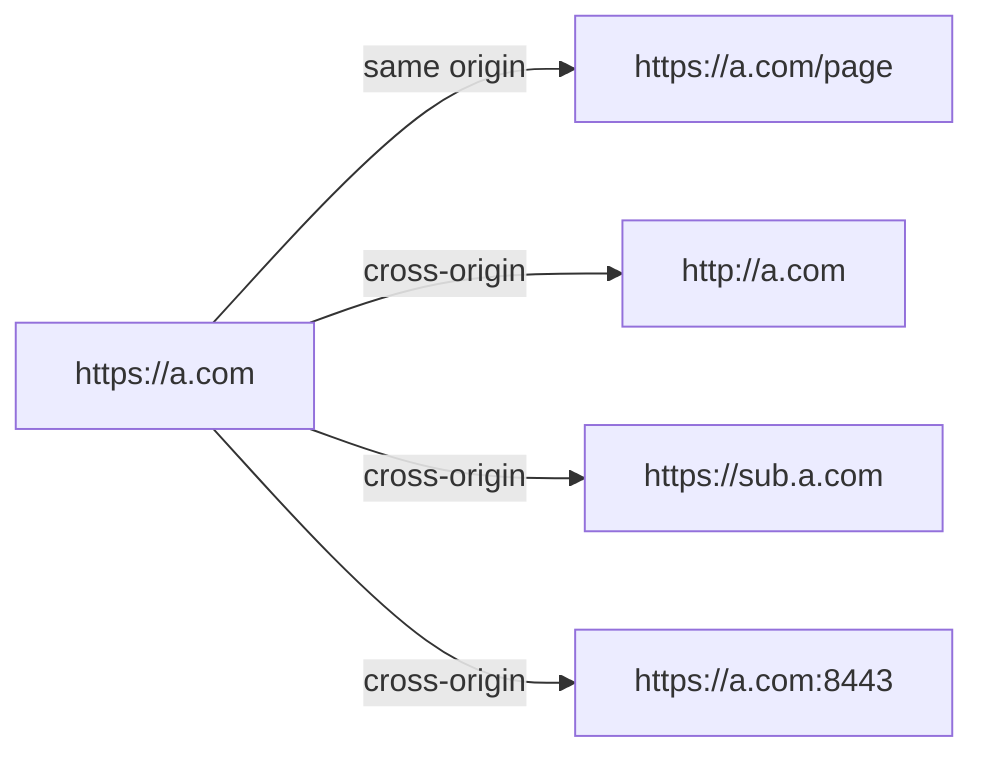
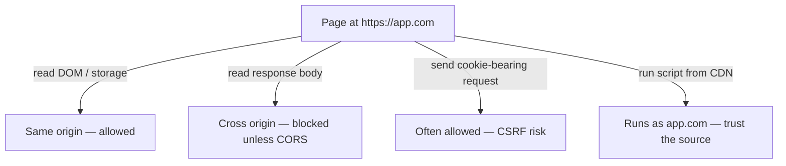
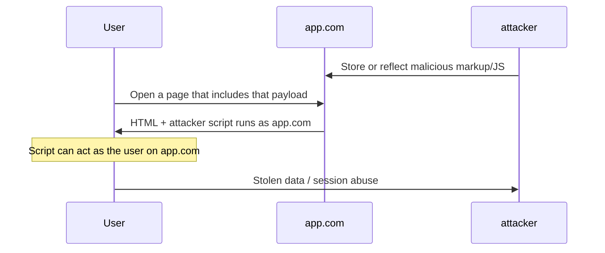
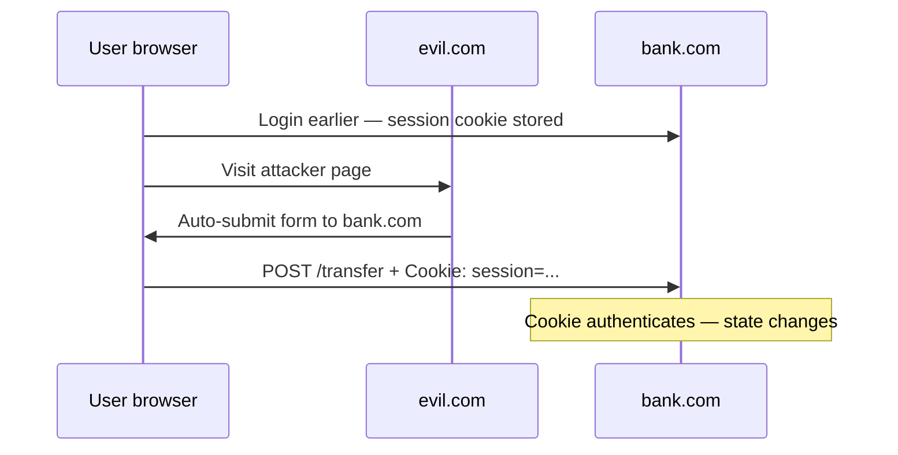
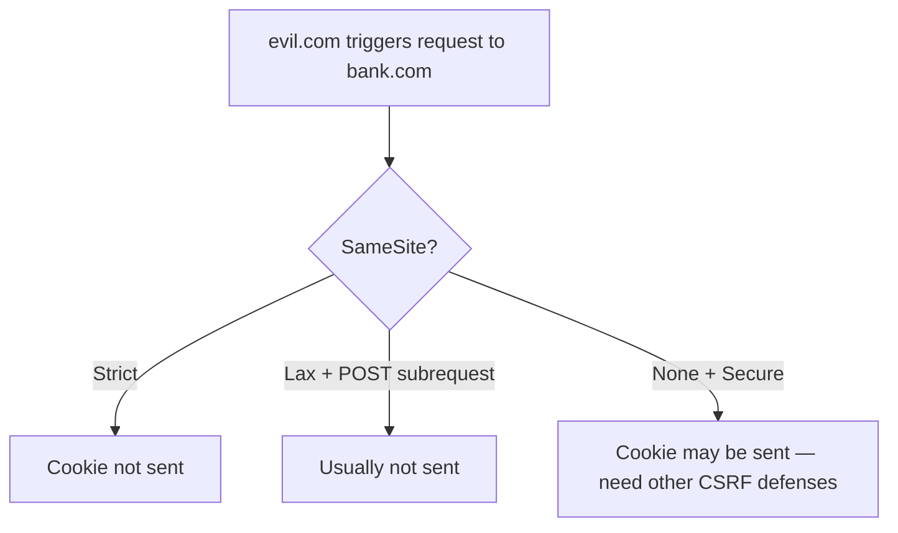
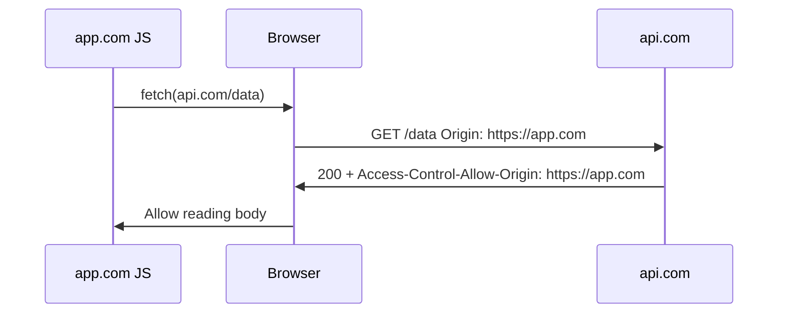
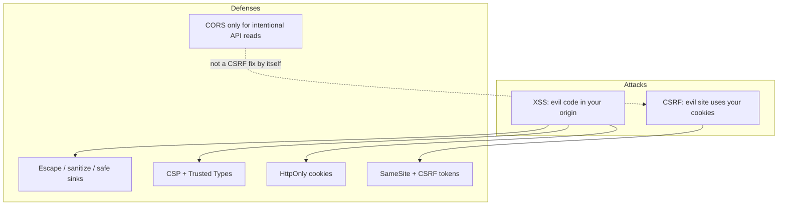

# Browser Security

This chapter teaches browser security from scratch. You do not need to already know Same-Origin Policy, XSS, CSRF, CSP, or CORS. By the end you should be able to explain **what an origin is**, **what the browser isolates by default**, **how common attacks abuse trust**, and **which defense blocks which attack**.

Related: [JS Security](/javascript/21-security) · [Networking](/browser/05-networking) · [Storage](/browser/08-storage) · [Node Security](/node/12-security)

---

## 1. The problem this chapter solves

A browser loads code from many places: your site, CDNs, ads, user comments rendered as HTML, third-party widgets. Some of that code is **yours**. Some of it is **not**. Security in the browser is mostly about answering:

> “Who is allowed to **read** what, and who is allowed to **act as** the user?”

Two different failures look similar in demos but need different fixes:

| Failure | Plain English | Classic name |
| --- | --- | --- |
| Attacker’s script runs **inside** your page | They can read the page’s secrets and act as the user in that tab | **XSS** |
| Attacker’s **site** tricks the browser into sending a request **with your cookies** | Your session authenticates a request you did not mean to make | **CSRF** |

This chapter always does **attack first, then defense**. Defenses without the attack story become buzzwords.

---

## 2. What is an origin?

An **origin** is the browser’s unit of “who you are talking to.” It is three parts glued together:

```text
origin = scheme + host + port
```

Examples:

| URL | Origin |
| --- | --- |
| `https://app.example.com/dashboard` | `https://app.example.com` (port 443 implied) |
| `http://app.example.com/dashboard` | `http://app.example.com` (port 80) — **different** (scheme) |
| `https://app.example.com:8443/` | `https://app.example.com:8443` — **different** (port) |
| `https://api.example.com/` | `https://api.example.com` — **different** (host) |
| `https://evil.com/` | completely different site |

Plain language:

> Two pages are **same-origin** only if scheme, host, and port all match. Everything else is **cross-origin**.



You will hear “site” in cookie rules (`SameSite`). **Site** is a looser idea than origin (roughly registrable domain + scheme). For interviews, start with **origin**; bring up **site** when talking about cookies.

---

## 3. Same-Origin Policy (SOP) — what the browser isolates

### 3.1 The everyday rule

**Same-Origin Policy** is the browser’s default isolation rule:

> Code running in page A may freely read and manipulate documents and storage belonging to **A’s origin**. It may **not** freely read documents / storage / responses belonging to another origin.

Without SOP, any website you visit could open your bank in a hidden iframe and read the balance from the DOM.

### 3.2 What SOP blocks (typical mental list)

From script on `https://evil.com`:

- Reading `document` of `https://bank.com` in an iframe
- Reading `localStorage` / cookies of `https://bank.com` via JS APIs for that origin
- Reading the **body** of a `fetch`/`XHR` response from `https://bank.com` (unless CORS allows it)

### 3.3 What SOP does *not* block

This is where interviews go deeper. SOP is **not** a firewall that stops every cross-origin action:

| Action | Allowed by default? | Why it matters |
| --- | --- | --- |
| Load a cross-origin `<script src="...">` | Yes | Script runs with **your page’s** privileges — XSS if that script is evil |
| Load cross-origin images, CSS, fonts (with caveats) | Often yes | Tracking pixels, font leakage, etc. |
| Navigate the browser to another origin | Yes | Links and redirects are fine |
| Send a form POST / some requests to another origin | Yes | Cookies may attach → **CSRF** |
| Embed another origin in an iframe | Often yes | You usually cannot **read** it |



**Interview soundbite:** SOP protects **reads** of cross-origin data more than it protects **sends**. CSRF exists because sends still happen.

---

## 4. XSS — attacker code runs as your site

### 4.1 The attack, from zero

**Cross-Site Scripting (XSS)** means:

> The attacker finds a way to make **your origin** execute **their JavaScript**.

Once that happens, the browser treats the attacker’s code as **your app**. It can:

- Read the DOM (including text the user typed)
- Call your APIs as the logged-in user
- Steal non-`HttpOnly` cookies via `document.cookie`
- Rewrite the page (fake login forms)
- Exfiltrate data to the attacker’s server



XSS is not “the browser is broken.” It is “the app mixed untrusted data into a context that becomes code.”

### 4.2 Three types you must name

| Type | How the payload arrives | Classic example |
| --- | --- | --- |
| **Stored (persistent)** | Saved on the server, served to victims later | Comment: `<script>…</script>` stored in DB |
| **Reflected** | Comes in the request and is echoed in the response | Search: `?q=<script>…</script>` appears in HTML |
| **DOM-based** | Client-side JS takes untrusted input and writes it into a dangerous sink | `el.innerHTML = location.hash` |

Stored and reflected are often discussed as **server-rendered** injection. DOM-based is **entirely in the browser**: the server may never see the payload (it can live only in the hash).

### 4.3 Sources and sinks (the useful vocabulary)

A **source** is where untrusted data enters your client code:

- `location`, `location.hash`, `location.search`
- `document.referrer`
- `postMessage` data
- User-controlled fields you render
- Anything from the network that you treat as HTML

A **sink** is where that data becomes dangerous if not handled:

- `innerHTML`, `outerHTML`, `document.write`
- `eval`, `new Function`, `setTimeout("string")`
- `javascript:` URLs
- React `dangerouslySetInnerHTML`, Vue `v-html`
- Assigning untrusted strings into some URL / CSS contexts

```ts
// BAD — DOM XSS: untrusted string becomes HTML
function renderSearch(q: string) {
  document.getElementById("out")!.innerHTML = `Results for ${q}`
}

// If q is ``, the browser parses HTML and runs the handler.
```

```ts
// BETTER — treat as text
function renderSearchSafe(q: string) {
  document.getElementById("out")!.textContent = `Results for ${q}`
}
```

### 4.4 Walkthrough — reflected XSS

1. App has a search page that does: `Results for ${req.query.q}` inside HTML **without escaping**.
2. Attacker sends the victim a link: `https://app.com/search?q=<script src="https://evil/x.js"></script>`
3. Victim is logged into `app.com`, clicks the link.
4. Server reflects `q` into the page. Browser runs the script **as app.com**.
5. Script calls `/api/me` or reads storage and sends results to evil.

Defense at the reflection point: **encode for HTML context** (or use a template engine that auto-escapes). Defense in depth: CSP so even if HTML injects, inline/script sources are restricted.

### 4.5 Walkthrough — DOM XSS

```ts
// Fragile pattern
const name = new URLSearchParams(location.search).get("name") ?? ""
document.getElementById("hello")!.innerHTML = `Hello, ${name}`
```

No server bug required. The malicious string never needs to touch your backend if it only lives in the URL the client reads.

### 4.6 Defenses for XSS (layered)

1. **Escape / encode for the correct context** — HTML body ≠ HTML attribute ≠ JavaScript string ≠ URL ≠ CSS.
2. **Prefer safe sinks** — `textContent`, `createElement` + properties, framework default escaping.
3. **Sanitize HTML** only when rich HTML is required — use a maintained library (e.g. DOMPurify), not homemade regex.
4. **CSP** — reduce damage if injection still happens ([section 8](#8-content-security-policy-csp)).
5. **HttpOnly cookies** — session cookie not readable via `document.cookie` (XSS can still **use** the session by making requests).
6. **Trusted Types** (Chromium) — force dangerous sinks to accept only values created by a policy.

```ts
import DOMPurify from "dompurify"

function renderHtml(untrusted: string) {
  document.getElementById("out")!.innerHTML = DOMPurify.sanitize(untrusted)
}
```

**React note:** text children in JSX are escaped by default. Footguns remain: `dangerouslySetInnerHTML`, and `href={userInput}` if it can be `javascript:…`.

**HttpOnly honesty:** XSS that can call `fetch('/api/transfer')` from your origin still acts as the user. HttpOnly stops **cookie theft via JS**, not **session abuse via script**.

---

## 5. CSRF — attacker site rides your cookies

### 5.1 The attack, from zero

**Cross-Site Request Forgery (CSRF)** means:

> The user is logged into `bank.com`. The user visits `evil.com`. `evil.com` causes the browser to send a request to `bank.com`. The browser **attaches bank.com cookies**. `bank.com` thinks the user meant it.

The attacker does **not** need to read the response. Changing state (“transfer money”, “change email”) is enough.

```html
<!-- On evil.com — classic form CSRF -->
<form action="https://bank.com/transfer" method="POST">
  <input type="hidden" name="to" value="attacker" />
  <input type="hidden" name="amount" value="1000" />
</form>
<script>document.forms[0].submit()</script>
```



### 5.2 Why SOP does not stop this

SOP stops evil.com from **reading** bank.com’s response. The POST still goes out. CSRF is about **unwanted authenticated requests**, not about reading HTML.

### 5.3 When CSRF matters

CSRF is dangerous when:

1. Browser automatically sends credentials (cookies / sometimes HTTP auth)
2. Server uses **only** that cookie to authorize state-changing requests
3. Request can be triggered cross-site (form POST, some navigations, older cookie rules)

APIs that require a custom header (e.g. `Authorization: Bearer …` from memory, or `X-CSRF-Token`) are harder to forge from a simple HTML form, because cross-origin form posts cannot set arbitrary headers. That is one reason SPA + bearer-in-memory patterns change the CSRF story (they create other risks — token theft via XSS).

### 5.4 Defenses for CSRF

| Defense | Idea |
| --- | --- |
| **SameSite cookies** | Tell the browser when *not* to attach cookies on cross-site requests |
| **CSRF tokens** | Server embeds a secret in the real app; attacker site cannot read it (SOP) to include it |
| **Double-submit cookie** | Cookie value must also appear in a header/body the attacker cannot set easily |
| **Prefer non-simple requests + custom headers** for APIs | Cross-origin form cannot add `X-Requested-With` |
| **Re-auth for sensitive actions** | Password / 2FA for email or payout changes |

```ts
// Conceptual Express-style check
app.post("/transfer", (req, res) => {
  if (req.body.csrfToken !== req.session.csrfToken) {
    return res.status(403).send("CSRF")
  }
  // proceed
})
```

**SameSite** is the modern browser-side default people mention first — next section.

---

## 6. Cookies — attributes that change security

Cookies are small pieces of data the browser stores per cookie rules and **may attach** on later requests to matching URLs.

### 6.1 Important attributes in plain language

| Attribute | Meaning |
| --- | --- |
| `Secure` | Only send on HTTPS |
| `HttpOnly` | JavaScript cannot read via `document.cookie` |
| `Path` / `Domain` | Which URLs receive the cookie |
| `Max-Age` / `Expires` | Lifetime |
| `SameSite=Strict\|Lax\|None` | When to send on cross-site requests |

### 6.2 SameSite — CSRF’s main browser control

**SameSite** answers: “If this request is considered cross-site, should the cookie still be attached?”

| Value | Behavior (simplified) |
| --- | --- |
| `Strict` | Cookie not sent on cross-site requests (including many top-level navigations from elsewhere) |
| `Lax` | Cookie withheld on most cross-site **subrequests** (images, iframes, XHR); still sent on top-level GET navigations |
| `None` | Cross-site allowed — **requires** `Secure` |

```http
Set-Cookie: session=abc; Secure; HttpOnly; SameSite=Lax; Path=/
```



**Lax** is a common default for session cookies: good CSRF reduction for many POSTs, while still letting users arrive via links (top-level GET) already logged in.

**None** is needed for some cross-site embeds (e.g. third-party widgets that must authenticate). That reopens CSRF-shaped risks — pair with tokens / careful design.

### 6.3 Cookies vs “localStorage tokens” (preview)

Putting a session JWT in `localStorage` avoids classic cookie CSRF (browser won’t auto-attach it), but XSS can steal it easily. Cookie + `HttpOnly` + `SameSite` + CSRF strategy is a different trade-off. See [Storage](/browser/08-storage).

---

## 7. CORS — controlled exceptions to SOP for APIs

### 7.1 Why CORS exists

Frontends often live on `https://app.com` and APIs on `https://api.com` — **different origins**. SOP would block JS from reading API responses. **CORS (Cross-Origin Resource Sharing)** is the server saying:

> “I opt in: browsers may let **these** origins read **these** responses.”

CORS is enforced by the **browser**. A non-browser client (curl, server-to-server) is not bound by CORS.

### 7.2 Simple mental model

1. Page on origin A calls `fetch` to origin B.
2. Browser sends the request (sometimes with an extra **preflight** `OPTIONS` first).
3. B responds with headers like `Access-Control-Allow-Origin`.
4. If headers don’t permit A, JS on A **cannot read** the response (opaque failure from the page’s view).



### 7.3 Preflight — when the browser asks first

For many “non-simple” requests (custom headers like `Authorization`, certain content types, methods beyond simple GET/POST), the browser first sends:

```http
OPTIONS /data HTTP/1.1
Origin: https://app.com
Access-Control-Request-Method: PUT
Access-Control-Request-Headers: authorization,content-type
```

The server must answer with allowing headers. If not, the real request may never be sent from the browser’s CORS procedure perspective.

### 7.4 Credentials and CORS

If you need cookies on cross-origin XHR/fetch:

```ts
fetch("https://api.com/data", { credentials: "include" })
```

The server cannot use `Access-Control-Allow-Origin: *` with credentials. It must echo a **specific** origin and set `Access-Control-Allow-Credentials: true`.

### 7.5 CORS is not an authentication system

Misconception: “We enabled CORS, so we’re secure.”

CORS controls **which browser origins can read responses**. It does not replace authz checks. Attackers can still call your API from non-browser clients. Always authenticate/authorize on the server.

---

## 8. Content Security Policy (CSP)

### 8.1 What CSP is for

**CSP** is an HTTP response header (or meta tag) that tells the browser **which sources of script, style, image, etc. are allowed**.

Its best-known job: **reduce XSS damage**. Even if an attacker injects `<script>…</script>`, a strict CSP can refuse to execute it.

```http
Content-Security-Policy: default-src 'self'; script-src 'self'; object-src 'none'; base-uri 'self'
```

Plain language:

> “Only load scripts from my own origin. Don’t run inline scripts. Don’t load plugins.”

### 8.2 Directives you will see

| Directive | Controls |
| --- | --- |
| `default-src` | Fallback for other resource types |
| `script-src` | JavaScript sources |
| `style-src` | Stylesheets / inline styles |
| `img-src` | Images |
| `connect-src` | `fetch` / XHR / WebSocket targets |
| `frame-ancestors` | Who may embed you (clickjacking related) |
| `base-uri` | Restricts `<base href>` tricks |
| `object-src` | Plugins (`'none'` common) |

### 8.3 Inline scripts and nonces / hashes

XSS often injects **inline** script. A policy with only `'self'` blocks inline scripts — good for security, painful if your HTML relies on inline tags.

Modern approach: **nonces**

```http
Content-Security-Policy: script-src 'nonce-rAnd0m123'
```

```html
<script nonce="rAnd0m123">/* allowed */</script>
```

Attacker-injected `<script>alert(1)</script>` lacks the nonce → blocked.

Hashes allow specific inline content by sha256 of the script body.

Avoid `'unsafe-inline'` in `script-src` if you can — it weakens XSS protection badly.

### 8.4 CSP report-only

```http
Content-Security-Policy-Report-Only: script-src 'self'; report-uri /csp-report
```

Browser reports violations without blocking — useful while tightening a policy in production.

### 8.5 CSP is defense in depth

CSP does not replace escaping. A misconfigured CSP (too loose, or `'unsafe-inline'` everywhere) gives false comfort. Treat CSP as **belt**; output encoding / safe sinks are **suspenders**.

---

## 9. Putting the pieces together



| Threat | Primary thinking |
| --- | --- |
| XSS | Stop untrusted data becoming code; limit script sources |
| CSRF | Stop cross-site requests from riding cookies; prove intent |
| Data theft cross-origin | SOP + careful CORS |
| Cookie theft via JS | `HttpOnly` + XSS prevention |
| Embedding / clickjacking | `frame-ancestors` / `X-Frame-Options` |

---

## 11. Threat-model table you can redraw on a whiteboard

| Asset | Threat | Primary controls |
| --- | --- | --- |
| Session | Theft via XSS | HttpOnly; short TTL; XSS prevention; CSP |
| Session | Abuse via CSRF | SameSite; CSRF token; re-auth |
| User HTML fields | Stored XSS | Encode/sanitize; CSP |
| API JSON | Broken authz | Server checks — CORS won’t save you |
| Third-party script | Supply chain = XSS | Minimize; SRI; iframe sandbox; CSP |
| Embed on other sites | Clickjacking | `frame-ancestors` |

### 11.1 `postMessage` footgun (related isolation)

Cross-origin frames cannot read each other’s DOM, so apps use `postMessage`. That is only safe if you:

```ts
window.addEventListener("message", (event) => {
  if (event.origin !== "https://trusted.example.com") return
  // validate event.data shape before use
  handle(event.data)
})
```

Sending with `targetOrigin: "*"` or accepting any `event.origin` reintroduces XSS-shaped trust bugs.

---

## 12. Worked interview story

**Prompt:** “How would you secure a cookie-based session for a React SPA talking to `api.example.com`?”

A strong answer walks layers:

1. **HTTPS everywhere**; cookies `Secure`.
2. Session cookie `HttpOnly`; `SameSite=Lax` or `Strict` if UX allows.
3. If cross-site cookie needed (`None`), add **CSRF tokens** or equivalent.
4. API CORS: allow only `https://app.example.com`, credentials only if required.
5. Escape all server-rendered HTML; avoid `dangerouslySetInnerHTML`; sanitize if needed.
6. Deploy a **strict CSP** with nonces for any required inline.
7. Sensitive actions: re-auth / step-up.
8. XSS still worst case — assume attacker script can call APIs as the user; design sensitive ops accordingly.
9. `postMessage` / analytics: origin allowlists; least third parties.

---

## Interview Questions

### Q1. What is an origin?
**Expected:** Scheme + host + port. Same-origin requires all three to match.  
**Common wrong:** “The domain name only” (misses scheme/port/subdomain).  
**Follow-ups:** Is `https://a.com` same-origin as `https://a.com:443`? (Yes — default port.)

### Q2. What does Same-Origin Policy protect?
**Expected:** Stops arbitrary cross-origin **reads** of documents, storage, and (without CORS) response bodies; isolates origins.  
**Common wrong:** “It blocks all cross-origin requests.”  
**Follow-ups:** Why does CSRF still exist?

### Q3. Explain XSS in one teaching paragraph.
**Expected:** Attacker causes the victim’s browser to run attacker JS **in the site’s origin**, so the script inherits the site’s privileges (DOM, same-origin requests, non-HttpOnly cookies).  
**Common wrong:** “XSS is when a site is down” / confusing with CSRF.  
**Follow-ups:** Name stored vs reflected vs DOM-based.

### Q4. How do you prevent DOM XSS?
**Expected:** Don’t pass untrusted strings to HTML/JS sinks; use `textContent` / safe APIs; sanitize if HTML required; CSP.  
**Common wrong:** “Blacklist `<script>` with regex.”  
**Follow-ups:** Why is `innerHTML` dangerous with user data?

### Q5. Explain CSRF.
**Expected:** Attacker’s page causes the browser to send a request to a victim site that automatically includes cookies, performing a state change the user didn’t intend.  
**Common wrong:** “Attacker steals the cookie via CORS.”  
**Follow-ups:** Does SOP stop CSRF? (No — it stops reading the response.)

### Q6. How does `SameSite=Lax` help?
**Expected:** Withholds cookies on many cross-site subrequests (e.g. cross-site POSTs from other sites), cutting a large class of CSRF, while still sending cookies on top-level GET navigations.  
**Common wrong:** “SameSite encrypts cookies.”  
**Follow-ups:** When do you need `SameSite=None`?

### Q7. What is CORS for?
**Expected:** A server opt-in so browsers allow JS on other origins to **read** responses; enforced by browsers.  
**Common wrong:** “CORS authenticates users” / “CORS stops curl.”  
**Follow-ups:** What is a preflight?

### Q8. How does CSP mitigate XSS?
**Expected:** Restricts which scripts can execute (e.g. block inline/injected scripts without nonce); limits exfil via `connect-src`.  
**Common wrong:** “CSP replaces input validation.”  
**Follow-ups:** What does `'unsafe-inline'` do to that story?

### Q9. Does `HttpOnly` stop XSS?
**Expected:** No — it stops JS reading that cookie, but XSS can still perform actions as the user.  
**Common wrong:** “HttpOnly means XSS is impossible.”  
**Follow-ups:** What does it still help with?

### Q10. Cookie session vs token in localStorage?
**Expected:** Cookies can be `HttpOnly` but need CSRF strategy; localStorage tokens avoid automatic cookie CSRF but are easy to steal with XSS. Trade-offs, not a single winner.  
**Common wrong:** “localStorage is always more secure.”  
**Follow-ups:** How does `SameSite` change the cookie side?

---

## Common Mistakes

- Treating CORS as a security boundary for non-browser clients.
- Escaping for the wrong context (HTML-escaping inside a JS string is not enough).
- Using `innerHTML` / `dangerouslySetInnerHTML` with “mostly trusted” user HTML.
- Believing `HttpOnly` fully neutralizes XSS.
- Setting `SameSite=None` without understanding CSRF returns.
- `Access-Control-Allow-Origin: *` with credentialed requests (invalid / broken).
- CSP with `'unsafe-inline'` and calling it “strict.”
- Confusing XSS and CSRF in interviews (wrong defense for the wrong attack).
- Homegrown HTML sanitizers.
- Assuming SOP blocks form POSTs to other origins.

---

## Trade-offs / Production Notes

- **Defense in depth:** encode → sanitize if needed → CSP → cookie flags → CSRF tokens → least privilege APIs.
- Prefer **framework defaults** that escape, and audit the escape hatches.
- Cookie sessions for first-party web apps often pair well with `Secure` + `HttpOnly` + `SameSite=Lax` + CSRF tokens for any cross-site or older-browser gaps.
- SPAs on another origin from the API need intentional CORS + cookie/`Authorization` design — write it down.
- Roll CSP out with **Report-Only**, then enforce; nonces need server/template support.
- Third-party scripts (analytics, pixels) expand XSS and supply-chain risk — minimize and isolate.
- Related: [Networking](/browser/05-networking), [Storage](/browser/08-storage), [JS Security](/javascript/21-security).
