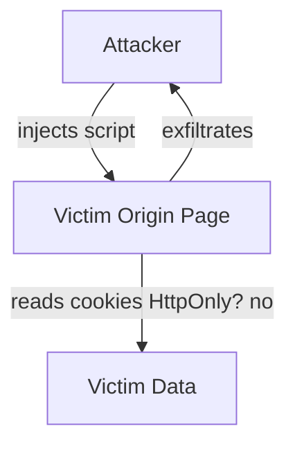

# Security — XSS, CSRF, CSP

Browser security interviews cluster around the **Same-Origin Policy**, **XSS**, **CSRF**, **CSP**, and cookie attributes. Depth beats buzzwords: say *where trust boundaries are* and *which defense blocks which attack*.

Related: [JS Security](/javascript/21-security) · [Networking](/browser/05-networking) · [Storage](/browser/08-storage) · [Node Security](/node/12-security) · [Next Auth](/nextjs/12-authentication)

## Same-Origin Policy (SOP)

**Origin** = scheme + host + port. `https://a.com` ≠ `http://a.com` ≠ `https://a.com:443` (443 default still same) ≠ `https://sub.a.com`.

SOP restricts reading cross-origin responses from script (with CORS exceptions), and isolates `document` / storage per origin. It does **not** block sending requests (CSRF lives here) or loading cross-origin images/scripts (but scripts run with **page** privileges — classic XSS vector).



## XSS — Cross-Site Scripting

| Type | Mechanism | Example |
| --- | --- | --- |
| Stored | Payload persisted server-side | Comment with `<script>` |
| Reflected | Payload in URL/request reflected in HTML | Search `?q=<script>` |
| DOM-based | Client JS sinks unsafe data | `el.innerHTML = location.hash` |

**Sources:** `location`, `document.referrer`, `postMessage`, URL params, stored HTML.  
**Sinks:** `innerHTML`, `outerHTML`, `document.write`, `eval`, `new Function`, `javascript:` URLs, React `dangerouslySetInnerHTML`, Vue `v-html`.

```ts
// BAD — DOM XSS
function renderSearch(q: string) {
  document.getElementById('out')!.innerHTML = `Results for ${q}`
}

// BETTER — text
function renderSearchSafe(q: string) {
  document.getElementById('out')!.textContent = `Results for ${q}`
}

// HTML needed — sanitize with a vetted library (DOMPurify), never regex
import DOMPurify from 'dompurify'
function renderHtml(untrusted: string) {
  document.getElementById('out')!.innerHTML = DOMPurify.sanitize(untrusted)
}
```

**React note:** JSX escapes text children by default; `dangerouslySetInnerHTML` and `href={user}` (`javascript:`) remain footguns. See [React interview Q&A](/react/12-interview-qa).

### Defenses layered

1. **Encode/escape** at the right context (HTML body vs attribute vs JS vs URL vs CSS).
2. **Sanitize** HTML if rich text required.
3. **CSP** as belt-and-suspenders ([below](#content-security-policy-csp)).
4. **HttpOnly** cookies so stolen XSS can’t read session cookie via `document.cookie` (XSS can still act as user).
5. **Trusted Types** — force sinks to accept only policy-created values.

```ts
// Trusted Types (Chromium) — conceptual
declare const trustedTypes: {
  createPolicy(
    name: string,
    rules: { createHTML: (s: string) => string },
  ): { createHTML: (s: string) => { toString(): string } }
}

const policy = trustedTypes.createPolicy('app', {
  createHTML: (s) => DOMPurify.sanitize(s),
})
document.getElementById('out')!.innerHTML = policy.createHTML(userHtml) as unknown as string
```

## CSRF — Cross-Site Request Forgery

Browser **automatically attaches cookies** on requests to an origin (subject to SameSite). Attacker site triggers a request; victim’s cookies authenticate it.

```html
<!-- attacker.com -->
<form action="https://bank.com/transfer" method="POST">
  <input name="to" value="attacker" />
  <input name="amount" value="1000" />
</form>
<script>document.forms[0].submit()</script>
```

### Defenses

| Defense | How |
| --- | --- |
| `SameSite=Lax/Strict` cookies | Blocks most cross-site POSTs with cookies |
| Synchronizer tokens | Hidden CSRF token bound to session; verified server-side |
| Double-submit cookie | Cookie + header/form field must match |
| Prefer custom headers + CORS | `X-Requested-With` / JSON APIs not simple form posts |
| Re-auth for sensitive actions | Password / WebAuthn step-up |

```ts
// Fetch pattern: CSRF header + SameSite cookie
await fetch('/api/transfer', {
  method: 'POST',
  credentials: 'same-origin',
  headers: {
    'Content-Type': 'application/json',
    'X-CSRF-Token': getCookie('csrf') ?? '',
  },
  body: JSON.stringify({ to, amount }),
})
```

**XSS vs CSRF:** XSS runs in origin → can read CSRF tokens → CSRF defenses alone don’t stop XSS. Fix XSS; use both.

## Content Security Policy (CSP)

HTTP header (or meta, weaker) listing allowed sources for script, style, img, connect, frame, etc.

```http
Content-Security-Policy:
  default-src 'self';
  script-src 'self' https://cdn.example.com 'nonce-rAnd0m';
  object-src 'none';
  base-uri 'self';
  frame-ancestors 'none';
  report-uri /csp-report
```

| Directive | Role |
| --- | --- |
| `script-src` | Blocks inline/eval unless allowed |
| `nonce-*` / `sha256-*` | Allow specific inline scripts |
| `strict-dynamic` | Trust scripts loaded by nonce-trusted scripts |
| `object-src 'none'` | Kill plugins |
| `frame-ancestors` | Clickjacking (replaces X-Frame-Options) |
| `connect-src` | Restrict `fetch`/XHR/WebSocket |

```ts
// Nonce must be unique per response — SSR injects into header + script tags
function scriptTag(nonce: string, src: string): string {
  return `<script src="${src}" nonce="${nonce}"></script>`
}
```

**`'unsafe-inline'` / `'unsafe-eval'`** gut CSP’s XSS value — common in legacy Angular/webpack setups; interviewers notice.

## Clickjacking & other neighbors

- **Clickjacking:** iframe overlay; defend with `frame-ancestors` / `X-Frame-Options`.
- **MIME sniffing:** `X-Content-Type-Options: nosniff`.
- **Open redirects:** validate `redirect_uri`.
- **postMessage:** always check `event.origin`; don’t `targetOrigin: '*'`.

```ts
window.addEventListener('message', (event) => {
  if (event.origin !== 'https://trusted.example.com') return
  // handle event.data
})
other.contentWindow?.postMessage({ type: 'ready' }, 'https://trusted.example.com')
```

## Interview Questions

**Q1. How do you prevent XSS in a React SPA?**  
Rely on JSX escaping; ban unsafe HTML or sanitize; CSP nonces for any inline; avoid `javascript:` URLs; treat markdown/HTML pipelines as hostile; HttpOnly session cookies.

**Q2. Does `SameSite=Lax` eliminate CSRF?**  
It kills classic cross-site POST cookie CSRF for many apps. Still need tokens for older browsers, subdomain attacks, and Lax edge cases (top-level GET state-changing — don’t mutate on GET).

**Q3. CSP `script-src 'self'` and CDN React?**  
Won’t load CDN unless added. Prefer self-hosted hashed bundles + nonces. `'strict-dynamic'` helps modern CDNs loaded from trusted bootstrap.

**Q4. Can CSRF steal data?**  
Usually **forces actions**, not reads (attacker can’t read response cross-origin without CORS). XSS steals/reads. Combined attacks exist (login CSRF, etc.).

**Q5. Why is `innerHTML = user` dangerous even without `<script>`?**  
Event handlers (``), SVG, `javascript:` links, mutation XSS via sanitizer bypasses — use maintained sanitizers + CSP.

## Common Mistakes

- Escaping only `<` but not attribute/JS contexts.
- CSRF tokens in cookies without matching header check.
- `ACAO: *` with credentialed APIs.
- CSP report-only forever without enforcing.
- Storing session tokens in `localStorage` (any XSS exfiltrates). Prefer HttpOnly cookies + careful CSRF.
- Trusting `Referer` header as auth.

## Trade-offs

| Control | Strength | Cost |
| --- | --- | --- |
| HttpOnly cookie sessions | XSS can’t read token | CSRF must be handled |
| Bearer token in memory | No automatic CSRF | XSS still steals; refresh complexity |
| Strict CSP | Strong XSS reduction | Breaks inline scripts, some libs |
| Sanitizer | Enables rich text | Bypass risk; perf |
| SameSite Strict | Max CSRF resistance | Breaks some cross-site deep links |

**Senior takeaway:** Frame answers as **attacker capability → violated invariant → control that restores the invariant**. Pair XSS + CSRF + CSP in one coherent story.

## Deep dive — Trusted Types policies in SPAs

Frameworks that assign to sinks need default policies or sanitized pipelines. React’s text escaping helps; markdown → HTML pipelines are the usual breach. Audit `dangerouslySetInnerHTML`, rich text editors, and PDF viewers.

```ts
// Defense in depth checklist for a PR review
const checklist = [
  'No innerHTML with untrusted data',
  'CSP nonce on scripts',
  'HttpOnly session cookie',
  'SameSite + CSRF token on mutations',
  'postMessage origin checks',
] as const
```

## Deep dive — COOP / COEP / CORP

Cross-Origin Opener Policy + Embedder Policy enable cross-origin isolation (SAB, precise timers). `Cross-Origin-Resource-Policy` protects against certain Spectre-ish reads of resources. Trade-off: embedding/CDN complexity ([Architecture](/browser/01-architecture)).

## Deep dive — OAuth / open redirect

`redirect_uri` allowlists must be exact. Token in URL fragment vs query; prefer auth code + PKCE for SPAs/native. Don’t store refresh tokens in `localStorage` ([Storage](/browser/08-storage)).

## Extra Q&A

**Q6. mXSS?**  
Mutation XSS — browser HTML parser “fixes” markup into an executable form after sanitization. Keep sanitizer updated; prefer text.

**Q7. CSRF with `SameSite=None; Secure`?**  
Needed for third-party iframe cookies; requires explicit CSRF tokens because SameSite won’t save you.

**Q8. Is CORS a CSRF defense?**  
Partially for XHR/fetch simple vs non-simple — form POSTs are not CORS-protected the same way. Don’t rely on CORS alone.

**Q9. `X-Frame-Options` vs `frame-ancestors`?**  
Prefer CSP `frame-ancestors`; don’t mix conflicting values.

**Q10. Prototype pollution → XSS?**  
Polluted `Object.prototype` can become HTML/script sinks in naive merges — validate JSON merges ([JS objects](/javascript/14-objects)).


## Worked example — review a PR for XSS

Flags: `dangerouslySetInnerHTML`, markdown render without sanitize, `href={user}`, new `script` tags, `eval` on JSONP leftovers, CSP `'unsafe-inline'`. Demand sanitize + CSP nonce + tests with payloads ``.

## Defense matrix

| Attack | Primary defenses |
| --- | --- |
| Stored XSS | Encode, sanitize, CSP, Trusted Types |
| CSRF | SameSite, tokens, safe methods |
| Clickjacking | frame-ancestors |
| Token theft XSS | HttpOnly cookies |
| MIME confuse | nosniff |

## Subdomain takeover note

Dangling DNS + unclaimed host → attacker cookies on parent Domain attribute scope. Limit `Domain=` cookies; inventory DNS.

## Glossary

| Term | Definition |
| --- | --- |
| SOP | Same-Origin Policy |
| Sink | Dangerous DOM/API destination |
| Source | Untrusted input origin |
| Nonce | Per-request CSP token |
| PKCE | OAuth code exchange protection |
