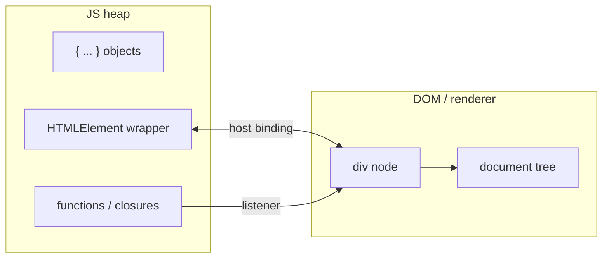
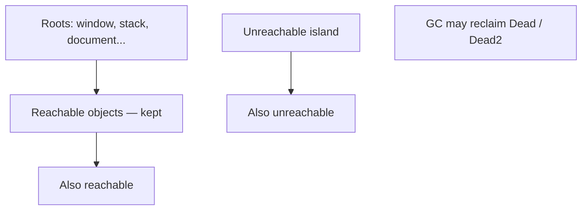
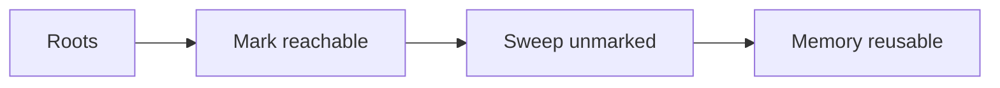
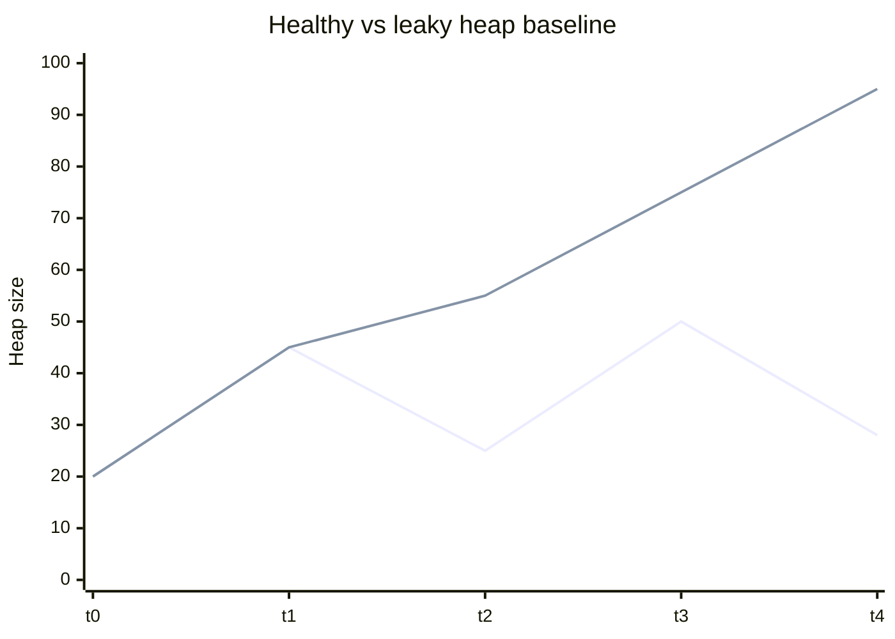
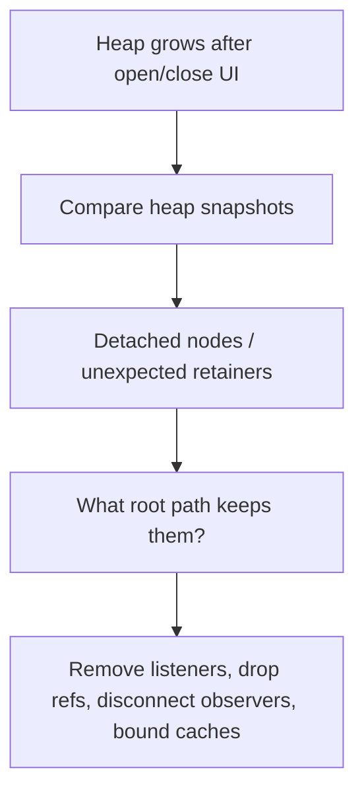

# Memory and Garbage Collection

This chapter teaches browser memory from scratch. You do not need to already know heaps, mark-and-sweep, or “detached DOM.” By the end you should be able to explain **where objects live**, **what keeps them alive**, **how garbage collection roughly works**, **why SPAs leak memory**, and **how to think with DevTools**.

Related: [Execution Context](/javascript/02-execution-context) · [Closures](/javascript/05-closures) · [Event Loop](/browser/03-event-loop) · [Rendering](/browser/02-rendering-pipeline)

---

## 1. Why browser memory is a different conversation

On a server process you might restart workers. In a browser tab, a user may leave your SPA open for hours. Memory that grows forever becomes:

- Slower GC pauses (jank)
- Tab crashes (`OUT OF MEMORY`)
- Laptop fans and battery drain
- Mobile browsers killing the tab

Interviewers care less about citing GC papers and more about:

> “What still has a **reference** to this object, and why?”

---

## 2. Two worlds: JS heap and the DOM

### 2.1 JavaScript objects live on the JS heap

When you write:

```ts
const user = { name: "Ada", scores: [1, 2, 3] }
```

the engine allocates objects/arrays/strings/functions in the **JavaScript heap** (engine-managed memory).

### 2.2 DOM nodes live in the browser’s DOM implementation

```ts
const el = document.createElement("div")
document.body.appendChild(el)
```

`el` is a **JS wrapper** (host object) that points at a real DOM node owned by the rendering engine. The DOM tree is not “just another plain object graph,” but **references cross the boundary**:

- JS can hold references to DOM nodes
- DOM nodes can keep JS objects alive (e.g. event listener closures)



**Leak pattern in one sentence:** JS keeps a DOM node alive, or a DOM node keeps a JS closure alive, longer than you intended.

---

## 3. Reachability — the only rule that matters

### 3.1 Plain language

Garbage collectors do **not** free memory because you “finished using” a variable mentally. They free objects that are **unreachable** from a set of **roots**.

**Roots** include things like:

- The currently running call stack’s local variables
- Global object properties (`window`, module top-level bindings that stay alive)
- DOM tree attached to the document (from the browser’s point of view)
- Other runtime handles (depending on engine)

**Reachable** means: starting from roots, following object references, you can still get to it.

```ts
let a = { name: "keep" }
let b = { name: "maybe" }
a = null
// If nothing else points at the old { name: "keep" }, it can be collected.
// b is still reachable via the binding `b`.
```



### 3.2 “Deleting” vs losing references

```ts
const cache = new Map()
cache.set("user", hugeObject)
cache.delete("user") // hugeObject may become collectible if no other refs
```

```ts
const nodes: Element[] = []
nodes.push(document.getElementById("x")!)
document.getElementById("x")!.remove()
// Node is detached from document, BUT still reachable via `nodes` array → not freed
```

That second snippet is the seed of **detached DOM** leaks.

---

## 4. Mark-and-sweep — the idea (not the PhD)

Engines differ (V8, SpiderMonkey, JavaScriptCore). Interviews want the **idea**:

### 4.1 Mark

1. Start from roots.
2. Recursively mark every object you can reach.

### 4.2 Sweep

3. Everything not marked is garbage.
4. Reclaim that memory (and often compact / move survivors — engine details).



### 4.3 Why you rarely call `gc()` yourself

Browsers run GC automatically. Forcing GC is not a product API you rely on. Your job is **not to retain** what you don’t need.

### 4.4 Generational intuition (enough for interviews)

Many engines treat **young** objects differently from **old** ones:

- Most objects die young → collect nursery frequently / cheaply
- Long-lived objects get promoted → collected less often

Implication: short-lived garbage is normal and fine. **Retaining large graphs for the life of the SPA** is what hurts.

---

## 5. What “a memory leak” means in an SPA

A **leak** in browser UI terms usually means:

> Memory that **should** have become unreachable after a navigation / unmount / closing a panel **still** has a path from a root.

The tab’s JS heap grows as the user uses the app. After GC, the baseline never returns near the start.



(Conceptual chart: healthy returns toward a baseline; leaky ratchets up.)

---

## 6. Common browser leak patterns

### 6.1 Event listeners not removed

```ts
function setup() {
  const button = document.getElementById("save")!
  const onClick = () => {
    console.log("save", heavyData)
  }
  button.addEventListener("click", onClick)
  // If this component goes away but listener stays, closure keeps heavyData (+ maybe DOM) alive
}
```

In SPAs, mount code often adds listeners to `window`, `document`, or a parent that **outlives** the view.

**Fix pattern:**

```ts
function setup() {
  const button = document.getElementById("save")!
  const onClick = () => { /* ... */ }
  button.addEventListener("click", onClick)
  return () => button.removeEventListener("click", onClick)
}

const teardown = setup()
// later, on unmount:
teardown()
```

Frameworks: React `useEffect` cleanup, Vue `onUnmounted`, etc. — same idea.

### 6.2 Detached DOM nodes retained by JS

```ts
const ledger: HTMLElement[] = []

function openModal() {
  const modal = document.createElement("div")
  modal.className = "modal"
  document.body.appendChild(modal)
  ledger.push(modal) // oops: immortal list
}

function closeModal(modal: HTMLElement) {
  modal.remove() // detached from document, still in ledger
}
```

**Detached DOM:** nodes not in the document tree, but still referenced from JS → cannot be collected → often retain large subtrees (and listeners).

**Fix:** drop the references (`ledger.length = 0`, or don’t store them), and remove listeners before discarding.

### 6.3 Closures capturing more than you think

```ts
function attachHandler(hugeList: string[]) {
  const button = document.querySelector("button")!
  button.addEventListener("click", () => {
    // Even if you only need one field, the closure may keep hugeList alive
    console.log(hugeList.length)
  })
}
```

Closures keep bindings from the outer scope **alive** as long as the function is reachable (e.g. registered as a listener).

**Mitigations:**

- Pass only the primitive you need into the closure
- Null out large structures when done
- Avoid parking huge arrays in module-level state “just in case”

```ts
function attachHandler(hugeList: string[]) {
  const count = hugeList.length
  const button = document.querySelector("button")!
  button.addEventListener("click", () => {
    console.log(count)
  })
}
```

### 6.4 Timers and animation frames

```ts
const id = setInterval(() => {
  syncFromServer()
}, 5000)

// Navigating away without clearInterval → callback keeps running and keeps its closure scope
```

Same for `setTimeout` chains and `requestAnimationFrame` loops.

**Fix:** `clearInterval` / `clearTimeout` / `cancelAnimationFrame` on teardown.

### 6.5 Global caches without bounds

```ts
const imageCache = new Map<string, ArrayBuffer>()

async function getImage(url: string) {
  if (!imageCache.has(url)) {
    imageCache.set(url, await load(url))
  }
  return imageCache.get(url)!
}
```

Every unique URL forever → unbounded growth.

**Fix:** LRU with a max size, `WeakRef`/`FinalizationRegistry` in advanced cases, or store in Cache API / IndexedDB with eviction policy. See [Storage](/browser/08-storage).

### 6.6 Closures + detached observers

`MutationObserver`, `IntersectionObserver`, `ResizeObserver` — if you `observe` and never `disconnect`, you can retain targets and callbacks.

```ts
const obs = new IntersectionObserver((entries) => {
  /* ... */
})
obs.observe(el)

// on teardown:
obs.disconnect()
```

### 6.7 Console retention (dev-only footgun)

Logging a DOM node or large object in DevTools can keep it around while DevTools is open. Don’t diagnose “leaks” only from sessions where you `console.log`’d the suspect nodes without understanding this.

---

## 7. Growing memory that is *not* a leak

Not every increase is a bug:

| Situation | What’s happening |
| --- | --- |
| User scrolled a long virtualized list that caches rows | Intentional cache — bound it |
| Image gallery decoded many bitmaps | Browser image memory — release by removing imgs / navigating |
| Heap rises then falls after GC | Normal |
| Bundle evaluates large modules once | One-time cost |

**Leak** = unintended retention after the logical lifetime ended.

---

## 8. DevTools thinking — how to investigate

You do not need to memorize every button. Learn a **workflow**.

### 8.1 Performance monitor / memory chart

1. Open DevTools → Performance or Memory tooling (browser-dependent names).
2. Use the app: open/close the suspect UI repeatedly.
3. Watch whether JS heap / DOM node count **ratchets up**.

If opening a modal 20 times adds 20× nodes that never drop → likely detached DOM or retained listeners.

### 8.2 Heap snapshots (Chrome-style mental model)

1. Take snapshot A after settling.
2. Reproduce the action (open+close modal).
3. Take snapshot B.
4. Compare: look for objects of unexpected retained size — often `Detached HTMLDivElement` or your component class.

**Retained size:** memory freed if this object were collected (includes what it uniquely keeps alive).  
**Shallow size:** the object alone.

### 8.3 Allocation instrumentation

Record allocations while interacting. Sort by size. Ask: “Who still holds this?” Follow retainer paths back to a global, a listener, a React fiber, a module-level Map, etc.

### 8.4 Checklist when you see Detached HTMLElement

1. Who references it? (array, Map, closure, React ref not cleared)
2. Are event listeners still registered?
3. Is an observer still observing?
4. Did a parent collection grow forever?



---

## 9. Frameworks hide — but don’t delete — the rules

React/Vue/Svelte teardown helps **if** you use their lifecycle correctly.

Still leak-prone:

- Subscriptions in `useEffect` without cleanup
- Module-level stores holding component-related objects
- Third-party widgets (`map.instance`, chart libraries) needing explicit `destroy()`
- Closures inside long-lived services capturing old props/state graphs

```ts
useEffect(() => {
  const handler = () => { /* uses props */ }
  window.addEventListener("resize", handler)
  return () => window.removeEventListener("resize", handler)
}, [])
```

---

## 10. WeakRef and WeakMap — tools for “don’t keep alive”

Sometimes you want a cache that **does not** prevent GC:

```ts
const cache = new WeakMap<object, Metadata>()

function associate(obj: object, meta: Metadata) {
  cache.set(obj, meta)
}
// When obj becomes unreachable elsewhere, the WeakMap entry can go away
```

`WeakMap` keys are weak. `WeakRef` holds a weak reference to a target (advanced; easy to misuse). Prefer fixing retainer bugs before reaching for weak refs.

---

## 11. Worked story — the “modal leak”

**Symptoms:** After opening/closing a modal 50 times, performance drops; DOM node count climbs.

**Bug:**

```ts
const openModals: HTMLElement[] = []

export function showModal() {
  const el = document.createElement("div")
  el.innerHTML = hugeTemplate
  el.addEventListener("click", () => save(formState))
  document.body.appendChild(el)
  openModals.push(el)
}

export function hideModal(el: HTMLElement) {
  el.remove()
  // forgot: remove from openModals, remove listener
}
```

**Fix:**

```ts
export function showModal() {
  const el = document.createElement("div")
  el.textContent = "..." // or safe render
  const onClick = () => save(formState)
  el.addEventListener("click", onClick)
  document.body.appendChild(el)

  return function hide() {
    el.removeEventListener("click", onClick)
    el.remove()
  }
}
```

No immortal array. Listener removed. Node can become unreachable.

---

## Interview Questions

### Q1. How does JS know what memory it can free?
**Expected:** Objects unreachable from roots (stack, globals, etc.) can be collected — typically via mark-and-sweep style algorithms.  
**Common wrong:** “Reference counting only” / “GC runs when I return from a function always.”  
**Follow-ups:** What is a root?

### Q2. What is a detached DOM node?
**Expected:** A DOM node not attached to the document, but still referenced from JS, so it cannot be collected and may retain a whole subtree.  
**Common wrong:** “Any node you create with createElement.”  
**Follow-ups:** How do you find them in DevTools?

### Q3. Why do event listeners leak memory?
**Expected:** The listener function stays registered on a long-lived target; its closure keeps captured variables (and sometimes DOM) reachable.  
**Common wrong:** “Listeners are always freed when the element is removed” (not if other retainers exist / wrong target).  
**Follow-ups:** Show a cleanup pattern.

### Q4. Mark-and-sweep in one paragraph.
**Expected:** Mark all objects reachable from roots; sweep (reclaim) the rest.  
**Common wrong:** Detailed claim of one exact algorithm as universal.  
**Follow-ups:** Why are short-lived objects less concerning than immortal caches?

### Q5. Is a rising heap always a leak?
**Expected:** No — caches, user-driven growth, and pre-GC spikes happen; a leak is unintended retention after lifetime ends.  
**Common wrong:** “Any GC means the app is broken.”  
**Follow-ups:** How would you distinguish?

### Q6. How do you debug a suspected SPA leak?
**Expected:** Reproduce open/close cycles; watch heap/DOM counts; compare heap snapshots; follow retainers; fix listeners/refs/caches.  
**Common wrong:** “Restart the browser” as the fix.  
**Follow-ups:** What is retained size?

### Q7. How can closures cause leaks?
**Expected:** A long-lived function retains outer-scope bindings, keeping large objects alive.  
**Common wrong:** “Closures always leak.”  
**Follow-ups:** Relate to [Closures](/javascript/05-closures).

### Q8. WeakMap vs Map for caching?
**Expected:** WeakMap keys don’t keep key objects alive; Map does. WeakMap only allows object keys and isn’t iterable the same way.  
**Common wrong:** “WeakMap is always better.”  
**Follow-ups:** When is an LRU Map more appropriate?

---

## Common Mistakes

- Pushing DOM nodes into a global array “for debugging” and shipping it.
- Adding `window` listeners in components without cleanup.
- Assuming `element.remove()` frees memory while JS still references the element.
- Unbounded `Map`/`Object` caches keyed by URL or id.
- Forgetting `clearInterval` / observer `disconnect`.
- Blaming GC for jank without measuring main-thread work / layout.
- Logging huge objects in production.
- Holding React refs to unmounted component trees in external stores.

---

## 12. Saying it in an interview (60-second version)

> “Browsers reclaim memory for objects that are unreachable from roots — roughly mark-and-sweep. Leaks in SPAs usually mean something still references what we thought we discarded: a `window` listener whose closure holds data, a Map of detached DOM nodes, an interval, or an unbounded cache. I reproduce open/close cycles, watch heap and DOM counters, compare heap snapshots, follow retainer paths, then remove listeners, drop references, disconnect observers, and bound caches. Growing memory isn’t always a leak — intentional caches and pre-GC spikes exist — so I define the expected lifetime first.”

That paragraph beats listing GC algorithm names.

---

## 13. Framework-specific retainer checklist

| Layer | Ask |
| --- | --- |
| React | Did every `useEffect` subscription return cleanup? Are refs cleared? |
| Vue | `onUnmounted` dispose? watchers stopped? |
| Maps/charts | Did you call vendor `destroy()` / `remove()`? |
| Routers | Do page-level singletons accumulate per navigation? |
| Analytics | Do page-view hooks register globals repeatedly? |

```ts
// Pattern: one ownership boundary, one disposer
export function mountFeature(root: HTMLElement) {
  const ac = new AbortController()
  root.addEventListener("click", onClick, { signal: ac.signal })
  const id = setInterval(poll, 10_000)
  const obs = new ResizeObserver(onResize)
  obs.observe(root)

  return () => {
    ac.abort() // removes listeners registered with this signal
    clearInterval(id)
    obs.disconnect()
  }
}
```

`AbortSignal` on `addEventListener` is a clean modern way to batch-remove listeners.

---

## Trade-offs / Production Notes

- **Correctness first:** fix retainers; don’t sprinkle `WeakRef` as perfume.
- Bound every cache; prefer eviction policies you can explain.
- Measure on real devices; mobile limits are stricter.
- Component teardown checklists for third-party widgets.
- Virtualize huge lists so you don’t keep thousands of DOM nodes.
- Prefer `AbortController` for listener lifetime when multiple listeners share a feature mount.
- Related: [Optimization](/browser/09-optimization), [Closures](/javascript/05-closures), [Event Loop](/browser/03-event-loop).
