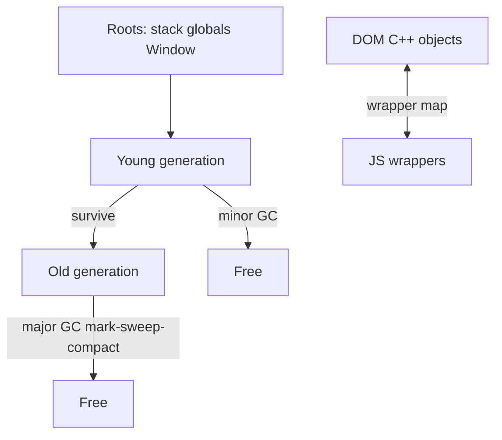
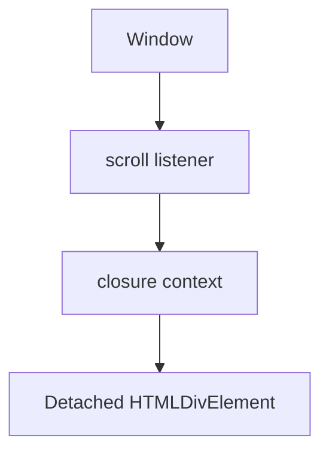

# Memory & Garbage Collection

Browsers run multiple heaps (V8 for JS, Blink for C++ DOM objects, GPU resources). Leaks usually come from **JS references keeping DOM alive** (or vice versa via wrappers), detached DOM trees, listeners, and caches.

Related: [JS Memory](/javascript/12-memory) · [Architecture](/browser/01-architecture) · [React memoization](/react/09-memoization) · [Optimization](/browser/09-optimization)

## Heaps & reachability

V8 GC is generational + marking (Orinoco / concurrent marking / scavenging). Objects reachable from **roots** (stack, globals, embedder roots) survive.



**Detached DOM:** nodes removed from document but still referenced from JS → C++ DOM + JS wrapper retained.

```ts
// Leak pattern: closure over element
const leaks: HTMLElement[] = []
function mount(el: HTMLElement) {
  const onScroll = () => console.log(el.id)
  window.addEventListener('scroll', onScroll)
  leaks.push(el) // keeps element + listener path alive if never cleaned
}

// Fix: remove listener + drop refs
function unmount(el: HTMLElement, onScroll: () => void) {
  window.removeEventListener('scroll', onScroll)
  const i = leaks.indexOf(el)
  if (i >= 0) leaks.splice(i, 1)
}
```

## Common browser leak patterns

| Pattern | Why it leaks | Fix |
| --- | --- | --- |
| Listener on `window`/`document` | Holds handler + closed-over nodes | `removeEventListener` / `AbortController` |
| Detached DOM in arrays/Maps | Nodes out of tree still reachable | Clear structures on unmount |
| Closures in timers | `setInterval` forever | `clearInterval` |
| Growth-only caches | Map unbounded | LRU / weak refs |
| Observables without unsubscribe | Callback retains `this` | Teardown |
| SPA route leaks | Previous page state retained | Framework unmount discipline ([React](/react/03-hooks)) |

```ts
// AbortController: idiomatic cleanup
function bind(el: HTMLElement): () => void {
  const ac = new AbortController()
  el.addEventListener('click', () => {}, { signal: ac.signal })
  window.addEventListener('resize', () => {}, { signal: ac.signal })
  return () => ac.abort()
}
```

## WeakRef & FinalizationRegistry

```ts
const cache = new Map<string, WeakRef<object>>()

function getCached(key: string): object | undefined {
  const ref = cache.get(key)
  const value = ref?.deref()
  if (!value) cache.delete(key)
  return value
}

const registry = new FinalizationRegistry((key: string) => {
  cache.delete(key)
})

function setCached(key: string, value: object) {
  cache.set(key, new WeakRef(value))
  registry.register(value, key)
}
```

`WeakMap`/`WeakSet` keys don’t prevent GC of the key object. Values in `WeakMap` can still keep values alive if keys alive. Don’t use WeakRef for correctness-critical logic — GC timing is nondeterministic.

## Measuring memory

| Tool | Use |
| --- | --- |
| Performance Monitor | JS heap rough live view |
| Memory → Heap snapshot | Dominators, retainers |
| Allocation instrumentation | What allocated over time |
| `performance.measureUserAgentSpecificMemory()` | Cross-origin isolated pages |

```ts
async function heapEstimate(): Promise<void> {
  const mem = (performance as Performance & {
    measureUserAgentSpecificMemory?: () => Promise<{ bytes: number }>
  }).measureUserAgentSpecificMemory
  if (!mem) return
  const { bytes } = await mem()
  console.log('approx bytes', bytes)
}
```

**Snapshot method:** take heap → interact → snapshot → compare. Look for detached `HTMLDivElement` growth, listener counts, retainer paths to `Window`.

## GC & jank

Major GC can cause long pauses (much improved with concurrent marking). Large object graphs / megamorphic hidden classes worsen costs ([JS memory](/javascript/12-memory)). Allocate less in hot animation paths; reuse typed arrays for audio/canvas.

```ts
// Reuse buffer instead of allocating per frame
const buf = new Float32Array(1024)
function tick() {
  // fill buf — avoid new Float32Array each rAF
  requestAnimationFrame(tick)
}
```

## Embedder & GPU memory

Images, canvases, WebGL textures live outside V8 heap. `canvas` width/height changes allocate bitmaps; forget to release WebGL resources → GPU OOM while JS heap looks fine.

## Interview Questions

**Q1. How do you find a detached DOM leak?**  
Heap snapshot → filter Detached → inspect retainer. Usually an array, closure, or React fiber still pointing at the node.

**Q2. Do event listeners prevent GC of the element?**  
If the listener is on the element and nothing else references the element, removing the element can collect both (engine-dependent details). Listeners on `document`/`window` closing over the element **do** keep it alive.

**Q3. `null`ing a variable vs WeakRef?**  
Eager `null`/delete is deterministic cleanup. WeakRef is opportunistic cache. Prefer explicit teardown in app code.

**Q4. Why did heap grow after navigating SPA routes?**  
Global stores, module-level Maps, uncleared intervals, third-party widgets, React Query cache without GC — not always “React is leaky.” Profile retainers.

**Q5. Memory leak vs high memory usage?**  
Leak: monotonic growth with repeated action after GC. High usage: large but stable working set (virtual lists help — [Machine coding virtual list](/machine-coding/04-virtual-list)).

## Common Mistakes

- Only watching JS heap while leaking GPU textures.
- Console logging DOM nodes (DevTools retains them!).
- Growing module-level caches without bounds.
- Assuming `WeakMap` magically fixes all caches (values still strong).
- Cleaning React state but forgetting native listeners outside React.

## Trade-offs

| Strategy | Pros | Cons |
| --- | --- | --- |
| Eager teardown | Predictable | Boilerplate |
| Weak caches | Auto-evict under pressure | Non-deterministic; harder reasoning |
| Object pooling | Less GC in hot paths | Complexity, stale state bugs |
| Virtualize large lists | Caps DOM size | Implementation cost |
| Concurrent GC | Smoother frames | Still not free; allocate less |

**Senior takeaway:** Speak in **retainers and roots**, demonstrate snapshot methodology, and separate **V8 heap vs DOM vs GPU**.

## Deep dive — retainers in DevTools

In a heap snapshot, pick a Detached node → Retainers pane shows the path to a GC root (`Window`, closure context, React fiber). Fix the **shortest controllable edge** (unsubscribe, clear array, abort controller).



## Deep dive — React-specific leaks

Module-level caches, `setInterval` in `useEffect` without cleanup, subscriptions in Zustand/Redux middleware, third-party chart libs holding canvas nodes. Profile with React DevTools + Memory. → [React hooks](/react/03-hooks) · [Memoization](/react/09-memoization)

```ts
useEffect(() => {
  const id = setInterval(() => {}, 1000)
  return () => clearInterval(id)
}, [])
```

## Deep dive — allocation timelines

Allocation instrumentation shows where objects were allocated. Spikes per keystroke → controlled inputs allocating huge arrays/strings. Reuse buffers in animation/audio worklets.

## Extra Q&A

**Q6. Does `removeChild` free memory immediately?**  
Only if unreachable. GC is deferred.

**Q7. WeakMap of DOM nodes as keys?**  
When node is unreferenced elsewhere, entry can GC — good for per-element metadata.

**Q8. Memory leak in bfcache?**  
Page frozen — timers paused; leaks still retained until eviction. Don’t treat bfcache as GC.

**Q9. `console.log(element)` leak?**  
DevTools retains logged objects — clear console when measuring.

**Q10. Heap vs RSS?**  
Process RSS includes images, code, GPU; JS heap is a subset — use both signals.


## Worked example — chart library leak

Mount chart → navigate away → Detached `canvas` grows. Fix: call chart `destroy()`, abort listeners, null refs in `useEffect` cleanup ([React hooks](/react/03-hooks)).

## Generational GC intuition for answers

Short-lived objects die in scavenge (cheap). Long-lived promote to old space; full GC rarer but costlier. High allocation rate in rAF → jank even if “no leak.”

## Measuring SPA routes

Protocol: snapshot → navigate A→B→A ten times → snapshot → compare Detached HTMLElement count. Stable = OK; linear growth = leak.

## Glossary

| Term | Definition |
| --- | --- |
| Root | GC reachability root |
| Retainer | Object keeping another alive |
| Detached DOM | Out-of-document but referenced |
| WeakRef | Non-owning reference |
| Embedder root | C++/DOM keeping JS wrapper |
