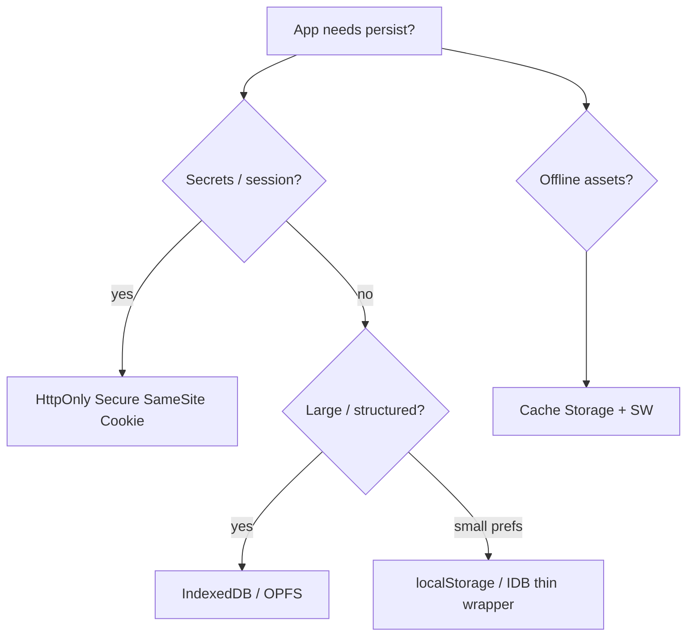

# Storage

Browsers expose multiple persistence APIs with different **quota**, **lifetime**, **partitioning**, and **sync vs async** characteristics. Choosing wrong leaks PII, blocks the main thread, or fails under Safari ITP.

Related: [Security](/browser/06-security) · [Networking](/browser/05-networking) · [JS Browser APIs](/javascript/19-browser-apis) · [React Query](/react/06-react-query)

## Comparison matrix

| API | Capacity (order) | Thread | Survives | Scope |
| --- | --- | --- | --- | --- |
| `localStorage` | ~5MB / origin | Sync | Until cleared | Origin |
| `sessionStorage` | ~5MB | Sync | Tab session | Origin + tab |
| Cookies | ~4KB each | Sent on HTTP | Per attributes | Origin + Domain/Path |
| IndexedDB | Large (quota) | Async | Until eviction | Origin |
| Cache Storage | Large | Async | SW-managed | Origin |
| OPFS | Large | Async/sync access handles | Origin | Origin |
| `document.cookie` | Same as cookies | Sync string API | — | — |



## Web Storage (`localStorage` / `sessionStorage`)

```ts
// Sync — blocks main thread on large reads/writes
localStorage.setItem('theme', 'dark')
const theme = localStorage.getItem('theme')

// StorageEvent — other documents of same origin
window.addEventListener('storage', (e) => {
  if (e.key === 'theme') console.log(e.oldValue, e.newValue)
})
```

**Limits:** string-only; quota throws `QuotaExceededError`; synchronous disk I/O can jank. **Never** store access tokens if XSS is a concern — prefer HttpOnly cookies ([Security](/browser/06-security)).

`sessionStorage` is per top-level browsing context tab; not shared with other tabs (unlike `localStorage`).

## Cookies

```http
Set-Cookie: sid=abc; Path=/; Secure; HttpOnly; SameSite=Lax; Max-Age=3600
```

| Attribute | Effect |
| --- | --- |
| `HttpOnly` | Not visible to `document.cookie` |
| `Secure` | HTTPS only |
| `SameSite` | CSRF posture |
| `Domain` | Broadens host scope (careful with subdomains) |
| `Partitioned` | CHIPS — third-party cookie partitioned by top-level site |

Third-party cookies are dying (ITP, Chrome Privacy Sandbox). Design for **first-party** auth.

## IndexedDB

Transactional, asynchronous, structured clone capable (including `File`, `Blob`, typed arrays).

```ts
function openDb(): Promise<IDBDatabase> {
  return new Promise((resolve, reject) => {
    const req = indexedDB.open('app', 1)
    req.onupgradeneeded = () => {
      const db = req.result
      if (!db.objectStoreNames.contains('kv')) {
        db.createObjectStore('kv')
      }
    }
    req.onsuccess = () => resolve(req.result)
    req.onerror = () => reject(req.error)
  })
}

async function idbSet(key: string, value: unknown): Promise<void> {
  const db = await openDb()
  return new Promise((resolve, reject) => {
    const tx = db.transaction('kv', 'readwrite')
    tx.objectStore('kv').put(value, key)
    tx.oncomplete = () => resolve()
    tx.onerror = () => reject(tx.error)
  })
}
```

Libraries (`idb`) wrap the verbose callbacks. Use for offline drafts, large client caches — pair with [React Query](/react/06-react-query) persistence carefully (sensitive data!).

## Cache Storage & Service Workers

```ts
self.addEventListener('fetch', (event: FetchEvent) => {
  event.respondWith(
    (async () => {
      const cached = await caches.match(event.request)
      if (cached) return cached
      const res = await fetch(event.request)
      const cache = await caches.open('v1')
      void cache.put(event.request, res.clone())
      return res
    })(),
  )
})
```

Strategies: cache-first, network-first, stale-while-revalidate. Version caches; delete old on `activate`.

## Quota & eviction

```ts
async function quota(): Promise<void> {
  if (!navigator.storage?.estimate) return
  const { usage, quota } = await navigator.storage.estimate()
  console.log({ usage, quota })
  if (navigator.storage.persist) {
    const persisted = await navigator.storage.persist() // permission / engagement heuristics
    console.log({ persisted })
  }
}
```

Under pressure, browsers evict **non-persistent** origins (LRU-ish). Best-effort: don’t assume IDB is forever.

## Partitioning & privacy

Storage may be **keyed by top-level site + frame origin** for third-party iframes (storage partitioning). Affects embeds, SSO iframes, widget cookies. First-party app storage remains origin-keyed.

## Interview Questions

**Q1. localStorage vs cookies for JWT?**  
`localStorage`: easy XSS theft, not sent automatically. Cookies: automatic send → CSRF; use `HttpOnly`+`SameSite`+CSRF tokens. For SPAs, HttpOnly cookie sessions are usually safer against XSS exfiltration.

**Q2. Why is localStorage sync a problem?**  
Large JSON parse/stringify on main thread blocks input/render ([Event Loop](/browser/03-event-loop)).

**Q3. sessionStorage after redirect?**  
Same tab navigations keep it; new tab duplicates independently. OAuth popup patterns need explicit messaging (`postMessage`) not sessionStorage sharing assumptions.

**Q4. When IndexedDB over Cache API?**  
Structured app data / indexing / queries → IDB. HTTP response caching for assets → Cache Storage.

**Q5. What is CHIPS?**  
Cookies Having Independent Partitioned State — third-party cookies scoped to the top-level site partition, reducing cross-site tracking while allowing embeds some state.

## Common Mistakes

- Storing secrets in LS/IDB without threat modeling XSS.
- Unbounded IDB growth (no TTL/LRU).
- Relying on third-party cookies for auth in 2026+.
- Blocking UI on `JSON.parse(localStorage.getItem(huge))`.
- Forgetting SW cache versions → users stuck on old app shell.
- Using cookies for large data (size + sent on every request).

## Trade-offs

| Store | Pros | Cons |
| --- | --- | --- |
| localStorage | Simple API | Sync, small, stringly, XSS-visible |
| HttpOnly cookie | XSS can’t read | CSRF, size, sent to server |
| IndexedDB | Large, async, structured | Complex API, eviction |
| Cache Storage | Natural for Response | Opaque request matching pitfalls |
| In-memory only | Safest for tokens | Lost on refresh |

**Senior takeaway:** Pick storage by **threat model + size + sync cost + partitioning**, not by familiarity with `localStorage`.

## Deep dive — Origin Private File System (OPFS)

```ts
async function writeOpfs(name: string, data: Blob): Promise<void> {
  const root = await navigator.storage.getDirectory()
  const handle = await root.getFileHandle(name, { create: true })
  const writable = await handle.createWritable()
  await writable.write(data)
  await writable.close()
}
```

Near-native file performance for large media/offline editors; still origin-scoped and evictable unless persisted.

## Deep dive — cookie size & request tax

Cookies attach to matching requests — large cookies inflate every API call. Prefer server sessions / slim IDs. Partitioned third-party cookies (CHIPS) change embed auth designs ([Security](/browser/06-security)).

## Deep dive — SW update dances

```ts
// skipWaiting + clients.claim carefully — can break mid-session
self.addEventListener('install', (e) => {
  e.waitUntil(caches.open('v2').then((c) => c.addAll(['/','/app.js'])))
})
self.addEventListener('activate', (e) => {
  e.waitUntil(
    caches.keys().then((keys) =>
      Promise.all(keys.filter((k) => k !== 'v2').map((k) => caches.delete(k))),
    ),
  )
})
```

Always version caches; announce updates UX-side.

## Extra Q&A

**Q6. `sessionStorage` vs in-memory state?**  
Survives reload in-tab; memory doesn’t. Neither shares across tabs.

**Q7. Can SW cache opaque responses?**  
Yes with caveats — opaque doesn’t expose body to JS; opaque CDN responses may have opaque sizing toward quota.

**Q8. IndexedDB multi-tab?**  
Transactions + `versionchange`; use `BroadcastChannel` for invalidation.

**Q9. Why did Safari clear storage?**  
ITP / seven-day caps historically for some script-writable storage — design server source of truth.

**Q10. Encrypting IDB?**  
Helps stolen-disk scenarios, not XSS (attacker runs in origin and can use your keys). XSS still wins.


## Worked example — “user logged out on Safari iframe widget”

Third-party cookies blocked / partitioned. Migrate to first-party tokens via redirect or Storage Access API where applicable; redesign embed ([Security](/browser/06-security)).

## Persistence recommendation table (product)

| Data | Store |
| --- | --- |
| Session id | HttpOnly cookie |
| Theme preference | localStorage / IDB |
| Draft editor doc | IndexedDB / OPFS |
| App shell assets | Cache Storage |
| Ephemeral UI | memory / sessionStorage |

## Quota errors UX

Catch `QuotaExceededError`, evict LRU, prompt user — don’t silent-fail writes.

## Glossary

| Term | Definition |
| --- | --- |
| CHIPS | Partitioned third-party cookies |
| OPFS | Origin Private File System |
| Eviction | Browser clearing origin data |
| Durable | `persist()` best-effort |
| Opaque response | no-cors cached Response |
