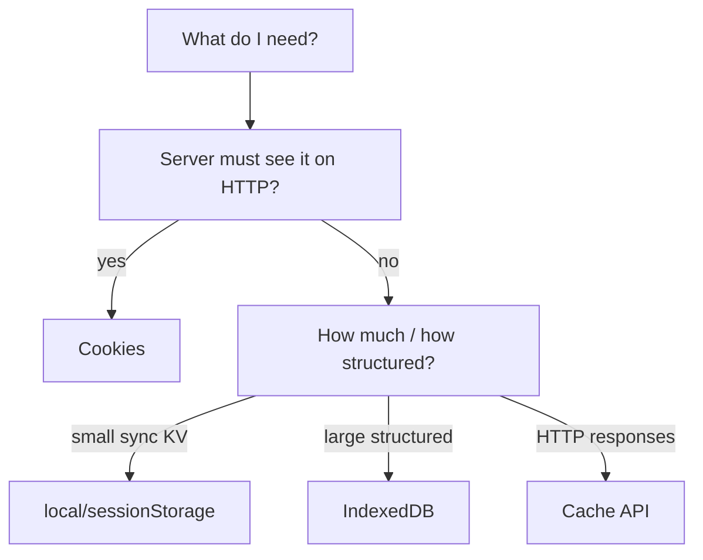
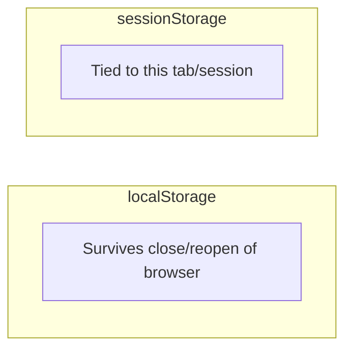
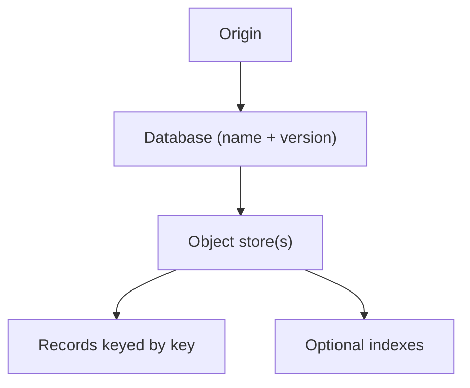
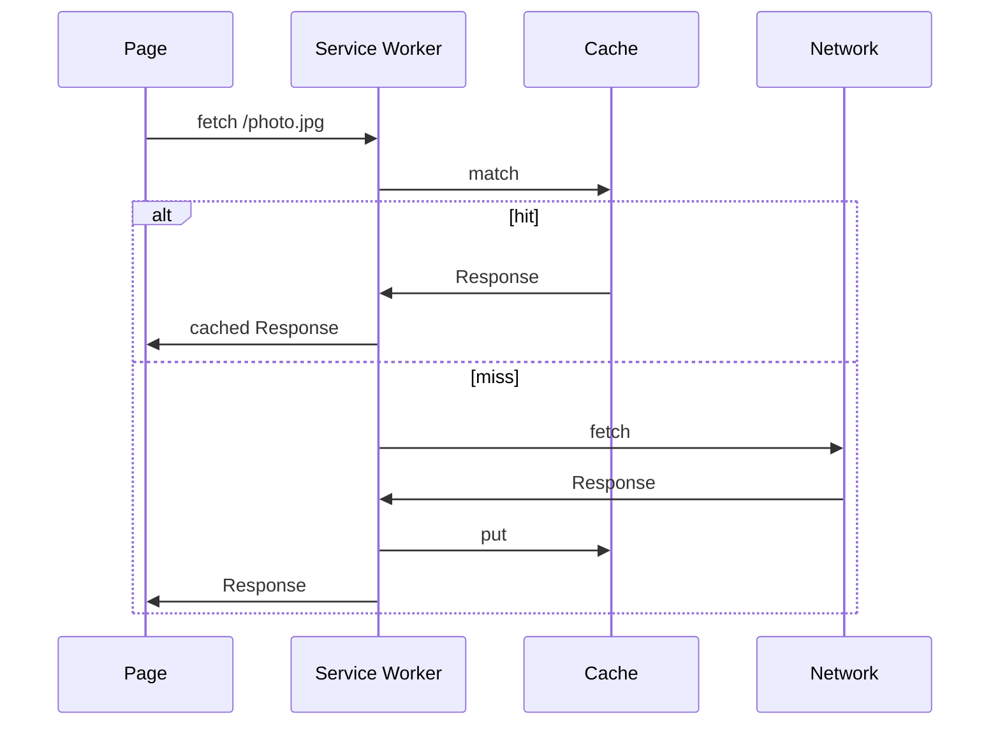
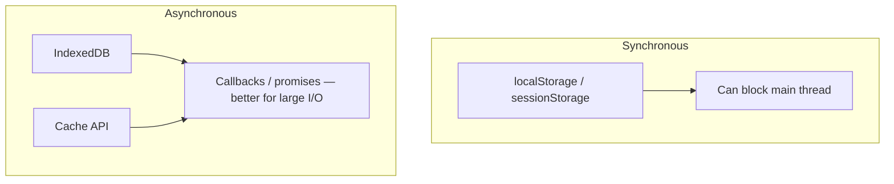
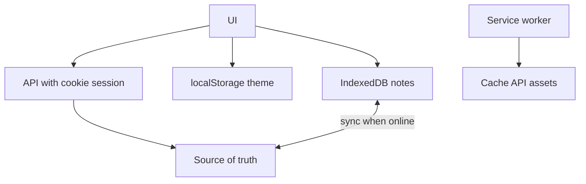

# Browser Storage

This chapter teaches browser storage from scratch. You do not need to already know cookie jars, quota bytes, or “partitioned storage.” By the end you should be able to compare **cookies**, **localStorage**, **sessionStorage**, **IndexedDB**, and the **Cache API** — including **sync vs async**, **size limits**, **when to use each**, and **privacy partitioning**.

Related: [Security](/browser/06-security) · [Networking](/browser/05-networking) · [Service Workers / PWA context via Cache API](/browser/09-optimization)

---

## 1. Why the browser stores data at all

Without storage, every visit starts empty: no session, no offline docs, no “remember this tab’s draft.”

Browsers give **several** storage mechanisms because they solve different jobs:

| Job | Example |
| --- | --- |
| Send identity to the server on requests | Session cookie |
| Remember a preference on this device | `localStorage` theme |
| Keep a big offline dataset | IndexedDB |
| Keep network responses for offline/speed | Cache API |

Using the wrong tool causes security bugs (tokens in the wrong place), jank (huge sync reads), or data loss (wrong lifetime).



---

## 2. Cookies — storage the server can receive

### 2.1 What a cookie is

A **cookie** is a small name/value piece stored by the browser under cookie rules. On later requests to matching URLs, the browser may **attach** it in the `Cookie` header automatically.

```http
HTTP/1.1 200 OK
Set-Cookie: session_id=abc123; Path=/; Secure; HttpOnly; SameSite=Lax
```

Later:

```http
GET /dashboard HTTP/1.1
Host: app.example.com
Cookie: session_id=abc123
```

Plain language:

> Cookies are mainly a **client-stored, request-attached** credential/preference channel between browser and server.

### 2.2 Reading from JavaScript

```ts
// Only cookies WITHOUT HttpOnly
document.cookie // "theme=dark; other=..."
document.cookie = "theme=dark; path=/; Secure; SameSite=Lax"
```

`HttpOnly` cookies are invisible to JS — good for session ids if you want to reduce theft via XSS (XSS can still *use* the session). See [Security](/browser/06-security).

### 2.3 Lifetime

| Kind | Behavior |
| --- | --- |
| **Session cookie** | No `Max-Age`/`Expires` — typically lasts until browser session ends (details vary) |
| **Persistent cookie** | Has `Max-Age` or `Expires` — survives restarts until expiry |

### 2.4 Size and count limits

Cookies are **small**. Per-cookie sizes are on the order of **4KB**. Browsers also limit number of cookies per domain. They are a bad place for large JSON blobs.

### 2.5 Security attributes (storage angle)

| Attribute | Storage / sending effect |
| --- | --- |
| `Secure` | Only on HTTPS |
| `HttpOnly` | Not readable from JS |
| `SameSite` | Controls cross-site sending |
| `Domain` / `Path` | Scope of where it’s stored/sent |

### 2.6 When cookies are the right tool

- Server needs the value on ordinary navigations and form posts
- Classic server-rendered session auth
- Prefer `Secure` + `HttpOnly` + thoughtful `SameSite` for sessions

---

## 3. Web Storage: `localStorage` and `sessionStorage`

### 3.1 What they are

Both are **simple key/value string maps** scoped to an **origin** (scheme + host + port).

```ts
localStorage.setItem("theme", "dark")
const theme = localStorage.getItem("theme") // "dark"
localStorage.removeItem("theme")
localStorage.clear()
```

```ts
sessionStorage.setItem("wizardStep", "2")
```

### 3.2 Lifetime difference

| API | Lifetime |
| --- | --- |
| **`localStorage`** | Persists until cleared by you, the user, or browser policy |
| **`sessionStorage`** | Per-tab (more precisely: per top-level browsing session); new tab usually gets a fresh copy; survives reload of that tab |



### 3.3 Only strings

```ts
localStorage.setItem("user", JSON.stringify({ id: 1 }))
const user = JSON.parse(localStorage.getItem("user") ?? "null")
```

You must serialize. Circular structures and `bigint` need care. Binary data does not fit well (use IndexedDB).

### 3.4 Synchronous API — a performance trap

`getItem` / `setItem` are **synchronous**. Large reads/writes block the **main thread**.

```ts
// Can jank the UI if the value is huge
const raw = localStorage.getItem("huge-cache")
```

Rule of thumb: keep values small; don’t store megabytes in Web Storage.

### 3.5 Storage events

Other **same-origin** tabs can hear `localStorage` changes:

```ts
window.addEventListener("storage", (e) => {
  console.log(e.key, e.oldValue, e.newValue)
})
```

Note: the tab that made the change does **not** get the event; other tabs do. `sessionStorage` does not broadcast the same way across tabs.

### 3.6 Quota (order of magnitude)

Often roughly **5MB per origin** for Web Storage (varies by browser). Exceeding throws (e.g. `QuotaExceededError`).

### 3.7 When to use Web Storage

| Use | Prefer |
| --- | --- |
| Theme, locale, lightweight flags | `localStorage` |
| Per-tab ephemeral UI state | `sessionStorage` |
| Auth tokens? | Risky — readable by any XSS script on the origin |
| Large datasets / files | IndexedDB instead |

---

## 4. IndexedDB — large structured client database

### 4.1 What it is

**IndexedDB** is an origin-scoped, **asynchronous**, transactional database in the browser. It stores structured data (objects, arrays, binaries via `ArrayBuffer`/`Blob`), not just strings.

Use cases:

- Offline document editors
- Cached API entities for SPAs
- Large user-generated content draft storage

### 4.2 Mental model



- **Database** — named, versioned
- **Object store** — like a table/collection
- **Key** — identifies a record
- **Index** — query by other fields
- **Transaction** — group of operations; async

### 4.3 Tiny walkthrough

```ts
function openDb(): Promise<IDBDatabase> {
  return new Promise((resolve, reject) => {
    const req = indexedDB.open("notes", 1)
    req.onupgradeneeded = () => {
      const db = req.result
      if (!db.objectStoreNames.contains("notes")) {
        db.createObjectStore("notes", { keyPath: "id" })
      }
    }
    req.onsuccess = () => resolve(req.result)
    req.onerror = () => reject(req.error)
  })
}

async function saveNote(note: { id: string; title: string; body: string }) {
  const db = await openDb()
  await new Promise<void>((resolve, reject) => {
    const tx = db.transaction("notes", "readwrite")
    tx.objectStore("notes").put(note)
    tx.oncomplete = () => resolve()
    tx.onerror = () => reject(tx.error)
  })
}
```

Many apps wrap IndexedDB with libraries (`idb`, Dexie) because the raw event API is verbose. Interviews still expect the concepts: async, transactions, object stores, origin-scoped.

### 4.4 Async — main-thread friendlier

Unlike `localStorage`, IndexedDB operations are asynchronous (you still must not do absurd work when decoding huge objects on the main thread after read).

### 4.5 Quota

Much larger than Web Storage — often a percentage of disk, with prompts/eviction under storage pressure. Still not infinite; handle quota errors.

### 4.6 When to use IndexedDB

- Megabytes+ of structured data
- Binary blobs
- Offline-first apps
- Anything that would be painful as one giant `localStorage` JSON string

---

## 5. Cache API — HTTP response storage

### 5.1 What it is

The **Cache API** (`caches`) stores **Request/Response** pairs — think “HTTP messages I can replay,” not a general database.

```ts
const cache = await caches.open("static-v1")
await cache.add("/app.js") // fetch + store
const res = await cache.match("/app.js")
if (res) {
  const text = await res.text()
}
```

It is heavily used with **service workers** for offline and performance (cache-first / network-first strategies).

### 5.2 Why not just IndexedDB for files?

You *can* store blobs in IndexedDB. Cache API is tailored to:

- Matching by request URL / varying requests
- Returning `Response` objects to `fetch` handlers in service workers



### 5.3 Versioning caches

Deploy new assets → open `static-v2`, delete old caches in `activate` — otherwise users keep stale shells forever.

### 5.4 When to use Cache API

- Precaching app shells and static assets
- Offline read of GETtable resources
- Not a replacement for user document databases (prefer IndexedDB for app data models)

---

## 6. Comparison table (memorize the shape)

| | Cookies | localStorage | sessionStorage | IndexedDB | Cache API |
| --- | --- | --- | --- | --- | --- |
| **Primary job** | Sent with HTTP | Persistent KV | Tab KV | Structured DB | HTTP responses |
| **Capacity** | ~4KB each | ~5MB | ~5MB | Large | Large |
| **Types** | Strings | Strings | Strings | Structured + binary | Request/Response |
| **API** | Header / `document.cookie` | Sync | Sync | Async | Async |
| **Sent to server** | Automatically (rules apply) | No | No | No | No |
| **Expires** | Attributes | Manual/clear | Tab session | Manual/clear | Manual/version |
| **JS readable** | Unless `HttpOnly` | Yes | Yes | Yes | Yes |

---

## 7. Sync vs async — why interviews ask



**Rule:** small preferences → Web Storage is fine. Large or frequent I/O → IndexedDB / Cache.

Cookies are “sync” from JS’s `document.cookie` string manipulation perspective, but their important behavior is on the **network**.

---

## 8. Privacy, eviction, and partitioning

### 8.1 Users and browsers can wipe you

Users clear site data. Browsers evict under disk pressure (especially non-durable modes). **Never** treat client storage as the only copy of critical data — sync to a server when it matters.

### 8.2 Third-party cookie demise / storage partitioning

Historically, an iframe from `tracker.com` embedded on many sites could use cookies/storage as a **cross-site identifier**. Browsers have been restricting this:

- Blocking or limiting **third-party cookies**
- **Partitioning** storage so `tracker.com` embedded in `a.com` does not see the same jar as when embedded in `b.com`

Plain language:

> Storage is increasingly **keyed by more than just the iframe’s origin** — the top-level site matters too.

Interview implication: “global third-party tracking cookies” is no longer a reliable design. First-party data and server-side sessions matter more.

### 8.3 Private / Incognito modes

Storage may be ephemeral and discarded when the private session ends. Feature-detect and don’t panic if writes fail.

### 8.4 `navigator.storage` persistence (advanced)

Sites can ask for persistent storage so the browser is less eager to evict (`navigator.storage.persist()`). Permission/heuristics apply — not a guarantee everywhere.

---

## 9. Security choices: where to put auth material

| Approach | CSRF angle | XSS angle |
| --- | --- | --- |
| Session cookie `HttpOnly` + `SameSite` | Need CSRF strategy if cookies attach cross-site | Cookie not readable by JS; XSS can still call APIs |
| Access token in `localStorage` | Not auto-sent → classic cookie CSRF less relevant | Any XSS can `getItem` and exfiltrate |
| Token in memory only | Harder XSS exfil of durable token | Lost on refresh — refresh-token design needed |

There is no universal winner — state the trade-off. Deeper attack/defense: [Security](/browser/06-security).

---

## 10. Decision guide — worked scenarios

### 10.1 “Remember dark mode”
`localStorage` (or a cookie if you must SSR-read it on first paint without flash — cookie can be sent on document request).

### 10.2 “Multi-step form in one tab”
`sessionStorage` or in-memory state; persist to server when durable.

### 10.3 “Offline notes app”
IndexedDB for notes; Cache API for app shell assets via service worker.

### 10.4 “Login session for server-rendered site”
`Secure` + `HttpOnly` + `SameSite` cookie.

### 10.5 “Cache GET /api/catalog for speed”
Careful: Cache API or IndexedDB with TTL; watch auth and personalization — don’t cache user-specific responses as public static.

---

## 11. Small patterns and footguns

### 11.1 JSON in localStorage without try/catch

```ts
function readJson<T>(key: string, fallback: T): T {
  try {
    const raw = localStorage.getItem(key)
    if (raw == null) return fallback
    return JSON.parse(raw) as T
  } catch {
    return fallback
  }
}
```

Quota errors, privacy mode, and corrupted strings happen.

### 11.2 Storing secrets

Assume any origin JS (including XSS and compromised dependencies) can read non-HttpOnly storage. Treat client storage as **hostile-readable**.

### 11.3 Schema versioning

IndexedDB has versions for a reason. When your object shape changes, bump version and migrate in `onupgradeneeded`.

---

## Interview Questions

### Q1. Cookies vs localStorage?
**Expected:** Cookies can be sent automatically with requests and are size-limited; localStorage is origin-scoped JS KV, not auto-sent, larger but sync and JS-readable.  
**Common wrong:** “They are the same thing.”  
**Follow-ups:** When is a cookie mandatory?

### Q2. localStorage vs sessionStorage?
**Expected:** Both string KV; local persists across sessions; session is tab/session-scoped.  
**Common wrong:** “sessionStorage clears every reload.” (Reload keeps it; new tab usually doesn’t share.)  
**Follow-ups:** Does `storage` event fire for sessionStorage across tabs?

### Q3. Why is IndexedDB preferred for large data?
**Expected:** Async, larger quota, structured/binary data, transactions — avoids main-thread blocking of huge Web Storage strings.  
**Common wrong:** “IndexedDB is always faster for 1 boolean flag.”  
**Follow-ups:** What is an object store?

### Q4. What is the Cache API for?
**Expected:** Storing HTTP Request/Response pairs, typically for service worker offline/performance strategies.  
**Common wrong:** “It’s just another localStorage.”  
**Follow-ups:** How do you bust old caches on deploy?

### Q5. Are Web Storage APIs async?
**Expected:** No — localStorage/sessionStorage are synchronous; IndexedDB and Cache API are asynchronous.  
**Common wrong:** “Everything in the browser is async.”  
**Follow-ups:** Why can sync storage cause jank?

### Q6. What is storage partitioning?
**Expected:** Browser isolates third-party context storage by top-level site so embedded trackers can’t share one cross-site identity jar as easily.  
**Common wrong:** “Partitioning means RAID disks.”  
**Follow-ups:** How does this relate to third-party cookie blocking?

### Q7. Where should you store a session identifier?
**Expected:** Often `HttpOnly` + `Secure` cookie with SameSite/CSRF strategy; explain XSS/CSRF trade-offs vs localStorage tokens.  
**Common wrong:** “Always localStorage JWT.”  
**Follow-ups:** What does HttpOnly prevent and not prevent?

### Q8. What happens when quota is exceeded?
**Expected:** Writes fail (e.g. QuotaExceededError); apps should catch, evict, or degrade gracefully.  
**Common wrong:** “Browser deletes other origins’ data for you silently always.”  
**Follow-ups:** How would you design eviction for a cache Map?

---

## Common Mistakes

- Storing multi-megabyte JSON in `localStorage` and wondering why scrolling janks.
- Putting long-lived auth tokens in Web Storage without XSS threat modeling.
- Using cookies to store large application state.
- Forgetting only strings go in Web Storage (double-encoded JSON bugs).
- Treating Cache API as a general database for editable user documents.
- No migration plan when IndexedDB schemas change.
- Assuming client storage is durable forever.
- Ignoring partitioned/third-party restrictions when designing embeds.

---

## 12. Worked end-to-end — “notes app storage design”

Requirements: works offline, syncs when online, remembers theme, keeps login.

| Concern | Choice | Why |
| --- | --- | --- |
| Login session | `Secure; HttpOnly; SameSite=Lax` cookie | Server sees it; JS can’t read id |
| Theme | `localStorage` | Tiny, client-only, sync OK |
| Note bodies | IndexedDB | Large text/blobs, async, offline |
| App shell JS/CSS | Cache API via SW | Fast repeat / offline shell |
| Conflict metadata | IndexedDB fields + server versions | Sync protocol needs structured data |



Failure modes to handle in production:

1. Quota exceeded while saving a large note → prompt user, evict old drafts.
2. SW serves stale HTML with new API → version caches; bypass cache for navigation HTML carefully.
3. User clears site data → re-login + resync; never imply local-only was durable forever.

---

## Trade-offs / Production Notes

- **Default map:** preferences → Web Storage; sessions → carefully flagged cookies; app data → IndexedDB; assets/offline shell → Cache API + SW.
- Always have a **server source of truth** for anything valuable.
- Measure main-thread cost of serialization.
- Document your auth storage choice and CSRF/XSS implications for the team.
- On deploy, version Cache API buckets; don’t strand users on old app shells.
- Treat third-party embeds as partitioned — don’t design cross-site tracking jars.
- Related: [Security](/browser/06-security), [Networking](/browser/05-networking), [Optimization](/browser/09-optimization).
