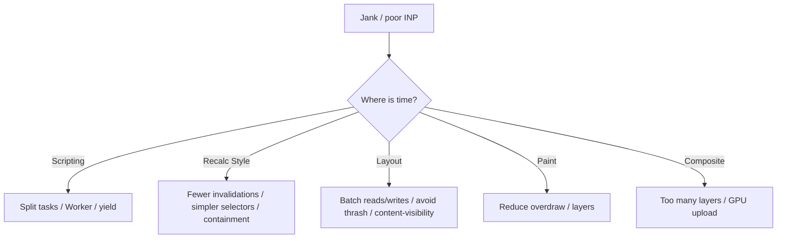

# Rendering Optimization

Optimization interviews want **measurement → bottleneck stage → targeted fix**. Blindly memoizing React or sprinkling `will-change` fails senior bars.

Related: [Rendering Pipeline](/browser/02-rendering-pipeline) · [Event Loop](/browser/03-event-loop) · [JS Performance](/javascript/22-performance) · [React Optimization](/react/08-optimization) · [Next.js](/nextjs/01-app-router)

## Measure first

| Metric / tool | What it tells you |
| --- | --- |
| LCP | Largest content paint — hero image/text |
| INP | Interaction latency (replaces FID) |
| CLS | Layout shift score |
| TTFB | Server/network before bytes |
| Performance panel | Long tasks, style/layout/paint |
| Rendering → Paint flashing | Overpaint |
| Layers panel | Layer explosion |

```ts
// Web Vitals-style observation
const po = new PerformanceObserver((list) => {
  for (const e of list.getEntries()) {
    if (e.entryType === 'largest-contentful-paint') console.log('LCP', e.startTime)
  }
})
po.observe({ type: 'largest-contentful-paint', buffered: true })

// Long tasks (>50ms)
const long = new PerformanceObserver((list) => {
  for (const e of list.getEntries()) console.log('long task', e.duration)
})
long.observe({ type: 'longtask', buffered: true })
```

## Map symptom → stage



## Main-thread strategies

1. **Break long tasks** — `scheduler.yield()`, `requestIdleCallback` for non-critical, Workers for CPU.
2. **Passive listeners** for scroll/touch.
3. **Debounce/throttle** input handlers ([Coding debounce](/coding/01-debounce-throttle)).
4. **Virtualize** long lists ([Virtual list](/machine-coding/04-virtual-list)).
5. **Avoid forced sync layout** ([Pipeline](/browser/02-rendering-pipeline)).

```ts
async function processChunks<T>(items: T[], work: (t: T) => void): Promise<void> {
  for (let i = 0; i < items.length; i++) {
    work(items[i]!)
    if (i % 50 === 0) {
      await new Promise<void>((r) => setTimeout(r, 0)) // yield task
    }
  }
}
```

## Rendering strategies

| Technique | Helps | Watch out |
| --- | --- | --- |
| `content-visibility: auto` | Skip offscreen render | Intrinsic size / scrollbar |
| `contain: content` | Limit invalidation | Incorrect containment bugs |
| Compositor animations | Smooth motion | Layout props still expensive |
| CSS `content-visibility` + virtualization | Huge DOMs | Accessibility / find-in-page |
| `loading="lazy"` images | Bandwidth / LCP contention | LCP image must NOT be lazy |
| Responsive images `srcset` | Decode/download size | Wrong sizes attribute |

```css
.feed-item {
  content-visibility: auto;
  contain-intrinsic-size: 1px 240px;
}
```

## Layer & paint hygiene

- Promote only animated nodes; remove `will-change` after.
- Prefer `transform` over animating `top`.
- Reduce stacking contexts / filters on large areas.
- Avoid huge box-shadows / blurs on scrolling content.

## Network ↔ render coupling

- Critical CSS / inline above-the-fold carefully.
- Preload LCP image; use correct `fetchpriority="high"`.
- Fonts: `font-display: swap` or optional; preload subset WOFF2.
- Code-split routes; hydrate less JS ([React RSC](/react/10-rsc), [Next](/nextjs/02-rsc)).

```html

```

## Framework-aware notes

React: memoization helps **only** when CPU reconciliation dominates — profile first ([React optimization](/react/08-optimization)). Concurrent features improve INP by yielding ([Concurrent](/react/04-concurrent)). Over-memoization adds comparison cost and complexity.

## Interview Questions

**Q1. LCP is slow — checklist?**  
TTFB, render-blocking CSS/JS, late discovery of hero image, lazy-loaded LCP, oversized image, font blocking text, client-only render waiting on JS.

**Q2. How do you fix layout thrashing?**  
Batch DOM writes, then reads; use `rAF`/Fastdom patterns; prefer transforms; cache geometry.

**Q3. Why is INP bad with React?**  
Large synchronous component trees on click; expensive selectors in handlers; cascading state updates. Fix: defer non-urgent updates (`startTransition`), virtualize, split long handlers.

**Q4. `will-change` made things worse — why?**  
Too many layers → memory + bandwidth; continuous promotion of static content.

**Q5. CLS fixes?**  
Explicit `width`/`height` or aspect-ratio boxes; reserve space for ads/embeds; avoid inserting above existing content; font metrics (`size-adjust`).

## Common Mistakes

- Optimizing without Performance panel evidence.
- Lazy-loading the LCP image.
- Animating layout properties with “GPU” comments.
- Mega CSS-in-JS runtime on every render.
- Hydrating entire page when static HTML + islands would do.
- Infinite scroll without virtualization → DOM death.

## Trade-offs

| Optimization | Gain | Cost |
| --- | --- | --- |
| Code splitting | Faster TTI | Waterfalls / spinners |
| SSR/RSC | Faster LCP/SEO | Complexity, server cost |
| Virtualization | DOM bound | Keyboard a11y, SEO for lists |
| Aggressive caching | Snappy nav | Stale content bugs |
| Workers | Parallel CPU | DX, serialization |

**Senior takeaway:** Say the **metric**, the **pipeline stage**, and **one concrete fix** — then mention the regression risk.

## Deep dive — INP breakdown

INP = input delay + processing + presentation. Input delay → main busy. Processing → your handlers/React. Presentation → style/layout/paint after. Fix the largest slice first with Performance event timing attribution.

```ts
new PerformanceObserver((list) => {
  for (const e of list.getEntries() as PerformanceEventTiming[]) {
    console.log(e.name, e.duration, e.processingStart - e.startTime)
  }
}).observe({ type: 'event', buffered: true, durationThreshold: 16 } as PerformanceObserverInit)
```

## Deep dive — image decode & LCP

Large images decode on main (historically) → long tasks. Use correctly sized resources, modern formats, `decoding="async"`, and avoid layout-shifting placeholders without dimensions. Priority hints on LCP candidate only.

## Deep dive — hydration cost

SSR HTML paints fast then JS hydrates — until hydration finishes, interactivity lags. Reduce client JS ([RSC](/react/10-rsc)), selective hydration, islands. Measure TTI/INP post-hydrate ([Next hydration](/nextjs/06-hydration)).

## Extra Q&A

**Q6. Is code splitting always good?**  
Waterfalls of small chunks can hurt; balance with HTTP cache and critical path.

**Q7. `preload` everything?**  
No — contention. Only critical path resources.

**Q8. Why virtualize?**  
DOM/layout cost grows with node count; windowing caps work ([Virtual list](/machine-coding/04-virtual-list)).

**Q9. GPU raster vs CPU?**  
Compositor/GPU helps; still pay upload. Giant blurs force expensive paints.

**Q10. Field vs lab metrics?**  
Lab (Lighthouse) controlled; field (CrUX/RUM) real users — optimize for field INP/LCP.


## Worked example — LCP regression after design change

Hero switched to CSS background-image → not discoverable by preload scanner as ``. Fix: real `` with dimensions + `fetchpriority=high` + preload.

## Budget sheet (example)

| Metric | Budget |
| --- | --- |
| LCP | < 2.5s p75 |
| INP | < 200ms p75 |
| CLS | < 0.1 |
| JS route | < 200KB gz |

Tie budgets to CI Lighthouse + RUM ([JS performance](/javascript/22-performance)).

## Third-party scripts

Tag managers often dominate long tasks — load deferred, facade patterns, Partytown/workers where appropriate.

## Glossary

| Term | Definition |
| --- | --- |
| RUM | Real user monitoring |
| CrUX | Chrome UX Report |
| Hydration | Attach listeners to SSR HTML |
| Facade | Lightweight placeholder before heavy embed |
| Critical request chain | Dependent waterfall depth |
