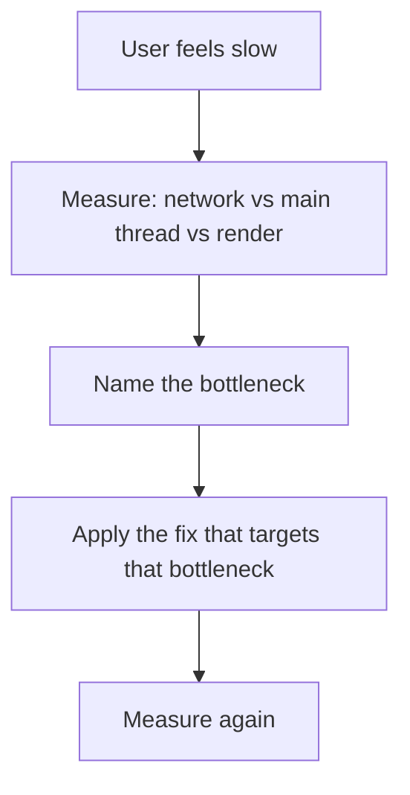
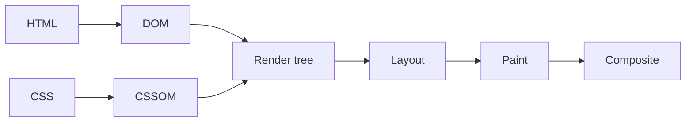
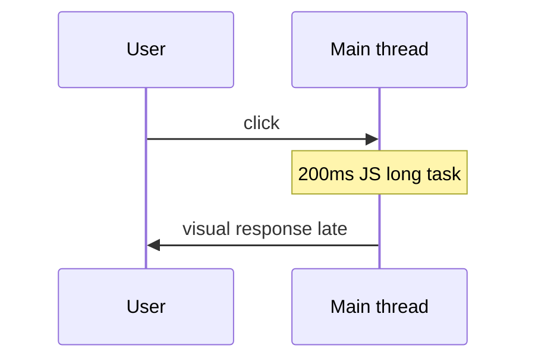
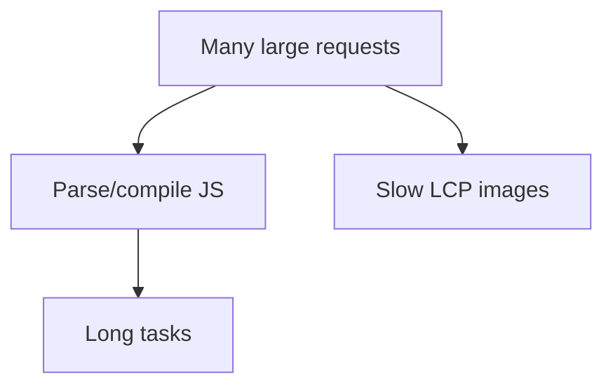
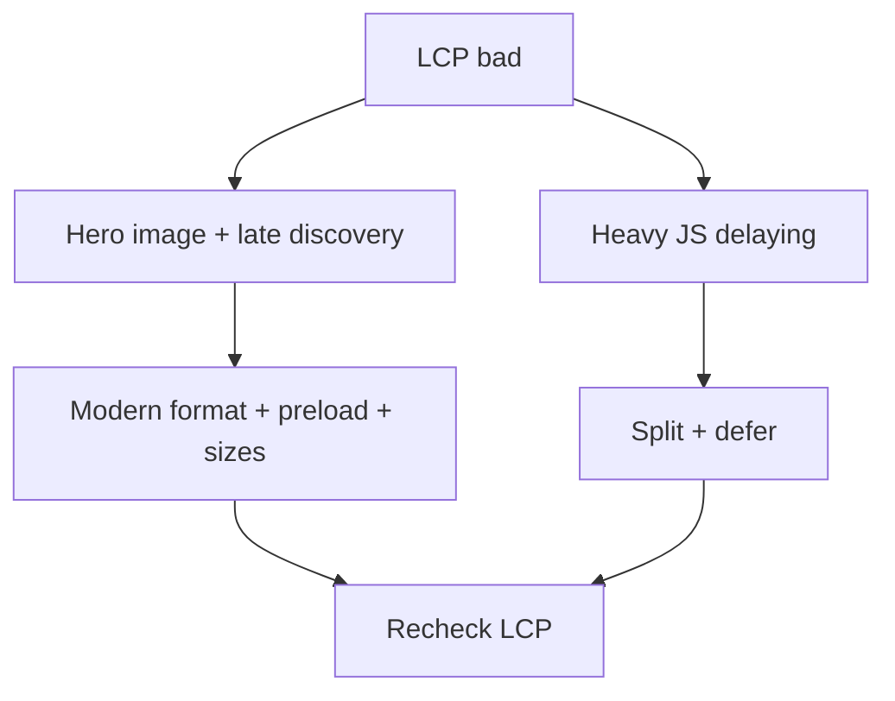

# Browser Performance Optimization

This chapter teaches browser performance from scratch. You do not need to already know “critical rendering path,” layout thrashing, or compositing layers. By the end you should be able to **measure first**, explain **what makes a page feel slow**, name **which problem each optimization solves**, and avoid cargo-cult tips that fix the wrong bottleneck.

Related: [Rendering Pipeline](/browser/02-rendering-pipeline) · [Networking](/browser/05-networking) · [Event Loop](/browser/03-event-loop) · [Memory](/browser/07-memory-gc)

---

## 1. The only rule that comes first: measure

Optimization without measurement is guessing. A page can feel slow for completely different reasons:

| Symptom users feel | Often actually… |
| --- | --- |
| Blank screen a long time | Slow network / huge JS parse / blocked rendering |
| Click → laggy response | Long tasks on main thread / forced layout |
| Scroll jank | Expensive paint / layout per frame / too much main-thread work |
| Fast first paint, slow “usable” | Hydration / huge client bundles |

**Tools (conceptual):**

- **Lighthouse / lab metrics** — reproducible scores (not identical to real users)
- **Web Vitals field data** — LCP, INP, CLS from real users
- **Performance panel** — flame chart of main thread
- **Network panel** — waterfalls, blocking, sizes
- **Coverage** — unused CSS/JS



Interview signal: say **what you would look at**, not a laundry list of buzzwords.

---

## 2. Critical rendering path — why first paint waits

### 2.1 Plain language

The **critical rendering path** is the sequence of work from receiving HTML to putting meaningful pixels on the screen.

Rough pipeline (simplified):

1. Fetch HTML
2. Parse HTML → DOM
3. Fetch CSS (and parse) → CSSOM
4. Combine → Render tree
5. **Layout** (geometry)
6. **Paint**
7. **Composite** (put layers on screen)

JavaScript can interrupt and delay this (parser-blocking scripts, long tasks).



### 2.2 What blocks first paint?

| Resource / action | Why it delays pixels |
| --- | --- |
| CSS in `<head>` (render-blocking) | Browser often waits to avoid unstyled flash |
| Sync `<script>` without `defer`/`async` | Stops HTML parsing; may run before first paint |
| Huge HTML | Slow parse |
| Fonts swapping late | Text invisible or layout shift (see fonts section) |
| Waiting on JS to inject content | Nothing meaningful in HTML |

### 2.3 Problem → fix map for CRP

| Problem | Fix that targets it |
| --- | --- |
| CSS blocks first paint forever | Split critical CSS; defer non-critical; reduce CSS weight |
| Scripts block parser | `defer` / `type="module"` (defer by default) / move non-critical later |
| Too much above-the-fold work | Ship less HTML/CSS/JS for first view |
| Slow server / TTFB | CDN, caching, faster origin |

```html
<!-- Parser continues; run after document parsed -->
<script src="/app.js" defer></script>

<!-- Modules defer by default -->
<script type="module" src="/app.js"></script>
```

---

## 3. Main thread, long tasks, and interactivity

After paint, users click. The browser handles input on the **main thread** (mostly), shared with JS, layout, and paint.

A **long task** (~50ms+) blocks input handling → poor **INP** (Interaction to Next Paint).

```ts
// BAD — huge sync work on click
button.addEventListener("click", () => {
  for (let i = 0; i < 1e8; i++) doSomething(i)
  updateUI()
})
```

**Problem:** JS monopolizes the main thread.  
**Fixes that target it:** break work (`scheduler` / `requestIdleCallback` / chunking), move heavy work to **Web Workers**, debounce, virtualize lists, memoize only when profiling says so.



---

## 4. Layout thrashing — read/write interleaving

### 4.1 The attack on your frame budget

**Layout** (reflow) computes geometry: sizes and positions.

Reading geometry (`offsetHeight`, `getBoundingClientRect`, `clientWidth`, …) may force the browser to **flush pending style/layout** so the answer is correct.

Writing styles invalidates layout. Pattern:

```ts
// BAD — thrash: write, read, write, read...
for (const el of elements) {
  el.style.width = "50%"      // write — invalidate
  const h = el.offsetHeight   // read — force layout NOW
  el.style.height = h + "px"  // write again
}
```

Each forced layout is expensive. Doing it in a loop is **layout thrashing** (also called forced synchronous layout).

### 4.2 Batch reads and writes

```ts
// BETTER — read all, then write all
const heights = elements.map((el) => el.offsetHeight)
elements.forEach((el, i) => {
  el.style.height = heights[i] + "px"
})
```

Or use `requestAnimationFrame` to schedule writes in a known frame phase; libraries like fastdom formalize read/write batches.

**Problem solved:** fewer forced layouts per frame → less jank.

---

## 5. Paint vs composite — why some animations are cheap

### 5.1 Layers of cost (simplified)

| Work | Rough cost | Typical triggers |
| --- | --- | --- |
| **Layout** | High | Changing width/height/top/left affecting flow |
| **Paint** | Medium–high | Color, box-shadow, backgrounds redraw |
| **Composite** | Lower | Transform/opacity on their own layer |

Animating `left`/`top`/`width` often causes layout + paint every frame. Animating `transform` and `opacity` can often stay on the **compositor** — smoother if set up correctly.

```css
/* Prefer for motion */
.card {
  transform: translateY(0);
  transition: transform 200ms ease;
}
.card:hover {
  transform: translateY(-4px);
}
```

**Problem solved:** dropped frames during animation / scroll.

`will-change: transform` can promote layers — overuse wastes memory. Measure; don’t spray it everywhere.

---

## 6. Network weight and waterfalls

### 6.1 What “too much network” looks like

- Huge JS bundles
- Unoptimized images
- Dozens of sequential critical requests
- No compression / poor caching



### 6.2 Problem → fix

| Problem | Fix |
| --- | --- |
| Huge initial JS | Code split, tree-shake, remove dead deps |
| Download bandwidth | Compression (gzip/br), HTTP/2/3, CDN |
| Repeat visits slow | Cache headers, service worker strategies |
| Chain of critical requests | Preload critical, reduce depth, early hints |

```html
<link rel="preload" as="image" href="/hero.avif" />
<link rel="preconnect" href="https://api.example.com" />
```

`preconnect` / `dns-prefetch` help **connection setup**. `preload` helps **critical resources**. Mis-preloading everything competes for bandwidth.

---

## 7. Lazy loading — defer what is not needed yet

### 7.1 Images and iframes

```html

```

**Problem solved:** fewer bytes and less decode work for offscreen media on first load.

Always include **width/height** (or aspect-ratio) to reduce **CLS** (layout shift).

### 7.2 Intersection Observer for custom lazy work

```ts
const io = new IntersectionObserver((entries) => {
  for (const e of entries) {
    if (e.isIntersecting) {
      loadWidget(e.target)
      io.unobserve(e.target)
    }
  }
})
io.observe(document.getElementById("heavy-widget")!)
```

**Problem solved:** don’t pay for below-the-fold widgets until visible.

### 7.3 Don’t lazy-load LCP

Your largest above-the-fold image is often the **LCP** element. Lazy-loading it **hurts**. Eager-load / preload the hero.

---

## 8. Code splitting — smaller initial JS

### 8.1 The problem

One giant bundle means:

- Longer download
- Longer parse/compile
- Longer time to interactive

Even unused routes’ code ships up front.

### 8.2 Dynamic import

```ts
button.addEventListener("click", async () => {
  const { openChart } = await import("./chart.js")
  openChart()
})
```

Bundlers (Vite, webpack) emit a **separate chunk** loaded on demand.

Route-level splitting in SPAs/Next.js:

```ts
// conceptual
const Settings = lazy(() => import("./Settings"))
```

**Problem solved:** reduce initial JS for first view; pay later when the feature is used.

**Trade-off:** first visit to that route pays a fetch; use loading UI; prefetch on hover/intent when it helps.

---

## 9. Fonts — invisible text and layout shift

### 9.1 What goes wrong

Custom fonts must download. Until then browsers may:

- Show fallback font, then swap → **layout shift** if metrics differ
- Or hide text (**FOIT**) until font arrives → feels broken

### 9.2 `font-display`

```css
@font-face {
  font-family: "Display";
  src: url("/display.woff2") format("woff2");
  font-display: swap; /* or optional, for less shift on slow nets */
}
```

| Strategy idea | Solves |
| --- | --- |
| `font-display: swap` | Text visible ASAP; may shift when font lands |
| `font-display: optional` | Avoid late swaps on slow connections |
| Subset fonts | Fewer bytes |
| `size-adjust` / metric-matched fallbacks | Reduce CLS from swap |
| Preload critical woff2 | Faster font availability |

```html
<link rel="preload" as="font" href="/display.woff2" type="font/woff2" crossorigin />
```

Fonts use CORS mode — `crossorigin` on preload matters.

**Problem solved:** slow text / jarring font swaps / CLS from typography.

---

## 10. Images — usually the heaviest pixels

### 10.1 Problems images cause

- Large LCP
- Bandwidth on mobile
- Decode costs
- CLS if dimensions missing
- Too many formats that the browser can’t use efficiently

### 10.2 Fixes that map to problems

| Problem | Fix |
| --- | --- |
| Wrong resolution for screen | `srcset` / `sizes`; responsive images |
| Heavy codec | AVIF/WebP with fallbacks |
| CLS | width/height or aspect-ratio |
| Offscreen cost | `loading="lazy"` (not for LCP) |
| Art direction | `<picture>` |
| Cache forever wrong file | Fingerprint filenames + long cache |

```html

```

```html
<picture>
  <source type="image/avif" srcset="/hero.avif" />
  <source type="image/webp" srcset="/hero.webp" />
  
</picture>
```

Compress and resize on a CDN/image pipeline — don’t ship 4000px photos into a 400px slot.

---

## 11. CSS and JS weight specifics

### 11.1 CSS

| Problem | Fix |
| --- | --- |
| Huge unused CSS | Purge/coverage; component CSS; avoid shipping entire design systems unused |
| Expensive selectors (rare today vs other costs) | Prefer simple selectors; profile paint |
| `@import` chains in CSS | Extra round trips — prefer bundling |

### 11.2 JavaScript

| Problem | Fix |
| --- | --- |
| Dead code | Tree-shaking, avoid side-effecty barrels |
| Polyfills for ancient browsers | Ship modern baseline; differential loading if needed |
| Duplicate dependencies | Deduplicate; check bundle analyzer |
| Hydration cost (SSR apps) | Reduce client components / islands; stream wisely |

Use a **bundle analyzer** once — seeing a 300KB charting library on the home page ends debates.

---

## 12. Caching strategies (browser + HTTP)

| Mechanism | Problem it solves |
| --- | --- |
| `Cache-Control` on static assets | Repeat visits don’t re-download |
| Fingerprinted filenames (`app.abc123.js`) | Safe long-term cache + easy invalidate |
| ETag / revalidation | Medium-change resources |
| Service worker Cache API | Offline / controlled cache-first |

Wrong caching causes “users stuck on old bugs.” Version assets; don’t set `max-age=infinity` on `index.html` without a plan.

---

## 13. Core Web Vitals — vocabulary for interviews

| Metric | In plain language | Often improved by |
| --- | --- | --- |
| **LCP** | When the main content appears | Optimize hero image/text; reduce block; server speed |
| **INP** | How quickly UI reacts to input | Shorter long tasks; less main-thread contention |
| **CLS** | How much layout jumps | Sizes on images/ads/fonts; reserve space |

These are **outcomes**. Optimizations are **inputs**. Connect them explicitly in answers.

---

## 14. End-to-end walkthrough

**Complaint:** “Our product page feels slow on mobile.”

1. **Field data:** LCP poor; INP OK; CLS OK → focus LCP.
2. **Lab:** Network waterfall shows 2MB PNG hero, no preload; 800KB JS before content.
3. **Fixes:**
   - Convert hero to AVIF/WebP, correct dimensions, preload hero, **not** lazy
   - Code-split below-the-fold reviews widget
   - `defer` non-critical scripts; trim CSS
4. **Remeasure** LCP on mid-tier mobile throttling.



---

## 15. Anti-patterns (cargo cult)

- Micro-optimizing React `memo` everywhere without profiles
- `will-change` on every element
- Lazy-loading the LCP image
- Prefetching the entire site on first load
- “We use a CDN” while shipping 5MB of JS
- Animating `height` with huge layouts and blaming the device

---

## Interview Questions

### Q1. What is the critical rendering path?
**Expected:** The dependency chain from HTML/CSS(/JS) to first rendered pixels — DOM, CSSOM, render tree, layout, paint, composite.  
**Common wrong:** “It’s just the CDN.”  
**Follow-ups:** What makes CSS render-blocking?

### Q2. What is layout thrashing?
**Expected:** Interleaving style writes with geometry reads so the browser repeatedly recalculates layout synchronously.  
**Common wrong:** “Any use of CSS is thrashing.”  
**Follow-ups:** How do you batch to fix it?

### Q3. Why prefer `transform` for animations?
**Expected:** Often composited without layout/paint of the whole document each frame; animating geometry properties is costlier.  
**Common wrong:** “transform is always free.”  
**Follow-ups:** Memory cost of too many layers?

### Q4. How does code splitting help?
**Expected:** Ships less JS for the initial route; downloads/parses feature code on demand.  
**Common wrong:** “It makes the network optional.”  
**Follow-ups:** When is the trade-off painful?

### Q5. Why measure before optimizing?
**Expected:** Bottlenecks differ (network vs CPU vs memory vs layout); wrong fix wastes time.  
**Common wrong:** “Always minify and you’re done.”  
**Follow-ups:** Lab vs field metrics?

### Q6. How can fonts hurt CLS and LCP?
**Expected:** Late swaps change text metrics (CLS); delayed text/font can affect when content appears.  
**Common wrong:** “Fonts never affect performance metrics.”  
**Follow-ups:** What does `font-display: optional` trade?

### Q7. Should all images be lazy-loaded?
**Expected:** No — offscreen yes; LCP/hero usually eager + possibly preloaded.  
**Common wrong:** “lazy everywhere is a free win.”  
**Follow-ups:** How do width/height help CLS?

### Q8. What is a long task and why care?
**Expected:** Main-thread work that blocks input/rendering for an extended time; hurts interactivity (INP).  
**Common wrong:** “Only network matters for UX.”  
**Follow-ups:** How would you break up work?

---

## Common Mistakes

- Optimizing blindly from a blog checklist.
- Lazy-loading the hero image.
- Ignoring image dimensions → CLS.
- One multi-megabyte bundle for a marketing page.
- Forced layout inside scroll handlers without batching.
- Over-preloading competing with critical bytes.
- Forever-caching HTML without versioning strategy.
- Blaming GC for jank that is actually layout/paint.

---

## Trade-offs / Production Notes

- **Measure → fix → remeasure** is the professional loop; ship budgets (e.g. max initial JS).
- Prioritize **LCP/INP/CLS** with real-user monitoring when available.
- Mobile mid-tier CPUs are the honest target for JS cost.
- Prefetch on intent (hover) beats prefetch-everything.
- Design systems: tree-shake or import only used components.
- Related: [Rendering Pipeline](/browser/02-rendering-pipeline), [Networking](/browser/05-networking), [Memory](/browser/07-memory-gc), [Modules / splitting](/javascript/13-modules).
