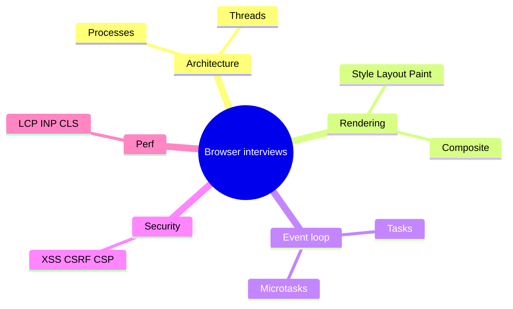

# Browser Interview Q&A

Dense drill set spanning architecture → security → performance. Cross-check deep chapters linked under each answer.

Related tracks: [JS Senior Q&A](/javascript/24-senior-js-qa) · [React Q&A](/react/12-interview-qa) · [Senior FE Q&A](/senior-qa/01-frontend)



## Interview Questions

### Architecture & processes

```ts
// Mental model anchors for verbal answers
type BrowserConcern =
  | 'process-isolation'
  | 'main-thread-contention'
  | 'compositor-only-animation'
  | 'sop-security'
```

**Q1. Why multi-process browsers?**  
Crash isolation, security (Site Isolation / Spectre), privilege separation. Cost: memory + IPC. → [Architecture](/browser/01-architecture)

**Q2. What is Site Isolation?**  
Renderers separated by site so a compromised renderer can’t freely read another origin’s memory.

**Q3. Main thread vs compositor?**  
Main: JS, style, layout, paint record. Compositor: tiles frames, scroll, compositor-only animations.

**Q4. Can Web Workers access DOM?**  
No. Message-passing only (structured clone / transferables / SAB with COOP/COEP).

**Q5. What blocks bfcache?**  
`unload` listeners, some `no-store`, busy connections — engine-specific. Prefer `pagehide`/`pageshow`.

## Rendering

**Q6. Pipeline stages?**  
Parse → style → layout → paint → composite. → [Pipeline](/browser/02-rendering-pipeline)

**Q7. Forced synchronous layout?**  
Reading geometry after writes flushes layout mid-script.

**Q8. Why `transform` over `top`?**  
Often composite-only; `top` triggers layout.

**Q9. `content-visibility: auto`?**  
Skips rendering off-screen content with containment; needs intrinsic size hints.

**Q10. Render tree vs DOM?**  
Render tree excludes `display:none`; includes anonymous boxes/pseudos for painting.

## Event loop

**Q11. Microtask vs task?**  
Microtasks drain completely after each task before render; tasks are one-per-turn from queues. → [Event Loop](/browser/03-event-loop) · [JS Event Loop](/javascript/10-event-loop)

**Q12. Where does rAF run?**  
Before paint, after microtasks of the preceding turn (rendering opportunity).

**Q13. Can promises starve rendering?**  
Yes — continuous microtask scheduling prevents paint.

**Q14. Browser vs Node loop?**  
Browser includes rendering/input; Node uses libuv phases + `nextTick`.

**Q15. Passive event listeners?**  
Tell browser it can scroll without waiting for `preventDefault` — better scroll INP.

## CSS internals

**Q16. Specificity of `#x.y`?**  
One ID + one class → (0,1,1,0). → [CSS](/browser/04-css-internals)

**Q17. Stacking context traps?**  
`opacity`, `transform`, `filter`, positioned+z-index create contexts; children can’t escape.

**Q18. Fixed positioning “broken”?**  
Transformed ancestor becomes containing block.

**Q19. Cascade layers vs specificity?**  
Higher layer wins across specificity within origin/importance.

**Q20. Flex child won’t shrink?**  
`min-width: auto` — set `min-width: 0`.

## Networking

**Q21. H2 vs H3?**  
Multiplexing both; H3 avoids TCP HOL via QUIC. → [Networking](/browser/05-networking)

**Q22. CORS preflight purpose?**  
Ask server if non-simple cross-origin request is allowed before sending it.

**Q23. preload vs prefetch?**  
Current nav critical vs future nav speculative.

**Q24. Why `Vary: Cookie` hurts CDN?**  
Cache key explodes; personalization often forces `private`.

**Q25. Early Hints?**  
103 suggests preloads during waiting for final response.

## Security

**Q26. XSS vs CSRF?**  
XSS: attacker script in origin. CSRF: attacker triggers victim-authenticated request. → [Security](/browser/06-security)

**Q27. Best CSRF baseline 2026?**  
`SameSite` cookies + CSRF token / SameSite-safe API design + no state-changing GETs.

**Q28. CSP nonce?**  
Per-response random; only matching inline/script tags execute; blocks injected scripts.

**Q29. Why not JWT in localStorage?**  
Any XSS reads it. HttpOnly cookie harder to exfiltrate (still need CSRF defenses).

**Q30. `postMessage` checklist?**  
Verify `origin`; explicit target origin; validate schema of `data`.

## Memory & storage

**Q31. Detached DOM leak?**  
JS still references removed nodes. Snapshot retainers. → [Memory](/browser/07-memory-gc)

**Q32. AbortController benefit?**  
Bulk-remove listeners/fetches on teardown.

**Q33. localStorage vs IndexedDB?**  
Sync/small/strings vs async/large/structured. → [Storage](/browser/08-storage)

**Q34. Storage partitioning?**  
Third-party contexts get partition keys so embeds can’t share cross-site tracking storage freely.

**Q35. Persistent storage?**  
`navigator.storage.persist()` — best-effort against eviction.

## Optimization

**Q36. INP improvement playbook?**  
Find long tasks → split/yield → cheaper handlers → concurrent UI → virtualize. → [Optimization](/browser/09-optimization) · [React concurrent](/react/04-concurrent)

**Q37. LCP image rules?**  
Discover early, preload/fetchpriority, correct size/format, don’t lazy-load.

**Q38. CLS?**  
Reserve space; font strategies; avoid late insertions above fold.

**Q39. Measure style invalidation?**  
Performance panel “Recalculate Style”; reduce scope with containment/classes.

**Q40. When Workers don’t help?**  
DOM-bound work, tiny tasks (messaging overhead dominates), or already I/O bound.

## Mixed senior scenarios

**Q41. “Page freezes 2s on button click” — debug steps?**  
Performance record → long task attribution → JS stack vs layout → fix algorithmic cost / yield / defer non-urgent React updates.

**Q42. “Safari users logged out in iframes” — hypothesis?**  
ITP / partitioned cookies / third-party cookie blocking — move to first-party auth flows.

**Q43. “Animation smooth but scroll janky” — hypothesis?**  
Scroll handler non-passive or layout thrashing on scroll; main-thread busy; too much paint on scroll.

**Q44. “CORS error but Network shows 200” — explain?**  
Browser hid body from JS because ACAO missing/mismatched; console CORS error.

**Q45. “Memory grows each visit to page in SPA” — approach?**  
Heap snapshots compare; check global caches, listeners, React Query, third parties; confirm Detached HTMLElement growth.

## Rapid-fire definitions

| Term | One-liner |
| --- | --- |
| Origin | scheme + host + port |
| Site | scheme + registrable domain (isolation unit) |
| Critical path | Resources blocking first render |
| Long task | Main thread task >50ms |
| Stacking context | Atomic z-order group |
| BFC | Block formatting context — float containment / margin boundary |
| Preflight | CORS OPTIONS for non-simple requests |
| Microtask | Promise/queueMicrotask jobs drained before render |
| bfcache | In-memory full page snapshot for back/forward |
| CHIPS | Partitioned third-party cookies |

## Common Mistakes (meta)

- Memorizing buzzwords without naming the **thread/process** involved.
- Confusing Node and browser loops.
- Saying “CORS encrypts data” (it doesn’t).
- Claiming CSP alone stops all XSS (injection into allowed sinks / gadgets).
- Optimizing React before proving browser pipeline cost.

## Trade-offs (meta interview frame)

Always close senior answers with a trade-off sentence:

> “I’d X because it improves Y metric/security property; the cost is Z (complexity/memory/compatibility), so I’d validate with W measurement.”

That structure scores higher than a bare fact dump.

## Scenario drills (answer → chapter)

| Prompt | Point to |
| --- | --- |
| “Click feels laggy” | [Event Loop](/browser/03-event-loop) + [Optimization](/browser/09-optimization) |
| “Hero image late” | [Networking](/browser/05-networking) + LCP rules |
| “Modal behind overlay” | [CSS stacking](/browser/04-css-internals) |
| “Session stolen via comment” | [XSS](/browser/06-security) |
| “Transfer from evil.com” | CSRF + SameSite |
| “Tab crash others fine” | [Architecture](/browser/01-architecture) |
| “Memory climbs on route change” | [Memory](/browser/07-memory-gc) |
| “Offline shell stale” | [Storage](/browser/08-storage) SW versioning |
| “Layout thrash in animation” | [Pipeline](/browser/02-rendering-pipeline) |
| “CORS 200 but JS error” | ACAO / credentials |

## Follow-up ladder (senior)

After any answer, expect: “How would you measure?” → “What could regress?” → “How does this interact with React/Next?” Tie to [React optimization](/react/08-optimization) and [JS performance](/javascript/22-performance).

## 10 more rapid Qs

**Q46. Speculative parsing?** HTML parser continues while classic script downloads (limited); modules defer.  
**Q47. Preload scanner?** Looks ahead for URLs before full parse — why early discovery matters.  
**Q48. Compositor thread scroll?** Independent of main if no non-passive listeners / layout-inducing scroll handlers.  
**Q49. Cookie `Partitioned`?** CHIPS — third-party cookie per top-level site.  
**Q50. `content-visibility` a11y?** Off-screen content may be skipped — test find-in-page / AT.  
**Q51. Why HttpOnly doesn’t stop XSS actions?** Script can still call APIs as the user; can’t exfiltrate cookie string easily.  
**Q52. Long task attribution?** Performance panel bottom-up / show third-party.  
**Q53. `fetchpriority` vs preload?** Both influence priority; don’t duplicate carelessly.  
**Q54. Why `transform` on SVG sometimes still expensive?** Large filter regions / software fallbacks.  
**Q55. Cross-origin isolation headers?** COOP+COEP for SAB; breaks some embeds.

## Cheat-sheet: property → pipeline stage

| Change | Likely stages |
| --- | --- |
| `color` | Paint |
| `width` | Layout + Paint |
| `transform` | Composite |
| class affecting selectors | Style (+ maybe Layout) |
| add/remove DOM | Style + Layout + Paint |

Memorize this table — it unlocks half of FE systems interviews.


## Spaced-repetition deck (self-test)

Day 1: architecture processes/threads. Day 2: pipeline stages + thrashing. Day 3: event loop ordering puzzles. Day 4: CSS containing/stacking. Day 5: CORS + cache. Day 6: XSS/CSRF/CSP triad. Day 7: memory snapshots + storage choice. Day 8: INP/LCP drills. Day 9: mixed scenarios from this file. Day 10: teach aloud to rubber duck.

## Pair with JS / React chapters

| Browser topic | Pair |
| --- | --- |
| Event loop | [JS event loop](/javascript/10-event-loop) |
| Rendering | [JS rendering](/javascript/20-rendering) · [React Fiber](/react/01-fiber) |
| Security | [JS security](/javascript/21-security) |
| Optimization | [React optimization](/react/08-optimization) |
| Memory | [JS memory](/javascript/12-memory) |

## Closing senior narrative

“Browsers are multi-process; my JS fights for the main thread with layout/paint; I schedule work, measure with Web Vitals, and enforce SOP/CSP at trust boundaries.” That one paragraph frames most follow-ups.
