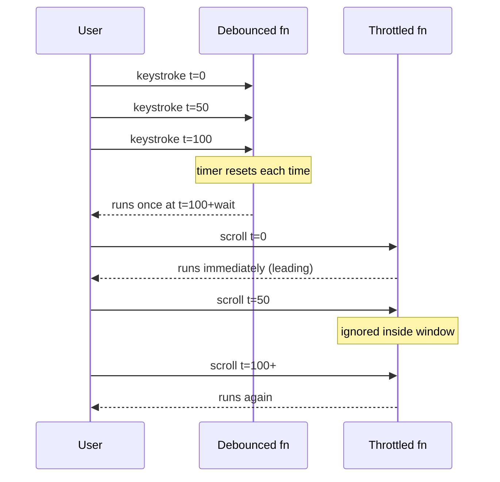

# Debounce & Throttle

Rate-limit how often a function runs. Interviewers want the **difference**, **leading/trailing** variants, **cancel/flush**, and correct `this`/`args` handling.

## Mental model

| | Debounce | Throttle |
| --- | --- | --- |
| Idea | Wait for quiet period | Fire at most once per interval |
| Typical UI | Search-as-you-type | Scroll / resize / mousemove |
| Analogy | Elevator door closes after last passenger | Turnstile every N seconds |



## Debounce (trailing + leading + maxWait)

```ts
type AnyFn = (...args: any[]) => any

interface DebounceOptions {
  leading?: boolean
  trailing?: boolean
  maxWait?: number
}

interface Debounced<F extends AnyFn> {
  (...args: Parameters<F>): void
  cancel(): void
  flush(): ReturnType<F> | undefined
  pending(): boolean
}

export function debounce<F extends AnyFn>(
  fn: F,
  wait: number,
  options: DebounceOptions = {}
): Debounced<F> {
  const { leading = false, trailing = true, maxWait } = options
  let timer: ReturnType<typeof setTimeout> | undefined
  let lastArgs: Parameters<F> | undefined
  let lastThis: ThisParameterType<F> | undefined
  let lastCallTime = 0
  let lastInvokeTime = 0
  let result: ReturnType<F> | undefined

  const invoke = (time: number) => {
    const args = lastArgs!
    const ctx = lastThis
    lastArgs = lastThis = undefined
    lastInvokeTime = time
    result = fn.apply(ctx, args)
    return result
  }

  const shouldInvoke = (time: number) => {
    const timeSinceCall = time - lastCallTime
    const timeSinceInvoke = time - lastInvokeTime
    return (
      lastCallTime === 0 ||
      timeSinceCall >= wait ||
      timeSinceCall < 0 ||
      (maxWait !== undefined && timeSinceInvoke >= maxWait)
    )
  }

  const trailingEdge = (time: number) => {
    timer = undefined
    if (trailing && lastArgs) return invoke(time)
    lastArgs = lastThis = undefined
    return result
  }

  const timerExpired = () => {
    const time = Date.now()
    if (shouldInvoke(time)) return trailingEdge(time)
    const timeSinceCall = time - lastCallTime
    const timeSinceInvoke = time - lastInvokeTime
    const timeWaiting = wait - timeSinceCall
    const remaining =
      maxWait === undefined
        ? timeWaiting
        : Math.min(timeWaiting, maxWait - timeSinceInvoke)
    timer = setTimeout(timerExpired, remaining)
  }

  const leadingEdge = (time: number) => {
    lastInvokeTime = time
    timer = setTimeout(timerExpired, wait)
    return leading ? invoke(time) : result
  }

  const debounced = function (this: ThisParameterType<F>, ...args: Parameters<F>) {
    const time = Date.now()
    const isInvoking = shouldInvoke(time)
    lastArgs = args
    lastThis = this
    lastCallTime = time

    if (isInvoking) {
      if (timer === undefined) return leadingEdge(time)
      if (maxWait !== undefined) {
        timer = setTimeout(timerExpired, wait)
        return invoke(time)
      }
    }
    if (timer === undefined) timer = setTimeout(timerExpired, wait)
    return result
  } as Debounced<F>

  debounced.cancel = () => {
    if (timer !== undefined) clearTimeout(timer)
    lastCallTime = lastInvokeTime = 0
    lastArgs = lastThis = timer = undefined
  }

  debounced.flush = () => {
    if (timer === undefined) return result
    return trailingEdge(Date.now())
  }

  debounced.pending = () => timer !== undefined

  return debounced
}
```

## Throttle (leading + trailing)

```ts
export function throttle<F extends AnyFn>(
  fn: F,
  wait: number,
  options: { leading?: boolean; trailing?: boolean } = {}
): Debounced<F> {
  const { leading = true, trailing = true } = options
  // Throttle = debounce with maxWait === wait
  return debounce(fn, wait, { leading, trailing, maxWait: wait })
}
```

Minimal standalone throttle (easier to hand-write in 10 minutes):

```ts
export function throttleSimple<F extends AnyFn>(fn: F, wait: number) {
  let last = 0
  let timer: ReturnType<typeof setTimeout> | undefined
  return function (this: ThisParameterType<F>, ...args: Parameters<F>) {
    const now = Date.now()
    const remaining = wait - (now - last)
    if (remaining <= 0) {
      if (timer) {
        clearTimeout(timer)
        timer = undefined
      }
      last = now
      fn.apply(this, args)
    } else if (!timer) {
      timer = setTimeout(() => {
        last = Date.now()
        timer = undefined
        fn.apply(this, args)
      }, remaining)
    }
  }
}
```

## Interview Q&A

**Q: Debounce vs throttle for infinite scroll?**  
Throttle (or `IntersectionObserver`). Debounce would delay until scrolling stops — bad UX for loading more.

**Q: Why preserve `this`?**  
Methods like `obj.onScroll` lose `this` when passed as callbacks; use `apply`.

**Q: How do you cancel in-flight work?**  
Debounce only cancels the *scheduled* call. Pair with `AbortController` for the fetch itself.

## Common mistakes

| Mistake | Fix |
| --- | --- |
| Recreating debounce every render | `useMemo` / `useRef` / hoist outside component |
| Forgetting trailing call | Document leading-only vs trailing |
| Using debounce for games/animation | Prefer `requestAnimationFrame` |
| Not clearing on unmount | `cancel()` in `useEffect` cleanup |

## Trade-offs

| Choice | Pros | Cons |
| --- | --- | --- |
| Leading | Instant feedback | Can miss final value |
| Trailing | Final value accurate | Feels laggy |
| maxWait | Guarantees progress under continuous input | More complex |

## Production relevance

Search boxes → debounce 200–300ms. Analytics / scroll → throttle 100–200ms. Always cancel on unmount; abort fetches separately.
