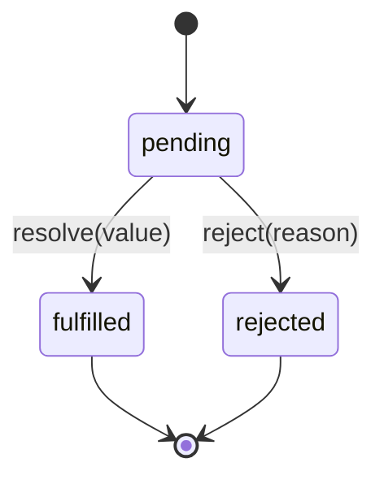
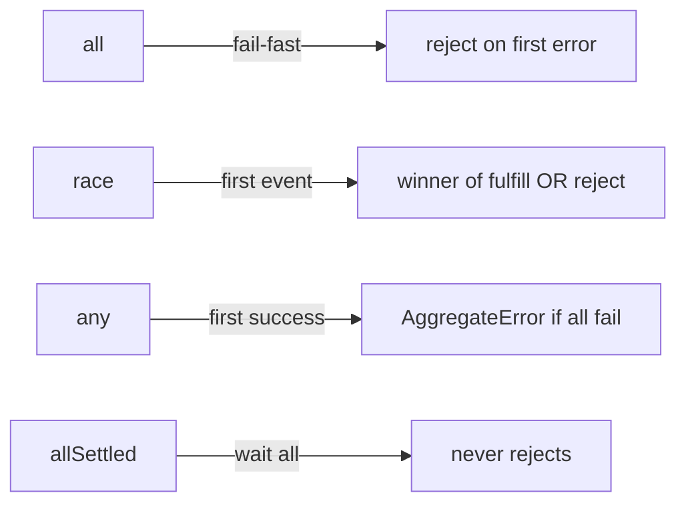

# Promise from Scratch + Combinators

Implement a Promises/A+-compatible subset, then `all` / `any` / `race` / `allSettled`. Interviewers probe microtasks, chaining, and error propagation.

## States



A Promise settles **once**. `then` always returns a **new** Promise. Reactions run as **microtasks**.

## Full implementation

```ts
type Resolve<T> = (value: T | PromiseLike<T>) => void
type Reject = (reason?: unknown) => void
type Executor<T> = (resolve: Resolve<T>, reject: Reject) => void

const enum State {
  Pending,
  Fulfilled,
  Rejected,
}

function isThenable(x: unknown): x is PromiseLike<unknown> {
  return (
    (typeof x === 'object' && x !== null) || typeof x === 'function'
  ) && typeof (x as PromiseLike<unknown>).then === 'function'
}

function enqueueMicrotask(fn: () => void) {
  queueMicrotask(fn)
}

export class MyPromise<T> {
  private state: State = State.Pending
  private value!: T
  private reason!: unknown
  private onFulfilled: Array<(v: T) => void> = []
  private onRejected: Array<(r: unknown) => void> = []

  constructor(executor: Executor<T>) {
    const resolve: Resolve<T> = (value) => {
      if (this.state !== State.Pending) return
      if (value === (this as unknown)) {
        reject(new TypeError('Chaining cycle detected'))
        return
      }
      if (isThenable(value)) {
        try {
          value.then(resolve, reject)
        } catch (e) {
          reject(e)
        }
        return
      }
      this.state = State.Fulfilled
      this.value = value as T
      this.onFulfilled.forEach((fn) => fn(this.value))
      this.onFulfilled = []
      this.onRejected = []
    }

    const reject: Reject = (reason) => {
      if (this.state !== State.Pending) return
      this.state = State.Rejected
      this.reason = reason
      this.onRejected.forEach((fn) => fn(this.reason))
      this.onFulfilled = []
      this.onRejected = []
    }

    try {
      executor(resolve, reject)
    } catch (e) {
      reject(e)
    }
  }

  then<TResult1 = T, TResult2 = never>(
    onFulfilled?: ((value: T) => TResult1 | PromiseLike<TResult1>) | null,
    onRejected?: ((reason: unknown) => TResult2 | PromiseLike<TResult2>) | null
  ): MyPromise<TResult1 | TResult2> {
    return new MyPromise<TResult1 | TResult2>((resolve, reject) => {
      const handleFulfill = (value: T) => {
        enqueueMicrotask(() => {
          try {
            if (typeof onFulfilled !== 'function') {
              resolve(value as unknown as TResult1)
              return
            }
            resolve(onFulfilled(value) as TResult1)
          } catch (e) {
            reject(e)
          }
        })
      }

      const handleReject = (reason: unknown) => {
        enqueueMicrotask(() => {
          try {
            if (typeof onRejected !== 'function') {
              reject(reason)
              return
            }
            resolve(onRejected(reason) as TResult2)
          } catch (e) {
            reject(e)
          }
        })
      }

      if (this.state === State.Fulfilled) handleFulfill(this.value)
      else if (this.state === State.Rejected) handleReject(this.reason)
      else {
        this.onFulfilled.push(handleFulfill)
        this.onRejected.push(handleReject)
      }
    })
  }

  catch<TResult = never>(
    onRejected?: ((reason: unknown) => TResult | PromiseLike<TResult>) | null
  ): MyPromise<T | TResult> {
    return this.then(undefined, onRejected)
  }

  finally(onFinally?: (() => void) | null): MyPromise<T> {
    return this.then(
      (value) => {
        onFinally?.()
        return value
      },
      (reason) => {
        onFinally?.()
        throw reason
      }
    )
  }

  static resolve<U>(value: U | PromiseLike<U>): MyPromise<U> {
    if (value instanceof MyPromise) return value
    return new MyPromise<U>((res) => res(value))
  }

  static reject<U = never>(reason?: unknown): MyPromise<U> {
    return new MyPromise<U>((_, rej) => rej(reason))
  }
}
```

## Combinators

```ts
export function promiseAll<T extends readonly unknown[] | []>(
  values: T
): MyPromise<{ -readonly [P in keyof T]: Awaited<T[P]> }> {
  return new MyPromise((resolve, reject) => {
    const input = Array.from(values)
    const n = input.length
    if (n === 0) {
      resolve([] as any)
      return
    }
    const results = new Array(n)
    let remaining = n
    input.forEach((item, i) => {
      MyPromise.resolve(item).then(
        (v) => {
          results[i] = v
          remaining -= 1
          if (remaining === 0) resolve(results as any)
        },
        reject
      )
    })
  })
}

export function promiseRace<T>(
  values: Iterable<T | PromiseLike<T>>
): MyPromise<Awaited<T>> {
  return new MyPromise((resolve, reject) => {
    for (const item of values) {
      MyPromise.resolve(item).then(resolve as any, reject)
    }
  })
}

export function promiseAny<T>(
  values: Iterable<T | PromiseLike<T>>
): MyPromise<Awaited<T>> {
  return new MyPromise((resolve, reject) => {
    const input = Array.from(values)
    if (input.length === 0) {
      reject(new AggregateError([], 'All promises were rejected'))
      return
    }
    const errors: unknown[] = new Array(input.length)
    let rejected = 0
    input.forEach((item, i) => {
      MyPromise.resolve(item).then(resolve as any, (err) => {
        errors[i] = err
        rejected += 1
        if (rejected === input.length) {
          reject(new AggregateError(errors, 'All promises were rejected'))
        }
      })
    })
  })
}

export type SettledResult<T> =
  | { status: 'fulfilled'; value: T }
  | { status: 'rejected'; reason: unknown }

export function promiseAllSettled<T>(
  values: Iterable<T | PromiseLike<T>>
): MyPromise<SettledResult<Awaited<T>>[]> {
  return new MyPromise((resolve) => {
    const input = Array.from(values)
    if (input.length === 0) {
      resolve([])
      return
    }
    const results: SettledResult<Awaited<T>>[] = new Array(input.length)
    let remaining = input.length
    input.forEach((item, i) => {
      MyPromise.resolve(item).then(
        (value) => {
          results[i] = { status: 'fulfilled', value: value as Awaited<T> }
          remaining -= 1
          if (remaining === 0) resolve(results)
        },
        (reason) => {
          results[i] = { status: 'rejected', reason }
          remaining -= 1
          if (remaining === 0) resolve(results)
        }
      )
    })
  })
}
```

## Comparison table

| API | Resolves when | Rejects when | Empty input |
| --- | --- | --- | --- |
| `all` | All fulfill | First reject | `[]` |
| `race` | First settle | First reject | hangs forever |
| `any` | First fulfill | All reject → `AggregateError` | reject |
| `allSettled` | All settle | never | `[]` |



## Interview Q&A

**Q: Why microtasks for `then`?**  
Guarantees handlers run after the current JS turn, in order, before macrotasks — stable chaining semantics.

**Q: `Promise.all` vs `allSettled` in production?**  
`all` for transactional “all must succeed”. `allSettled` for fan-out where partial failure is OK (dashboards, multi-source fetch).

**Q: How to add timeout?**  
`promiseRace([job, sleep(ms).then(() => Promise.reject(new Error('timeout')))])`.

## Common mistakes

| Mistake | Fix |
| --- | --- |
| Resolving with another thenable without unwrapping | Adopt / recursive resolve |
| Calling resolve/reject after settle | Guard with `state === Pending` |
| Forgetting empty `all` → `[]` | Special-case `n === 0` |
| Treating `race([])` as reject | Spec: stays pending |

## Trade-offs

Custom Promise is great for interviews; in production use native + `AbortSignal`. Combinators don’t cancel losers — wrap with AbortController.

## Production relevance

Timeouts, request coalescing, retry with backoff, and bounded concurrency pools all compose from these primitives.
