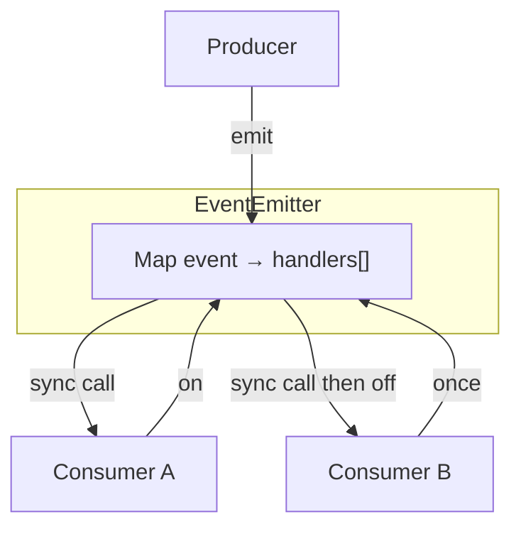

# EventEmitter

Pub/sub with `on` / `once` / `off` / `emit` / `removeAllListeners`. Classic Node-style machine coding.

## Architecture



## Implementation

```ts
type Handler = (...args: any[]) => void

export class EventEmitter {
  private events = new Map<string | symbol, Set<Handler>>()

  on(event: string | symbol, handler: Handler): this {
    let set = this.events.get(event)
    if (!set) {
      set = new Set()
      this.events.set(event, set)
    }
    set.add(handler)
    return this
  }

  addListener(event: string | symbol, handler: Handler): this {
    return this.on(event, handler)
  }

  once(event: string | symbol, handler: Handler): this {
    const wrapper: Handler = (...args) => {
      this.off(event, wrapper)
      handler(...args)
    }
    // Preserve identity for off(original) if needed via WeakMap — interview version:
    ;(wrapper as any).__origin = handler
    return this.on(event, wrapper)
  }

  off(event: string | symbol, handler?: Handler): this {
    const set = this.events.get(event)
    if (!set) return this
    if (!handler) {
      this.events.delete(event)
      return this
    }
    set.delete(handler)
    for (const h of [...set]) {
      if ((h as any).__origin === handler) set.delete(h)
    }
    if (set.size === 0) this.events.delete(event)
    return this
  }

  removeListener(event: string | symbol, handler: Handler): this {
    return this.off(event, handler)
  }

  removeAllListeners(event?: string | symbol): this {
    if (event === undefined) this.events.clear()
    else this.events.delete(event)
    return this
  }

  emit(event: string | symbol, ...args: any[]): boolean {
    const set = this.events.get(event)
    if (!set || set.size === 0) return false
    // Snapshot so handlers can off() during emit safely
    for (const handler of [...set]) {
      try {
        handler(...args)
      } catch (err) {
        // Node emits 'error' specially; interview: rethrow or schedule
        queueMicrotask(() => {
          throw err
        })
      }
    }
    return true
  }

  listenerCount(event: string | symbol): number {
    return this.events.get(event)?.size ?? 0
  }

  listeners(event: string | symbol): Handler[] {
    return [...(this.events.get(event) ?? [])]
  }

  eventNames(): Array<string | symbol> {
    return [...this.events.keys()]
  }
}
```

## Typed variant (senior signal)

```ts
type Events = {
  login: [userId: string]
  error: [err: Error]
  message: [text: string, meta: { ts: number }]
}

export class TypedEmitter<E extends Record<string, any[]>> {
  private map = new Map<keyof E, Set<(...args: any[]) => void>>()

  on<K extends keyof E>(event: K, handler: (...args: E[K]) => void): this {
    let set = this.map.get(event)
    if (!set) {
      set = new Set()
      this.map.set(event, set)
    }
    set.add(handler as any)
    return this
  }

  emit<K extends keyof E>(event: K, ...args: E[K]): boolean {
    const set = this.map.get(event)
    if (!set) return false
    for (const h of [...set]) h(...args)
    return true
  }

  off<K extends keyof E>(event: K, handler: (...args: E[K]) => void): this {
    this.map.get(event)?.delete(handler as any)
    return this
  }
}

// usage
const bus = new TypedEmitter<Events>()
bus.on('login', (userId) => console.log(userId))
bus.emit('login', 'u_1')
```

## Interview Q&A

**Q: Sync vs async emit?**  
Node `EventEmitter` is sync. Async emit avoids reentrancy but changes ordering — document it.

**Q: Memory leaks?**  
Forgotten `off` on unmount. Prefer `AbortSignal` or return unsubscribe functions.

**Q: `error` event special case?**  
In Node, emit `'error'` with no listeners throws. Mention this for Node interviews.

## Common mistakes

| Mistake | Fix |
| --- | --- |
| Mutating Set while iterating emit | Snapshot `[...set]` |
| `once` can’t be removed by original fn | Store origin mapping |
| Array + indexOf off | Prefer `Set` for O(1) remove |

## Trade-offs

| Design | Pros | Cons |
| --- | --- | --- |
| Sync emit | Simple, predictable | Reentrancy hazards |
| Wildcard `*` | Flexible | Harder to type / debug |
| Max listeners warning | Catches leaks | Soft limit only |

## Production relevance

React isn’t built on EventEmitter, but design systems, analytics buses, WebSocket hubs, and Node services are. Always provide unsubscribe and avoid global singleton pollution.
