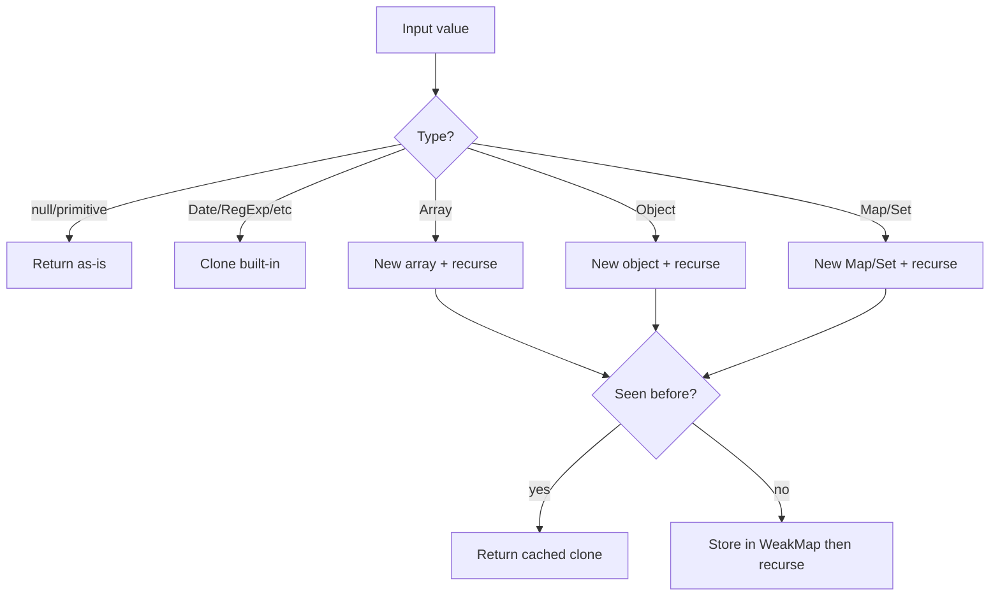

# Deep Clone

Produce a structurally independent copy. Interviews escalate: primitives → nested objects → cycles → built-ins (`Date`, `Map`, `Set`, `RegExp`, typed arrays).

## Threat model



## Implementation (cycle-safe)

```ts
export function deepClone<T>(value: T, seen = new WeakMap<object, unknown>()): T {
  if (value === null || typeof value !== 'object') {
    return value
  }

  if (seen.has(value as object)) {
    return seen.get(value as object) as T
  }

  if (value instanceof Date) {
    return new Date(value.getTime()) as T
  }

  if (value instanceof RegExp) {
    const copy = new RegExp(value.source, value.flags)
    copy.lastIndex = value.lastIndex
    return copy as T
  }

  if (value instanceof ArrayBuffer) {
    return value.slice(0) as T
  }

  if (ArrayBuffer.isView(value)) {
    // TypedArray / DataView
    const Ctor = value.constructor as new (
      buf: ArrayBufferLike,
      byteOffset?: number,
      length?: number
    ) => typeof value
    const copy = new Ctor(
      value.buffer.slice(value.byteOffset, value.byteOffset + value.byteLength)
    )
    return copy as T
  }

  if (value instanceof Map) {
    const copy = new Map()
    seen.set(value, copy)
    value.forEach((v, k) => {
      copy.set(deepClone(k, seen), deepClone(v, seen))
    })
    return copy as T
  }

  if (value instanceof Set) {
    const copy = new Set()
    seen.set(value, copy)
    value.forEach((v) => copy.add(deepClone(v, seen)))
    return copy as T
  }

  if (Array.isArray(value)) {
    const copy: unknown[] = []
    seen.set(value, copy)
    value.forEach((item, i) => {
      copy[i] = deepClone(item, seen)
    })
    return copy as T
  }

  // plain object (and class instances — own enumerable props only)
  const proto = Object.getPrototypeOf(value)
  const copy = Object.create(proto)
  seen.set(value as object, copy)

  for (const key of Reflect.ownKeys(value as object)) {
    const desc = Object.getOwnPropertyDescriptor(value as object, key)!
    if (desc.get || desc.set) {
      Object.defineProperty(copy, key, desc) // keep accessors as-is
    } else {
      Object.defineProperty(copy, key, {
        ...desc,
        value: deepClone(desc.value, seen),
      })
    }
  }

  return copy as T
}
```

## Structured clone (browser / worker)

```ts
// Supports more types; throws on functions / DOM nodes / symbols as keys
export function structuredDeepClone<T>(value: T): T {
  return structuredClone(value)
}
```

## JSON clone (know the traps)

```ts
export function jsonClone<T>(value: T): T {
  return JSON.parse(JSON.stringify(value))
}
// Drops: undefined, functions, symbols
// Converts: Date → string, NaN/Infinity → null
// Throws: cycles
// Maps/Sets → {}
```

## Interview Q&A

**Q: Why `WeakMap` for cycles?**  
Keys don’t prevent GC; maps original → clone so `a.b = a` doesn’t infinite-loop.

**Q: Clone vs immutable update?**  
Deep clone is expensive O(n). Prefer structural sharing (Immer) for state trees.

**Q: Class instances?**  
Own-property clone keeps prototype but may miss private fields (`#x`). Mention limitation.

## Common mistakes

| Mistake | Fix |
| --- | --- |
| `typeof null === 'object'` | Check `null` first |
| No cycle detection | `WeakMap` |
| Spreading nested objects | Only shallow |
| Cloning functions | Usually share reference or throw |

## Trade-offs

| Approach | Pros | Cons |
| --- | --- | --- |
| Hand-rolled | Controllable | Easy to miss types |
| `structuredClone` | Spec-complete for many types | Not in very old envs; no functions |
| `JSON` | Tiny | Silent data loss |
| Immer | Ergonomic immutable updates | Dependency / proxy cost |

## Production relevance

Avoid deep-cloning Redux state every action. Use for: isolating untrusted config, worker message prep, undo stacks with snapshots (or patches).
