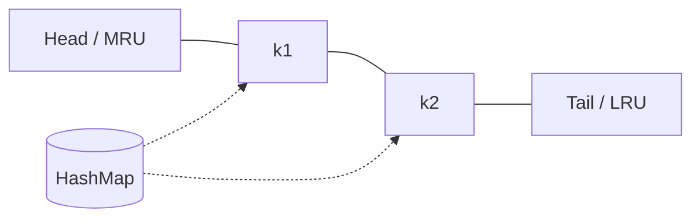

# LRU Cache

Least Recently Used cache: `get` and `put` in **O(1)**. Classic HashMap + doubly linked list.

## Invariant

- Map: `key → node`
- List: most-recent at head, least-recent at tail
- On `get`/`put` hit: move node to head
- On `put` over capacity: evict tail



## Implementation

```ts
class Node<K, V> {
  key: K
  value: V
  prev: Node<K, V> | null = null
  next: Node<K, V> | null = null
  constructor(key: K, value: V) {
    this.key = key
    this.value = value
  }
}

export class LRUCache<K, V> {
  private capacity: number
  private map = new Map<K, Node<K, V>>()
  private head: Node<K, V>
  private tail: Node<K, V>

  constructor(capacity: number) {
    if (capacity <= 0) throw new Error('capacity must be > 0')
    this.capacity = capacity
    // dummy sentinels — avoids null checks
    this.head = new Node(null as K, null as V)
    this.tail = new Node(null as K, null as V)
    this.head.next = this.tail
    this.tail.prev = this.head
  }

  get(key: K): V | undefined {
    const node = this.map.get(key)
    if (!node) return undefined
    this.moveToHead(node)
    return node.value
  }

  put(key: K, value: V): void {
    const existing = this.map.get(key)
    if (existing) {
      existing.value = value
      this.moveToHead(existing)
      return
    }
    const node = new Node(key, value)
    this.map.set(key, node)
    this.addToHead(node)
    if (this.map.size > this.capacity) {
      const lru = this.popTail()
      if (lru) this.map.delete(lru.key)
    }
  }

  has(key: K): boolean {
    return this.map.has(key)
  }

  get size(): number {
    return this.map.size
  }

  private addToHead(node: Node<K, V>) {
    node.prev = this.head
    node.next = this.head.next
    this.head.next!.prev = node
    this.head.next = node
  }

  private removeNode(node: Node<K, V>) {
    node.prev!.next = node.next
    node.next!.prev = node.prev
    node.prev = node.next = null
  }

  private moveToHead(node: Node<K, V>) {
    this.removeNode(node)
    this.addToHead(node)
  }

  private popTail(): Node<K, V> | null {
    const node = this.tail.prev
    if (!node || node === this.head) return null
    this.removeNode(node)
    return node
  }
}
```

## Map-only trick (JS insertion order)

`Map` iterates in insertion order. Re-insert on access = move to end (MRU at end):

```ts
export class LRUCacheMap<K, V> {
  private map = new Map<K, V>()
  constructor(private capacity: number) {}

  get(key: K): V | undefined {
    if (!this.map.has(key)) return undefined
    const v = this.map.get(key)!
    this.map.delete(key)
    this.map.set(key, v)
    return v
  }

  put(key: K, value: V): void {
    if (this.map.has(key)) this.map.delete(key)
    this.map.set(key, value)
    if (this.map.size > this.capacity) {
      const lruKey = this.map.keys().next().value!
      this.map.delete(lruKey)
    }
  }
}
```

> Prefer explaining the linked-list version in interviews — it shows you understand the O(1) mechanics without relying on Map ordering.

## Interview Q&A

**Q: Why not array + indexOf?**  
`get`/`move` become O(n).

**Q: LRU vs LFU?**  
LRU: recency. LFU: frequency (needs freq buckets). TinyLFU / W-TinyLFU in production caches (Caffeine).

**Q: Thread safety?**  
Single-threaded JS is fine; in multi-threaded backends use locks or concurrent maps.

## Common mistakes

| Mistake | Fix |
| --- | --- |
| Forgetting update-on-put still refreshes recency | `moveToHead` |
| Evicting before checking update of existing key | Update path first |
| Off-by-one capacity | Evict when `size > capacity` |

## Trade-offs

| Design | Pros | Cons |
| --- | --- | --- |
| HashMap + DLL | True O(1), language-agnostic | More code |
| JS Map order | Tiny | Interviewers may reject |
| TTL + LRU | Production-ready | Clock / lazy expire complexity |

## Production relevance

CDN edge caches, React Query / SWR in-memory caches, Redis `MAXMEMORY` + `allkeys-lru`, GraphQL persisted query caches. Always size by memory, not just entry count, when values vary.
