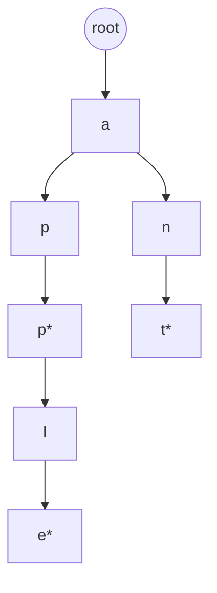

# Flatten & Trie

Two frequent machine-coding / algorithm hybrids: flatten nested lists, and prefix trees for autocomplete.

## Flatten nested arrays / lists

```ts
type Nested<T> = T | Nested<T>[]

export function flatten<T>(input: Nested<T>[], depth = Infinity): T[] {
  const out: T[] = []
  const helper = (arr: Nested<T>[], d: number) => {
    for (const item of arr) {
      if (Array.isArray(item) && d > 0) helper(item, d - 1)
      else out.push(item as T)
    }
  }
  helper(input, depth)
  return out
}

// Iterator version — interview bonus (lazy)
export function* flattenIter<T>(
  input: Nested<T>[],
  depth = Infinity
): Generator<T> {
  for (const item of input) {
    if (Array.isArray(item) && depth > 0) yield* flattenIter(item, depth - 1)
    else yield item as T
  }
}
```

### Flatten nested object keys

```ts
export function flattenObject(
  obj: Record<string, unknown>,
  prefix = '',
  out: Record<string, unknown> = {}
): Record<string, unknown> {
  for (const [k, v] of Object.entries(obj)) {
    const key = prefix ? `${prefix}.${k}` : k
    if (v !== null && typeof v === 'object' && !Array.isArray(v)) {
      flattenObject(v as Record<string, unknown>, key, out)
    } else {
      out[key] = v
    }
  }
  return out
}
// { a: { b: 1 } } → { 'a.b': 1 }
```

## Trie (prefix tree)



```ts
class TrieNode {
  children = new Map<string, TrieNode>()
  isEnd = false
  // optional: count for “how many words share this prefix”
  count = 0
}

export class Trie {
  private root = new TrieNode()

  insert(word: string): void {
    let node = this.root
    for (const ch of word) {
      if (!node.children.has(ch)) node.children.set(ch, new TrieNode())
      node = node.children.get(ch)!
      node.count += 1
    }
    node.isEnd = true
  }

  search(word: string): boolean {
    const node = this.walk(word)
    return !!node?.isEnd
  }

  startsWith(prefix: string): boolean {
    return this.walk(prefix) !== null
  }

  /** Autocomplete: all words with given prefix */
  autocomplete(prefix: string, limit = 10): string[] {
    const node = this.walk(prefix)
    if (!node) return []
    const results: string[] = []
    const dfs = (n: TrieNode, path: string) => {
      if (results.length >= limit) return
      if (n.isEnd) results.push(path)
      for (const [ch, child] of n.children) {
        dfs(child, path + ch)
      }
    }
    dfs(node, prefix)
    return results
  }

  delete(word: string): boolean {
    const stack: Array<{ node: TrieNode; ch: string }> = []
    let node = this.root
    for (const ch of word) {
      const next = node.children.get(ch)
      if (!next) return false
      stack.push({ node, ch })
      node = next
    }
    if (!node.isEnd) return false
    node.isEnd = false
    // prune unique path
    for (let i = stack.length - 1; i >= 0; i--) {
      const { node: parent, ch } = stack[i]
      const child = parent.children.get(ch)!
      child.count -= 1
      if (child.count === 0 && !child.isEnd && child.children.size === 0) {
        parent.children.delete(ch)
      } else break
    }
    return true
  }

  private walk(s: string): TrieNode | null {
    let node = this.root
    for (const ch of s) {
      const next = node.children.get(ch)
      if (!next) return null
      node = next
    }
    return node
  }
}
```

## Flatten nested list iterator (LeetCode 341)

```ts
export interface NestedInteger {
  isInteger(): boolean
  getInteger(): number | null
  getList(): NestedInteger[]
}

export class NestedIterator {
  private stack: NestedInteger[]

  constructor(nestedList: NestedInteger[]) {
    this.stack = [...nestedList].reverse()
  }

  next(): number {
    // hasNext ensures top is integer
    return this.stack.pop()!.getInteger()!
  }

  hasNext(): boolean {
    while (this.stack.length) {
      const top = this.stack[this.stack.length - 1]
      if (top.isInteger()) return true
      this.stack.pop()
      const list = top.getList()
      for (let i = list.length - 1; i >= 0; i--) this.stack.push(list[i])
    }
    return false
  }
}
```

## Interview Q&A

**Q: Trie vs HashSet for autocomplete?**  
HashSet: O(n · L) scan. Trie: O(P + K) for prefix + collect K results.

**Q: Memory?**  
Trie can be heavy for sparse alphabets; compress with radix tree (Patricia).

**Q: Unicode?**  
Iterate code points carefully; `for...of` on string is UTF-16 code units — OK for BMP, beware surrogate pairs if required.

## Common mistakes

| Mistake | Fix |
| --- | --- |
| Flatten without depth | Match `Array.prototype.flat(depth)` |
| Marking prefix nodes as words | Separate `isEnd` |
| Mutating while iterating nested list | Stack snapshot approach |

## Trade-offs

| Structure | Best for | Cost |
| --- | --- | --- |
| Trie | Prefix ops | Memory |
| Sorted array + bisect | Static dictionary | Rebuild cost |
| FM-index / suffix array | Substring (not only prefix) | Complex |

## Production relevance

Search autocomplete, router path matching, IP prefix (binary trie), spell-check dictionaries, analytics tag hierarchies (flatten/unflatten).
