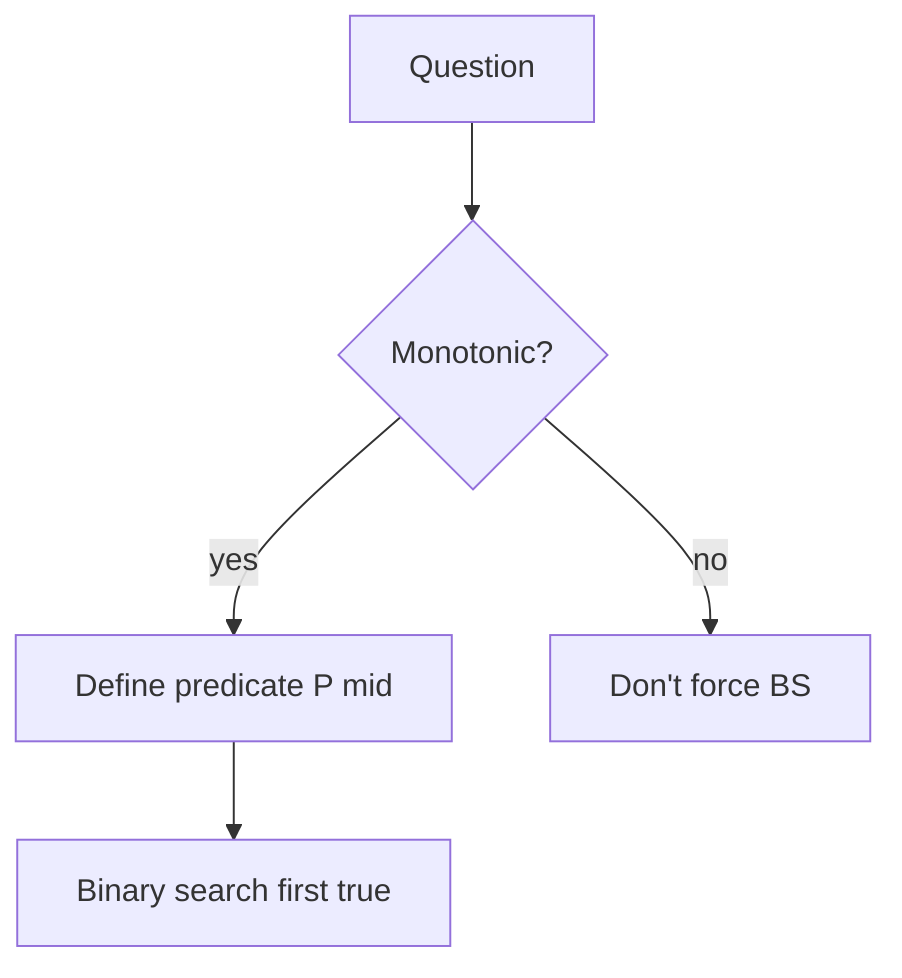

# Binary Search

On sorted data or **monotonic predicates**. Master the invariant — everything else is template reuse.

## Core invariant templates

```ts
/** Lower bound: first index with a[i] >= target; or n if none */
export function lowerBound(a: number[], target: number): number {
  let lo = 0
  let hi = a.length // exclusive
  while (lo < hi) {
    const mid = lo + ((hi - lo) >> 1)
    if (a[mid] < target) lo = mid + 1
    else hi = mid
  }
  return lo
}

/** Upper bound: first index with a[i] > target */
export function upperBound(a: number[], target: number): number {
  let lo = 0
  let hi = a.length
  while (lo < hi) {
    const mid = lo + ((hi - lo) >> 1)
    if (a[mid] <= target) lo = mid + 1
    else hi = mid
  }
  return lo
}

/** Classic exact find */
export function binarySearch(a: number[], target: number): number {
  let lo = 0
  let hi = a.length - 1
  while (lo <= hi) {
    const mid = lo + ((hi - lo) >> 1)
    if (a[mid] === target) return mid
    if (a[mid] < target) lo = mid + 1
    else hi = mid - 1
  }
  return -1
}
```



## Rotated sorted array

```ts
export function searchRotated(nums: number[], target: number): number {
  let lo = 0
  let hi = nums.length - 1
  while (lo <= hi) {
    const mid = lo + ((hi - lo) >> 1)
    if (nums[mid] === target) return mid
    if (nums[lo] <= nums[mid]) {
      // left half sorted
      if (nums[lo] <= target && target < nums[mid]) hi = mid - 1
      else lo = mid + 1
    } else {
      // right half sorted
      if (nums[mid] < target && target <= nums[hi]) lo = mid + 1
      else hi = mid - 1
    }
  }
  return -1
}

export function findMinRotated(nums: number[]): number {
  let lo = 0
  let hi = nums.length - 1
  while (lo < hi) {
    const mid = lo + ((hi - lo) >> 1)
    if (nums[mid] > nums[hi]) lo = mid + 1
    else hi = mid
  }
  return nums[lo]
}
```

## First / last position

```ts
export function searchRange(nums: number[], target: number): [number, number] {
  const left = lowerBound(nums, target)
  if (left === nums.length || nums[left] !== target) return [-1, -1]
  const right = upperBound(nums, target) - 1
  return [left, right]
}
```

## Answer on real domain (sqrt, capacity)

```ts
export function mySqrt(x: number): number {
  let lo = 0
  let hi = x
  while (lo < hi) {
    const mid = lo + ((hi - lo + 1) >> 1) // bias up
    if (mid * mid <= x) lo = mid
    else hi = mid - 1
  }
  return lo
}

/** Koko eating bananas — minimize speed k such that hours(k) <= h */
export function minEatingSpeed(piles: number[], h: number): number {
  let lo = 1
  let hi = Math.max(...piles)
  const hours = (k: number) =>
    piles.reduce((sum, p) => sum + Math.ceil(p / k), 0)
  while (lo < hi) {
    const mid = lo + ((hi - lo) >> 1)
    if (hours(mid) <= h) hi = mid
    else lo = mid + 1
  }
  return lo
}
```

## Peak element

```ts
export function findPeakElement(nums: number[]): number {
  let lo = 0
  let hi = nums.length - 1
  while (lo < hi) {
    const mid = lo + ((hi - lo) >> 1)
    if (nums[mid] < nums[mid + 1]) lo = mid + 1
    else hi = mid
  }
  return lo
}
```

## Interview Q&A

**Q: Overflow on `(lo+hi)/2`?**  
Use `lo + ((hi - lo) >> 1)`. JS Number is float64 — still good habit.

**Q: When is binary search on answer valid?**  
When feasibility is monotonic: if `k` works, `k+1` works (or the reverse).

**Q: Duplicates in rotated array?**  
`nums[lo] === nums[mid] === nums[hi]` forces `lo++` / `hi--` — can degrade to O(n).

## Common mistakes

| Mistake | Fix |
| --- | --- |
| Infinite loop `lo = mid` without progress | Ensure mid moves; use exclusive hi carefully |
| Confusing lower/upper bound | Write invariant in comment |
| Using BS on unsorted data | Sort first or different pattern |

## Trade-offs

Binary search is O(log n) probes but each probe may be costly (network, disk). Prefetch / interpolation search rare in interviews.

## Production relevance

DB B-tree seeks, feature-flag ramp (binary search deploy), load-test “min instances that pass SLO”, rate-limit config tuning.
