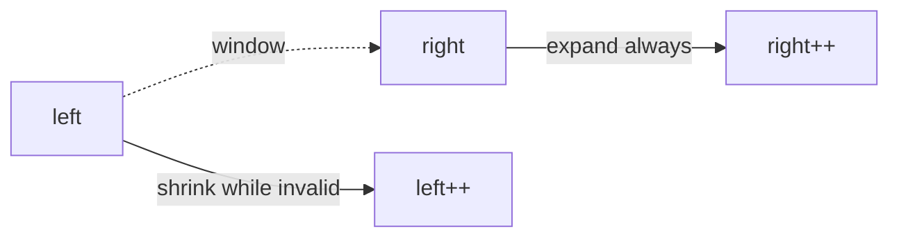

# Sliding Window

Contiguous subarray / substring problems with a constraint. Two pointers + (often) a frequency map.

## Templates

### Variable window (grow/shrink)

```ts
/** Longest substring with at most k distinct characters */
export function longestWithKDistinct(s: string, k: number): number {
  const freq = new Map<string, number>()
  let left = 0
  let best = 0
  for (let right = 0; right < s.length; right++) {
    freq.set(s[right], (freq.get(s[right]) ?? 0) + 1)
    while (freq.size > k) {
      const c = s[left]
      const n = freq.get(c)! - 1
      if (n === 0) freq.delete(c)
      else freq.set(c, n)
      left += 1
    }
    best = Math.max(best, right - left + 1)
  }
  return best
}
```

### Fixed window

```ts
/** Max sum of any subarray of size k */
export function maxSumFixed(arr: number[], k: number): number {
  if (arr.length < k) return 0
  let sum = 0
  for (let i = 0; i < k; i++) sum += arr[i]
  let best = sum
  for (let i = k; i < arr.length; i++) {
    sum += arr[i] - arr[i - k]
    best = Math.max(best, sum)
  }
  return best
}
```



## Classic problems

### Minimum window substring

```ts
export function minWindow(s: string, t: string): string {
  if (!t) return ''
  const need = new Map<string, number>()
  for (const c of t) need.set(c, (need.get(c) ?? 0) + 1)
  let missing = need.size
  let left = 0
  let best = ''
  const window = new Map<string, number>()

  for (let right = 0; right < s.length; right++) {
    const c = s[right]
    window.set(c, (window.get(c) ?? 0) + 1)
    if (need.has(c) && window.get(c) === need.get(c)) missing -= 1

    while (missing === 0) {
      if (best === '' || right - left + 1 < best.length) {
        best = s.slice(left, right + 1)
      }
      const d = s[left]
      window.set(d, window.get(d)! - 1)
      if (need.has(d) && window.get(d)! < need.get(d)!) missing += 1
      left += 1
    }
  }
  return best
}
```

### Longest substring without repeating characters

```ts
export function lengthOfLongestSubstring(s: string): number {
  const last = new Map<string, number>()
  let left = 0
  let best = 0
  for (let right = 0; right < s.length; right++) {
    const c = s[right]
    if (last.has(c) && last.get(c)! >= left) left = last.get(c)! + 1
    last.set(c, right)
    best = Math.max(best, right - left + 1)
  }
  return best
}
```

### Subarray sum equals K (prefix — related)

Sliding window needs **non-negative** for two-pointer sum. For negatives, use prefix + hashmap:

```ts
export function subarraySum(nums: number[], k: number): number {
  const map = new Map<number, number>([[0, 1]])
  let sum = 0
  let count = 0
  for (const n of nums) {
    sum += n
    count += map.get(sum - k) ?? 0
    map.set(sum, (map.get(sum) ?? 0) + 1)
  }
  return count
}
```

### Max consecutive ones III

```ts
export function longestOnes(nums: number[], k: number): number {
  let left = 0
  let zeros = 0
  let best = 0
  for (let right = 0; right < nums.length; right++) {
    if (nums[right] === 0) zeros += 1
    while (zeros > k) {
      if (nums[left] === 0) zeros -= 1
      left += 1
    }
    best = Math.max(best, right - left + 1)
  }
  return best
}
```

## Complexity

| Variant | Time | Space |
| --- | --- | --- |
| Fixed window | O(n) | O(1) |
| Variable + map | O(n) | O(Σ) alphabet |
| Prefix sum + hash | O(n) | O(n) |

## Interview Q&A

**Q: When can you use sliding window for sum?**  
Monotonic growth: non-negative nums. Negatives break “shrink left safely”.

**Q: At most vs exactly k?**  
`exactly(k) = atMost(k) - atMost(k - 1)` for count problems.

## Common mistakes

| Mistake | Fix |
| --- | --- |
| Updating best before validating window | Check constraint first |
| Forgetting to delete zero counts | `map.delete` when 0 |
| Off-by-one length | `right - left + 1` |

## Trade-offs

Deque (monotonic queue) extends window to “sliding window maximum” in O(n). Mention for hard follow-ups.

## Production relevance

Rate-limit windows, analytics “users active in last 5m”, log anomaly rolling aggregates, video bitrate buffers.
