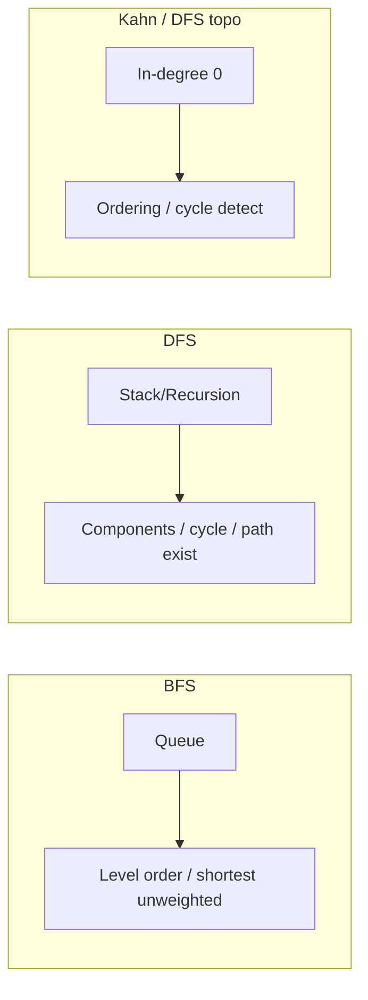

# Graphs

Representations, BFS/DFS, topological sort, Union-Find, and grid problems. Default to **adjacency list**.

## Representations

```ts
type Graph = Map<number, number[]> // undirected: add both ways

export function buildGraph(n: number, edges: number[][]): number[][] {
  const g: number[][] = Array.from({ length: n }, () => [])
  for (const [u, v] of edges) {
    g[u].push(v)
    g[v].push(u)
  }
  return g
}
```



## BFS — shortest path unweighted

```ts
export function bfsDistances(graph: number[][], start: number): number[] {
  const dist = Array(graph.length).fill(-1)
  const q: number[] = [start]
  dist[start] = 0
  for (let i = 0; i < q.length; i++) {
    const u = q[i]
    for (const v of graph[u]) {
      if (dist[v] === -1) {
        dist[v] = dist[u] + 1
        q.push(v)
      }
    }
  }
  return dist
}
```

## DFS — connected components / cycle

```ts
export function countComponents(n: number, edges: number[][]): number {
  const g = buildGraph(n, edges)
  const seen = new Array(n).fill(false)
  let count = 0
  const dfs = (u: number) => {
    seen[u] = true
    for (const v of g[u]) if (!seen[v]) dfs(v)
  }
  for (let i = 0; i < n; i++) {
    if (!seen[i]) {
      count += 1
      dfs(i)
    }
  }
  return count
}

/** Directed cycle detection (colors: 0=unseen 1=visiting 2=done) */
export function hasCycleDirected(graph: number[][]): boolean {
  const color = new Array(graph.length).fill(0)
  const dfs = (u: number): boolean => {
    color[u] = 1
    for (const v of graph[u]) {
      if (color[v] === 1) return true
      if (color[v] === 0 && dfs(v)) return true
    }
    color[u] = 2
    return false
  }
  for (let i = 0; i < graph.length; i++) {
    if (color[i] === 0 && dfs(i)) return true
  }
  return false
}
```

## Topological sort (Kahn)

```ts
export function topoSort(n: number, edges: number[][]): number[] | null {
  const g: number[][] = Array.from({ length: n }, () => [])
  const indeg = new Array(n).fill(0)
  for (const [u, v] of edges) {
    g[u].push(v)
    indeg[v] += 1
  }
  const q: number[] = []
  for (let i = 0; i < n; i++) if (indeg[i] === 0) q.push(i)
  const order: number[] = []
  for (let i = 0; i < q.length; i++) {
    const u = q[i]
    order.push(u)
    for (const v of g[u]) {
      indeg[v] -= 1
      if (indeg[v] === 0) q.push(v)
    }
  }
  return order.length === n ? order : null // null ⇒ cycle
}
```

## Union-Find (Disjoint Set)

```ts
export class UnionFind {
  parent: number[]
  rank: number[]
  components: number

  constructor(n: number) {
    this.parent = Array.from({ length: n }, (_, i) => i)
    this.rank = new Array(n).fill(0)
    this.components = n
  }

  find(x: number): number {
    while (this.parent[x] !== x) {
      this.parent[x] = this.parent[this.parent[x]] // path compression
      x = this.parent[x]
    }
    return x
  }

  union(a: number, b: number): boolean {
    let ra = this.find(a)
    let rb = this.find(b)
    if (ra === rb) return false
    if (this.rank[ra] < this.rank[rb]) [ra, rb] = [rb, ra]
    this.parent[rb] = ra
    if (this.rank[ra] === this.rank[rb]) this.rank[ra] += 1
    this.components -= 1
    return true
  }

  connected(a: number, b: number): boolean {
    return this.find(a) === this.find(b)
  }
}
```

## Grid — number of islands

```ts
export function numIslands(grid: string[][]): number {
  if (!grid.length) return 0
  const rows = grid.length
  const cols = grid[0].length
  let count = 0
  const dfs = (r: number, c: number) => {
    if (r < 0 || c < 0 || r >= rows || c >= cols || grid[r][c] !== '1') return
    grid[r][c] = '0'
    dfs(r + 1, c)
    dfs(r - 1, c)
    dfs(r, c + 1)
    dfs(r, c - 1)
  }
  for (let r = 0; r < rows; r++) {
    for (let c = 0; c < cols; c++) {
      if (grid[r][c] === '1') {
        count += 1
        dfs(r, c)
      }
    }
  }
  return count
}
```

## Dijkstra (non-negative weights)

```ts
export function dijkstra(n: number, edges: number[][], src: number): number[] {
  const g: Array<Array<[number, number]>> = Array.from({ length: n }, () => [])
  for (const [u, v, w] of edges) g[u].push([v, w])
  const dist = Array(n).fill(Infinity)
  dist[src] = 0
  // binary heap would be better; interview: simple O(V^2) pick
  const used = new Array(n).fill(false)
  for (let i = 0; i < n; i++) {
    let u = -1
    for (let j = 0; j < n; j++) {
      if (!used[j] && (u === -1 || dist[j] < dist[u])) u = j
    }
    if (u === -1 || dist[u] === Infinity) break
    used[u] = true
    for (const [v, w] of g[u]) {
      if (dist[u] + w < dist[v]) dist[v] = dist[u] + w
    }
  }
  return dist
}
```

## Interview Q&A

**Q: BFS vs DFS?**  
BFS: shortest unweighted, levels. DFS: path existence, topo (DFS version), memory often lower on skinny graphs / higher on deep recursion.

**Q: When Union-Find over DFS?**  
Dynamic connectivity, Kruskal MST, “merge accounts” online unions.

**Q: Recursion stack limits?**  
Prefer iterative DFS/BFS for large graphs in production JS.

## Common mistakes

| Mistake | Fix |
| --- | --- |
| Forgetting mark visited before enqueue | Mark when push, not when pop (BFS) |
| Treating undirected as directed | Add both edges |
| Topo on undirected | Only for DAG |

## Trade-offs

Adj matrix: O(1) edge query, O(V²) space. Adj list: sparse-friendly. Edge list: Kruskal-friendly.

## Production relevance

Dependency graphs (module bundlers, job DAGs), social graphs, network routing, RBAC inheritance, service mesh topology.
